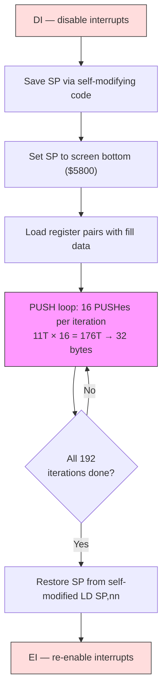

# Chapter 3: The Demoscener's Toolbox

Every craft has its bag of tricks --- patterns that practitioners reach for so instinctively they stop thinking of them as tricks at all. A Z80 demoscener reaches for the techniques in this chapter.

These patterns --- unrolled loops, self-modifying code, the stack as a data pipe, LDI chains, code generation, and RET-chaining --- appear in almost every effect we will build in Part II. They are what separates a demo that fits in one frame from one that takes three. Learn them here, and you will recognise them everywhere.

---

## Unrolled Loops and Self-Modifying Code

### The cost of looping

Consider the simplest possible inner loop: clearing 256 bytes of memory.

```z80 id:ch03_the_cost_of_looping
; Looped version: clear 256 bytes at (HL)
    ld   b, 0            ; 7 T   (B=0 means 256 iterations)
    xor  a               ; 4 T
.loop:
    ld   (hl), a         ; 7 T
    inc  hl              ; 6 T
    djnz .loop           ; 13 T  (8 on last iteration)
```

Each iteration costs 7 + 6 + 13 = 26 T-states to store a single byte. Only 7 of those T-states do the work --- the rest is overhead. That is 73% waste. For 256 bytes: 256 x 26 - 5 = 6,651 T-states. On a machine where you have 71,680 T-states per frame, those wasted T-states hurt.

### Unrolling: trade ROM for speed

The solution is brutal and effective: write out the loop body N times and delete the loop.

```z80 id:ch03_unrolling_trade_rom_for_speed
; Unrolled version: clear 256 bytes at (HL)
    xor  a               ; 4 T
    ld   (hl), a         ; 7 T
    inc  hl              ; 6 T
    ld   (hl), a         ; 7 T
    inc  hl              ; 6 T
    ld   (hl), a         ; 7 T
    inc  hl              ; 6 T
    ; ... repeated 256 times total
```

Each byte now costs 7 + 6 = 13 T-states. No DJNZ. No loop counter. Total: 256 x 13 = 3,328 T-states --- half the looped version.

The cost is code size: 256 repetitions occupy 512 bytes vs. 7 for the loop. You are trading ROM for speed.

**When to unroll:** Inner loops that execute thousands of times per frame --- screen clearing, sprite drawing, data copying.

**When NOT to unroll:** Outer loops that run once or twice per frame. Saving 5 T-states across 24 iterations buys you 120 T-states --- less than three NOPs. Not worth the bloat.

The practical middle ground is *partial unrolling*: unroll 8 or 16 iterations inside the loop, keep DJNZ for the outer count. The `push_fill.a80` example in this chapter's `examples/` directory does exactly this: 16 PUSHes per iteration, 192 iterations.

### Self-modifying code: the Z80's secret weapon

The Z80 has no instruction cache, no prefetch buffer, no pipeline. When the CPU fetches an instruction byte from RAM, it reads whatever is there *right now*. If you changed that byte one cycle ago, the CPU sees the new value. This is a guaranteed property of the architecture.

Self-modifying code (SMC) means writing to instruction bytes at runtime. The classic pattern is patching an immediate operand:

```z80 id:ch03_self_modifying_code_the_z80_s
; Self-modifying code: fill with a runtime-determined value
    ld   a, (fill_value)       ; load the fill byte from somewhere
    ld   (patch + 1), a        ; overwrite the operand of the LD below
patch:
    ld   (hl), $00             ; this $00 gets replaced at runtime
    inc  hl
    ; ...
```

The `ld (patch + 1), a` writes into the immediate operand of the next `ld (hl), $00`, changing it to `ld (hl), $AA` or whatever you loaded. The CPU executes whatever bytes it finds. Some common SMC patterns:

**Patching opcodes.** You can even replace the instruction itself. Need a loop that sometimes increments HL and sometimes decrements it? Before the loop, write the opcode for INC HL ($23) or DEC HL ($2B) into the instruction byte. Inside the inner loop, there is no branch at all --- the right instruction is already in place. Compare this to a branch-per-iteration approach that would cost 12 T-states (JR NZ) on every single pixel.

**Saving and restoring the stack pointer.** This pattern appears constantly when using PUSH tricks (below):

```z80 id:ch03_self_modifying_code_the_z80_s_2
    ld   (restore_sp + 1), sp     ; save SP into the operand below
    ; ... do stack tricks ...
restore_sp:
    ld   sp, $0000                ; self-modified: the $0000 was overwritten
```

The `ld (nn), sp` saves the current SP directly into the operand of the later `ld sp, nn`. No temporary variable. This is idiomatic Z80 demoscene code.

### Self-modifying variables: the `$+1` pattern

The most pervasive SMC pattern on the ZX Spectrum is not patching opcodes or saving SP --- it is embedding a *variable* directly inside an instruction's immediate operand. The idea is simple: instead of storing a counter in a named memory location and loading it with `LD A,(nn)` at 13 T-states, you let the instruction's own operand byte *be* the variable.

```z80 id:ch03_smc_dollar_plus_one
.smc_counter:
    ld   a, 0                    ; 7T — this 0 is the "variable"
    inc  a                       ; 4T
    ld   (.smc_counter + 1), a   ; 13T — write back to the operand byte
```

The `ld a, 0` fetches its operand as part of the normal instruction decode --- 7 T-states total, and the value is already in A. Compare that to loading from a separate memory address: `ld a, (counter)` costs 13 T-states, plus you still need a separate `ld (counter), a` at 13 T-states to write it back. The SMC version reads the variable for free (it is part of the instruction fetch) and only pays the 13 T-states once for the write-back.

In sjasmplus, you can place a label at `$+1` to give the embedded variable a readable name:

```z80 id:ch03_smc_named_variable
    ld   a, 0                    ; 7T
.scroll_pos EQU $ - 1           ; .scroll_pos names the operand byte above
    add  a, 4                   ; 7T — advance by 4 pixels
    ld   (.scroll_pos), a       ; 13T — store back into the operand
```

This pattern appears everywhere in ZX Spectrum code: scroll positions, animation frame counters, effect phase accumulators, direction flags. Any single-byte value that persists between calls is a candidate. You will see it constantly in Parts II and V --- practically every effect routine in this book uses at least one self-modifying variable.

The convention is to prefix these labels with `.smc_` or place them immediately after the instruction they modify. Either way, the intent should be clear to anyone reading the source. As we noted in Chapter 2, local labels (`.label`) prevent naming collisions when multiple routines each have their own embedded variables.

**A word of caution.** SMC is safe on the Z80, the eZ80, and every Spectrum clone. It is *not* safe on modern cached CPUs (x86, ARM) without explicit cache flush instructions. If you port to a different architecture, this is the first thing that breaks.

---

## The Stack as a Data Pipe

### Why PUSH is the fastest write on the Z80

The PUSH instruction writes 2 bytes to memory and decrements SP, all in 11 T-states. Let us compare the alternatives for writing data to a screen address:

| Method | Bytes written | T-states | T-states per byte |
|--------|--------------|----------|-------------------|
| `ld (hl), a` + `inc hl` | 1 | 13 | 13.0 |
| `ld (hl), a` + `inc l` | 1 | 11 | 11.0 |
| `ldi` | 1 | 16 | 16.0 |
| `ldir` (per byte) | 1 | 21 | 21.0 |
| `push hl` | 2 | 11 | **5.5** |

PUSH writes two bytes in 11 T-states --- 5.5 T-states per byte. Nearly 4x faster than LDIR. The catch: PUSH writes to where SP points, and SP is normally your stack. To use PUSH as a data pipe, you must hijack the stack pointer.

### The technique

The pattern is always the same:

1. Disable interrupts (DI). If an interrupt fires while SP points to the screen, the CPU will push the return address into your pixel data. Chaos follows.
2. Save SP. Use self-modifying code to stash it.
3. Set SP to the *end* of your target area. The stack grows downward --- PUSH decrements SP before writing. So if you want to fill from $4000 to $57FF, you set SP to $5800.
4. Load your data into register pairs and PUSH repeatedly.
5. Restore SP and re-enable interrupts (EI).

<!-- figure: ch03_push_fill_pipeline -->


> **Why PUSH wins:** `LD (HL),A` + `INC HL` writes 1 byte in 13T (13.0 T/byte). `PUSH HL` writes 2 bytes in 11T (**5.5 T/byte**) — nearly 2.4× faster per byte. The cost: interrupts must be disabled while SP is hijacked.

Here is the core of the `push_fill.a80` example from this chapter's `examples/` directory:

```z80 id:ch03_the_technique_2
stack_fill:
    di                          ; critical: no interrupts while SP is moved
    ld   (restore_sp + 1), sp   ; self-modifying: save SP

    ld   sp, SCREEN_END         ; SP points to end of screen ($5800)
    ld   hl, $AAAA              ; pattern to fill

    ld   b, 192                 ; 192 iterations x 16 PUSHes x 2 bytes = 6144
.loop:
    push hl                     ; 11 T  \
    push hl                     ; 11 T   |
    push hl                     ; 11 T   |
    push hl                     ; 11 T   |
    push hl                     ; 11 T   |
    push hl                     ; 11 T   |  16 PUSHes = 32 bytes
    push hl                     ; 11 T   |  = 176 T-states
    push hl                     ; 11 T   |
    push hl                     ; 11 T   |
    push hl                     ; 11 T   |
    push hl                     ; 11 T   |
    push hl                     ; 11 T   |
    push hl                     ; 11 T   |
    push hl                     ; 11 T   |
    push hl                     ; 11 T   |
    push hl                     ; 11 T  /
    djnz .loop                  ; 13 T (8 on last)

restore_sp:
    ld   sp, $0000              ; self-modified: restores original SP
    ei
    ret
```

The 16-PUSH inner body writes 32 bytes in 176 T-states. Total for the full 6,144-byte pixel area: roughly 36,000 T-states. Compare LDIR: 6,144 x 21 - 5 = 129,019 T-states. The PUSH method is about 3.6x faster --- the difference between fitting in one frame and bleeding into the next.


### POP as a fast read

PUSH is the fastest write, but POP is the fastest *read*. POP loads 2 bytes from (SP) into a register pair in 10 T-states --- that is 5.0 T-states per byte. Compare the alternatives:

| Method | Bytes read | T-states | T-states per byte |
|--------|-----------|----------|-------------------|
| `ld a, (hl)` + `inc hl` | 1 | 13 | 13.0 |
| `ld a, (hl)` + `inc l` | 1 | 11 | 11.0 |
| `ldi` (as a read+write) | 1 | 16 | 16.0 |
| `pop hl` | 2 | 10 | **5.0** |

The pattern: pre-build a table of 16-bit values in memory, point SP at the start of the table, and POP into register pairs. Each POP advances SP by 2, walking through the table automatically. This is the read-side complement of the PUSH write trick.

Combine POP and PUSH and you get a fast memory-to-memory pipe: POP a value from a source table (10T), process the register pair if needed, then PUSH it to the destination (11T). Total: 21 T-states for 2 bytes --- the same throughput as LDIR, but with the register pair available for processing between the read and write. You can mask bits, add offsets, swap bytes, or apply any register-to-register transformation at no extra memory-access cost. This POP-process-PUSH pipeline is the backbone of many compiled sprite routines.

### Where PUSH tricks are used

- **Screen clearing.** The most common use. Every demo needs to clear the screen between effects.
- **Compiled sprites.** The sprite is compiled into a sequence of PUSH instructions with pre-loaded register pairs. The fastest possible sprite output on the Z80.
- **Fast data output.** Any time you need to blast a block of data to a contiguous address range: attribute fills, buffer copies, display list construction.

The price you pay: interrupts are off. If your music player runs from an IM2 interrupt, it will miss a beat during a long PUSH sequence. Demo coders plan around this --- schedule PUSH fills during border time, or split them across multiple frames.

---

## LDI Chains

### LDI vs LDIR

LDI copies one byte from (HL) to (DE), increments both, and decrements BC. LDIR does the same but repeats until BC = 0. The difference is timing:

| Instruction | T-states | Notes |
|-------------|----------|-------|
| LDI | 16 | Copies 1 byte, always 16 T |
| LDIR (per byte) | 21 | Copies 1 byte, loops back. Last byte: 16 T |

LDIR costs 5 extra T-states per byte for its internal loop-back check. Those 5 T-states add up fast.

For 256 bytes:
- LDIR: 255 x 21 + 16 = 5,371 T-states
- 256 x LDI: 256 x 16 = 4,096 T-states
- Savings: 1,275 T-states (24%)

A chain of individual LDI instructions is just 256 repetitions of the two-byte opcode `$ED $A0`. That is 512 bytes of code to save 24% --- the same ROM-for-speed trade-off as loop unrolling.

### When LDI chains shine

The sweet spot is copying blocks of known size. A chain of 32 LDIs saves 160 T-states over LDIR for a sprite row. Across 24 rows, that is 3,840 T-states per frame.

But the real power emerges when you combine LDI chains with *entry point arithmetic*. If you have a chain of 256 LDIs and want to copy only 100 bytes, jump into the chain at position 156. No loop counter, no setup. This technique is used in Introspec's chaos zoomer in Eager (2015):

```z80 id:ch03_when_ldi_chains_shine
; Chaos zoomer inner loop (simplified from Eager)
; Each line copies a different number of bytes from a source buffer.
; Entry point into the LDI chain is calculated per line.
    ld   hl, source_data
    ld   de, dest_screen
    ; ... calculate entry point based on zoom factor ...
    jp   (ix)             ; jump into the LDI chain at the right point

ldi_chain:
    ldi                   ; byte 255
    ldi                   ; byte 254
    ldi                   ; byte 253
    ; ... 256 LDIs total ...
    ldi                   ; byte 0
    ; falls through to next line setup
```

This variable-length copy with zero per-byte loop overhead is a technique you simply cannot achieve with LDIR. It is one reason LDI is everyone's best friend in demoscene code.


---

## Bit Tricks: SBC A,A and Friends

### SBC A,A as a conditional mask

After any instruction that produces a carry flag, `SBC A,A` converts that flag into a full byte: $FF if carry was set, $00 if not. The cost: 4 T-states. Compare this to the branching alternative --- `JR C,.set` / `LD A,0` / `JR .done` / `.set: LD A,$FF` / `.done:` --- which costs 17-22 T-states depending on which path is taken, plus the pipeline disruption of a conditional branch.

The canonical use case is *bit-to-byte expansion*. Given a byte where each bit represents a pixel (the Spectrum's pixel format), you can expand each bit into a full attribute byte:

```z80 id:ch03_sbc_bit_expand
    rlc  (hl)            ; rotate top bit into carry    — 15T
    sbc  a, a            ; A = $FF if set, $00 if not   — 4T
    and  $47             ; A = bright white ($47) or $00 — 7T
```

Three instructions, 26 T-states, no branches. To select between two *arbitrary* values rather than zero and a mask, use the pattern `SBC A,A : AND mask : XOR base`. The AND selects which bits change between the two values, and the XOR flips them to the desired base. This pattern replaces every "if bit set then value A else value B" test in your inner loops.

### ADD A,A vs SLA A

Both instructions shift A left by one bit. But `ADD A,A` is 4 T-states and 1 byte, while `SLA A` is 8 T-states and 2 bytes. There is no situation where SLA A is preferable --- `ADD A,A` is strictly faster and smaller. Similarly, `ADD HL,HL` shifts HL left in 11 T-states (1 byte), replacing the two-instruction sequence `SLA L : RL H` at 16 T-states (4 bytes). For a 16-bit left shift inside an inner loop running 192 times per frame, that substitution alone saves 960 T-states --- over four scanlines of border time.

These are not tricks. They are vocabulary. Just as a fluent speaker does not pause to conjugate common verbs, a Z80 programmer reaches for `ADD A,A` and `SBC A,A` without conscious thought. If you find yourself writing `SLA A` or a conditional branch to select between two values, stop and reach for the shorter form. The T-states add up.

---

## Code Generation

### Code generation: writing the program that draws

Everything above is a fixed optimisation --- the code runs the same way every frame. Code generation goes further: your program writes the program that draws the screen. There are two variants: offline (before assembly) and runtime (during execution).

### Offline: generating assembly from a higher-level language

Introspec used Processing (a Java-based creative coding environment) to generate Z80 assembly for the chaos zoomer in Eager (2015). A chaos zoomer changes magnification every frame --- different source pixels map to different screen locations. Rather than computing these mappings at runtime, the Processing script pre-calculated every mapping and output .a80 source files containing optimised LDI chains and LD instructions.

The workflow: a Processing script calculates, for each frame, which source byte maps to which screen byte. It outputs Z80 assembly source --- sequences of `ld hl, source_addr` and `ldi` instructions --- which the assembler (sjasmplus) builds alongside the hand-written engine code. At runtime, the engine simply calls into the pre-generated code for the current frame.

This is not "cheating." It is the fundamental insight that division of labour between compile time and runtime can eliminate branches, lookups, and arithmetic from the inner loop entirely. The Processing script does the hard maths once, slowly, on a modern machine. The Z80 does the easy part --- copying bytes --- as fast as physically possible.

### Runtime: the program writes machine code during execution

Sometimes parameters change every frame, so offline generation is not enough. The sphere-mapping routine in X-Trade's Illusion (ENLiGHT'96) generates machine code into a RAM buffer at runtime. The sphere geometry changes as it rotates --- different pixels need different skip distances. Before each frame, the engine emits opcode bytes into a buffer, then executes them:

```z80 id:ch03_runtime_the_program_writes
; Runtime code generation (conceptual, simplified from Illusion)
; Generate an unrolled rendering loop for this frame's sphere slice

    ld   hl, code_buffer
    ld   de, sphere_table       ; per-frame skip distances

    ld   b, SPHERE_WIDTH
.gen_loop:
    ld   a, (de)                ; load skip distance for this pixel
    inc  de

    ; Emit: ld a, (hl) -- opcode $7E
    ld   (hl), $7E
    inc  hl

    ; Emit: add a, N   -- opcodes $C6, N
    ld   (hl), $C6
    inc  hl
    ld   (hl), a                ; the skip distance, as immediate operand
    inc  hl

    djnz .gen_loop

    ; Emit: ret -- opcode $C9
    ld   (hl), $C9

    ; Now execute the generated code
    call code_buffer
```

The generated code is a straight-line sequence with no branches, no lookups, no loop overhead --- but it is *different code every frame*. Instead of "if pixel_skip == 3 then..." at 12 T-states per branch, you emit the exact instructions needed and execute them branch-free.

### The cost of generation

Runtime code generation is not free. Look at the generator loop above: each emitted instruction requires loading an opcode byte, storing it, advancing the pointer, and possibly loading an operand --- roughly 30-50 T-states per emitted byte, depending on complexity. Call it ~40 T-states on average. For a generated routine of 100 instruction bytes, that is about 4,000 T-states of generation overhead.

The break-even point: generation pays off when the generated code runs more than once per frame, or when it replaces branching logic that costs more than the generation itself. In the Illusion sphere mapper, each generated rendering pass executes once per frame --- but it replaces per-pixel conditional branches that would cost far more. Alone Coder documented a similar trade-off in his rotation engine: generating a sequence of INC H/INC L instructions for coordinate stepping costs roughly 5,000 T-states to emit, but eliminates coordinate arithmetic that would cost approximately 146,000 T-states if computed inline. The generation overhead is under 4% of the cost it replaces.

The rule of thumb: if you find yourself writing a loop that contains branches selecting between different instruction sequences based on per-pixel or per-line data, that loop is a candidate for code generation. Emit the right instructions once, execute them branch-free, and regenerate only when the parameters change.

**When to generate code:** If the same operations happen every frame with only data changes, self-modifying code (patching operands) suffices. If the *structure* changes --- different numbers of iterations, different instruction sequences --- generate the code. If you can precompute the variations on a modern machine, prefer offline generation: it is debuggable, verifiable, and imposes zero runtime cost. Runtime generation pays off when the generated code executes far more often than it costs to generate.

---

## RET-Chaining

### Turning the stack into a dispatch table

In 2025, DenisGrachev published a technique on Hype developed for his game Dice Legends. The problem: rendering a tile-based playfield requires drawing dozens of tiles per frame. The naive approach uses CALL:

```z80 id:ch03_turning_the_stack_into_a
; Naive approach: call each tile renderer
    call draw_tile_0
    call draw_tile_1
    call draw_tile_2
    ; ...
```

Each CALL costs 17 T-states. For a 30 x 18 playfield (540 tiles), that is 9,180 T-states on dispatch alone.

DenisGrachev's insight: set SP to a *render list* --- a table of addresses --- and end each tile-drawing procedure with RET. RET pops 2 bytes from (SP) into PC. If SP points to your render list, RET does not return to the caller --- it jumps to the next routine in the list.

```z80 id:ch03_turning_the_stack_into_a_2
; RET-chaining: zero call overhead
    di
    ld   (restore_sp + 1), sp   ; save SP
    ld   sp, render_list        ; SP points to our dispatch table

    ; "Call" the first tile routine by falling into it or using RET:
    ret                         ; pops first address from render_list

; Each tile routine ends with:
draw_tile_N:
    ; ... draw the tile ...
    ret                         ; pops NEXT address from render_list

; The render list is a sequence of addresses:
render_list:
    dw   draw_tile_42           ; first tile to draw
    dw   draw_tile_7            ; second tile
    dw   draw_tile_42           ; third tile (same tile type, different position)
    ; ... one entry per tile on screen ...
    dw   render_done            ; sentinel: address of cleanup code

render_done:
restore_sp:
    ld   sp, $0000              ; self-modified: restore SP
    ei
```

Each dispatch now costs 10 T-states (RET) instead of 17 (CALL). For 540 tiles: 3,780 T-states saved. But the real gain is free dispatch --- each entry can point to a different procedure (wide tile, blank tile, animated tile). No jump table, no indirect call. The render list *is* the program.

### Three strategies for the render list

DenisGrachev explored three approaches to constructing the render list:

1. **Map as render list.** The tilemap itself is the render list: each cell contains the address of the drawing routine for that tile type. Simple but inflexible --- changing a tile means rewriting 2 bytes in the map.

2. **Address-based segments.** The screen is divided into segments. Each segment's render list is a block of addresses copied from a master table. Changing tiles means copying a new address block.

3. **Byte-based with 256-byte lookup tables.** Each tile type is a single byte (the tile index). A 256-byte lookup table maps tile indices to routine addresses. The render list is built by iterating through the tilemap bytes and looking up each address. This is the approach DenisGrachev chose for Dice Legends.

Using the byte-based approach, he expanded the playfield from 26 x 15 tiles (the limit of his previous engine) to 30 x 18 tiles while maintaining the target frame rate. The savings from eliminating CALL overhead, combined with the zero-cost dispatch, freed enough T-states to render 40% more tiles.

### The trade-offs

Like all stack tricks, interrupts must be disabled while SP is hijacked. Each tile routine must be self-contained --- ending with RET and not using CALL, since the real stack is unavailable. In practice, tile routines are short enough that this is not a limitation.

---

## Sidebar: "Code is Dead" (Introspec, 2015)

In January 2015, Introspec published a short, provocative essay on Hype titled "Code is Dead" (Kod myortv). The argument draws a parallel to Roland Barthes' "Death of the Author": just as Barthes argued that a text's meaning belongs to the reader, not the writer, Introspec argues that demo code only truly lives when someone reads it --- in a debugger, in a disassembly listing, in source code shared on a forum.

The uncomfortable truth: modern demos are consumed as visual media. People watch them on YouTube. They vote on Pouet based on video captures. Nobody sees the inner loops. A brilliant optimisation that saves 3 T-states per pixel is invisible to 99% of the audience. "Writing code purely for its own sake," Introspec wrote, "has lost relevance."

And yet.

You are reading this book. We are opening the debugger. We are counting T-states. We are looking inside. The techniques in this chapter are not museum exhibits. They are living tools, and the fact that most people will never see them does not diminish their craft.

Introspec's essay is a challenge, not a surrender. He went on to publish some of the most detailed technical analyses the ZX scene has ever produced --- including the Illusion teardown and the compression benchmarks referenced throughout this book. Code may be dead to the YouTube viewer. But to the reader with a disassembler and a curious mind, it is very much alive.

---

## Putting It All Together

The techniques in this chapter are not independent. In practice, they compose:

- **Screen clearing** combines *unrolled loops* with *PUSH tricks*: a partially unrolled loop of 16 PUSHes per iteration, with SP hijacked via *self-modifying code*.
- **Compiled sprites** combine *code generation* (each sprite compiles to executable code), *POP reads* and *PUSH output* (the fastest way to move pixel data through registers), *bit tricks* (SBC A,A for mask expansion), and *self-modification* (patching screen addresses per frame).
- **Tile engines** combine *RET-chaining* for dispatch with *LDI chains* inside each tile routine for fast data copy.
- **Chaos zoomers** combine *offline code generation* (Processing scripts emitting assembly) with *LDI chains* (the generated code is mostly LDI sequences) and *self-modification* (patching source addresses per frame).
- **Attribute effects** combine *POP reads* from pre-computed tables with *bit tricks* (SBC A,A to expand bitmasks into colour values) and *PUSH writes* for fast attribute output.

The common thread: every technique eliminates something from the inner loop. Unrolling eliminates the loop counter. Self-modification eliminates branches. PUSH eliminates per-byte write overhead. POP eliminates per-byte read overhead. LDI chains eliminate the LDIR repeat penalty. Bit tricks eliminate conditional branches. Code generation eliminates the entire distinction between code and data. RET-chaining eliminates CALL overhead.

The Z80 runs at 3.5 MHz. You have 71,680 T-states per frame. Every T-state you save in the inner loop is a T-state you can spend on more pixels, more colours, more motion. The toolbox in this chapter is how you get there.

In the chapters that follow, you will see each of these techniques at work in real demos --- the textured sphere of Illusion, the attribute tunnel of Eager, the multicolor engine of Old Tower. The goal of this chapter was to give you the vocabulary. Now let us see what the masters built with it.

---

## Try It Yourself

1. **Measure the difference.** Take the timing harness from Chapter 1 and measure three versions of a 256-byte fill: (a) the `ld (hl), a : inc hl : djnz` loop, (b) a fully unrolled `ld (hl), a : inc hl` x 256, and (c) the PUSH-based fill from `examples/push_fill.a80`. Compare the border stripe widths. The PUSH version's stripe should be visibly shorter.

2. **Build a self-modifying clear.** Write a screen-clear routine that takes the fill pattern as a parameter and patches it into a PUSH-based fill loop using self-modifying code. Call it twice with different patterns and watch the screen alternate.

3. **Time an LDI chain.** Write a 32-byte copy using LDIR and another using 32 x LDI. Measure both with the border-colour technique. The LDI chain should save 160 T-states --- visible if you run the copy in a tight loop.

4. **Experiment with entry points.** Build a 128-entry LDI chain and a small routine that calculates an entry point based on a value in register A (0--128). Jump into the chain at different points. This is a simplified version of the variable-length copy used in real chaos zoomers.

5. **Variable-length copier with calculated entry.** Build a 256-entry LDI chain and a front-end that accepts a byte count in register B (1--256). Calculate the entry point: each LDI is 2 bytes, so the offset is (256 - B) x 2 from the start of the chain. Add this to the chain's base address, then JP (HL) into it. Wrap the whole thing in the border-colour harness and compare the stripe width against LDIR for the same byte count. For small counts (under 16), the difference is slim. For counts above 64, the LDI chain pulls visibly ahead.

6. **Bit-to-attribute unpacker.** Write a routine that reads a byte from (HL), rotates each bit out with RLC (HL), and uses `SBC A,A : AND $47` to expand each bit into an attribute byte (bright white or black). Store the 8 resulting attribute bytes to a destination buffer using (DE) / INC DE. This is the seed of a compiled sprite's attribute writer --- in later chapters you will see this pattern generate entire sprite routines.

> **Sources:** DenisGrachev "Tiles and RET" (Hype, 2025); Introspec "Making of Eager" (Hype, 2015); Introspec "Technical Analysis of Illusion" (Hype, 2017); Introspec "Code is Dead" (Hype, 2015)
