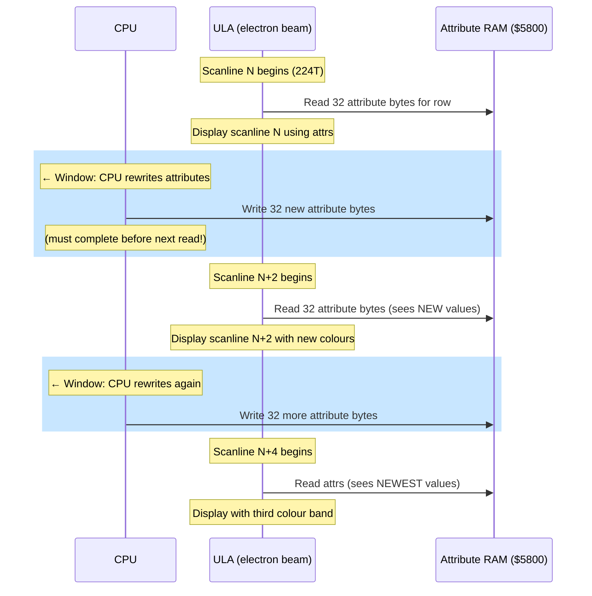

# Chapter 8: Multicolor --- Breaking the Attribute Grid

> *"The multicolor will be conquered."*
> --- DenisGrachev, Hype, 2019

---

Every ZX Spectrum coder knows the rule. Two colours per 8x8 cell. Ink and paper. That is what the ULA gives you, and that is all it gives you. If your character has a red hat and a blue coat and the two colours fall inside the same attribute cell, one of them loses. The result --- garish fringing, miscoloured sprites, characters that change colour as they walk past scenery --- is attribute clash, and it is the defining visual constraint of the platform.

Attribute clash is so fundamental to the Spectrum's identity that many coders simply accept it. They design around it. They pick their palettes to minimise it. They restrict sprite sizes or avoid certain colour combinations. For thirty years, the 8x8 grid has been a fact of life.

But the ULA does not know this.

The ULA reads attribute bytes as it draws the screen, one scanline at a time. It does not read all 768 attribute bytes at once. It reads each row of 32 attributes exactly when it needs them, eight scanlines later it reads the same row again for the next pixel line within that character row, and so on. The attribute for any given cell is read eight times per frame --- once for each pixel row in that cell.

The trick is obvious once you see it: if you change the attribute byte between reads, the ULA will apply a different colour to different pixel rows within the same cell. Instead of two colours for all eight rows, you get two colours per *group of rows*. The 8x8 grid does not break because the hardware was redesigned. It breaks because you rewrote the data faster than the hardware could consume it.

This is multicolor. It has been known since at least the early 2000s, when the Russian ZX magazine Black Crow published an algorithm and example code in its fifth issue. But for years, multicolor remained a curiosity --- impressive in demos, impractical in games, because the CPU spent so many T-states changing attributes that nothing was left for game logic.

Then DenisGrachev figured out how to make games with it.

---

## The ULA's Perspective

To understand multicolor, you need to see the screen from the ULA's point of view.

The ULA draws 192 visible scanlines per frame, top to bottom. Each scanline takes 224 T-states (on Pentagon). For each scanline, the ULA reads 32 pixel bytes and 32 attribute bytes from memory. The pixel bytes determine which dots are ink and which are paper. The attribute bytes determine which colours "ink" and "paper" actually are.

Within a character row (8 pixel lines), the ULA reads the same 32 attribute bytes for every scanline. It does not cache them --- it reads them fresh each time. This means you have a window of opportunity between one scanline's attribute read and the next to change the attribute data.

The "traditional" multicolor approach exploits this directly. After a HALT (which synchronises the CPU with the frame interrupt), you count T-states to know exactly when the ULA will read each attribute row. Then, in the gap between reads, you overwrite the attribute bytes with new values. When the ULA reads them for the next scanline, it sees the new colours.

The limitation is brutal: counting T-states precisely, changing 32 bytes between scanlines, then waiting for the next opportunity. The CPU spends almost all its time on this bookkeeping. In a typical traditional multicolor engine, you can change attributes every 2 or 4 scanlines, giving 8x2 or 8x4 colour resolution. But the cycle budget consumed by the attribute-changing code itself leaves almost nothing for game logic, sprite rendering, or sound.

This is why multicolor stayed in demos. Demos can afford to spend 100% of the CPU on visual effects. Games cannot.

---

## The LDPUSH Insight

In January 2019, DenisGrachev published an article on Hype titled "Multicolor Will Be Conquered" (Mul'tikolor budet pobezhdon). The title was a statement of intent. He had been developing Old Tower, a game for the ZX Spectrum with 8x2 multicolor --- attributes changing every two pixel rows --- and he wanted to explain how he had solved the cycle budget problem that made multicolor impractical in games.

The key insight is one of those ideas that seems inevitable in hindsight: the code that outputs pixel data *is* the display buffer.

Traditional multicolor separates code and data. You have a buffer of attribute bytes somewhere in memory, and rendering code that copies them to the screen at the right moment. DenisGrachev's technique fuses the two. The "buffer" is a sequence of Z80 instructions --- specifically, `LD DE,nn` followed by `PUSH DE` --- and executing those instructions writes the display data directly to screen memory via the stack pointer.

Here is how it works.

### LD DE,nn / PUSH DE

The instruction `LD DE,nn` loads a 16-bit immediate value into register pair DE. It takes 10 T-states and is 3 bytes long: the opcode byte `$11`, followed by two data bytes (the value to load, low byte first). The instruction `PUSH DE` writes the contents of DE to the address pointed to by SP, then decrements SP by 2. It takes 11 T-states.

Together, `LD DE,nn : PUSH DE` costs 21 T-states, is 4 bytes long, and writes 2 bytes of data to the screen. The "data" is the immediate operand of the LD instruction. To change what gets drawn, you do not rewrite a display buffer --- you patch the operand bytes inside the LD instructions themselves.

```z80
; One LDPUSH pair: writes 2 bytes to screen memory
    ld   de,$AA55       ; 10 T  load pixel data
    push de             ; 11 T  write to (SP), SP = SP - 2
                        ; ---
                        ; 21 T total, 2 bytes output
```

A scanline of pixel data is 32 bytes wide. But you cannot fill all 32 bytes with PUSH alone, because PUSH writes downward (SP decrements) and you need the data to appear left-to-right on screen. The Spectrum's screen memory layout handles this: within a single scanline, consecutive bytes are at ascending addresses. PUSH writes to descending addresses. So the data comes out backwards --- the last byte pushed appears at the lowest address, which is the leftmost byte on screen.

This means you build your LDPUSH sequence in reverse display order. The first `LD DE,nn : PUSH DE` in the code writes the rightmost two bytes of the scanline. The last writes the leftmost two bytes. When executed, the pushes fill the scanline right-to-left.

### How much fits in a scanline?

DenisGrachev does not fill all 32 bytes. The GLUF engine (which powers Old Tower and other games) uses a 24-character-wide game area, padded with a border on each side. That is 24 bytes per scanline in the game area.

At 4 bytes of code per 2 bytes of output, you need 48 bytes of code to fill 24 bytes of screen. But there is an additional byte for the initial `LD SP,nn` setup and for the attribute change between scanline groups. DenisGrachev reports 51 bytes per scanline of generated code.

The beauty of this approach: there is no separate rendering pass. The instructions that populate the screen ARE the executable code. When you need to update a tile or sprite, you patch the immediate operands of the LD instructions. When the display code runs, it outputs the patched data. Code is data. Data is code.

### The stack pointer as a cursor

During execution, SP is pointed at the right edge of the current scanline in screen memory. Each PUSH writes 2 bytes and decrements SP by 2, moving the "write cursor" leftward across the scanline. At the end of one scanline's output, SP points to the left edge. The code then adjusts SP to the right edge of the next scanline and repeats.

The fundamental constraint: interrupts must be disabled while SP is hijacked. If an interrupt fired, the CPU would push the return address into screen memory, corrupting the display. This means the multicolor rendering code runs with `DI` and re-enables interrupts with `EI` only after SP is restored to the real stack. The entire rendering pass --- all 192 visible scanlines --- happens in one uninterruptible block.

---

## The GLUF Engine: Multicolor in a Real Game

Old Tower was a proof of concept. GLUF (DenisGrachev's game framework) was the production engine. Here are the numbers:

| Parameter | Value |
|-----------|-------|
| Multicolor resolution | 8x2 (attributes change every 2 pixel rows) |
| Game area | 24x16 characters (192x128 pixels) |
| Buffering | Double-buffered (two sets of display code) |
| Sprite size | 16x16 pixels |
| Tile size | 16x16 pixels |
| Sound | 25 Hz (every other frame) |
| Cycles per frame | ~70,000 (nearly the entire Pentagon budget) |

The 8x2 resolution means the engine changes attributes four times per character row instead of once. Each character row is 8 scanlines tall; changing attributes every 2 scanlines gives four distinct colour bands within a single character cell. A character that would normally be limited to ink-on-paper suddenly has up to eight colours (two per band, four bands). In practice, the effect is striking --- sprites and tiles display far more colour detail than the Spectrum's architecture was designed to allow.

### Double buffering

GLUF maintains two complete sets of LDPUSH display code. While one set executes (drawing the current frame), the other is being patched with new tile and sprite data for the next frame. This eliminates the flicker that would result from modifying display code while it is executing.

The cost is memory. Each set of display code covers the 24x16 character game area at 51 bytes per scanline times 128 scanlines: roughly 6,500 bytes per buffer. Two buffers consume about 13,000 bytes. On a 128K Spectrum with banked memory, this is manageable but significant --- it means careful memory planning for the rest of the game's assets.

### The two-frame architecture

Here is where the engineering gets brutal. GLUF does not render a complete frame every 1/50th of a second. It uses a two-frame architecture:

**Frame 1:** Change attributes for the multicolor effect, then render as many tiles as possible into the display code buffer. The attribute changes are the time-critical part --- they must happen at precisely the right moment relative to the raster beam.

**Frame 2:** Finish rendering any remaining tiles, then overlay sprites onto the display code buffer.

The split is necessary because the workload simply does not fit in one frame. Rendering tiles into the LDPUSH buffer means patching operand bytes inside the display code --- for each tile pixel, you calculate which LD instruction it affects and write the new value into the right byte offset. This is not a simple block copy. The interleaved structure of the display code (opcode-data-data-opcode-data-data...) means tile rendering involves scattered writes, not sequential ones.

The total rendering budget is approximately 70,000 T-states per frame --- nearly the entire Pentagon budget of 71,680. What remains is barely enough for game logic, input handling, and the periodic sound update.

Sound runs at 25 Hz instead of 50 Hz. Every other frame, the engine skips the sound update entirely to reclaim those T-states for rendering. The player does not notice the halved update rate for simple sound effects. For music, the 25 Hz rate means each note lasts twice as many frames, which requires the music engine to be written specifically for this constraint.

### What the player sees

The player does not see any of this. They see a side-scrolling game with more colour than a Spectrum should have. Sprites move over scenery without the usual attribute clash. Tiles display shading, texture, and multi-coloured detail that would be impossible with standard 8x8 attributes. The game feels like it belongs on a more capable platform.

This is the point DenisGrachev's work makes forcefully: multicolor is not a demo trick. It is a game engine technique. The engineering is extreme --- double buffers, two-frame rendering, 25 Hz sound --- but the result is a playable game with visuals that genuinely break the Spectrum's perceived limits.

---

## Ringo: A Different Kind of Multicolor

In December 2022, DenisGrachev published a second article on Hype: "Ringo Render 64x48." Where GLUF extended the attribute grid to 8x2, Ringo threw it away entirely and built something closer to a chunky-pixel framebuffer with per-pixel colour.

The approach is conceptually simple and technically devious.

### The 11110000b pattern

Fill every pixel byte in screen memory with the value `$F0` --- binary `11110000`. The left four pixels of each byte are set (ink colour), and the right four are clear (paper colour). Now, if you change the attribute for that cell, the left half displays the ink colour and the right half displays the paper colour. A single 8-pixel-wide cell displays two distinct colours, side by side.

With standard 8x8 attributes, this gives you a 64x24 grid of independently coloured "pixels," each 4 real pixels wide and 8 real pixels tall. Not bad, but not revolutionary.

### Two-screen switching

The trick that makes Ringo work: the ZX Spectrum 128K has two screen buffers. Screen 0 lives at `$4000`, Screen 1 at `$C000` (in bank 7). A single `OUT` to port `$7FFD` switches which screen the ULA displays.

Ringo prepares both screens with the `11110000b` pattern but with *different* attributes on each screen. It then switches between the two screens every 4 scanlines. The effect: within each 8-pixel-tall character row, the top 4 scanlines show Screen 0's attributes, and the bottom 4 show Screen 1's. Each half can specify independent ink and paper colours.

Combined with the `11110000b` pixel pattern, this gives:

- 2 colour columns per character cell (left 4 pixels = ink, right 4 = paper)
- 2 colour rows per character cell (top 4 scanlines from Screen 0, bottom 4 from Screen 1)
- Total: 4 independently coloured sub-cells per 8x8 character cell

Over the full screen: 64 columns x 48 rows = **3,072 independently coloured pixels**, each 4x4 real pixels in size. The effective resolution is 64x48 with full per-pixel colour from the Spectrum's 15-colour palette.

This is a fundamentally different approach from GLUF's 8x2 multicolor. GLUF changes attributes in sync with the beam, requiring precise timing and consuming massive cycle budgets. Ringo uses dual-screen hardware switching, which requires only a single `OUT` instruction every 4 scanlines. The CPU overhead for the screen switching itself is minimal.

### Where the T-states go

The cheap screen switching means more T-states are available for game logic. But rendering into two screens simultaneously is not free. Every tile and sprite update must be written to both Screen 0 and Screen 1, because the player sees a composite of both.

Ringo's sprites are 12x10 "pixels" in the 64x48 grid, which means 12 attribute bytes wide and 10 attribute rows tall (split across the two screens). Each sprite occupies 120 bytes of data. Sprite rendering uses fixed-cycle macros --- sequences of instructions with known, constant execution time, critical for maintaining synchronisation with the screen switching.

Tile rendering is more involved. DenisGrachev pre-generates tile rendering code in memory pages, using `pop af : or (hl)` patterns:

```z80
; Tile rendering fragment (conceptual)
    pop  af             ; 10 T  load tile data from stack-based source
    or   (hl)           ;  7 T  combine with existing screen data
    ld   (hl),a         ;  7 T  write back
    inc  l              ;  4 T  next attribute column
                        ; ---
                        ; 28 T per attribute byte
```

The `pop af` is a stack trick: the tile data is arranged as a stack-format table in memory. SP points to the tile data, and POP reads two bytes at a time. The `or (hl)` combines the tile colour with whatever is already on screen, allowing transparent tiles and layered backgrounds.

### Horizontal scrolling

Ringo implements horizontal scrolling with half-character displacement. Since each "pixel" in the 64x48 grid is 4 real pixels wide, scrolling by one "pixel" means shifting the `11110000b` pattern by 4 bits. But the pattern is fixed --- you cannot easily shift it without corrupting the colour trick.

Instead, DenisGrachev scrolls by moving the attribute data. A one-pixel scroll shifts all attributes one column to the left or right and draws the new column at the edge. Because the attributes are the only thing that changes (the pixel pattern stays fixed at `$F0`), the scroll is just a block copy of attribute bytes. For the 64x48 grid, this is 48 bytes per column shift (one byte per row), far cheaper than pixel-level scrolling.

For sub-"pixel" scrolling --- smooth movement within a 4-pixel-wide column --- DenisGrachev alternates between `$F0` and `$E0` (or similar shifted patterns) in the pixel data. This requires more bookkeeping but achieves half-character displacement, giving the illusion of 128-column horizontal resolution.

---

## Traditional Multicolor: The Interrupt-Driven Approach

Before we move to the practical, it is worth understanding the "classic" approach that GLUF and Ringo displaced. Traditional multicolor is conceptually the simplest: change attributes at precisely the right moment, and the ULA will display different colours on different scanlines.

The technique works like this:

1. Execute `HALT` to synchronise with the frame interrupt. After HALT, the CPU is at a known T-state position relative to the start of the display.

2. Count T-states from the HALT. The ULA reads each row of 32 attributes at a known point in each scanline. By padding with `NOP`s or other known-length instructions, you can position your code at exactly the right moment.

3. At the precise T-state when the ULA has finished reading attributes for the current scanline (but before it reads them for the next), overwrite the 32 attribute bytes with new values.

4. Wait for the ULA to read the new values, then overwrite again for the next change.

The timing is brutal. Each scanline takes 224 T-states on Pentagon. The ULA reads 32 attribute bytes early in each scanline, and the CPU must change all 32 bytes in the gap before the next read. With `LD (HL),A : INC L` at 11 T-states per byte, writing 32 bytes takes 352 T-states --- more than one entire scanline. You cannot change every scanline. At best, you can change every other scanline (8x2 resolution) if you use the fastest possible output method (PUSH-based), and even then the timing margins are razor-thin.

<!-- figure: ch08_multicolor_beam_racing -->


> **The race:** At 224 T-states per scanline, writing 32 bytes via `LD (HL),A : INC L` costs 352T — more than one scanline. This is why 8×2 resolution (change every 2 scanlines) is the practical limit with CPU-based attribute rewriting, and why LDPUSH merges pixel and attribute output to avoid a separate attribute pass.

The practical result: traditional multicolor consumes 80--90% of the CPU on attribute management. In a demo, where the multicolor *is* the effect, this is acceptable. In a game, it is lethal. No T-states remain for game logic, collision detection, or sound.

DenisGrachev's LDPUSH technique solves this by merging the attribute output with the pixel output. The same code that writes pixel data also writes attributes, and both are embedded in executable instructions. There is no separate "attribute management" phase eating the budget. The rendering pass handles everything.

---

## Sidebar: Black Crow #05 --- Early Multicolor

The technique of changing attributes between scanlines was documented as early as 2001 in Black Crow #05, a Russian ZX Spectrum scene magazine distributed on TRD disk images. The article presented the basic algorithm --- synchronise with the raster, count T-states, change attributes --- along with working example code.

Black Crow is significant as a historical marker. By 2001, the ZX Spectrum demoscene had evolved well past the platform's commercial lifespan, and coders were systematically cataloguing tricks that pushed the hardware beyond its design specifications. Multicolor was one of many techniques shared through the scene magazine ecosystem: Spectrum Expert, ZX Format, Born Dead, Black Crow, and later the online platform Hype.

DenisGrachev's contribution, nearly two decades later, was not inventing multicolor but solving its practical problems for game development. The magazine articles documented what was possible. DenisGrachev showed what was *usable*.

---

## The Spectrum's Palette and Multicolor

A brief note on colour mechanics, because multicolor's visual impact depends entirely on the palette.

The ZX Spectrum has 15 colours: 8 base colours (black, blue, red, magenta, green, cyan, yellow, white) and 7 BRIGHT variants (bright black is the same as black, so only 7 additional). Each attribute byte specifies an ink colour (3 bits), a paper colour (3 bits), a BRIGHT flag (1 bit, applies to both ink and paper simultaneously), and a FLASH flag (1 bit).

With 8x2 multicolor, each character cell gets four attribute rows instead of one. Each row specifies independent ink and paper colours. That is up to eight colours per cell (two per row, four rows) --- though in practice, the BRIGHT constraint (it applies to both ink and paper) limits the effective combinations.

With Ringo's 64x48 approach, each sub-cell is fully independent. The 15-colour palette is available at every one of the 3,072 positions. The result is closer to what 8-bit home computers with more capable hardware --- the MSX2, the Amstrad CPC --- could achieve natively. On the Spectrum, it is achieved entirely in software, by exploiting the timing relationship between the CPU and the ULA.

---

## Practical: A Multicolor Game Screen

Let us build a simplified multicolor renderer. The goal: a 24-character-wide game area with 8x2 colour resolution and one moving sprite on top. This will not match GLUF's full feature set, but it will demonstrate the core LDPUSH technique and the two-frame rendering approach.

### Step 1: The display code buffer

First, we need a block of memory filled with LDPUSH instruction pairs. For each scanline in the 24-character game area, we need 12 pairs of `LD DE,nn : PUSH DE` (each pair outputs 2 bytes, 12 pairs output 24 bytes = the full game area width).

```z80
; Structure of one scanline's display code (conceptual)
; SP is pre-set to the right edge of this scanline in screen memory

    ld   de,$0000       ; 10 T  rightmost 2 bytes (will be patched)
    push de             ; 11 T
    ld   de,$0000       ; 10 T  next 2 bytes leftward
    push de             ; 11 T
    ld   de,$0000       ; 10 T
    push de             ; 11 T
    ; ... 12 pairs total ...
    ld   de,$0000       ; 10 T  leftmost 2 bytes
    push de             ; 11 T
    ; --- 252 T per scanline (12 x 21) ---

    ; Then: adjust SP for the next scanline
    ; Then: change attributes (every 2nd scanline)
```

The total display code for 128 scanlines (16 character rows x 8 scanlines each) at approximately 51 bytes per scanline is about 6,500 bytes.

### Step 2: Attribute changes within the display code

Every two scanlines, the display code must include attribute writes. Between the LDPUSH sequences for scanlines N and N+2, insert code that overwrites the 32 attribute bytes for the current character row:

```z80
; After outputting scanline N...
; Attribute change for the next 2-scanline band

    ld   sp,attr_row_end       ; point SP at end of attribute row
    ld   de,attr_data_0        ; 10 T  rightmost 2 attribute bytes
    push de                    ; 11 T
    ld   de,attr_data_1        ; 10 T
    push de                    ; 11 T
    ; ... 16 pairs for 32 attribute bytes ...

    ld   sp,next_scanline_end  ; point SP at next scanline's right edge
    ; Continue with pixel LDPUSH pairs for scanlines N+2, N+3
```

The attribute changes are embedded directly in the display code stream. They execute at exactly the right moment because they are *positioned* at exactly the right point in the instruction sequence. No T-state counting required. No NOP padding. The structure of the code guarantees the timing.

### Step 3: Tile rendering via operand patching

To draw a tile into the game area, you must patch the operand bytes of the LD instructions in the display code buffer. A 16x16 pixel tile covers 2 bytes wide and 16 scanlines tall. In the display code, those 2 bytes are the operand of a specific LD DE instruction. To update the tile:

```z80
; Patch one scanline of a 16x16 tile into the display buffer
; IX points to the LD DE instruction for this position in the buffer
; HL points to the tile's pixel data for this scanline

    ld   a,(hl)             ;  7 T  read tile byte 0
    ld   (ix+1),a           ; 19 T  patch into LD DE operand (low byte)
    inc  hl                 ;  6 T
    ld   a,(hl)             ;  7 T  read tile byte 1
    ld   (ix+2),a           ; 19 T  patch into LD DE operand (high byte)
    inc  hl                 ;  6 T
    ; advance IX to the next scanline's LD DE instruction
    ; (stride depends on display code structure)
```

At 19 T-states per IX-indexed write, this is not cheap. For a full 16x16 tile (16 scanlines x 2 bytes x 2 patches per byte): roughly 1,200 T-states per tile. In a 24x16 character game area with 2-character-wide tiles, there are up to 192 tiles. Even with partial updates (only redrawing tiles that changed), tile rendering dominates the budget.

This is why GLUF splits rendering across two frames. Frame 1 handles the time-critical attribute changes and renders as many tiles as possible. Frame 2 finishes tiles and composites sprites on top.

### Step 4: Sprite overlay

Sprites are rendered on top of tiles using the same operand-patching technique, but with an additional step: save the original operand bytes before overwriting them, so the sprite can be erased on the next frame by restoring the saved data.

```z80
; Sprite rendering: save background, patch sprite data
    ld   a,(ix+1)           ; read current (background) byte
    ld   (save_buffer),a    ; save for later restoration
    ld   a,(sprite_data)    ; load sprite pixel
    ld   (ix+1),a           ; patch into display code
```

The save/restore mechanism is the multicolor equivalent of dirty-rectangle sprite rendering. You save what was there, draw the sprite, display it, then restore the saved bytes to erase the sprite before drawing it in its new position.

### Step 5: The main loop

```z80
main_loop:
    halt                    ; synchronise with frame

    ; --- Frame 1: attributes + tiles ---
    di
    ld   (restore_sp+1),sp  ; save real SP
    call execute_display     ; run the LDPUSH display code
restore_sp:
    ld   sp,$0000           ; restore SP
    ei

    call update_tiles        ; patch changed tiles into buffer B
    call read_input          ; handle player input
    call update_game_logic   ; move entities, check collisions

    halt                    ; synchronise with next frame

    ; --- Frame 2: remaining tiles + sprites ---
    di
    ld   (restore_sp2+1),sp
    call execute_display     ; display the current frame
restore_sp2:
    ld   sp,$0000
    ei

    call finish_tiles        ; patch any remaining tiles
    call erase_old_sprite    ; restore saved bytes
    call render_sprite       ; patch sprite into new position
    call update_sound        ; sound at 25 Hz (every other frame pair)

    jr   main_loop
```

This skeleton captures the essential rhythm: two frames per logical game frame, display code executing with interrupts disabled, tile and sprite rendering happening between display passes. The interleaving of rendering and game logic within the two-frame structure is the engineering heart of a multicolor game engine.

---

## What DenisGrachev's Work Means

The demoscene has always been about pushing hardware past its limits. But there is a distinction --- sometimes overlooked, sometimes intentional --- between pushing hardware for a ten-second demo and pushing it for a playable game.

Demos are performance art. They run once, they impress, they end. There is no input handling. There is no collision detection. There is no state that persists from one frame to the next (beyond what the effect needs internally). A demo can spend 100% of its T-states on visual spectacle because spectacle is all it needs to produce.

Games are engineering. They must read the keyboard, update entity positions, check collisions, play sound, manage game state, and render the screen --- every frame, forever, while remaining responsive to the player. Each of these systems competes for the same 70,000-cycle budget. A technique that works in a demo but consumes 90% of the CPU is useless for games.

DenisGrachev's achievement is solving the engineering problem. Multicolor was known. The visual potential was known. The LDPUSH instruction pattern was arguably implicit in the demoscene's long history of stack-based output tricks (Chapter 3). What was not known was how to fit multicolor rendering, tile engines, sprite overlay, double buffering, sound, input, and game logic into the same frame budget. The two-frame architecture, the merged code-as-data display buffer, the 25 Hz sound compromise, the careful budget allocation --- these are game engine decisions, not demo tricks.

The Ringo engine pushes further in a different direction. By using dual-screen switching instead of beam-synchronised attribute changes, it trades colour resolution (64x48 instead of GLUF's 192x128 pixel grid) for a radically cheaper rendering path. The CPU overhead of screen switching is a handful of `OUT` instructions per frame. What you gain is cycle budget. What you spend it on is game logic.

Both engines represent a philosophy: the demoscene's techniques are not museum exhibits. They are engineering tools, applicable to real products, if you are willing to do the work of making them practical. DenisGrachev's multicolor games do not look like ZX Spectrum games. They look like games that happen to run on a ZX Spectrum. That distinction is the whole point.

---

## Summary

- **Attribute clash** (two colours per 8x8 cell) is the Spectrum's defining visual constraint. The ULA reads attributes per scanline, not per frame --- if you change them between reads, you get more colours per cell.
- The **LDPUSH technique** fuses display data with executable code: `LD DE,nn : PUSH DE` sequences write pixel data to screen memory when executed, and the immediate operands serve as the display buffer. Patching the operands changes what gets drawn.
- **GLUF** achieves 8x2 multicolor in a 24x16 character game area with double-buffered display code, 16x16 sprites and tiles, and a two-frame architecture that splits rendering across 2/50ths of a second.
- **Ringo** uses the `11110000b` pixel pattern with dual-screen switching every 4 scanlines to achieve a 64x48 grid with per-pixel colour --- a fundamentally different trade-off that favours colour independence over spatial resolution.
- **Traditional multicolor** (interrupt-driven attribute changes) is conceptually simpler but consumes 80--90% of the CPU, making it impractical for games.
- The **Black Crow #05** magazine documented multicolor as early as 2001. DenisGrachev's contribution was making it practical for game development.
- DenisGrachev's work demonstrates that demoscene techniques are engineering tools, not just demo tricks. The distinction between "possible in a demo" and "usable in a game" is the engineering challenge.

---

## Try It Yourself

1. **Build the display buffer.** Write a program that generates a block of `LD DE,nn : PUSH DE` pairs in memory, points SP at screen memory, and executes the block. You should see a pattern on screen corresponding to the immediate values you chose. Change the values and re-execute to see the screen update.

2. **Add attribute changes.** Extend your display buffer to include attribute writes every 2 scanlines. Fill alternate bands with different colours. You should see horizontal colour stripes within a single character row --- proof that the multicolor effect is working.

3. **Patch a tile.** Write a routine that takes a 16x16 pixel tile and patches it into the display buffer at a specified position by modifying the LD operand bytes. Draw several tiles to fill the game area.

4. **Move a sprite.** Implement save/restore background patching: before drawing the sprite, save the operand bytes it will overwrite. After displaying the frame, restore the saved bytes. Move the sprite one character per frame and verify it moves cleanly without leaving trails.

5. **Measure the budget.** Use the border-colour timing harness from Chapter 1 to measure how much of the frame your display code consumes. On Pentagon, the red stripe should nearly fill the border --- GLUF uses ~70,000 of the available 71,680 T-states. See how much room remains for game logic.

---

> **Sources:** DenisGrachev, "Multicolor Will Be Conquered" (Hype, 2019); DenisGrachev, "Ringo Render 64x48" (Hype, 2022); Black Crow #05 (ZXArt, 2001). Game engines: Old Tower, GLUF, Ringo by DenisGrachev.
