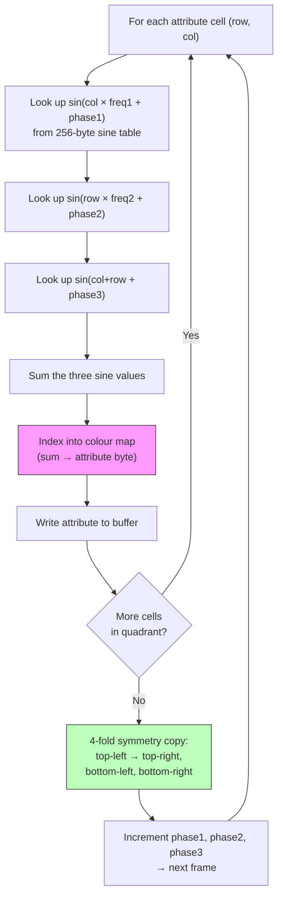

# Chapter 9: Attribute Tunnels and Chaos Zoomers

> *"This is a VERY BUGGY demo. It is THE hardest thing I've ever done in a demo -- no joke."*
> -- Introspec, file_id.diz for the party version of Eager (to live), 3BM Open Air 2015

---

In the summer of 2015, Introspec sat down to build something he had never attempted before. The demo that emerged -- Eager (to live), released under the Life on Mars label at 3BM Open Air -- won first place in the ZX Spectrum demo compo. It ran for two minutes, looping, and every frame of it rendered at 50Hz with true digital drums blended into the AY chip's output. The visual centrepiece was a tunnel that appeared to bore into the screen, colours rippling outward in organic waves. When people saw it, many assumed heavy pixel manipulation was involved. In fact, the tunnel never touched a single pixel. The entire effect lived in attribute memory.

This chapter is a making-of. We will work through the two core visual effects from Eager -- the attribute tunnel and the chaos zoomer -- tracing the creative reasoning alongside the code. Along the way, we will encounter a scripting engine that hints at the synchronisation architecture covered in Chapter 12, and a philosophical argument about precalculation that divided the ZX scene for years. But we begin where Introspec began: staring at 768 bytes and realising they were enough.

---

## The Attribute Grid as a Framebuffer

Every ZX Spectrum coder knows the attribute area at `$5800`--`$5AFF`. Each of the 768 bytes controls the ink and paper colour for an 8x8 block of pixels, giving a 32x24 grid. In game development, attributes are the source of colour clash headaches. In Chapter 8, we saw how multicolor engines rewrite attributes in sync with the raster beam to fight the 8x8 grid. The attribute tunnel does the opposite: it embraces the grid.

The insight is disarmingly simple. If you fill pixel memory with a fixed pattern -- say, alternating ink/paper stripes or a checkerboard -- then the attribute byte alone determines what the viewer sees in each 8x8 cell. Change the ink and paper colours, and the visual content of that cell changes completely. You now have 32x24 "pixels" of colour, each one an attribute byte. Writing a full frame means writing 768 bytes. No screen address interleaving. No bit manipulation. No pixel plotting. Just a linear block copy into attribute RAM.

At 32x24, the resolution is terrible by any normal standard. But Introspec was not building a normal effect. He was building a tunnel.

Think about what a tunnel looks like from the viewer's perspective. The "mouth" of the tunnel -- the centre of the screen -- is where the eye is drawn. The walls recede toward the edges. Near the centre, individual details are small and blurred by depth. Near the edges, the walls are close and you can see texture. This maps beautifully onto a variable-resolution display: coarse resolution in the centre (where the tunnel is far away and detail does not matter) and finer resolution at the edges (where it does).

Introspec pushed this further with pseudo-chunky rendering. In the centre of the screen, several attribute cells share the same colour, creating larger "pixels." Toward the edges, each 8x8 cell gets its own value. The eye accepts the blocky centre because that is where the tunnel mouth is -- depth naturally destroys detail there. Peripheral vision picks up the finer resolution at the edges, creating an impression of higher fidelity than the data actually contains.

This is the first lesson of Eager: the attribute grid is not a limitation to work around. It is a framebuffer to work with.

---

## Plasma: The Colour Engine

The tunnel's colours do not come from a stored texture mapped onto a tube. They come from a plasma calculation -- the classic sum-of-sines approach that has been a demoscene staple since the Amiga days, here adapted for the Spectrum's attribute palette.

The basic idea: for each position on the 32x24 grid, sum several sine waves with different frequencies and phases. The result, after clamping to the available colour range, determines the attribute byte. Vary the phases over time and the plasma animates, creating that organic, rippling flow.

On the Z80, this means table lookups. A 256-byte sine table, page-aligned so you can index it with a single register, provides the base function. For each cell, you look up `sin(x * freq1 + phase1) + sin(y * freq2 + phase2) + ...` where the multiplications by frequency are really just additions to the index (multiply by 2 = look up every other entry, multiply by 3 = add the index to itself twice). The accumulated value indexes into a colour map that produces an attribute byte.

The tunnel shape is implicit, not explicit. There is no distance-from-centre calculation, no angle table, no polar coordinate transform. Instead, the frequency and phase parameters of the plasma are arranged so that the resulting colour pattern naturally forms concentric rings when viewed on screen. The rings emerge from the interference of the sine waves, just as Moire patterns emerge from overlapping grids. Adjust the parameters and the rings contract toward the centre, creating the illusion of depth -- of looking down a tunnel.

<!-- figure: ch09_tunnel_plasma_computation -->


> **Key insight:** There is no distance-from-centre calculation, no angle table, no polar coordinate transform. The tunnel shape emerges from sine wave interference — concentric rings appear naturally from overlapping frequencies. Only one quarter (16×12) is computed; the rest is mirrored.

This is cheaper than a true geometric tunnel (which would require per-pixel distance and angle lookups) and produces a visually rich result. The trade-off is less geometric precision, but at 32x24 resolution, geometric precision was never on the table anyway.

---

## Four-Fold Symmetry: Divide and Conquer

Even at 32x24, calculating plasma for all 768 cells every frame is expensive on a 3.5MHz Z80. Introspec cut the workload by a factor of four with a classic optimisation: exploit the tunnel's natural symmetry.

A tunnel viewed head-on is symmetric about both the horizontal and vertical axes. If you calculate one quarter of the screen -- the top-left 16x12 block -- you can copy it to the other three quarters by mirroring. Top-left to top-right is a horizontal flip. Top-left to bottom-left is a vertical flip. Top-left to bottom-right is both.

The copy routine is tight. In Introspec's implementation, HL points to the source byte in the top-left quarter, and the three destination addresses (top-right, bottom-left, bottom-right) are maintained in a combination of absolute addresses and register pair BC:

```z80 id:ch09_four_fold_symmetry_divide_and
    ld a,(hl)      ; read source byte from top-left quarter
    ld (nn),a      ; write to upper-right quarter (mirrored)
    ld (mm),a      ; write to lower-left quarter (mirrored)
    ld (bc),a      ; write to lower-right quarter (mirrored)
    ldi            ; copy source to its own destination AND advance HL, DE
```

The `ld (nn),a` and `ld (mm),a` instructions use absolute addressing -- the target addresses are embedded directly in the code, patched via self-modification or code generation for each cell position. The `ldi` instruction at the end does double duty: it copies the byte from (HL) to (DE) for the top-left quarter's own position in the attribute buffer, and it auto-increments both HL and DE while decrementing BC. This means the loop counter, the source pointer advance, and one of the four writes are all folded into a single two-byte instruction.

The total cost: under 15 T-states per byte for the four-way copy. For 192 source bytes (one quarter of the 768-byte attribute area), that is roughly 2,880 T-states to fill the entire screen. At 3.5MHz with a ~70,000 T-state frame budget, this leaves the vast majority of the frame for the plasma calculation, the music engine, and the digital drum playback that made Eager distinctive.

The addresses `(nn)` and `(mm)` are literal two-byte values baked into `LD (addr),A` instructions, patched via self-modification or code generation for each cell position. This is standard demoscene practice: the Z80's lack of an instruction cache means self-modifying code executes reliably.

---

## The Chaos Zoomer

The second major visual effect in Eager is the chaos zoomer. Where the tunnel is smooth and organic, the zoomer is jagged and fractal-like -- a field of attribute data zooming toward or away from the viewer, with new detail emerging at the edges as the zoom progresses.

The "chaos" comes from the visual result, not the algorithm. The effect zooms into a region of attribute data, magnifying the centre while the edges scroll inward. Because the source data has patterns at multiple scales, the zooming reveals self-similar structure that reads as fractal to the eye.

The implementation relies on unrolled `ld hl,nn : ldi` sequences. Each `ld hl,nn` loads a new source address -- the position in the source buffer to sample for this particular output cell. The following `ldi` copies from (HL) to (DE), advancing DE to the next output position. The source addresses are arranged so that cells near the centre of the screen sample from nearby positions in the source data (magnification), while cells near the edges sample from widely spaced positions (compression). Vary the mapping over time and the zoom animates.

```z80 id:ch09_the_chaos_zoomer
    ; Unrolled chaos zoomer fragment
    ld hl,src_addr_0    ; source for output cell 0
    ldi                 ; copy to output, advance DE
    ld hl,src_addr_1    ; source for output cell 1
    ldi
    ld hl,src_addr_2    ; source for output cell 2
    ldi
    ; ... repeated for all 768 cells (or one quarter, with symmetry)
```

The key optimisation: since `ldi` auto-increments DE, you never need to calculate or load the destination address. The output is always written sequentially into attribute RAM. Only the source addresses vary, and they are embedded directly in the instruction stream as immediate operands. This makes the zoomer a long sequence of `ld hl,nn : ldi` pairs -- conceptually simple, but each pair is just 5 bytes (3 for `ld hl,nn` + 2 for `ldi`) and 26 T-states. For a full quarter-screen of 192 cells, that is roughly 5,000 T-states of pure copying, plus the four-way symmetry copy on top.

The complication is that the source addresses change every frame as the zoom progresses. Updating 192 two-byte addresses embedded in the code would cost nearly as much as the copy itself. This is where code generation enters the picture.

---

## Code Generation: Processing Writes Z80

Introspec did not write the zoomer's unrolled code by hand. The address sequences are different for every zoom level, and calculating them at runtime would consume the frame budget. Instead, he wrote the code generator in Processing, the Java-based creative coding environment. A Processing sketch calculated, for each frame and each output cell, which source cell should be sampled, then output a complete `.a80` source file containing the unrolled `ld hl,nn : ldi` sequence with all addresses filled in. sjasmplus compiled this generated source alongside the hand-written engine code.

The pipeline: Processing calculates the zoom mapping, writes `.a80` source, the assembler compiles it, and at runtime the scripting engine selects which pre-generated frame to execute. The Z80 does not compute the mapping. It merely plays it back.

This trades memory for speed -- the pre-generated code for all zoom frames occupies substantial RAM, hence the 128K requirement -- but the runtime cost per frame is minimal.

---

## The Zapilator Question

The ZX scene has a long and occasionally heated relationship with precalculation. The Russian demoscene coined the term *zapilator* -- roughly, "precalculator" -- for demos that rely heavily on pre-generated data rather than real-time computation. The word carries a faint whiff of disapproval. If the PC does all the interesting work, what is the Spectrum actually doing? Is it a demo or a slideshow?

Introspec's answer is characteristically nuanced. The art, he argues, is not in the computation itself but in *designing what to precalculate*. Choosing the right zoom mapping, the right interpolation, the right way to decompose the problem so that the pre-generated code fits in memory and the playback runs at 50Hz -- this is engineering. The Processing script does not write itself. The Z80 code structure that makes playback efficient does not emerge automatically. The creativity lives in the architecture, not in whether the inner loop contains an `add` or a `ldi`.

He has a point. The chaos zoomer's visual quality depends on the source data, the mapping function, the zoom curve, the colour palette, and the interplay with the music. All of these are artistic decisions. The fact that the address calculations happen at compile time rather than runtime is an implementation detail -- one that enables a visual quality impossible with real-time computation at 3.5MHz. The machine's constraints -- its memory, its instruction set, its timing -- shaped every decision. That the shaping happened partly in Processing and partly in Z80 assembly does not diminish the result.

For this book's purposes, the takeaway is practical: code generation is a legitimate and powerful technique. If your effect requires calculations that exceed the Z80's frame budget, consider moving them to build time. Your assembler's macro language, a Lua script inside sjasmplus, or an external program in Python or Processing can all serve as code generators. The Z80 gets to do what it does best: copy data at maximum speed.

---

## A Taste of the Scripting Engine

Eager contains more than the tunnel and the zoomer. It runs for two minutes, with multiple visual variations, transitions, and the digital drum playback that gives the demo its rhythmic pulse. Coordinating all of this is a scripting engine -- a topic we will explore in depth in Chapter 12 when we discuss music synchronisation. But a brief sketch here sets up that discussion.

Introspec's engine uses two levels of scripting. The **outer script** controls the sequence of effects: play the tunnel for N frames, transition to the zoomer, back to the tunnel with different parameters, and so on. The **inner script** controls variations within a single effect: changing the plasma frequencies, shifting the colour palette, adjusting the zoom speed.

A critical command in the scripting language is what Introspec calls **kWORK**: "generate N frames, then show them independently." This is the key to Eager's asynchronous frame generation. The engine pre-renders several frames of the current effect into memory buffers. Then, while those frames are being displayed (one per screen refresh), the engine can do other work -- like playing a digital drum sample through the AY chip.

This async architecture is what made Eager so difficult to build. When a drum hit occurs, the CPU is consumed by digital sample playback. Frame generation stalls. The visual effect survives on pre-rendered frames until the drum finishes and generation resumes. During rapid drum hits, the generator falls behind; between hits, it catches up. "My brain is not coping with asynchronous coding well," Introspec wrote in the party version's file_id.diz. The honest exhaustion in that note captures the reality of interleaving a timing-critical audio routine with a frame generation pipeline on a machine with one thread and no operating system.

We will return to this architecture in Chapter 12, where we also examine n1k-o's digital drum technique and the double-buffered attribute frames that make the whole system work.

---

## The Making Of: Timeline and Inspiration

Eager was developed between June and August 2015. Introspec has said the initial inspiration came from seeing the twister effect in **Bomb** by Atebit -- a visual trick that exploited attribute manipulation to create the illusion of a three-dimensional rotating column. "What else could you do with attributes alone?" was the question that started the project.

The music came from n1k-o (of Skrju), whose track gave the demo its rhythmic structure. The hybrid drum technique -- digital sample for the attack transient, AY envelope for the decay -- was n1k-o's innovation, and it drove the entire architectural decision to build an asynchronous frame generation engine. Without the drums, Eager could have been a simpler demo. With them, it became what Introspec called "the hardest thing I've done in a demo."

The development was compressed into roughly ten weeks. The party version, submitted to 3BM Open Air 2015, still had bugs -- the file_id.diz carried a note thanking diver of 4th Dimension "for the cool tip" and apologising for the instability. The final version fixed the timing issues across Spectrum models (128K, +2, +2A/B, +3, Pentagon -- all at 3.5MHz only, no turbo). That cross-pollination -- a scener from one group passing a technical insight to a coder from another -- is how the ZX demoscene evolves.

---

## Practical: Building a Simplified Attribute Tunnel

Let us build a stripped-down version of Eager's attribute tunnel. We will implement:

1. A fixed pixel pattern in bitmap memory (so attributes have something to colour).
2. A plasma calculation over the 32x24 attribute grid.
3. Four-fold symmetry to reduce the calculation to one quarter.
4. Animation by incrementing the plasma phase each frame.

This will not match Eager's visual sophistication -- we are omitting the pseudo-chunky variable-size pixels, the code-generated zoomer, and the async architecture. But it will demonstrate the core principle: the attribute grid as your framebuffer.

### Step 1: Fill Pixel Memory with a Pattern

We need a fixed pixel pattern so that ink and paper colours are both visible. A simple checkerboard works:

```z80 id:ch09_step_1_fill_pixel_memory_with
; Fill bitmap memory ($4000-$57FF) with checkerboard pattern
    ld hl,$4000
    ld de,$4001
    ld bc,$17FF          ; 6143 bytes
    ld a,$55             ; 01010101 binary -- alternating pixels
    ld (hl),a
    ldir
```

Every 8x8 cell will now display alternating ink and paper pixels. When we change the attribute, the checkerboard reveals both colours.

### Step 2: Sine Table

Page-align a 256-byte sine table for fast indexing. This can be generated at assembly time using sjasmplus's Lua scripting, or pre-calculated and included as binary data:

```z80 id:ch09_step_2_sine_table
    ALIGN 256
sin_table:
    LUA ALLPASS
    for i = 0, 255 do
        -- Sine scaled to 0..63 (6-bit unsigned)
        sj.add_byte(math.floor(math.sin(i * math.pi / 128) * 31 + 32))
    end
    ENDLUA
```

### Step 3: Plasma for One Quarter

Calculate the plasma value for each cell in the top-left 16x12 quarter. The result is an index into a colour table that produces the attribute byte:

```z80 id:ch09_step_3_plasma_for_one_quarter
; Calculate plasma for top-left quarter (16 columns x 12 rows)
; Input: frame_phase is incremented each frame
; Output: attr_buffer filled with 192 attribute bytes

calc_plasma:
    ld iy,attr_buffer
    ld h,sin_table / 256     ; H = high byte of sine table page
    ld b,12                  ; 12 rows (half of 24)
.row_loop:
    ld c,16                  ; 16 columns (half of 32)
.col_loop:
    ; Plasma = sin(x*2 + phase1) + sin(y*3 + phase2) + sin(x+y + phase3)

    ; Term 1: sin(x*2 + phase1)
    ld a,c
    add a,a                  ; x * 2
    add a,(ix+0)             ; + phase1 (self-modifying or IX-indexed)
    ld l,a
    ld a,(hl)                ; sin_table[x*2 + phase1]
    ld d,a                   ; accumulate in D

    ; Term 2: sin(y*3 + phase2)
    ld a,b
    add a,a
    add a,b                  ; y * 3
    add a,(ix+1)             ; + phase2
    ld l,a
    ld a,(hl)                ; sin_table[y*3 + phase2]
    add a,d
    ld d,a

    ; Term 3: sin((x+y) + phase3)
    ld a,c
    add a,b                  ; x + y
    add a,(ix+2)             ; + phase3
    ld l,a
    ld a,(hl)                ; sin_table[x+y + phase3]
    add a,d                  ; total plasma value

    ; Map to attribute byte
    rrca
    rrca
    rrca                     ; shift to get ink bits in position
    and %00000111            ; 8 ink colours
    or  %00111000            ; white paper (bits 3-5 = 7)
    ld (iy+0),a              ; store in buffer
    inc iy

    dec c
    jr nz,.col_loop
    djnz .row_loop
    ret
```

This is intentionally simplified. A production version would use self-modifying code to inline the phase values (7 T-states per load versus 19 for IX-indexed) and a 256-byte colour lookup table instead of the `rrca` chain.

### Step 4: Four-Way Copy

The simplified approach copies row by row, mirroring horizontally for the right half and indexing from the bottom for the lower half. But the production technique is Introspec's single-pass copy we saw earlier -- it writes all four quadrants simultaneously from one source byte, using self-modifying `ld (nn),a` instructions with pre-patched addresses. The practical code for that pattern is in the chapter's examples directory as `tunnel_4way.a80`.

### Step 5: Main Loop

```z80 id:ch09_step_5_main_loop
main_loop:
    halt                     ; wait for vsync

    call calc_plasma         ; calculate one quarter
    call copy_four_way       ; mirror to full screen

    ; Advance plasma phases
    ld hl,phase1
    inc (hl)
    inc (hl)                 ; phase1 += 2
    ld hl,phase2
    inc (hl)                 ; phase2 += 1
    ld hl,phase3
    dec (hl)                 ; phase3 -= 1 (counter-rotating)

    jr main_loop
```

The different phase increments make the plasma terms rotate at different speeds. Experiment with these values -- even small changes produce dramatically different visual textures.

### Key Insight

The attribute grid IS your framebuffer for this effect. You never touch pixel memory after the initial checkerboard fill. The entire animation consists of writing 768 bytes per frame to `$5800`--`$5AFF`. The Z80's screen address interleaving, which makes pixel manipulation so painful, is completely irrelevant. The attribute area is linear. The copy is fast. The visual result, at 50Hz, is smooth and surprisingly compelling.

This is the lesson Introspec drew from building Eager, and it applies far beyond tunnels. Any time the ZX Spectrum's colour system frustrates you, consider inverting the problem. Instead of fighting the attribute grid, use it. Those 768 bytes are the cheapest full-screen animation buffer on the machine.

---

## Sources

- Introspec, "Making of Eager," Hype, 2015 (hype.retroscene.org/blog/demo/261.html)
- Introspec, file_id.diz from Eager (to live) party version, 3BM Open Air 2015
- Introspec, "Код мёртв" (Code is Dead), Hype, 2015
- Introspec, "За дизайн" (For Design), Hype, 2015

> **Next:** Chapter 10 takes us to Illusion's dotfield scroller and Eager's four-phase colour animation -- where two normal frames and two inverted frames create the illusion of a palette the Spectrum does not have.
