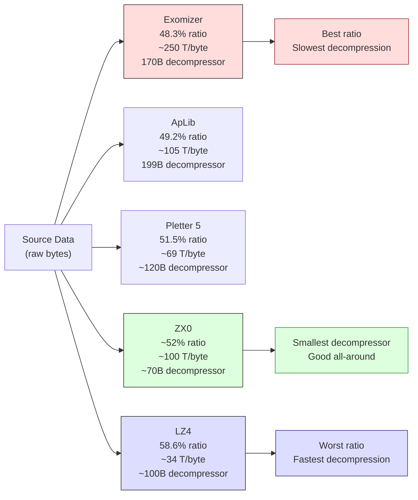

# Chapter 14: Compression --- More Data in Less Space

The ZX Spectrum 128K has 128 kilobytes of RAM. That sounds generous until you start subtracting: the screen takes 6,912 bytes (6,144 pixels + 768 attributes), the system variables claim their share, the AY music player and its pattern data want a bank or two, your code occupies another few thousand bytes, and the stack needs room to breathe. By the time you sit down to store the actual content of your demo --- the graphics, the animation frames, the precalculated lookup tables --- you are fighting for every byte.

A single full-screen image on the Spectrum is 6,912 bytes. A 4K intro can fit roughly 0.6 of one. A 48K demo could theoretically hold seven screens with nothing else. But demos are not slideshows. They have music. They have code. They have effects that demand tables of precalculated data. The question is not whether to compress --- it is which compressor to use, and when.

This chapter is built around a benchmark. In 2017, Introspec (spke, Life on Mars) published "Data Compression for Modern Z80 Coding" on Hype --- a meticulous comparison of ten compression tools tested against a carefully designed corpus. That article, with its 22,000 views and hundreds of comments, became the reference that ZX coders consult when choosing a compressor. We will walk through his results, understand the tradeoffs, and learn to pick the right tool for each job.

---

## The Memory Problem

Let us be concrete about the constraints. Consider Break Space by Thesuper (Chaos Constructions 2016, 2nd place) --- a demo with 19 scenes running on a ZX Spectrum 128K. One of those scenes, the Magen Fractal by psndcj, displays 122 frames of animation. Each frame is a full 6,912-byte screen. Uncompressed, that is 843,264 bytes --- over six times the machine's total RAM.

psndcj compressed all 122 frames into 10,512 bytes. That is 1.25% of the original size. The entire animation, every frame of it, fits in less space than two uncompressed screens.

Another scene in Break Space, the Mondrian animation, packs 256 hand-drawn frames --- every square cut separately, individually compressed --- into 3 kilobytes.

These are not theoretical exercises. They are production techniques from a demo that competed at one of the scene's most prestigious parties. Compression is not an optimisation you apply at the end. It is a fundamental architectural decision that determines what your demo can contain.

### Compression as bandwidth amplifier

Introspec articulated the insight that elevates compression from a storage trick to a performance technique: **compression acts as a method to increase effective memory bandwidth**.

Suppose an effect needs 2 KB of data per frame. Store it compressed to 800 bytes and decompress with LZ4 at 34 T-states per output byte. The decompression costs 69,632 T-states --- almost exactly one frame. But you can overlap it with border time, double-buffer a frame ahead, and interleave with effect rendering. The result: more data flowing through the system than the bus could deliver from uncompressed storage. The decompressor is a data amplifier.

---

## The Benchmark

Introspec did not simply run each compressor on a few files and eyeball the results. He designed a corpus and measured systematically.

### The corpus

The test data totalled 1,233,995 bytes across five categories:

- **Calgary corpus** --- the standard academic compression benchmark (text, binary, mixed)
- **Canterbury corpus** --- a more modern academic standard
- **30 ZX Spectrum graphics** --- loading screens, multicolour images, game screens
- **24 music files** --- PT3 patterns, AY register dumps, sample data
- **Miscellaneous ZX data** --- tilemaps, lookup tables, mixed demo data

This mix matters. A compressor that excels on English text may struggle with ZX graphics, where long runs of zeros in the pixel area alternate with near-random attribute data. Testing on real Spectrum data --- the data you will actually compress --- is essential.

### The results

Ten tools. Measured on total compressed size (lower is better), decompression speed in T-states per output byte (lower is faster), and decompressor code size in bytes (smaller is better for size-coded productions).

| Tool | Compressed (bytes) | Ratio | Speed (T/byte) | Decompressor Size | Notes |
|------|-------------------|-------|-----------------|-------------------|-------|
| **Exomizer** | 596,161 | 48.3% | ~250 | ~170 bytes | Best compression ratio |
| **ApLib** | 606,833 | 49.2% | ~105 | 199 bytes | Good balance |
| PuCrunch | 616,855 | 50.0% | --- | --- | Complex LZ alternative |
| Hrust 1 | 613,602 | 49.7% | --- | --- | Relocatable stack depacker |
| **Pletter 5** | 635,797 | 51.5% | ~69 | ~120 bytes | Fast + decent compression |
| MegaLZ | 636,910 | 51.6% | ~130 | ~110 bytes | Revived by Introspec in 2019 |
| **ZX7** | 653,879 | 53.0% | ~107 | **69 bytes** | Tiny decompressor |
| **ZX0** | --- | ~52% | ~100 | **~70 bytes** | Successor to ZX7 |
| **LZ4** | 722,522 | 58.6% | **~34** | ~100 bytes | Fastest decompression |
| Hrum | --- | ~52% | --- | --- | Declared obsolete |

Only Exomizer broke the 600,000-byte barrier across the full corpus. But Exomizer's decompression speed --- roughly 250 T-states per output byte --- makes it impractical for anything that needs to decompress during playback.

### The tradeoff triangle

Every compressor makes a tradeoff between three qualities:

1. **Compression ratio** --- how small the compressed data gets
2. **Decompression speed** --- how many T-states per output byte
3. **Decompressor code size** --- how many bytes the decompression routine occupies

You cannot have all three. Exomizer wins on ratio but is slow to decompress and has a large decompressor. LZ4 is the fastest to decompress but wastes 10 percentage points of compression ratio. ZX7 has a 69-byte decompressor but compresses less aggressively than Exomizer.

Introspec's genius was to map these tradeoffs on a Pareto frontier --- a curve where no tool can improve on one dimension without losing on another. If a compressor is dominated on all three axes by another tool, it is obsolete. If it sits on the frontier, it is the right choice for some use case.

<!-- figure: ch14_compression_tradeoff -->


> **The tradeoff:** Smaller compressed size = slower decompression. No compressor wins on all three axes (ratio, speed, decompressor size). Choose based on your use case: Exomizer for one-time loads, LZ4 for real-time streaming, ZX0 for size-coded intros.

His practical recommendations are crisp:

- **Maximum compression, speed irrelevant:** Exomizer. Use for one-time decompression at load time --- loading screens, level data, anything you unpack once into a buffer and use repeatedly.
- **Good compression, moderate speed (~105 T/byte):** ApLib. A solid general-purpose choice when you need decent ratio and can afford ~105 T-states per byte.
- **Fast decompression (~69 T/byte):** Pletter 5. When you need to decompress during gameplay or between scenes and cannot afford Exomizer's sluggish unpacking.
- **Fastest decompression (~34 T/byte):** LZ4. The only choice for real-time streaming --- decompressing data as you play it back. At 34 T-states per output byte, LZ4 can decompress over 2,000 bytes per frame. That is a 2 KB/frame data pipe.
- **Smallest decompressor (69--70 bytes):** ZX7 or ZX0. When the decompressor itself must be tiny --- in 256-byte, 512-byte, or 1K intros where every byte of code counts.

Let these numbers guide your decisions. There is no universally "best" compressor. There is only the best compressor for your specific constraints.

---

## How LZ Compression Works

All of the compressors in the table above belong to the Lempel-Ziv family. Understanding the core idea helps you predict which data compresses well and which does not.

LZ compression replaces repeated byte sequences with back-references. A match says: "copy N bytes from position P bytes back in the already-decoded stream." The compressed stream alternates between **literals** (raw bytes with no useful match) and **matches** (offset + length pairs that reference earlier output).

The differences between compressors come down to encoding: how many bits for the offset, how many for the length, how to signal literal vs match. Exomizer uses sophisticated variable-length bit-level codes that compress tightly but require careful bit-extraction to decode --- hence the ~250 T-states per byte. LZ4 uses byte-aligned tokens that the Z80 processes with simple shifts and masks --- hence ~34 T-states per byte at the cost of 10 percentage points of ratio. ZX0 uses single-bit flags (0 = literal, 1 = match) with Elias interlaced codes for lengths, hitting a sweet spot between size and speed.

ZX Spectrum data compresses well because it has structure: large areas of identical bytes (black backgrounds, blank attributes), repeated patterns (tiles, fonts, UI), and correlated pixel data at regular offsets. Music compresses well too --- PT3 patterns are full of repeated note sequences and empty rows. What compresses poorly: random data, already-compressed data, and very short files where encoding overhead exceeds savings.

---

## ZX0 --- The Size Coder's Choice

ZX0, created by Einar Saukas, is the spiritual successor to ZX7 and has become the default compressor for modern ZX Spectrum development. It deserves special attention.

### Why ZX0 exists

ZX7 was already remarkable: a 69-byte decompressor that achieved respectable compression ratios. But Saukas saw room for improvement. ZX0 uses an optimal parsing algorithm --- it does not just find good matches, it finds the *best possible sequence* of matches and literals for the entire file. The result is compression ratios close to much larger compressors, with a decompressor that stays in the 70-byte range.

### The decompressor

The Z80 decompressor for ZX0 is hand-optimised assembly, designed specifically for the Z80's instruction set. It exploits the Z80's flag register, its block transfer instructions, and the exact timing of conditional jumps to squeeze maximum functionality into minimum bytes. Here is the kind of code we are talking about:

```z80 id:ch14_the_decompressor
; ZX0 decompressor — standard version
; HL = source (compressed data)
; DE = destination (output buffer)
; Uses: AF, BC, DE, HL
dzx0_standard:
        ld      bc, $ffff       ; initial offset = -1
        push    bc
        inc     bc              ; BC = 0 (literal length counter)
        ld      a, $80          ; bit buffer: only flag bit set
dzx0s_literals:
        call    dzx0s_elias     ; read literal length
        ldir                    ; copy literals
        add     a, a            ; read flag bit
        jr      c, dzx0s_new_offset
        call    dzx0s_elias     ; read match length
        ex      (sp), hl        ; retrieve offset from stack
        push    hl              ; put it back
        add     hl, de          ; calculate match address
        ldir                    ; copy match
        add     a, a            ; read flag bit
        jr      nc, dzx0s_literals
dzx0s_new_offset:
        ; ... offset decoding continues ...
```

Every instruction pulls double duty. The accumulator serves as both a bit buffer and a working register. The stack holds the last-used offset for repeated matches. The LDIR instruction handles both literal copying and match copying, keeping the code small.

At roughly 70 bytes, the entire decompressor fits in less space than a single ZX Spectrum character row. For a 256-byte intro, that leaves 186 bytes for everything else --- the effect, the animation, the music. For a 4K intro, 70 bytes is negligible overhead. This is why ZX0 has become ubiquitous.

### When to use ZX0

- **256-byte to 1K intros:** The tiny decompressor is essential. Every byte saved on the decompressor is a byte available for content.
- **4K intros:** ZX0 can decompress 4,096 bytes into 15--30 KB of code and data. SerzhSoft's Megademica (1st place, Revision 2019) used this exact strategy to fit what reviewers called "a full new-school demo" into a 4K intro.
- **General demo and game development:** When you need a solid all-around compressor with a small footprint. ZX0 is not the fastest decompressor, but it is fast enough for one-time decompression at load time, and its ratio is competitive with tools that have much larger decompressors.
- **RED REDUX** (2025) used the newer ZX2 variant (also by Saukas) to achieve the remarkable feat of including Protracker music in a 256-byte intro.

ZX0 is not the right choice for real-time streaming (use LZ4) or for maximum compression at any cost (use Exomizer). But for the vast majority of ZX Spectrum projects, it is the correct default.

---

## RLE and Delta Coding

Not everything needs a full LZ compressor. Two simpler techniques handle specific data types more effectively.

### RLE: Run-Length Encoding

The simplest scheme: replace a run of identical bytes with a count and a value. The decompressor is trivial:

```z80 id:ch14_rle_run_length_encoding
; Minimal RLE decompressor — HL = source, DE = destination
rle_decompress:
        ld      a, (hl)         ; read count
        inc     hl
        or      a
        ret     z               ; count = 0 means end
        ld      b, a
        ld      a, (hl)         ; read value
        inc     hl
.fill:  ld      (de), a
        inc     de
        djnz    .fill
        jr      rle_decompress
```

Only 12 bytes of decompressor code. RLE compresses beautifully when data contains long runs --- blank screens, solid-colour backgrounds, attribute fills. It compresses terribly on complex pixel art. The advantage over LZ: for size-coded intros where even ZX0's 70 bytes feel expensive, a 12-byte RLE scheme frees precious space.

RLE also benefits from **data transposition**: if your data is a 2D block (e.g., 32×24 attributes) where columns are more uniform than rows, transposing to column-major order creates longer runs. The cost is an un-transpose pass after decompression (~13 T-states/byte). Whether the total (12-byte decompressor + un-transpose code + compressed data) beats ZX0 (70-byte decompressor + compressed data) depends on your data --- measure both.

> **Sidebar: Ped7g's Self-Modifying RLE --- 9 Bytes That Rewrite Themselves**
>
> For 256-byte intros, even 12 bytes feels expensive. Ped7g (Peter Helcmanovsky, sjasmplus maintainer) contributed a self-modifying RLE depacker that compresses the decoder itself to **9 bytes of core code** --- and the exit mechanism is built into the data stream.
>
> The trick: the RLE data lives in memory *before* the depacker code. The data stream ends with the bytes `$18, $00`, which the depacker writes into the target buffer at a calculated position so that the bytes overwrite the `ld (hl),c` instruction. The byte sequence `$18, $23` assembles to `jr +$23`, which jumps forward past the depacker into the intro's main code. The data literally rewrites the code to terminate itself.
>
> Here is the complete working mini-intro --- a 120-byte binary that fills the screen with coloured stripes using only the self-modifying RLE:
>
> ```z80 id:ch14_ped7g_rle_mini_intro
> ; Ped7g's self-modifying RLE mini-intro
> ; Assemble with sjasmplus: sjasmplus rle_intro.a80
> ;
> ; The RLE data is a stream of (value, count) pairs read via POP BC.
> ; SP walks through the data as a read pointer.
> ; The db $18,$00 at the end of the data stream overwrites ld (hl),c
> ; to become jr +$23, exiting the depack loop into intro_start.
> ;
> ; Contributed by Ped7g (Peter Helcmanovsky) — sjasmplus maintainer
> ; and ZX Spectrum Next contributor. Used with permission.
>
>     DEVICE ZXSPECTRUM48, $8000
>
> target  EQU $4000
>     ORG $5B00              ; loading address → print buffer
>
> intro_data:
>     dw  target             ; initial HL value (POP HL)
> ; RLE pairs: value, count (count=0 means 256 iterations)
>     .(4*3) db $AA, 0, $00, 0    ; alternating stripe pattern
>     db  $43, 32*2, $44, 32*4, $45, 32*3, $46, 32*2, $47, 32*2
>     db  $46, 32*2, $45, 32*3, $44, 32*4, $43, 32*2
>     db  $18, $00           ; data that will overwrite ld (hl),c
>                            ; creating jr rle_loop_inner+$25
> rle_start:
>     ei                     ; simulate post-LOAD BASIC environment
>     ld  sp, intro_data
>     pop hl                 ; HL = target address
> rle_loop_outer:
>     pop bc                 ; C = value, B = repeat count
> rle_loop_inner:
>     ld  (hl), c            ; ← THIS instruction gets overwritten
>     inc hl                 ;   by the $18,$00 data to become
>     djnz rle_loop_inner    ;   jr +$23, jumping to intro_start
>     jr  rle_loop_outer
> ; 31 bytes of space — fill with helper code
>     ds  $1F
> intro_start:
>     assert $ == rle_loop_inner + 2 + $23
>     inc a
>     and 7
>     out (254), a           ; cycle border colours
>     jr  intro_start
>
>     SAVESNA "rle_intro.sna", rle_start
>     SAVEBIN "rle_intro.bin", intro_data, $ - intro_data
> ```
>
> 
>
> **Byte count analysis.** The depack loop is 9 bytes: `pop bc` (1) + `ld (hl),c` (1) + `inc hl` (1) + `djnz` (2) + `jr` (2) + `pop hl` (1) + `ld sp,nn` (3) = 9 core + 6 setup = **15 bytes total** for a self-contained RLE decoder with built-in exit. Compare to the 12-byte minimal RLE from the previous section, which still needs external setup and a termination check.
>
> **Interrupt safety.** SP is used as a data pointer, so interrupts will corrupt the stack. The `ei` at the start is intentional --- in a 256-byte intro loaded from BASIC, interrupts are already enabled. The occasional interrupt writes to already-consumed data behind the SP pointer, so the depack completes correctly. For the intro code itself, SP has moved past the data and the stack works normally. But do not combine this technique with IM2 or interrupt-driven music.
>
> **Advanced variants.** Ped7g notes several alternative exit strategies: (1) if the target area extends behind the depack code, the RLE data can overwrite the `jr rle_loop_outer` offset to jump further; (2) the `jp $C3C3` trick --- place `$C3` values in the data with exact counts so that DJNZ terminates when `jp $C3C3` assembles in memory, and align the intro so address $C3C3 is the continuation code. As Ped7g says: "you can invent many such things --- it always depends on the specific situation."
>
> **Credit:** Contributed by Ped7g (Peter Helcmanovsky) --- sjasmplus maintainer and ZX Spectrum Next contributor. Used with permission.

### Delta coding: store what changed

Delta coding stores differences between consecutive values rather than absolute values. Two animation frames that are 90% identical? Store only the changed bytes --- a list of (position, new_value) pairs. If only 691 bytes differ out of 6,912, the delta is 2,073 bytes (3 bytes per change) instead of a full frame. Apply LZ on top of the delta stream and it compresses further --- the difference stream has more zeros and repeated small values than raw frame data.

The Break Space Magen Fractal exploits this: 122 frames at 6,912 bytes each, compressed to 10,512 bytes total, because each frame differs from the previous by a small amount. Delta + LZ is the standard pipeline for multi-frame animations, scrolling tilemaps, and sprite animations where the figure changes pose but the background stays fixed.

---

## Pre-Compression Data Preparation

Delta coding is not the only trick. The compressor only sees the byte stream you feed it. If you restructure the data before compression, the same LZ algorithm can achieve dramatically different ratios. This is the art of pre-compression preparation --- and it is often more valuable than switching packers.

### Entropy: the theoretical floor

Shannon entropy measures the minimum bits per byte needed to represent your data, assuming an ideal encoder. A completely random byte stream has entropy 8.0 bits/byte --- incompressible. A file of identical bytes has entropy 0.0. Real Spectrum data falls somewhere between. A raw sine table might have entropy 6.75 bits/byte. Apply delta encoding, and it drops to 2.85. Apply the second derivative, and it falls to 1.49 --- an 78% reduction. That is the theoretical room the compressor has to work with.

You do not need to compute entropy by hand. The formula is simple enough for a Python script:

```python
import math
from collections import Counter

def entropy(data: bytes) -> float:
    """Shannon entropy in bits per byte. Lower = more compressible."""
    counts = Counter(data)
    n = len(data)
    return -sum(c/n * math.log2(c/n) for c in counts.values())
```

Run this on your raw data, then on delta-encoded data, then on transposed data. The transform that gives the lowest entropy will compress best, regardless of which packer you use.

### The second derivative: sinusoidal and quadratic data

Delta encoding stores first differences: `d[i] = data[i] - data[i-1]`. For a linear ramp (0, 3, 6, 9...), the delta stream is constant (3, 3, 3...) --- perfect for compression. But sine waves and smooth curves produce a delta stream that itself varies smoothly. The second derivative (delta of delta) catches this:

| Data type | Raw entropy | 1st derivative | 2nd derivative |
|---|---|---|---|
| Sine table (256B) | 6.75 | 2.85 | **1.49** |
| Linear ramp | 7.00 | 0.00 | 0.00 |
| Quadratic curve | 6.80 | 3.20 | **0.00** |
| Random bytes | 8.00 | 8.00 | 8.00 |

The second derivative of a quadratic function is a constant. This is not abstract calculus --- it is the difference between 6.80 and 0.00 bits per byte. A 256-byte quadratic lookup table, second-derivative encoded, compresses to almost nothing.

Here is the creative insight: sinusoidal decay and quadratic decay are often visually indistinguishable in a demo effect. If you are animating a particle that slows down, the audience cannot tell whether you used `sin(t)` or `at² + bt + c`. But the compressor can: the quadratic version has a perfectly linear first derivative and a constant second derivative. If your animation can tolerate a quadratic approximation, you save bytes not by switching compressors, but by switching curves.

### Transposition: column-major for tabular data

Demoscene data is often tabular --- 3D vertex tables (X, Y, Z per vertex), animation keyframes (angle, radius, speed per frame), colour palettes (R, G, B per entry). When stored row-major (X₀ Y₀ Z₀ X₁ Y₁ Z₁...), consecutive bytes are from different columns with different statistical properties. Delta encoding makes this *worse*:

```
Row-major:  128 64 200 129 63 201 130 62 202 ...
Delta:        64 136  57 190 138  57 190 138 ...  (wild jumps between columns)
```

Transpose to column-major (X₀ X₁ X₂... Y₀ Y₁ Y₂... Z₀ Z₁ Z₂...) and now consecutive bytes are from the same column. Delta encoding now sees smooth progressions:

```
Column-major: 128 129 130 131 ... 64 63 62 61 ... 200 201 202 203 ...
Delta:          1   1   1   1 ...  -1  -1  -1 ...    1   1   1   1 ...  (trivial)
```

The numbers are striking. A 768-byte vertex table (256 vertices × 3 columns):

| Layout | Entropy (raw) | Entropy (delta) |
|---|---|---|
| Row-major (X,Y,Z interleaved) | 7.52 | 7.66 (worse!) |
| Column-major, stride 3 | 7.52 | **2.58** |

Delta encoding on row-major data *increased* entropy. The same delta on transposed data reduced it by 65%. The compressor does not know your data is tabular --- you have to tell it, by reordering.

The rule: if your data has columns with different patterns, **always transpose before compressing**. The stride (number of columns) does not need to be guessed --- try a few divisors of the data length and pick whichever gives the lowest delta entropy.

On the Spectrum, the decompressor just writes bytes sequentially. The transposition happens in your build tools, not at runtime. Zero runtime cost.

### Interleaving planes: masks and pixels

Sprites with masks are a special case of transposition. Stored as mask-pixel-mask-pixel per row, consecutive bytes alternate between two completely different distributions (masks are mostly $FF or $00; pixels have diverse values). Separate all mask bytes from all pixel bytes:

```
Before: FF 3C FF 18 FF 00 ...  (mask, pixel, mask, pixel)
After:  FF FF FF ... 3C 18 00 ...  (all masks, then all pixels)
```

The mask block compresses to nearly nothing (long runs of $FF). The pixel block compresses normally. Combined ratio improves 10--20% over interleaved storage, depending on sprite complexity.

### Pattern detection: when not to compress

Sometimes data has structure that a generator can reproduce more cheaply than a decompressor. If your data is periodic with period *P*, storing one period plus a tiny replay loop takes *P* + ~10 bytes. If *P* is small relative to the total data, this beats any compressor.

Sine tables are the canonical case. A 256-byte sine table compresses to ~140 bytes with ZX0. But a Spectrum-friendly sine generator (using the ROM calculator or a CORDIC kernel) produces the same 256 bytes from under 30 bytes of code. For demo-quality accuracy, even a simple quadratic approximation per quarter-wave suffices.

The decision tree: (1) Can you generate it from a formula in fewer bytes than compressed size? Generate. (2) Is the data periodic? Store one period + loop. (3) Is the data tabular? Transpose + delta + LZ. (4) Is the data sequential frames? Delta + LZ. (5) None of the above? Just compress it.

### Practical transforms for common demo data

| Data type | Best pre-transform | Why |
|---|---|---|
| Sine/cosine tables | 2nd derivative, or generate at runtime | Smooth acceleration → constant 2nd deriv |
| 3D vertex tables | Transpose (stride = fields per vertex) + delta | Separates axes; smooth trajectories per axis |
| Precalculated animation | Delta between frames + LZ | High inter-frame redundancy |
| AY register dumps | Transpose (stride = 14, one per register) + delta | Each register varies smoothly between frames |
| Colour ramps / gradients | 1st derivative | Linear or near-linear progression |
| Tile maps | Transpose (stride = map width) + delta | Spatial locality: adjacent tiles are similar |
| Bitmap font data | Separate bit-planes, or store as 1-bit + RLE | Lots of zero bytes in descenders |
| Particle positions | Sort by one axis, then delta-encode each axis | Sorted order maximises delta compression |

The key insight: **every byte you save with a free pre-transform is a byte you do not need a more expensive packer to save**. Transpose + delta + Pletter 5 (fast decompressor) often beats raw Exomizer (slow decompressor) on structured data. You get a better ratio *and* faster decompression.

---

## The Practical Pipeline

Understanding compression algorithms is useful. Integrating them into your build pipeline is essential.

### From asset to binary

The pipeline: source asset (PNG) --> converter (png2scr) --> compressor (zx0) --> assembler (sjasmplus) --> .tap file. The compressor runs on your development machine, not the Spectrum. For ZX0: `zx0 screen.scr screen.zx0`. Include the result with sjasmplus's INCBIN directive:

```z80 id:ch14_from_asset_to_binary
compressed_screen:
    incbin "assets/screen.zx0"
```

At runtime, decompress with a simple call:

```z80 id:ch14_from_asset_to_binary_2
    ld   hl, compressed_screen    ; source: compressed data
    ld   de, $4000                ; destination: screen memory
    call dzx0_standard            ; decompress
```

### Makefile integration

The compression step belongs in your Makefile, not in your head:

```makefile
%.zx0: %.scr
	zx0 $< $@

demo.tap: main.asm assets/screen.zx0
	sjasmplus main.asm --raw=demo.bin
	bin2tap demo.bin demo.tap
```

Change a source PNG, run `make`, and the compressed binary is regenerated automatically. No manual steps, no forgotten recompression.

### Example: loading screen with ZX0

A complete minimal example --- decompress a loading screen to video memory and wait for a keypress:

```z80 id:ch14_example_loading_screen_with
; loading_screen.asm — assemble with sjasmplus
        org  $8000
start:
        ld   hl, compressed_screen
        ld   de, $4000
        call dzx0_standard

.wait:  xor  a
        in   a, ($fe)
        cpl
        and  $1f
        jr   z, .wait
        ret

        include "dzx0_standard.asm"

compressed_screen:
        incbin "screen.zx0"

        display "Total: ", /d, $ - start, " bytes"
```


Use sjasmplus's DISPLAY directive to print size information during assembly. Always know exactly how large your compressed data is --- the difference between ZX0 and Exomizer on a single loading screen can be 400 bytes, and over 8 scenes that adds up.

### Choosing the right compressor

Ask in order: (1) Size-coded intro? ZX0/ZX7 --- the 69--70 byte decompressor is non-negotiable. (2) Real-time streaming? LZ4 --- nothing else is fast enough. (3) One-time load? Exomizer --- maximum ratio, speed irrelevant. (4) Need a balance? ApLib or Pletter 5, both on the Pareto frontier. (5) Data full of identical runs? Custom RLE. (6) Sequential animation frames? Delta coding first, then LZ.

---

## The MegaLZ Revival

In 2017, Introspec declared MegaLZ "morally obsolete." Two years later, he resurrected it himself.

The insight: the compression *format* and the *decompressor implementation* are separable problems. MegaLZ's format was good --- the first Spectrum compressor to use an optimal parser (LVD, 2005), with Elias gamma codes and a slightly larger window than Pletter 5. What was bad was the Z80 decompressor. Introspec wrote two new ones:

- **Compact:** 92 bytes, ~98 T-states per byte
- **Fast:** 234 bytes, ~63 T-states per byte --- faster than three consecutive LDIRs

With these decompressors, MegaLZ "handily beats Pletter 5 and ZX7" on the combined ratio-plus-speed metric. The lesson: do not assume a compressor is dead. The format is the hard part. The decompressor is Z80 code, and Z80 code can always be rewritten.

---

## What the Numbers Mean in Practice

**4K intro:** 4,096 bytes total. ZX0 decompressor: ~70 bytes. Engine + music + effects: ~2,400 bytes. That leaves ~1,626 bytes for compressed data, which decompress to ~3,127 bytes of raw assets. SerzhSoft's Megademica (1st place, Revision 2019) compressed tunnel effects, transitions, AY music, and rapid scene changes into exactly 4,096 bytes. It was nominated for Outstanding Technical Achievement at the Meteoriks.

**Real-time streaming:** You need 2 KB of data per frame at 50 fps. LZ4 at 34 T/byte decompresses 2,048 bytes in 69,632 T-states --- almost exactly one frame (69,888 T-states on 48K). Tight but feasible with overlapped border-time decompression. ApLib would need 215,040 T-states for the same data --- over three frames. Exomizer over seven. For streaming, LZ4 is the only option.

**128K multi-scene demo:** Eight scenes, each with a 6,912-byte loading screen. Exomizer compresses each to ~3,338 bytes; ZX0 to ~3,594 bytes. The difference: 256 bytes per screen, 2,048 bytes across 8 scenes. When decompression happens during scene transitions, Exomizer's slow decompression is invisible. The 2 KB savings is not.

**256-byte intro:** ZX0's 70-byte decompressor leaves 186 bytes for everything. More commonly at this size, you skip LZ and generate data procedurally with LFSR generators and ROM calculator calls. But when you need specific non-algorithmic data --- a colour ramp, a bitmap fragment --- ZX0 remains the tool.

---

## Summary: The Compressor Cheat Sheet

| Your situation | Use this | Why |
|---|---|---|
| One-time load, maximum ratio | Exomizer | 48.3% ratio, speed irrelevant |
| General purpose, good balance | ApLib | 49.2% ratio, ~105 T/byte |
| Need speed + decent ratio | Pletter 5 | 51.5% ratio, ~69 T/byte |
| Real-time streaming | LZ4 | ~34 T/byte, 2+ KB per frame |
| Size-coded intro (256b--1K) | ZX0 / ZX7 | 69--70 byte decompressor |
| 4K intro | ZX0 | Tiny decompressor + good ratio |
| Runs of identical bytes | RLE (custom) | Decompressor under 30 bytes |
| Sequential animation frames | Delta + LZ | Exploit inter-frame redundancy |

The numbers are the answer. Not opinions, not folklore, not "I heard Exomizer is the best." Introspec tested ten compressors across 1.2 megabytes of real Spectrum data and published the results. Use his numbers. Choose the compressor that fits your constraints. Then move on to the hard part --- making something worth compressing.

---

## Try It Yourself

1. **Compress a loading screen.** Take any ZX Spectrum .scr file (grab one from zxart.ee or create your own in Multipaint). Compress it with ZX0 and Exomizer. Compare the sizes. Then write the minimal loader shown in this chapter to decompress and display it. Time the decompression using border-colour timing from Chapter 1.

2. **Measure the streaming limit.** Write a tight loop that decompresses data with the ZX0 standard decompressor and measures how many bytes it can decompress per frame. Compare with the LZ4 decompressor. Verify the numbers from the benchmark table against your own measurements.

3. **Build a delta compressor.** Take two ZX Spectrum screens that differ slightly (save a game screen, move a sprite, save again). Write a simple tool (in Python or your language of choice) that produces a delta stream: a list of (offset, new_value) pairs for bytes that differ. Compare the size of the delta stream to the size of the full second screen. Then compress the delta stream with ZX0 and compare again.

4. **Integrate compression into a Makefile.** Set up a project with a Makefile that automatically compresses assets as a build step. Change a source PNG, run `make`, and verify that the compressed binary is regenerated and the final .tap file is updated. This is the workflow you will use for every project from now on.

5. **Transpose and measure.** Create a 768-byte file of 256 (X, Y, Z) triplets where X is a sine wave, Y is a cosine, and Z is a linear ramp. Measure the entropy of the raw file. Then transpose it (all X values, then all Y, then all Z) and measure again. Apply delta encoding to both versions and compare. You should see the transposed+delta version drop below 3 bits/byte, while the raw+delta version stays above 7. Compress both with ZX0 and compare the actual sizes --- the entropy numbers predict the winner.

6. **The quadratic substitution.** Generate a 256-byte sine table and a 256-byte quadratic approximation (fit `ax² + bx + c` to one quarter-wave, mirror for the full cycle). Plot both --- they should be visually identical. Now compute the second derivative of each. The sine's second derivative has entropy ~1.5 bits/byte; the quadratic's is exactly 0. Compress both with ZX0. The quadratic version is smaller, and the animation looks the same.

> **Sources:** Introspec "Data Compression for Modern Z80 Coding" (Hype, 2017); Introspec "Compression on the Spectrum: MegaLZ" (Hype, 2019); Break Space NFO (Thesuper, 2016); Einar Saukas, ZX0 (github.com/einar-saukas/ZX0); Ped7g (Peter Helcmanovsky), self-modifying RLE depacker (contributed with permission, 2026)
