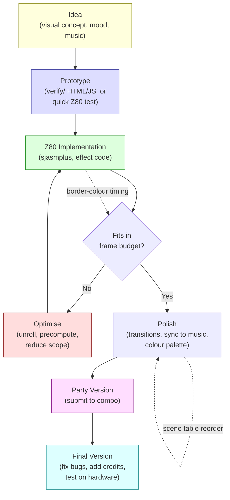

# Chapter 20: Demo Workflow --- From Idea to Compo

> *"Design is the complete aggregate of all demo components, both visible and concealed. Design characterises realizational, stylistic, ideological integrity."*
> -- Introspec, "For Design," Hype, 2015

---

A demo is not built in a single session of inspired coding. It is a project -- one with deadlines, dependencies, creative decisions that must be locked down weeks before the party, technical gambles that pay off or do not, and a final submission that either works on the compo machine or fails in front of an audience. The distance between "I have an idea for a demo" and "it placed third at DiHalt" is measured not in lines of code but in workflow: how you organise effects, how you schedule your time, how you build and test, how you handle the inevitable moment when the music is not ready and the party is in four days.

This chapter is about that workflow. We have spent nineteen chapters on techniques -- inner loops, cycle counting, compression, sound, sync. Now we step back and ask: how does a real demo come together? How do you go from a blank screen to a two-minute production that runs reliably, looks intentional, and lands at the right party on the right day?

The answers come from three sources. restorer's making-of article for Lo-Fi Motion (Hype, 2020) provides a detailed case study of a working production pipeline -- fourteen effects built in two weeks of evening coding, with a scene table system and a toolchain that any reader can replicate. Introspec's philosophical essays on Hype -- "For Design" and "MORE" (both 2015) -- articulate the design thinking that separates a collection of effects from a coherent demo. And the broader making-of culture of the ZX Spectrum scene -- from Eager's detailed NFO to GABBA's iOS video editor workflow to NHBF's 256-byte puzzle -- gives us a gallery of approaches to learn from.

---

## 20.1 What "Design" Means in a Demo

When demosceners say "design," they do not mean graphic design. They do not mean UI layout or colour theory, although those matter. Introspec's definition, published on Hype in January 2015, is broader and more demanding:

> Design is the complete aggregate of all demo components, both visible and concealed.

This definition includes the effects the audience sees, the transitions between them, the music choice and how it synchronises with visuals, the colour palette, the pacing, the emotional arc -- but also the code architecture, the memory layout, the compression strategy, the build pipeline, and the decisions about what to leave out. A demo with beautiful pixel art and terrible pacing has poor design. A demo with crude visuals but perfect musical sync and a clear emotional arc might have excellent design. A deliberately ugly demo, one that chooses its aesthetic with intention, can have outstanding design.

The implications for workflow are immediate. If design encompasses everything, then design decisions happen at every stage. The choice of assembler constrains what your build pipeline can do. The memory map determines which effects can coexist. The order in which you build effects determines what you can cut if time runs out. Every technical choice has an aesthetic consequence, and every aesthetic choice has a technical cost.

Demo production must be simultaneously bottom-up and top-down, with constant feedback between creative vision and technical reality. The workflow must support that feedback loop.

---

## 20.2 Lo-Fi Motion: A Complete Case Study

In September 2020, restorer published a making-of article for Lo-Fi Motion, a ZX Spectrum demo released at DiHalt 2020. The article is valuable not for any single technical insight but because it documents an *entire production pipeline* -- from initial concept to finished binary -- in enough detail to reproduce.

### The Concept: "Belarusian Pixel"

Lo-Fi Motion uses attribute-resolution graphics -- what restorer calls "lo-fi" rendering. Most effects work at the 32x24 attribute grid or at a doubled 32x48 resolution using half-character rows. No pixel-level rendering. The aesthetic is deliberately blocky, embracing the ZX Spectrum's attribute grid rather than fighting it. The name says it: this is lo-fi, and the motion is the point.

This is a design decision with cascading technical benefits. Attribute-resolution effects are cheap to calculate (192 or 384 bytes per frame instead of 6,144), cheap to store (small frame buffers mean more room for compressed data), and fast to display (writing 768 bytes to attribute RAM fits easily within one frame). The lo-fi aesthetic is not a compromise -- it is a choice that unlocks fourteen effects in two weeks of evening work.

### The Scene Table

At the centre of Lo-Fi Motion's architecture is the **scene table** -- a data structure that drives the entire demo. Each entry in the table describes one scene:

```z80 id:ch20_the_scene_table
; Scene table entry (conceptual structure)
scene_entry:
    DB  bank_number          ; which 16K memory bank holds this effect's code
    DW  entry_address        ; start address of the effect routine
    DW  frame_duration       ; how many frames this scene runs
    DB  param_byte_1         ; effect-specific parameter
    DB  param_byte_2         ; effect-specific parameter
    ; ... additional parameters as needed
```

The demo engine reads the scene table linearly. For each entry, it pages in the specified memory bank, jumps to the entry address, and runs the effect for the specified number of frames. When the duration expires, it advances to the next entry. The entire demo -- all fourteen effects, all transitions, all timing -- is encoded in this one table.

This is the same architectural pattern we saw in Chapter 12's scripting engine, stripped to its essentials. The Eager scripting engine had two levels (outer script for effects, inner script for parameter variations) and the kWORK command for asynchronous frame generation. Lo-Fi Motion's scene table is simpler: one level, synchronous generation, no asynchronous buffering. The simplicity is the point. It works. It was built in two weeks.

The scene table pattern has a critical workflow advantage: it separates content from engine. Adding a new effect means writing the effect routine and adding one entry to the table. Reordering the demo means rearranging table entries. Adjusting timing means changing duration values. The engine code does not change. This separation means you can iterate on the demo's structure -- its pacing, its order, its timing -- without touching the engine, and iterate on individual effects without touching the structure.

### Fourteen Effects

Lo-Fi Motion contains approximately fourteen distinct visual effects. restorer lists them by their working names: raskolbas, slime, fire, interp, plasma, rain, dina, rtzoomer, rbars, bigpic, and several others. Each effect is a self-contained routine that renders into a virtual buffer.

The virtual buffer is a key architectural choice. Most effects do not write directly to screen memory. Instead, they render to a **1-byte-per-pixel buffer** -- a block of RAM where each byte represents one attribute cell's colour value. The buffer is typically 32 bytes wide and 24 or 48 bytes tall (for half-character resolution). After the effect renders into the buffer, a separate output routine copies the buffer to attribute RAM, performing any necessary format conversion.

This indirection costs a few hundred T-states per frame but provides two benefits. First, effects are isolated from the screen's physical layout. An effect that renders into a linear buffer does not need to know about the attribute memory's address structure. Second, effects can be composed: two effects can render into separate buffers, and a mixing routine can blend them before output. Lo-Fi Motion uses this for transitions -- crossfading between two effects by interpolating their buffer values.

The buffer also enables the half-character resolution mode. A 32x48 buffer maps to the screen by using two attribute writes per character cell (one for the "top half" and one for the "bottom half"), exploiting the timing trick of rewriting attributes mid-scanline. This doubles the vertical resolution at the cost of more complex output code and tighter timing constraints.

### The Effects Themselves

Each effect is a variation on themes from earlier chapters: **plasma** (sum-of-sines from Chapter 9), **rotozoomer** (texture-walking from Chapter 7), **fire** (cellular automaton averaging neighbours), **rain** (particle system), and **bigpic** (pre-compressed bitmap animation decompressed frame-by-frame, using techniques from Chapter 14). None of these effects is novel. The point is that at attribute resolution, every one of them is cheap enough that fourteen fit in one demo built in two weeks. The lo-fi decision is a force multiplier.

### The Toolchain

restorer's toolchain for Lo-Fi Motion is a concrete answer to the question "what tools do I need to make a demo?"

**Assembler: sjasmplus.** The standard Z80 macro assembler for the modern ZX scene. Memory banking (SLOT/PAGE directives), conditional assembly, macros, INCBIN for embedded data, DISPLAY for build-time diagnostics, output to .tap/.sna/.trd. The scene table, effect code, compressed data, and engine all compile in one sjasmplus invocation.

**Emulator: zemu.** restorer's emulator of choice for Lo-Fi Motion. Unreal Speccy and Fuse are equally common. What matters is accurate timing and fast reload -- you need to test a new build every few minutes.

**Graphics: BGE 3.05 + Photoshop.** BGE (Burial Graphics Editor, by Sinn/Delirium Tremens) is a ZX Spectrum-native graphics editor, widely used in the Russian scene for creating attribute-level artwork directly on the target platform. Pre-rendered PC images go through Photoshop (or Multipaint, GIMP) and custom scripts.

**Scripts: Ruby.** Conversion pipeline automation: images to attribute data, sine tables to binary includes, animation sequences to delta-compressed streams. Python, Perl, and Processing are equally common. What matters is that conversion is automated and repeatable.

**Compression: hrust1opt.** Hrust 1 with optimal parsing. The Z80 decompressor is relocatable (uses the stack for its working buffer), convenient for demos that page data in and out of banked memory.

The practical lesson: there is no single "right" toolchain. The right one is where every step from source asset to final binary is automated, changing one input regenerates all dependent outputs, and the whole build completes in seconds. Any manual step is a bug waiting to happen at 2 AM before the compo deadline.

### The Build Pipeline

The tools chain together through a **Makefile** (or equivalent build script). The pipeline for Lo-Fi Motion looks approximately like this:

```text
Source assets (PNG, raw data)
    |
    v
Ruby conversion scripts
    |
    v
Binary includes (.bin, .hru)
    |
    v
sjasmplus assembly
    |
    v
Output binary (.trd or .sna)
    |
    v
Test in emulator (zemu)
```

Each arrow is a Makefile rule. Change a PNG, run `make`, and the entire chain re-executes -- conversion, compression, assembly -- producing a fresh binary in seconds. Load it in the emulator, watch the result, decide what to change, edit the source, run `make` again. This edit-build-test loop, measured in seconds, is what makes it possible to build fourteen effects in two weeks.

The Makefile also serves as documentation. Reading the build rules tells you exactly which scripts produce which outputs, which effects depend on which data files, and what the complete dependency graph looks like. When you return to the project after a six-month break, the Makefile tells you how everything fits together.

### The Timeline: Two Weeks of Evenings

Lo-Fi Motion was built in approximately two weeks of evening coding sessions. restorer was working a day job. The evenings were the only available time.

This timeline is realistic for a lo-fi attribute demo, and instructive for anyone planning their first production. The breakdown looks roughly like this:

- **Days 1-2:** Engine architecture. Scene table system, virtual buffer, output routine, basic framework. Get one effect (plasma) running through the full pipeline.
- **Days 3-7:** Effects. Two to three effects per evening once the framework is solid. Each effect is 100-300 lines of assembly, rendering into the virtual buffer. Test each one individually.
- **Days 8-10:** Content. Pre-rendered images, font data, conversion scripts. This is where the Ruby scripts earn their keep.
- **Days 11-12:** Integration. All effects in the scene table, timing adjusted to the music, transitions tuned. This is where the scene table's edit-and-rebuild workflow pays off.
- **Days 13-14:** Polish and debugging. Border colours for timing visualisation (Chapter 1), fixing effects that break on edge cases, final compression pass to fit everything in memory.

The critical observation: the engine and pipeline consume the first two days. Every subsequent day benefits from that investment. If you skip the pipeline work and hardcode your first effect directly into screen memory, you save a day up front and lose a week later when you try to add a second effect and discover that nothing is modular.

---

## 20.3 Making-of Culture

The ZX Spectrum demoscene has a strong culture of documenting how demos are made. This is not universal in the broader demoscene -- on many platforms, demos ship with no documentation beyond credits. On the Spectrum scene, detailed making-of articles are a tradition, and Hype (hype.retroscene.org) is the primary venue for publishing them.

### Eager: The Technical NFO

When Introspec released Eager (to live) at 3BM Open Air 2015, the ZIP file included a file_id.diz -- the traditional demo information file -- that went far beyond credits and greetings. It was a technical writeup: the attribute tunnel approach, the four-fold symmetry optimisation, the digital drum hybrid technique, the asynchronous frame generation architecture. Kylearan, reviewing the demo on Pouet, wrote: "Big thanks for the nfo file alone, I love reading technical write-ups! Helps in understanding what I'm seeing/hearing, too."

Introspec then published an even more detailed making-of article on Hype, which became the primary source for Chapters 9 and 12 of this book. The article explained not just *what* the demo does but *why* -- the reasoning behind each technical decision, the constraints that drove the architecture, the creative goals that shaped the visual design.

This level of documentation serves multiple purposes. For the audience, it deepens appreciation -- understanding how an effect works makes watching it more rewarding, not less. For other coders, it is education -- the making-of articles on Hype are the closest thing the ZX scene has to a technical curriculum. For the author, it is a form of closure -- articulating the decisions forces you to understand your own work, and the community feedback (Hype comments can be hundreds of posts deep) stress-tests your reasoning.

### GABBA: A Different Workflow

diver4d's making-of article for GABBA (2019) documents a radically different workflow from Eager's. Where Introspec spent weeks on a scripting engine and asynchronous frame buffer, diver4d used Luma Fusion -- an iOS video editor -- as his synchronisation tool.

We covered the technical details in Chapter 12. The workflow insight is what matters here: diver4d recognised that frame-level audio-visual synchronisation is a *video editing* problem, not a *programming* problem. By doing the sync work in a tool designed for it, he could iterate on timing in seconds instead of minutes. The Z80 code was the implementation layer; the creative decisions happened in the video editor.

This is a general principle. Demo workflow is not about doing everything in assembly. It is about using the right tool for each task. Assembly for inner loops. Processing or Ruby for code generation. Photoshop or Multipaint for graphics. A video editor for timing. A Makefile to tie them together. The demo is the output; the tools are whatever gets you there fastest.

### NHBF: The Puzzle

UriS's making-of for NHBF (2025) documents a workflow at the opposite extreme from Lo-Fi Motion's fourteen-effect pipeline. NHBF is a 256-byte intro -- the entire program, code and data, fits in less space than a single attribute frame. The "workflow" is one person staring at a hex dump, constantly reshuffling instructions to find shorter encodings, discovering that register values from one routine happen to match the data needs of another.

We covered the specific techniques in Chapter 13. The workflow lesson is about constraint-driven creativity. UriS describes the process as "playing puzzle-like games" -- an apt metaphor because the optimisation space in 256-byte coding is combinatorial. You cannot plan a path to the solution. You can only keep rearranging pieces and remain alert for serendipitous alignments. Art-Top's discovery that register values from the screen-clearing routine matched the text string length was not planned. It was noticed.

This matters for demo workflow at any scale. Even in a full-sized demo with a proper engine and a Makefile and a scene table, there are moments when the best solution comes from stepping back and looking at the whole picture, noticing an accidental alignment between two systems that were designed independently. The puzzle-solving mindset is not exclusive to size-coding. It is a mode of thinking that improves all demo work.

---

## 20.4 The Toolchain in Detail

The ZX Spectrum demo toolchain has converged on a standard set. Here is a typical project layout:

```text
src/
    main.asm            ; entry point, scene table, engine loop
    engine.asm          ; scene table interpreter, buffer management
    effects/
        plasma.asm      ; individual effect routines
        fire.asm
        rotozoomer.asm
    sound/
        player.asm      ; music player (PT3 or custom)
        drums.asm       ; digital drum sample playback
    data/
        music.pt3       ; music file (INCBIN)
        screens.zx0     ; compressed graphics (INCBIN)
        sinetable.bin   ; pre-generated lookup table (INCBIN)
Makefile
tools/
    gen_sinetable.rb    ; Ruby script: generate sine table
    convert_gfx.rb      ; Ruby script: PNG to attribute data
```

### Assembler: sjasmplus

The workhorse. Memory banking via SLOT/PAGE directives, conditional assembly, macros, INCBIN for embedded data, DISPLAY for build-time diagnostics, and output to .tap/.sna/.trd. A typical demo compiles in a single sjasmplus invocation.

### Emulators

**Unreal Speccy** is preferred by many Russian-scene demosceners for its deterministic timing and accurate Pentagon emulation, with TR-DOS, TurboSound, and multiple clone model support. **Fuse** is widely available on Linux and macOS. **zemu** is another option, used by restorer for Lo-Fi Motion. For source-level debugging, **DeZog** in VS Code connects to ZEsarUX and provides breakpoints, register inspection, and memory views.

Pick one emulator for primary development. Test on others before release. Demos that work in one emulator and crash in another are a party tradition best avoided.

### Graphics and Code Generation

**Multipaint** enforces attribute constraints in real time -- purpose-built for 8-bit pixel art. **Photoshop, GIMP, or Aseprite** offer creative freedom but require conversion scripts (Python, Ruby, Processing) to quantise and export. **Processing** handles generative graphics and code generation -- Introspec used it to generate the chaos zoomer's unrolled code sequences (Chapter 9).

### Build Automation and CI

Your Makefile must automate the full pipeline: source assets to conversion scripts to compression to assembly. If any step requires manual intervention, it will fail at 2 AM before the deadline.

CI via GitHub Actions is increasingly common. A workflow that builds on every push catches implicit dependencies -- the demo assembles on your machine but fails on a clean environment because of an undeclared tool version. Lo-Fi Motion's source is on GitHub, published as a reference implementation: clone it, run `make`, get a working binary. This openness is unusual in the demoscene and valuable for learning.

---

## 20.5 Compo Culture

A demo without a compo is a video on YouTube. A demo at a compo is a performance -- shown on a big screen, with an audience, with other entries to compare against, with prizes at stake. The compo is where the work meets its audience, and the culture around compos shapes the work.

### The Major Parties

The ZX Spectrum demo scene is served by a handful of recurring parties, each with its own character.

**Chaos Constructions (CC)** is the largest and most prestigious ZX demo event, held in Saint Petersburg, Russia. The ZX demo compo at CC draws the strongest entries: Break Space (2016), Eager's successors, and productions from groups like Thesuper, 4th Dimension, and Placeholders. CC is where you go to compete at the highest level. The audience is large, knowledgeable, and unforgiving.

**DiHalt** is held in Nizhny Novgorod, Russia, and has both a summer event and a "Lite" winter edition. DiHalt tends to be more experimental than CC -- the audience is welcoming to first-time entrants, and the atmosphere encourages risk-taking. Lo-Fi Motion was released at DiHalt 2020. If you are entering your first compo, DiHalt Lite is a good choice.

**Multimatograf** is a smaller event with a tradition of encouraging new work. The compo categories are broad, the entry requirements are minimal, and the vibe is supportive. Introspec has reviewed Multimatograf compos on Hype, sometimes critically -- he holds every party to the same standard -- but the event itself is welcoming to beginners.

**CAFe (Creative Art Festival)** is a demoscene event with a broader scope (not exclusively ZX), but the ZX categories attract strong entries. GABBA took first place at CAFe 2019.

**Revision** is the world's largest demoscene event, held annually in Saarbrucken, Germany. It is not ZX-specific, but the "8-bit demo" and "oldschool" categories welcome ZX Spectrum entries. Competing at Revision means showing your work to the global demoscene -- an audience of thousands, most of whom have never seen a Spectrum demo. SerzhSoft's Megademica won the 4K intro compo at Revision 2019, proving that ZX entries can compete on the global stage.

### How to Enter Your First Compo

The process is less intimidating than it sounds.

**1. Choose a party.** Start with a smaller event -- DiHalt Lite, Multimatograf, or a local party if one exists in your area. Larger parties have higher expectations, and the pressure of competing against experienced groups at CC can be counterproductive for a first entry.

**2. Know the rules.** Each party publishes compo rules specifying: platform requirements (which Spectrum model, which emulator configuration), file format (.tap, .trd, .sna), maximum file size, whether remote entries are accepted, and submission deadlines. Read the rules. Follow the rules. A technically impressive demo that ships as a .tzx when the rules require .trd will be disqualified.

**3. Test on the target platform.** If the party runs entries on real hardware (a physical Pentagon or Scorpion), test on that hardware or on an emulator configured to match. Demos that work perfectly on one machine model and crash on another are distressingly common. The differences are subtle: contended memory timings, bank switching delays, AY chip quirks. Chapter 15 covers the machine-specific details; Chapter 5 of Introspec's GO WEST series covers the portability pitfalls.

**4. Submit early.** Most parties accept remote entries via email or a web form. Submit a day early if possible. Last-minute submissions are stressful and prone to errors (uploading the wrong file, forgetting to include a required metadata file). The party version can be imperfect -- many demos are updated to "final" versions after the party, fixing bugs discovered during the compo showing.

**5. Write a file_id.diz or NFO.** Include a text file with credits (who did what), platform requirements (which model, which mode), and -- if you are willing -- a brief technical description. The audience appreciates knowing what they are looking at. The scene appreciates the documentation. And you will appreciate having written it when, three years later, you try to remember how the plasma table generation works.

**6. Watch the compo.** If you are at the party in person, watch your demo on the big screen with the audience. The experience of seeing your work displayed publicly, of hearing the audience react, of comparing your entry to the others -- this is why compos exist. If you are submitting remotely, watch the stream if one is available. Some parties publish compo recordings on YouTube afterward.

**7. Do not expect to win.** Your first entry is a learning experience. The goal is to finish something, submit it, and see it shown. Placing is a bonus. The feedback you get -- from the audience, from other sceners, from your own reaction to seeing it on a big screen -- is worth more than any prize.

Remote entries are accepted at most ZX events. Lo-Fi Motion was a remote entry at DiHalt 2020. Some parties run online-only events streamed on YouTube or Twitch. If your nearest demoscene event is a 12-hour flight away, online compos are a viable starting point.

---

## 20.6 The Community

The ZX Spectrum demoscene is small enough that most active participants know each other, and large enough that it sustains multiple active communities.

### Hype (hype.retroscene.org)

The primary Russian-language forum for ZX Spectrum demoscene discussion. Founded and moderated by Introspec, it hosts the making-of articles, technical tutorials, compo reviews, and design discussions that form the core source material for this book. Threads run to hundreds of comments, with experienced coders debating cycle counts in detail. For a non-Russian speaker, browser translation tools handle the prose well enough, and Z80 assembly reads the same in every alphabet.

The culture is direct. If you post a demo with a timing bug, someone will tell you exactly which T-state is wrong. This directness produces genuine technical discussion rather than polite but unhelpful encouragement.

### ZXArt (zxart.ee)

The comprehensive archive of ZX Spectrum creative works -- demos, music, graphics, games, magazines, and metadata. Every production in this book can be found on ZXArt with screenshots, credits, party results, and downloads. ZXArt also hosts digitised ZX magazines in TRD format (Spectrum Expert, Born Dead, ZX Format), containing the original articles that established the techniques this book teaches.

### Pouet (pouet.net)

The global demoscene production database. For the ZX scene, Pouet bridges to the wider community -- ZX demos rated by people who primarily watch PC or Amiga productions. The perspective shift is valuable: a technically brilliant inner loop that impresses Hype readers might be invisible to a Pouet commenter who focuses on visual impact and music sync. Pouet also hosts NFO files -- when you cannot find a making-of article on Hype, check the NFO on Pouet.

---

## 20.7 Project Management for Demo Makers

Demo making is project management. The project has a deadline (the party date), deliverables (the final binary), dependencies (music, graphics, effects, engine), and usually a team of contributors with competing priorities. Managing this is not glamorous, but it is what separates finished demos from abandoned prototypes.

### The Minimum Viable Demo

Start with the simplest possible version of your demo that is complete -- not polished, not impressive, but complete. One effect, one piece of music, a proper beginning and end. Get this running end-to-end through the full build pipeline within the first few days. This is your safety net. If everything goes wrong -- if the complex effect you planned does not work, if the musician is late with the final track, if your hard drive dies a week before the party -- you have something to submit.

Then iterate. Add effects one at a time. Replace the placeholder music when the final track arrives. Add transitions, polish timing, optimise memory usage. Each iteration produces a complete, submittable demo that is better than the last. At any point, you can stop and submit what you have.

This incremental approach is how Lo-Fi Motion was built. restorer did not write fourteen effects and then stitch them together. He built the engine and one effect, verified they worked, then added effects one by one. Each evening's work produced a slightly better demo. If he had run out of time at ten effects instead of fourteen, the demo would still have been complete and submittable.

### Working with Collaborators

Most demos are collaborations. Three principles keep them on track:

**Establish the data format early.** The musician needs to know: PT3 or custom player? Single AY or TurboSound? How are drum triggers signalled? The artist needs to know: attribute resolution or pixel resolution? Colour constraints? Maximum file size? Receiving a TurboSound composition when your engine supports only single AY is a disaster, and it is your fault for not specifying constraints.

**Communicate the timeline.** If the party is in four weeks, tell the musician you need the track in two. The buffer is for integration, debugging, and surprises.

**Provide placeholders.** Use a placeholder .pt3 with the right tempo until the final track arrives. Use programmer art until the final graphics arrive. The engine should never depend on final assets. When real assets arrive, drop them into the pipeline and rebuild.

### Debugging and Testing

Demo bugs are uniquely painful because they manifest in front of an audience. A crash during the compo showing is both a technical failure and a social embarrassment. Testing is not optional.

**Test on multiple emulators.** Each emulator has slightly different timing, memory initialisation, and AY behaviour. A demo that works in Unreal Speccy but crashes in Fuse probably has a timing or memory assumption that is valid on Pentagon but not on standard Spectrum.

**Test from a cold start.** Clear all memory before loading the demo. Do not assume any register values or memory contents from a previous program. If your demo works after running a previous demo but crashes from a fresh boot, you have an initialisation bug.

**Test the compo file, not the development binary.** The file you submit should be the exact file you tested. Not a "quickly recompiled" version with a last-minute fix. Last-minute fixes introduce last-minute bugs.

**Use border colours for timing.** The technique from Chapter 1: set the border to different colours at different points in the frame loop. If the border flash extends into the visible area, your code is too slow. If it does not, you have margin. This is the fastest way to verify that an effect fits within the frame budget.

---

## 20.8 Transcending the Platform: Introspec's "MORE"

In February 2015, Introspec published a short essay on Hype titled simply "MORE." It is not a technical article. It contains no code, no cycle counts, no inner loops. It is a challenge to the ZX Spectrum scene -- and by extension, to everyone who works within hardware constraints.

The argument is that the best demos are not the ones that do the most impressive things *despite* the platform limitations. They are the ones that transcend the platform entirely -- that create experiences which would be meaningful on any hardware. The platform's constraints shape the technique but should not limit the ambition.

> Two pixels suffice to tell a story.

This is Introspec's most quoted line. It means: the artistic content of a demo is not determined by its resolution, its colour depth, its polygon count, or its sample rate. Two pixels -- two attribute cells, two dots on a 32x24 grid -- can tell a story if the timing is right, the context is clear, and the intention is genuine. The technology serves the art, not the other way around.

Introspec references James Houston's "Big Ideas (Don't Get Any)" -- a video where a Sinclair ZX Spectrum, dot matrix printer, and other obsolete hardware perform a Radiohead song. The project is moving not because of the technical achievement but because the choice of hardware *means* something. The obsolescence is the point. The fragility is the beauty.

The practical implication: technique is necessary but not sufficient. You can master every effect in this book and still produce a demo nobody remembers. What makes a demo memorable is not what it does but what it says. Even an abstract demo has a personality: its pacing says something about tension and release; its colour palette evokes a mood; its music choice creates emotional context. The coder who treats these as afterthoughts produces a tech demo. The coder who treats them as design decisions produces a demo.

Lo-Fi Motion embraced its lo-fi aesthetic as identity. Eager turned the 32x24 grid from constraint into creative choice. NHBF found beauty in the puzzle of 256 bytes. In each case, the limitation became the medium.

This is what "MORE" demands. Not more polygons, not more colours, not more effects. More ambition. More intention. More willingness to treat a ZX Spectrum demo as an art form.

---

## 20.9 Your First Demo: A Practical Roadmap

For the reader who has followed this book from Chapter 1 and wants to make a demo, here is a concrete path.

<!-- figure: ch20_demo_workflow_pipeline -->


> **The iterative loop:** The path from implementation to timing check and back is where most development time is spent. The prototype stage (HTML/JS or quick Z80 sketch) validates the visual concept before committing to full implementation. The scene table makes reordering effects trivial during the polish phase.


### Week 1: Foundation

1. **Set up the toolchain.** Install sjasmplus, choose an emulator (Unreal Speccy, Fuse, or ZEsarUX), set up a project directory with a Makefile. Verify that you can assemble a minimal program and run it in the emulator.

2. **Build the scene table engine.** Write a minimal engine that reads a scene table and calls effect routines for the specified duration. Start with Lo-Fi Motion's architecture: bank number, entry address, frame count. Get it working with a single dummy effect (fill the screen with a colour, increment the colour each frame).

3. **Add music.** Integrate a PT3 player into your IM2 interrupt handler (Chapter 11). Drop in any .pt3 file as a placeholder. Verify that music plays while the dummy effect runs.

### Week 2: Effects

4. **Build your first real effect.** Attribute plasma is the natural starting point -- it is cheap, visually rich, and well-understood (Chapter 9). Render into a virtual buffer and copy to attribute RAM.

5. **Build your second effect.** Fire, rotozoomer, rain, colour bars -- pick one from the effects covered in Part II. Two effects and a transition between them constitute a minimal demo.

6. **Add a transition.** A simple crossfade between two attribute buffers: interpolate the colour values over 25-50 frames. Or a hard cut synchronised to a beat in the music.

### Week 3: Polish

7. **Replace placeholder music.** If you have a musician collaborator, integrate the final track. If not, spend time choosing a .pt3 that fits your demo's mood and pace.

8. **Adjust timing.** This is where the scene table earns its value. Rearrange effects, adjust durations, align transitions to musical events. Rebuild and test repeatedly.

9. **Add a beginning and an end.** A loading screen (compressed with ZX0, Chapter 14), an opening title, a closing credits screen. First and last impressions matter.

### Week 4: Release

10. **Test.** Multiple emulators. Cold boot. The exact file you will submit.

11. **Write the NFO.** Credits, platform requirements, greetings, and -- if you are feeling generous -- a technical description of how the effects work. Future you will be grateful.

12. **Submit.** Choose a party. Follow the rules. Upload the file. Then watch the compo and enjoy seeing your work on screen.

Your first entry is unlikely to place. Treat it as a learning exercise: the feedback from seeing your work on the big screen and comparing it to other entries is more valuable than any prize. Each subsequent demo will be better because you will know what to fix.

---

## Summary

- **Design is everything.** Introspec defines demo design as "the complete aggregate of all demo components, both visible and concealed" -- the code architecture, the memory layout, the pacing, and the emotional arc, not just the visual effects.

- **Lo-Fi Motion provides a replicable production template:** a scene table drives the demo structure, effects render into virtual 1-byte-per-pixel buffers, and the toolchain (sjasmplus + zemu + Ruby scripts + hrust1opt) chains together through a Makefile. Fourteen effects were built in two weeks of evening work.

- **The scene table pattern** separates content from engine. Adding, removing, or reordering effects means editing a data table, not restructuring code. This supports rapid iteration on pacing and structure.

- **Making-of culture is a strength of the ZX scene.** Detailed technical writeups -- from Eager's NFO to GABBA's video-editor workflow to NHBF's 256-byte puzzle -- serve as education, documentation, and community building.

- **The standard toolchain** converges on sjasmplus (assembler), Unreal Speccy or Fuse (emulator), BGE or Multipaint (graphics), Ruby or Python scripts (conversion and code generation), ZX0 or hrust1opt (compression), and a Makefile (build automation). CI via GitHub Actions is increasingly common.

- **Compo culture** centres on events like Chaos Constructions, DiHalt, Multimatograf, CAFe, and Revision. Entering your first compo requires choosing an appropriate event, following the rules, testing thoroughly, and submitting early.

- **The community** lives on Hype (technical discussion, making-of articles), ZXArt (production archive), and Pouet (global demoscene database).

- **Project management matters.** Build the minimum viable demo first, then iterate. Establish data formats with collaborators early. Test on multiple emulators from a cold start. Submit the exact file you tested.

- **Introspec's "MORE"** challenges demo makers to transcend platform limitations: "Two pixels suffice to tell a story." The technology serves the art, not the other way around. The best demos are not the most technically impressive -- they are the ones where every component, visible and concealed, serves a coherent creative vision.

---

*Next: Chapter 21 -- Full Game: ZX Spectrum 128K. We move from demos to games, integrating everything from Parts I through V into a complete side-scrolling platformer.*

> **Sources:** restorer, "Making of Lo-Fi Motion," Hype, 2020 (hype.retroscene.org/blog/demo/1023.html); Introspec, "For Design," Hype, 2015 (hype.retroscene.org/blog/demo/64.html); Introspec, "MORE," Hype, 2015 (hype.retroscene.org/blog/demo/87.html); Introspec, "Making of Eager," Hype, 2015 (hype.retroscene.org/blog/demo/261.html); diver4d, "Making of GABBA," Hype, 2019 (hype.retroscene.org/blog/demo/948.html); UriS, "NHBF Making-of," Hype, 2025 (hype.retroscene.org/blog/dev/1120.html)
