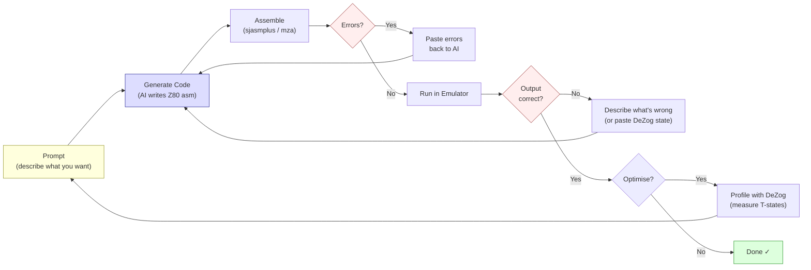

# Chapter 23: AI-Assisted Z80 Development

> "Z80 they still don't know."
> -- Introspec (spke), Life on Mars, 2024

This book was partially written with AI assistance. The chapter you are reading was drafted by Claude Code. The assembler used to build the examples -- MinZ's `mza` -- was built with AI assistance. The "Antique Toy" companion demo that this book documents was coded in a feedback loop between a human and an AI agent. If that makes you uncomfortable, good. That discomfort is worth examining.

This is the most self-aware chapter in the book. We are going to look honestly at what AI assistance means for Z80 development in 2026 -- where it genuinely helps, where it confidently fails, and where the answer is a frustrating "it depends." We will do this with real examples, real code, and real failure cases, because the demoscene has never had patience for hype.

---

## 23.1 The Historical Parallel: HiSoft C on ZX Spectrum

Before we talk about AI, let us talk about another attempt to bring higher-level tools to the ZX Spectrum.

In 1998, *Spectrum Expert* #02 -- the same issue where Dark and STS published their midpoint 3D method (Chapter 5) -- reviewed the HiSoft C compiler for ZX Spectrum. The verdict was mixed. The compiler produced code that ran "10--15x faster than BASIC." It supported 33 reserved keywords, offered a stdio.lib that provided graphics at BASIC capability levels, and included `gam128.h` for 128K memory bank access.

But it had no floating-point support.

Think about that for a moment. A C compiler. On a machine where floating-point is already handled by the ROM's RST $28 calculator, sitting there in 16K of free code. And the compiler could not use it.

The conclusion from the *Spectrum Expert* reviewer was precise: "useful for speed-critical work where float isn't needed." A tool with clear strengths and hard limits, evaluated honestly.

HiSoft Pascal HP4D told a similar story. The compiler occupied 12K, leaving roughly 21K for programs. It supported real types and trig functions -- SIN, COS, SQRT -- and was "suitable for data processing and computational mathematics." But 21K for your program, on a machine where a single uncompressed screen takes 6,912 bytes, means you are writing small programs or nothing.

Higher-level languages on constrained hardware have always been a compromise. They accelerate certain tasks enormously. They make other tasks impossible. The question was never "is HiSoft C good or bad?" but "what is it good *for*, and what should you still write in assembly?"

AI-assisted Z80 development is the same kind of compromise. Different shape, same question.

---

## 23.2 The Claude Code Feedback Loop

Here is how AI-assisted Z80 development actually works in practice. It is not magic. It is a loop.

### The Loop

```text
prompt --> code --> assemble --> error? --> fix --> assemble --> run --> wrong? --> fix --> run --> correct
  ^                                                                                                |
  +------------------------------------------------------------------------------------------------+
```

<!-- figure: ch23_ai_feedback_loop -->


You describe what you want. The AI generates Z80 assembly. You assemble it. It fails -- wrong syntax, wrong label format, wrong assembler dialect. You paste the error back. The AI fixes it. You assemble again. This time it compiles. You run it in the emulator. The output is wrong -- the screen fills with garbage, the border is the wrong colour, nothing appears at all. You describe what you see. The AI adjusts. You run again.

This loop is not fundamentally different from how a human programmer works, except for one critical detail: the AI generates its first attempt much faster and gets some classes of errors much more predictably.

### A Concrete Example

Suppose you ask Claude Code to write a routine that fills the ZX Spectrum attribute area with a diagonal stripe pattern. Here is a plausible first attempt:

```z80 id:ch23_a_concrete_example
; Fill attributes with diagonal stripes
; Pattern: alternating INK colours along diagonals
    ORG $8000

fill_diagonal:
    ld   hl, $5800          ; attribute memory start
    ld   b, 24              ; 24 rows

.row_loop:
    ld   c, 32              ; 32 columns per row
    ld   a, 24
    sub  b                  ; A = row index (0-23)

.col_loop:
    push af
    add  a, c               ; A = row + column
    and  7                  ; clamp to 0-7 (INK colours)
    or   $40                ; set BRIGHT bit
    ld   (hl), a            ; write attribute
    inc  hl
    pop  af
    dec  c
    jr   nz, .col_loop

    djnz .row_loop
    ret
```

This is reasonable code. It assembles. It runs. But there are problems. The column counter `C` counts down from 32, not up from 0, so the diagonal goes the wrong direction. The `or $40` sets bit 6 (BRIGHT), which is correct, but the visual effect has diagonals running top-right to bottom-left instead of the more natural top-left to bottom-right. And the PUSH/POP AF in the inner loop costs 22 T-states per attribute byte -- unnecessary overhead if you restructure the calculation.

None of these are *wrong* in the sense that the code crashes. They are *wrong* in the sense that a Z80 programmer would not write the code this way. A human who has filled attributes hundreds of times would compute the diagonal index differently, avoid the PUSH/POP, and get the direction right on the first attempt because the pattern of row + column is second nature.

Here is the version you arrive at after two iterations:

```z80 id:ch23_a_concrete_example_2
fill_diagonal:
    ld   hl, $5800
    ld   d, 0               ; row index

.row_loop:
    ld   e, 0               ; column index
    ld   b, 32

.col_loop:
    ld   a, d
    add  a, e               ; diagonal = row + col
    and  7
    or   $40                ; BRIGHT + INK colour
    ld   (hl), a
    inc  hl
    inc  e
    djnz .col_loop

    inc  d
    ld   a, d
    cp   24
    jr   nz, .row_loop
    ret
```

Cleaner. No PUSH/POP. Diagonals run the right direction. The inner loop costs 4 + 4 + 7 + 4 + 7 + 7 + 6 + 4 + 13 = 56 T-states per byte -- not brilliant, but functional for a fill routine that runs once.

The point is not that the AI wrote bad code. The point is that the *loop* -- prompt, generate, assemble, test, fix, test again -- is the actual workflow. AI assistance does not eliminate the need to understand Z80. It shifts the bottleneck from writing code to evaluating code.

### What Makes the Loop Fast

The loop is faster with AI than without for specific categories of work:

**Boilerplate.** The ORG directive, the HALT loop, the border colour timing harness from Chapter 1, the attribute fill skeleton, the AY register write subroutine, the LDIR setup, the interrupt mode setup. Every Z80 project starts with the same 30-50 lines. The AI generates these correctly and instantly. A human types them from memory. The AI is faster.

**Iteration on a known pattern.** "Now make the diagonal go the other direction." "Add a frame counter so it animates." "Make the colours cycle through BRIGHT and non-BRIGHT." Each iteration is a small delta on existing code. The AI applies the delta faster than manual editing, and the changes are usually correct.

**Test harness generation.** "Write a test that fills memory at $C000 with values 0-255, calls the multiply routine at $8000, and checks the results against a table." The AI generates this kind of scaffolding code quickly and reliably. The structure of a test -- set up inputs, call routine, compare outputs -- is well within AI competence.

**Documentation and comments.** "Add cycle counts to every instruction in this inner loop." The AI knows the Z80 timing tables and applies them correctly in straightforward cases. This is tedious human work that machines handle well.

### What Makes the Loop Slow

**Novel algorithms.** When you ask for something the AI has not seen -- a new unrolling strategy, a trick that exploits Z80 flag behaviour in a specific way, a code generation scheme tailored to your exact data layout -- the AI generates plausible-looking code that is often subtly wrong. Worse, it is wrong in ways that compile and run but produce incorrect results. You spend more time debugging AI-generated code than you would have spent writing it yourself.

**Cycle counting under pressure.** The AI can count cycles for isolated instructions. But when you need to know the exact cost of a routine that spans contended and uncontended memory, involves conditional branches with different taken/not-taken costs, and must fit within a budget of 2,340 T-states (one scanline minus a few instructions), the AI's estimates are unreliable. It will tell you "approximately 2,200 T-states" when the actual cost depends on branch probabilities and memory alignment. This is where DeZog becomes essential.

**Creative effect design.** "Design a visual effect that looks good and fits in 8,000 T-states" is a question the AI cannot answer. It can implement an effect you describe. It cannot invent one. The creative core of demoscene work -- finding a computation scheme that produces compelling visuals within a tight budget -- remains entirely human.

---

## 23.3 DeZog Integration: The Other Half of the Loop

If the AI generates the code, DeZog tells you whether it works.

DeZog is a VS Code extension that provides a Z80 debugger interface. It connects to emulators (ZEsarUX, CSpect, MAME) or its own internal Z80 simulator and gives you breakpoints, memory inspection, register watches, call stacks, and disassembly views -- the standard debugging experience that modern developers expect, applied to Z80 code.

### The AI + DeZog Workflow

The most productive workflow for AI-assisted Z80 development combines Claude Code with DeZog in a tight loop:

1. **Claude Code generates a routine** -- say, an 8x8 multiply.
2. **You assemble it** with `mza` and load it into the DeZog-connected emulator.
3. **You set a breakpoint** at the entry point and step through.
4. **You watch the registers** at each step. Does A contain the right intermediate value after the first `ADD A,B`? Does the carry flag get set when it should?
5. **You spot a divergence** -- the high byte of the result is wrong. You take a screenshot of the register state or copy the values.
6. **You paste the divergence back to Claude Code** -- "After 6 iterations of the shift loop, A = $3C but should be $78. Here are the register values at the breakpoint."
7. **Claude Code identifies the bug** -- usually a missing shift, a wrong register choice, or an off-by-one in the loop count.
8. **You fix, reassemble, retest.**

This workflow is powerful because it gives the AI what it lacks: ground truth. The AI is good at reasoning about code structure but poor at mentally simulating Z80 execution over many iterations. DeZog provides the actual execution state. The AI reasons about the gap between expected and actual state. Together, they converge on correct code faster than either alone.

### Memory Inspection for Data-Heavy Code

For routines that manipulate memory -- screen fills, table generation, buffer operations -- DeZog's memory view is indispensable. You can set a breakpoint after your sine table generation routine and inspect the 256 bytes at the table address. Are they symmetric? Do they peak at the right value? Do they cross zero at the right position?

This is especially valuable for AI-generated lookup tables. Claude Code can generate a routine that computes a 256-byte sine table using the parabolic approximation from Chapter 4. The routine will usually *almost* work -- the shape is right, the range is right, but there might be an off-by-one in the index that shifts the entire table by one position, or a sign error that inverts one quadrant. DeZog lets you see the table directly and compare it to known-good values.

### What DeZog Cannot Do (Yet)

DeZog does not currently integrate with AI agents programmatically. You, the human, are the bridge -- reading register values, pasting them into the prompt, applying fixes. An AI agent that could set breakpoints and iterate autonomously would close the loop for well-defined problems. For creative and architectural work, the human remains in the loop.

---

## 23.4 When AI Helps, When It Does Not

Let us be specific. Not "AI is good at some things" -- specific categories with specific assessments.

### AI Helps: High Confidence

**Instruction encoding and cycle counts.** The AI has the Z80 instruction set memorised: opcodes, byte counts, T-state costs. `DJNZ` taken = 13T, not taken = 8T. `LDIR` per byte = 21T except last = 16T. It gets these right consistently, with the caveat that it sometimes confuses Pentagon and 48K contended timing.

**Boilerplate and scaffolding.** ORG directives, HALT loops, AY register writes, screen clear routines, interrupt setup. Patterns seen thousands of times. Generated correctly, saves typing.

**Dialect translation and code explanation.** Converting between sjasmplus, mza, and z80asm syntax. Explaining what a block of Z80 assembly does -- tracing logic, identifying patterns. Reading Z80 is easier than writing it, and the AI reads well.

### AI Helps: Medium Confidence

**Standard algorithms.** Shift-and-add multiply, restoring division, Bresenham line drawing, LDIR-based scrolling. The AI generates working implementations of these, but they are usually textbook versions -- correct but not optimised. A human would squeeze out 5-15% more speed through register allocation tricks, flag exploitation, and unrolling that the AI does not think to apply.

**Memory layout and addressing.** "Set up a 256-byte aligned table at $xx00" or "calculate the attribute address for screen position (row, col)." The AI understands the Spectrum's screen layout and generates correct address calculations, though it occasionally gets the third-boundary crossing wrong in the pixel memory interleave.

**Simple self-modifying code.** Patching an immediate operand, changing a jump target, swapping an instruction. The AI understands the concept and generates correct examples for simple cases. Complex self-modification -- where the modified code's behaviour depends on multiple patches interacting -- is unreliable.

### AI Does Not Help: Low Confidence

**Novel inner loop optimisation.** This is the big one. When you need to shave 3 T-states off an inner loop that runs 6,144 times per frame -- when 3 T-states is the difference between 50 fps and 48 fps -- the AI cannot reliably find the optimisation. It will suggest standard approaches (unrolling, table lookup, register substitution) but will not discover the *specific* trick that this *specific* data layout and register allocation permit.

Introspec's `ld a,(hl) : inc l : dec h : add a : add a : add (hl)` rotozoomer inner loop from his Illusion analysis (Chapter 7) is 95 T-states for 4 chunky pixel pairs. The genius is in the choice to use `inc l` instead of `inc hl` (saving 2 T-states, 6 for the pair) and to exploit the fact that `add a` (a doubling) is 4T while `sla a` (a shift, which does the same thing) is 8T. These are the kinds of micro-decisions that accumulate into the difference between a demo that runs and a demo that does not. AI does not make these decisions well, because they require understanding the *global* context of register pressure, memory alignment, and frame budget simultaneously.

**Contended memory timing.** The delay pattern on original Spectrums (6, 5, 4, 3, 2, 1, 0, 0 extra T-states per 8-T-state period) interacts with instruction timing in ways the AI cannot reliably predict. Introspec documented this in "GO WEST" (Hype, 2015). The AI knows the facts but cannot apply them to calculate actual runtime of mixed contended/uncontended routines.

**Flag-based tricks and aesthetic judgement.** The AI knows that `ADD A,A` sets carry from bit 7 -- usable as both branch condition and multiplication -- but does not spontaneously combine such facts into novel optimisations. And it cannot make creative decisions: which colours work for a plasma, how a tunnel should feel, whether a scroller should bounce or sine-wave.

---

## 23.5 Case Study: Building MinZ

MinZ is a programming language for Z80 and eZ80 systems, built by Alice with substantial AI assistance over the course of 2024-2026. It compiles modern, readable code to efficient Z80 assembly. The project is real, open-source, and at version 0.18.0 as of this writing.

MinZ is relevant to this chapter for two reasons. First, it is a case study in AI-assisted development of Z80-targeting tools. Second, it is itself an example of the HiSoft C pattern -- a higher-level language on constrained hardware, with familiar strengths and limits.

### What MinZ Is

MinZ provides typed variables (`u8`, `u16`, `i8`, `i16`, `bool`), functions with multiple returns, control flow (`if/else`, `while`, `for i in 0..n`), structs, arrays, and a standard library covering maths, graphics, input, sound, and memory operations. It compiles to Z80 assembly via its own assembler (`mza`), runs on its own emulator (`mze`), and targets ZX Spectrum, CP/M, and Agon Light 2.

A MinZ program looks like this:

```minz
import stdlib.graphics.screen;
import stdlib.input.keyboard;
import stdlib.time.delay;

fun main() -> void {
    clear_screen();
    draw_circle(128, 96, 50);

    loop {
        wait_frame();
        let dx = get_key_dx();
        // Move sprite based on input...
    }
}
```

This compiles to Z80 assembly, assembles to a binary, and runs on real or emulated hardware. The self-contained toolchain -- compiler, assembler, emulator, REPL, remote runner -- means no external dependencies.

### Where AI Helped Build MinZ

**The compiler itself.** MinZ's compiler is written in Go (~90,000 lines). The bulk of the code generation -- translating MinZ's intermediate representation to Z80 assembly -- was written in an AI-assisted loop. The pattern: describe the semantics of a language feature, generate the code generator, test against the emulator, fix discrepancies. For standard features like arithmetic expressions, function calls, and control flow, this loop converged quickly. Claude Code generated correct code generators for `if/else` and `while` loops on the first or second attempt.

**The assembler.** `mza`, the MinZ Z80 assembler, was built with AI assistance. It supports the full Z80 instruction set, macros, multiple output formats, and two-pass assembly. The instruction encoding table -- which maps mnemonics to opcodes, handling all the Z80's irregular prefix byte patterns (CB, DD, ED, FD) -- was generated by the AI and verified against the Z80 data sheet. This is exactly the kind of systematic, table-driven code that AI handles well.

**The emulator.** `mze` achieves 100% Z80 instruction coverage. The AI generated the initial implementation for each instruction from the Z80 manual; the test suite (also AI-generated) caught edge cases -- flag behaviour on overflow, the half-carry flag on DAA, interrupt timing.

**The standard library and peephole optimiser.** Ten stdlib modules (maths, graphics, input, sound, etc.) and 35+ peephole patterns ("replace `LD A,0` with `XOR A`"). Both were AI-generated and human-refined. The AI knows the instruction set well enough to suggest valid simplifications; the human verifies semantic correctness.

### Where AI Did Not Help Build MinZ

**True Self-Modifying Code (TSMC).** MinZ's most distinctive feature is TSMC -- the compiler can emit code that rewrites its own instructions at runtime for performance. A single-byte opcode patch (7-20 T-states) replaces a conditional branch sequence (44+ T-states). The *concept* of TSMC was Alice's invention, not the AI's. The AI could not have proposed "what if the compiled code patched its own opcodes to change behaviour at runtime?" because the idea requires understanding both the compilation model and the Z80's instruction encoding at a level the AI does not reach unprompted.

**The parser.** MinZ originally used tree-sitter for parsing but hit out-of-memory issues on large files. The replacement -- a hand-written recursive descent parser in Go -- was designed by Alice, informed by AI consultation (GPT-4, o4-mini, and Claude were all asked for architectural advice). The AI colleagues agreed that a hand-written parser was the right approach and suggested keeping tree-sitter's test corpus. But the parser's actual grammar design -- how MinZ's syntax maps to AST nodes -- was human work. The AI could generate parser code for individual grammar rules but could not design the grammar itself.

**Register allocation for the code generator.** Deciding which variables live in which Z80 registers, when to spill to memory, and how to handle the Z80's irregular register file (only certain registers can be used with certain instructions) is a constraint satisfaction problem that the AI handles poorly. It generates code that works but wastes registers, uses unnecessary memory stores, and misses opportunities to keep hot values in registers across basic blocks.

### The MinZ Verdict

MinZ could not exist without AI assistance. The sheer volume of systematic code -- the instruction encoder, the emulator, the standard library, the peephole patterns -- would have taken one developer years to write manually. With AI assistance, MinZ went from concept to v0.18.0 in roughly 18 months.

But MinZ's *interesting* features -- TSMC, the zero-cost lambda-to-function transform, the UFCS method dispatch -- are human inventions. The AI implemented them, but did not conceive them.

This maps precisely to the HiSoft C pattern. The tool accelerates the routine work enormously. The creative work remains human. The compromise is real and worth making.

---

## 23.6 Honest Take: "Z80 They Still Don't Know"

Introspec's scepticism about AI's Z80 capabilities is not generic technophobia. It comes from decades of experience pushing the Z80 to its absolute limits. When he says "Z80 they still don't know," he means something specific.

Consider the rotozoomer inner loop from his Illusion analysis. The effect walks through a texture at an angle, producing rotated and zoomed 2x2 chunky pixels. The inner loop is:

```z80 id:ch23_honest_take_z80_they_still
    ld   a, (hl)    ; 7T   read texture byte
    inc  l          ; 4T   next column (no carry needed: 256-aligned!)
    dec  h          ; 4T   previous row
    add  a          ; 4T   double (same as SLA A but 4T not 8T)
    add  a          ; 4T   quadruple
    add  (hl)       ; 7T   combine with second texture sample
                    ; --- 30T per pixel pair
```

The key insight is `inc l` instead of `inc hl`. This saves 2 T-states but only works because the texture is aligned to a 256-byte boundary, so incrementing just L never needs to carry into H. The AI would use `inc hl` -- the safe, general choice -- and lose 2 T-states per iteration. Over 3,072 pixel pairs per frame, that is 6,144 T-states -- nearly 10% of the frame budget on a 48K Spectrum.

This is what "Z80 they still don't know" means. Not that the AI cannot write Z80 assembly -- it can. Not that it gets the instructions wrong -- it usually does not. But that it does not understand the *context* in which each instruction choice matters. It does not think in budgets. It does not see that `inc l` is safe here because of the alignment constraint three abstraction layers up. It does not know that 2 T-states per iteration, multiplied by thousands of iterations, is the difference between fitting in one frame and needing two.

### What the AI Gets Wrong, Specifically

We tested Claude Code on several Z80 tasks from the demoscene domain. Here are representative results.

**Task: Write a DOWN_HL routine.** DOWN_HL moves the screen pointer in HL one pixel row down in the Spectrum's interleaved video memory. It is the most commonly used graphics primitive on the platform. Introspec wrote a definitive article about it (Hype, 2020).

The AI's first attempt:

```z80 id:ch23_what_the_ai_gets_wrong
down_hl:
    inc  h              ; 4T   move down one pixel row
    ld   a, h           ; 4T
    and  7              ; 7T
    ret  nz             ; 11T/5T  still within the character row
    ld   a, l           ; 4T
    add  a, 32          ; 7T   next character row
    ld   l, a           ; 4T
    ret  c              ; 11T/5T  if carry, crossed into next third
    ld   a, h           ; 4T
    sub  8              ; 7T
    ld   h, a           ; 4T
    ret                 ; 10T
```

This is actually correct -- it handles all three screen thirds properly, including the boundary transitions. The AI can get standard routines like DOWN_HL right because the pattern is well-documented and appears in many Z80 references. The routine works: `inc h` advances the pixel row, `add a, 32` advances the character row when needed, the carry from the L addition correctly detects third boundaries, and `sub 8` undoes the spurious TT increment for the common case.

But "correct" is not the same as "good." Introspec's article presents a version by RST7 using a dual-counter approach that handles all boundaries in 2,343 T-states for a full-screen traverse. The naive approach above -- the standard textbook version -- costs 5,922 T-states. The gap between "works" and "works well" is a factor of 2.5x, and the AI does not bridge that gap. It produces the first version any competent programmer would write, not the version an expert would optimise toward.

**Task: Generate an unrolled screen fill.** Asked to generate an unrolled PUSH-based screen fill (the technique from Chapter 3), the AI produced correct code -- PUSH pairs writing two bytes at a time, DI/EI to protect the stack pointer manipulation. But it did not think to arrange the data in reverse order (PUSH writes high byte first, to lower addresses), which means the fill pattern was backwards. A human who has written PUSH fills before accounts for this automatically.

**Task: Optimise a given inner loop.** Given a working inner loop and asked to make it faster, the AI suggested standard optimisations: unrolling, lookup tables, register substitution. These are valid. But it did not find the non-obvious optimisation -- the one where you rearrange memory layout to enable `inc l` instead of `inc hl`, or use the carry flag from an addition as a branch condition instead of a separate comparison. The non-obvious optimisation requires understanding the full context of the routine, and the AI's context window, while large, does not capture the *spatial* and *temporal* structure of a Z80 program the way a human expert's mental model does.

### Where Introspec Is Right

The deepest Z80 optimisations are not about knowing instructions. They are about understanding the interplay between memory layout, register allocation, instruction encoding, timing constraints, and visual output -- simultaneously. This interplay is what Introspec means by "evolving a computation scheme" (Chapter 1). A computation scheme is a holistic design where every decision affects every other decision. The AI operates on code locally. The expert operates on the scheme globally.

The AI does not know Z80 in the sense that Introspec knows Z80. It has memorised the instruction set but not internalised the machine.

### Where Introspec Is Not Quite Right

But "Z80 they still don't know" implies the AI is useless for Z80 work, and that is not true either.

The AI is not trying to replace Introspec. It is trying to help Alice -- a programmer who understands Z80 well enough to evaluate AI output but does not have decades of inner-loop optimisation experience. For Alice, the AI's output is a starting point that is better than a blank screen. She does not need the AI to find the `inc l` trick. She needs it to generate the first 80% of the routine so she can spend her time on the last 20%.

The demoscene has always been about the last 20%. The AI does not change that. It changes how fast you get through the first 80%.

---

## 23.7 The "Antique Toy" Demo: AI in Practice

The companion demo for this book -- "Antique Toy" -- is a deliberate experiment: build a ZX Spectrum demo with AI assistance and document what happens.

The name is a nod to Introspec's *Eager* (2015, 1st place at 3BM openair). We are implementing effects inspired by Eager -- the attribute tunnel with 4-fold symmetry, the chaos zoomer, 4-phase colour animation -- plus Dark's midpoint 3D engine from *Spectrum Expert* #02.

**What has worked:** Effect prototyping -- Claude Code generates working first drafts fast enough to try ideas that would otherwise not be worth the typing time. "What if the tunnel used 8-fold symmetry instead of 4-fold?" takes 15 minutes with AI-generated code instead of 2 hours manually. Tooling -- the build system, asset pipeline, Makefile rules, and test harnesses were all AI-generated and work reliably. Code review -- feeding the AI a routine and asking "what is wrong?" catches obvious mistakes (off-by-one errors, forgotten DI/EI, wrong port numbers) before they cost debugging hours.

**What has not worked:** Dark's midpoint 3D engine. The virtual processor with packed 2-bit opcodes and 6-bit point numbers was incorrectly decoded. The averaging instruction computed `(A+B)/2` using `ADD A,B : SRA A`, which overflows for signed coordinates. Three debugging sessions, longer than writing it from scratch. Music integration failed similarly -- the AI generated a player that conflicted with the effect code's use of shadow registers (EXX, EX AF,AF'). Both the player and the effect used shadow BC for different purposes, and the EXX in the interrupt handler swapped in stale values. This class of bug -- system-level register conflicts across interrupt boundaries -- requires understanding full system architecture, not just individual routines.

**The honest assessment:** "Antique Toy" is not finished. The effects work individually. Integration is ongoing. But AI assistance made the project *feasible* for a solo developer working evenings and weekends. The right question is not "does AI match a dedicated human team?" but "does AI assistance let more people make demos?" The answer, provisionally, is yes.

---

## 23.8 The Feedback Loop in Practice

A concrete example from the "Antique Toy" project: implementing 4-fold symmetry for the tunnel effect by copying the top-left 16x12 attribute quadrant to the other three quadrants with mirroring.

The prompt was specific: "Write a Z80 routine that copies the top-left 16x12 quadrant of the ZX Spectrum attribute area ($5800) to the other three quadrants with appropriate mirroring." Claude Code generated 47 lines that assembled on the first attempt.

Testing revealed the top-right quadrant was offset by one column. DeZog showed the problem: after the mirror loop decremented DE 16 times, the row-advance calculation forgot that DE had already been moved backwards. The code advanced DE by 32 (one row width) instead of the needed 48 (32 for the row + 16 to compensate for the mirror traversal). Pasting the register values into Claude Code -- "After row 1, DE = $581F (should be $582F)" -- produced the fix immediately. The bottom-right quadrant had the same error compounded. One more iteration fixed it.

Total: three iterations, roughly 25 minutes. Manual estimate for an experienced Z80 programmer: 40-60 minutes. For a newcomer: 2-3 hours. The AI saved time on initial generation. The debugging took the same time regardless of who wrote the code.

---

## 23.9 Building Your Own AI-Assisted Workflow

The practical setup: VS Code with Z80 Macro Assembler extension and Z80 Assembly Meter. Claude Code (or any code-capable LLM). An assembler (`mza` or sjasmplus). DeZog connected to an emulator. A Makefile.

The workflow: **Start with the AI** -- describe what you want with specifics (target machine, memory addresses, assembler syntax). **Assemble immediately** -- do not read the AI's code carefully; assemble it, paste errors back. **Test with border colours** -- wrap AI-generated routines in the timing harness from Chapter 1. **Debug with DeZog** -- set breakpoints, find the first register divergence, report it to the AI. **Iterate** -- usually 2-5 rounds for moderate complexity; more than 5 means the AI is failing and you should write it yourself. **Optimise yourself** -- once correct, profile and apply the techniques from Chapters 1-14.

### Prompt Engineering for Z80

**Good prompt:** "Write a Z80 routine for ZX Spectrum 128K (Pentagon timing) that copies 16 bytes from the address in HL to screen memory at (DE), with the screen address following the Spectrum interleave pattern. After each byte, advance DE to the next pixel row using the standard down_hl method. Use mza syntax. Include cycle counts."

**Bad prompt:** "Write a sprite routine for the Spectrum."

The good prompt specifies machine, assembler, addresses, behaviour, and output format. The bad prompt leaves everything ambiguous, and the AI will fill the gaps with wrong assumptions.

For optimisation prompts, give a concrete target: "This routine takes ~3,200 T-states. I need it under 2,400. Do not change the interface (HL = source, DE = destination, B = height). Pentagon timing." A performance target and interface constraint force the AI to look for real optimisations instead of restructuring the calling convention.

---

## 23.10 The Broader Picture

AI assistance does not change the abstraction level of the output -- the Z80 still executes the same instructions at the same speeds. What it changes is the speed of the input: how fast you go from idea to working (if unoptimised) code. The demoscene's experts will still write better inner loops than any AI, but AI-assisted tooling lowers the entry barrier enough that more people can start making demos and learn the deep tricks for themselves.

---

## Summary

- **AI-assisted Z80 development follows a feedback loop:** prompt, generate, assemble, test, debug, iterate. The AI generates the first draft fast; the human evaluates and refines. The loop typically takes 2-5 iterations for a routine of moderate complexity.

- **AI is reliable for** instruction encoding, cycle counts, boilerplate, dialect translation, and code explanation. It is moderately reliable for standard algorithms and simple self-modifying code. It is unreliable for novel optimisation, contended memory timing, creative effect design, and deep flag-based tricks.

- **DeZog integration** closes the gap between AI output and correct code. The human reads register states from the debugger and feeds divergences back to the AI, which reasons about the mismatch. Programmatic AI-debugger integration does not yet exist but is the obvious next step.

- **The MinZ case study** shows the pattern clearly: AI assistance made it possible for one developer to build a complete language toolchain (compiler, assembler, emulator, standard library) in 18 months. The routine work -- instruction encoding, test generation, standard library functions -- was AI-generated. The creative work -- TSMC, zero-cost abstractions, grammar design -- was human.

- **Introspec's scepticism is valid:** AI does not understand Z80 the way an expert does. It does not think in budgets, does not see cross-cutting constraints, does not find non-obvious optimisations. The deepest demoscene work remains beyond AI's reach.

- **The historical parallel holds:** HiSoft C was "10-15x faster than BASIC" but had no floats. AI-assisted Z80 development is dramatically faster for scaffolding and iteration but cannot match human experts for inner loop optimisation. Higher-level tools on constrained hardware have always been a compromise. The question is not "good or bad?" but "good *for what*?"

- **The practical workflow** combines Claude Code for code generation, DeZog for debugging, `mza` or sjasmplus for assembly, and a Makefile for build automation. Start with AI, assemble immediately, test with border colours, debug with DeZog, optimise yourself.

- **The broader effect** is positive: AI assistance lowers the entry barrier to Z80 development without lowering the ceiling. More people can start; the experts are still needed for the deep work. This is good for the demoscene.

---

## Try It Yourself

1. **The boilerplate test.** Ask your AI assistant to generate a ZX Spectrum 128K boot template: ORG at $8000, disable interrupts, set up IM1, HALT loop with border colour timing harness. Assemble and run it. How many iterations did it take?

2. **The optimisation test.** Write (or AI-generate) a working attribute fill loop. Measure its cost with border colour timing. Then ask the AI to make it faster. Measure again. Now optimise it yourself using techniques from Chapters 1-3. Compare all three versions: original, AI-optimised, human-optimised.

3. **The DOWN_HL challenge.** Ask the AI to write a DOWN_HL routine. Test it on all 192 pixel rows. Does it handle the third-boundary transitions correctly? Compare to Introspec's analysis (Hype, 2020). This is a litmus test for AI Z80 competence.

4. **The MinZ experiment.** Install the MinZ toolchain (`mza`, `mze`). Write a simple program in MinZ -- a screen fill, a keyboard reader, a bouncing pixel. Compare the generated assembly to what you would write by hand. Where is the MinZ output good? Where is it wasteful?

5. **Build something.** Pick an effect from an earlier chapter. Use AI assistance to write the first draft. Iterate until it works. Profile it. Optimise the inner loop by hand. Document each step. You have just experienced the workflow this entire chapter describes.

---

*This is the final technical chapter. What follows are the appendices -- reference tables, setup guides, and the instruction reference you will reach for every time you write Z80 assembly.*

> **Sources:** HiSoft C review (Spectrum Expert #02, 1998); Introspec "Technical Analysis of Illusion" (Hype, 2017); Introspec "DOWN_HL" (Hype, 2020); Introspec "GO WEST Parts 1-2" (Hype, 2015)
