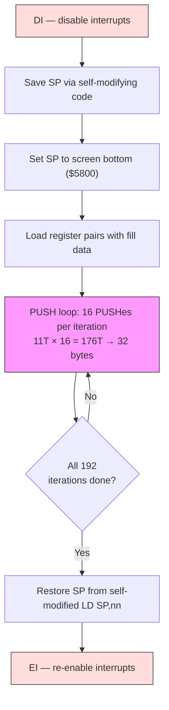

# Capítulo 3: La caja de herramientas del demoscener

Todo oficio tiene su bolsa de trucos --- patrones a los que los practicantes recurren con tanta naturalidad que dejan de considerarlos trucos. Un demoscener del Z80 recurre a las técnicas de este capítulo.

Estos patrones --- bucles desenrollados, código auto-modificable, la pila como canal de datos, cadenas LDI, generación de código y encadenamiento RET --- aparecen en casi cada efecto que construiremos en la Parte II. Son lo que separa una demo que cabe en un fotograma de una que necesita tres. Apréndelos aquí, y los reconocerás en todas partes.

---

## Bucles Desenrollados y Código Auto-Modificable

### El coste de iterar

Considera el bucle interno más simple posible: borrar 256 bytes de memoria.

```z80 id:ch03_the_cost_of_looping
; Looped version: clear 256 bytes at (HL)
    ld   b, 0            ; 7 T   (B=0 means 256 iterations)
    xor  a               ; 4 T
.loop:
    ld   (hl), a         ; 7 T
    inc  hl              ; 6 T
    djnz .loop           ; 13 T  (8 on last iteration)
```

Cada iteración cuesta 7 + 6 + 13 = 26 T-states para almacenar un solo byte. Solo 7 de esos T-states hacen el trabajo --- el resto es sobrecarga. Eso es un 73% de desperdicio. Para 256 bytes: 256 x 26 - 5 = 6.651 T-states. En una máquina donde tienes 71.680 T-states por fotograma, esos T-states desperdiciados duelen.

### Desenrollado: intercambiar RAM por velocidad

La solución es brutal y efectiva: escribe el cuerpo del bucle N veces y elimina el bucle.

```z80 id:ch03_unrolling_trade_ram_for_speed
; Unrolled version: clear 256 bytes at (HL)
    xor  a               ; 4 T
    ld   (hl), a         ; 7 T
    inc  hl              ; 6 T
    ld   (hl), a         ; 7 T
    inc  hl              ; 6 T
    ld   (hl), a         ; 7 T
    inc  hl              ; 6 T
    ; ... repeated 256 times total
```

Cada byte ahora cuesta 7 + 6 = 13 T-states. Sin DJNZ. Sin contador de bucle. Total: 256 x 13 = 3.328 T-states --- la mitad de la versión con bucle.

El coste es el tamaño de código: 256 repeticiones ocupan 512 bytes frente a 7 del bucle. Estás intercambiando RAM por velocidad.

**Cuándo desenrollar:** Bucles internos que se ejecutan miles de veces por fotograma --- borrado de pantalla, dibujado de sprites, copia de datos.

**Cuándo NO desenrollar:** Bucles externos que se ejecutan una o dos veces por fotograma. Ahorrar 5 T-states en 24 iteraciones te da 120 T-states --- menos de tres NOPs. No vale la pena el aumento de tamaño.

El punto medio práctico es el *desenrollado parcial*: desenrolla 8 o 16 iteraciones dentro del bucle, conserva DJNZ para el conteo exterior. El ejemplo `push_fill.a80` en el directorio `examples/` de este capítulo hace exactamente esto: 16 PUSHes por iteración, 192 iteraciones.

### Código auto-modificable: el arma secreta del Z80

El Z80 no tiene caché de instrucciones, ni búfer de prebúsqueda, ni pipeline. Cuando la CPU busca un byte de instrucción de la RAM, lee lo que esté allí *en ese momento*. Si cambiaste ese byte un ciclo antes, la CPU ve el nuevo valor. Esta es una propiedad garantizada de la arquitectura.

El código auto-modificable (SMC) significa escribir en los bytes de instrucción en tiempo de ejecución. El patrón clásico es parchear un operando inmediato:

```z80 id:ch03_self_modifying_code_the_z80_s
; Self-modifying code: fill with a runtime-determined value
    ld   a, (fill_value)       ; load the fill byte from somewhere
    ld   (patch + 1), a        ; overwrite the operand of the LD below
patch:
    ld   (hl), $00             ; this $00 gets replaced at runtime
    inc  hl
    ; ...
```

El `ld (patch + 1), a` escribe en el operando inmediato del siguiente `ld (hl), $00`, cambiándolo a `ld (hl), $AA` o lo que hayas cargado. La CPU ejecuta los bytes que encuentra. Algunos patrones comunes de SMC:

**Parchear opcodes.** Incluso puedes reemplazar la instrucción misma. ¿Necesitas un bucle que a veces incrementa HL y a veces lo decrementa? Antes del bucle, escribe el opcode de INC HL ($23) o DEC HL ($2B) en el byte de instrucción. Dentro del bucle interno, no hay salto alguno --- la instrucción correcta ya está colocada. Compara esto con un enfoque de salto-por-iteración que costaría 12 T-states (JR NZ) en cada píxel individual.

**Guardar y restaurar el puntero de pila.** Este patrón aparece constantemente al usar trucos de PUSH (más abajo):

```z80 id:ch03_self_modifying_code_the_z80_s_2
    ld   (restore_sp + 1), sp     ; save SP into the operand below
    ; ... do stack tricks ...
restore_sp:
    ld   sp, $0000                ; self-modified: the $0000 was overwritten
```

El `ld (nn), sp` guarda el SP actual directamente en el operando del posterior `ld sp, nn`. Sin variable temporal. Este es código idiomático de demoscene Z80.

### Variables auto-modificables: el patrón `$+1`

El patrón de SMC más extendido en el ZX Spectrum no es parchear opcodes ni guardar SP --- es incrustar una *variable* directamente dentro del operando inmediato de una instrucción. La idea es simple: en lugar de almacenar un contador en una ubicación de memoria con nombre y cargarlo con `LD A,(nn)` a 13 T-states, dejas que el propio byte del operando de la instrucción *sea* la variable.

```z80 id:ch03_smc_dollar_plus_one
.smc_counter:
    ld   a, 0                    ; 7T — this 0 is the "variable"
    inc  a                       ; 4T
    ld   (.smc_counter + 1), a   ; 13T — write back to the operand byte
```

El `ld a, 0` obtiene su operando como parte de la decodificación normal de la instrucción --- 7 T-states en total, y el valor ya está en A. Compara con cargar desde una dirección de memoria separada: `ld a, (counter)` cuesta 13 T-states, más aún necesitas un `ld (counter), a` separado a 13 T-states para escribir el valor de vuelta. La versión SMC lee la variable gratis (es parte de la búsqueda de instrucción) y solo paga los 13 T-states una vez para la escritura de vuelta.

En sjasmplus, puedes colocar una etiqueta en `$+1` para darle un nombre legible a la variable incrustada:

```z80 id:ch03_smc_named_variable
    ld   a, 0                    ; 7T
.scroll_pos EQU $ - 1           ; .scroll_pos names the operand byte above
    add  a, 4                   ; 7T — advance by 4 pixels
    ld   (.scroll_pos), a       ; 13T — store back into the operand
```

Este patrón aparece en todas partes del código del ZX Spectrum: posiciones de desplazamiento, contadores de fotogramas de animación, acumuladores de fase de efectos, banderas de dirección. Cualquier valor de un solo byte que persista entre llamadas es candidato. Lo verás constantemente en las Partes II y V --- prácticamente cada rutina de efecto en este libro usa al menos una variable auto-modificable.

La convención es prefijar estas etiquetas con `.smc_` o colocarlas inmediatamente después de la instrucción que modifican. De cualquier forma, la intención debe ser clara para cualquiera que lea el código fuente. Como señalamos en el Capítulo 2, las etiquetas locales (`.label`) previenen colisiones de nombres cuando múltiples rutinas tienen cada una sus propias variables incrustadas.

**Una nota de precaución.** El SMC es seguro en el Z80, el eZ80 y cada clon de Spectrum. *No* es seguro en CPUs modernas con caché (x86, ARM) sin instrucciones explícitas de vaciado de caché. Si portas a una arquitectura diferente, esto es lo primero que se rompe.

---

## La Pila como Canal de Datos

### Por qué PUSH es la escritura más rápida en el Z80

La instrucción PUSH escribe 2 bytes en memoria y decrementa SP, todo en 11 T-states. Comparemos las alternativas para escribir datos en una dirección de pantalla:

| Método | Bytes escritos | T-states | T-states por byte |
|--------|---------------|----------|-------------------|
| `ld (hl), a` + `inc hl` | 1 | 13 | 13,0 |
| `ld (hl), a` + `inc l` | 1 | 11 | 11,0 |
| `ldi` | 1 | 16 | 16,0 |
| `ldir` (por byte) | 1 | 21 | 21,0 |
| `push hl` | 2 | 11 | **5,5** |

PUSH escribe dos bytes en 11 T-states --- 5,5 T-states por byte. Casi 4 veces más rápido que LDIR. La trampa: PUSH escribe donde apunta SP, y SP es normalmente tu pila. Para usar PUSH como canal de datos, debes secuestrar el puntero de pila.

### La técnica

El patrón es siempre el mismo:

1. Deshabilitar interrupciones (DI). Si una interrupción se dispara mientras SP apunta a la pantalla, la CPU empujará la dirección de retorno en tus datos de píxel. Le sigue el caos.
2. Guardar SP. Usa código auto-modificable para guardarlo.
3. Establecer SP al *final* de tu área objetivo. La pila crece hacia abajo --- PUSH decrementa SP antes de escribir. Así que si quieres llenar desde $4000 hasta $57FF, estableces SP en $5800.
4. Cargar tus datos en pares de registros y hacer PUSH repetidamente.
5. Restaurar SP y rehabilitar interrupciones (EI).

<!-- figure: ch03_push_fill_pipeline -->


> **Por qué PUSH gana:** `LD (HL),A` + `INC HL` escribe 1 byte en 13T (13,0 T/byte). `PUSH HL` escribe 2 bytes en 11T (**5,5 T/byte**) --- casi 2,4x más rápido por byte. El coste: las interrupciones deben estar deshabilitadas mientras SP está secuestrado.

Aquí está el núcleo del ejemplo `push_fill.a80` del directorio `examples/` de este capítulo:

```z80 id:ch03_the_technique_2
stack_fill:
    di                          ; critical: no interrupts while SP is moved
    ld   (restore_sp + 1), sp   ; self-modifying: save SP

    ld   sp, SCREEN_END         ; SP points to end of screen ($5800)
    ld   hl, $AAAA              ; pattern to fill

    ld   b, 192                 ; 192 iterations x 16 PUSHes x 2 bytes = 6144
.loop:
    push hl                     ; 11 T  \
    push hl                     ; 11 T   |
    push hl                     ; 11 T   |
    push hl                     ; 11 T   |
    push hl                     ; 11 T   |
    push hl                     ; 11 T   |  16 PUSHes = 32 bytes
    push hl                     ; 11 T   |  = 176 T-states
    push hl                     ; 11 T   |
    push hl                     ; 11 T   |
    push hl                     ; 11 T   |
    push hl                     ; 11 T   |
    push hl                     ; 11 T   |
    push hl                     ; 11 T   |
    push hl                     ; 11 T   |
    push hl                     ; 11 T   |
    push hl                     ; 11 T  /
    djnz .loop                  ; 13 T (8 on last)

restore_sp:
    ld   sp, $0000              ; self-modified: restores original SP
    ei
    ret
```

El cuerpo interno de 16 PUSHes escribe 32 bytes en 176 T-states. Total para los 6.144 bytes del área de píxeles completa: aproximadamente 36.000 T-states. Compara con LDIR: 6.144 x 21 - 5 = 129.019 T-states. El método PUSH es aproximadamente 3,6 veces más rápido --- la diferencia entre caber en un fotograma y desbordar al siguiente.


### POP como lectura rápida

PUSH es la escritura más rápida, pero POP es la *lectura* más rápida. POP carga 2 bytes de (SP) en un par de registros en 10 T-states --- eso son 5,0 T-states por byte. Comparemos las alternativas:

| Método | Bytes leídos | T-states | T-states por byte |
|--------|-----------|----------|-------------------|
| `ld a, (hl)` + `inc hl` | 1 | 13 | 13,0 |
| `ld a, (hl)` + `inc l` | 1 | 11 | 11,0 |
| `ldi` (como lectura+escritura) | 1 | 16 | 16,0 |
| `pop hl` | 2 | 10 | **5,0** |

El patrón: pre-construir una tabla de valores de 16 bits en memoria, apuntar SP al inicio de la tabla, y hacer POP en pares de registros. Cada POP avanza SP en 2, recorriendo la tabla automáticamente. Este es el complemento de lectura del truco PUSH de escritura.

Combina POP y PUSH y obtienes un canal rápido de memoria a memoria: haz POP de un valor desde una tabla fuente (10T), procesa el par de registros si es necesario, luego haz PUSH al destino (11T). Total: 21 T-states para 2 bytes --- el mismo rendimiento que LDIR, pero con el par de registros disponible para procesamiento entre la lectura y la escritura. Puedes enmascarar bits, sumar desplazamientos, intercambiar bytes o aplicar cualquier transformación registro-a-registro sin coste extra de acceso a memoria. Este pipeline POP-procesar-PUSH es la columna vertebral de muchas rutinas de sprites compilados.

### Dónde se usan los trucos de PUSH

- **Borrado de pantalla.** El uso más común. Toda demo necesita borrar la pantalla entre efectos.
- **Sprites compilados.** El sprite se compila en una secuencia de instrucciones PUSH con pares de registros precargados. La salida de sprites más rápida posible en el Z80.
- **Salida rápida de datos.** Cada vez que necesitas transferir un bloque de datos a un rango de direcciones contiguo: llenado de atributos, copias de búfer, construcción de listas de visualización.

El precio que pagas: las interrupciones están desactivadas. Si tu reproductor de música funciona desde una interrupción IM2, perderá un compás durante una secuencia larga de PUSH. Los programadores de demos planifican alrededor de esto --- programan los llenados PUSH durante el tiempo de borde, o los dividen en múltiples fotogramas.

---

## Cadenas LDI

### LDI vs LDIR

LDI copia un byte de (HL) a (DE), incrementa ambos y decrementa BC. LDIR hace lo mismo pero repite hasta que BC = 0. La diferencia está en la temporización:

| Instrucción | T-states | Notas |
|-------------|----------|-------|
| LDI | 16 | Copia 1 byte, siempre 16 T |
| LDIR (por byte) | 21 | Copia 1 byte, vuelve a iterar. Último byte: 16 T |

LDIR cuesta 5 T-states adicionales por byte para su verificación interna de retorno al bucle. Esos 5 T-states se acumulan rápidamente.

Para 256 bytes:
- LDIR: 255 x 21 + 16 = 5.371 T-states
- 256 x LDI: 256 x 16 = 4.096 T-states
- Ahorro: 1.275 T-states (24%)

Una cadena de instrucciones LDI individuales son solo 256 repeticiones del código de operación de dos bytes `$ED $A0`. Eso son 512 bytes de código para ahorrar un 24% --- el mismo intercambio de RAM por velocidad que el desenrollado de bucles.

### Cuándo las cadenas LDI brillan

El punto ideal es copiar bloques de tamaño conocido. Una cadena de 32 LDIs ahorra 160 T-states respecto a LDIR para una fila de sprite. A lo largo de 24 filas, son 3.840 T-states por fotograma.

Pero el verdadero poder emerge cuando combinas cadenas LDI con *aritmética de punto de entrada*. Si tienes una cadena de 256 LDIs y quieres copiar solo 100 bytes, salta a la cadena en la posición 156. Sin contador de bucle, sin configuración. Esta técnica se usa en el chaos zoomer de Introspec en Eager (2015):

```z80 id:ch03_when_ldi_chains_shine
; Chaos zoomer inner loop (simplified from Eager)
; Each line copies a different number of bytes from a source buffer.
; Entry point into the LDI chain is calculated per line.
    ld   hl, source_data
    ld   de, dest_screen
    ; ... calculate entry point based on zoom factor ...
    jp   (ix)             ; jump into the LDI chain at the right point

ldi_chain:
    ldi                   ; byte 255
    ldi                   ; byte 254
    ldi                   ; byte 253
    ; ... 256 LDIs total ...
    ldi                   ; byte 0
    ; falls through to next line setup
```

Esta copia de longitud variable con cero sobrecarga de bucle por byte es una técnica que simplemente no puedes lograr con LDIR. Es una razón por la que LDI es el mejor amigo de todos en el código de demoscene.


---

## Trucos de Bits: SBC A,A y Compañía

### SBC A,A como máscara condicional

Después de cualquier instrucción que produce una bandera de acarreo, `SBC A,A` convierte esa bandera en un byte completo: $FF si el acarreo estaba activado, $00 si no. El coste: 4 T-states. Compara esto con la alternativa de ramificación --- `JR C,.set` / `LD A,0` / `JR .done` / `.set: LD A,$FF` / `.done:` --- que cuesta 17-22 T-states dependiendo de qué ruta se tome, más la interrupción de la tubería por un salto condicional.

El caso de uso canónico es la *expansión de bit a byte*. Dado un byte donde cada bit representa un píxel (el formato de píxeles del Spectrum), puedes expandir cada bit en un byte de atributo completo:

```z80 id:ch03_sbc_bit_expand
    rlc  (hl)            ; rotate top bit into carry    — 15T
    sbc  a, a            ; A = $FF if set, $00 if not   — 4T
    and  $47             ; A = bright white ($47) or $00 — 7T
```

Tres instrucciones, 26 T-states, sin ramificaciones. Para seleccionar entre dos valores *arbitrarios* en lugar de cero y una máscara, usa el patrón `SBC A,A : AND mask : XOR base`. El AND selecciona qué bits cambian entre los dos valores, y el XOR los invierte al valor base deseado. Este patrón reemplaza cada prueba "si el bit está activado entonces valor A, si no valor B" en tus bucles internos.

### ADD A,A vs SLA A

Ambas instrucciones desplazan A un bit a la izquierda. Pero `ADD A,A` es 4 T-states y 1 byte, mientras que `SLA A` es 8 T-states y 2 bytes. No hay situación donde SLA A sea preferible --- `ADD A,A` es estrictamente más rápido y más pequeño. De manera similar, `ADD HL,HL` desplaza HL a la izquierda en 11 T-states (1 byte), reemplazando la secuencia de dos instrucciones `SLA L : RL H` a 16 T-states (4 bytes). Para un desplazamiento de 16 bits a la izquierda dentro de un bucle interno que se ejecuta 192 veces por fotograma, esa sustitución por sí sola ahorra 960 T-states --- más de cuatro líneas de escaneo de tiempo de borde.

Estos no son trucos. Son vocabulario. Así como un hablante fluido no se detiene a conjugar verbos comunes, un programador de Z80 recurre a `ADD A,A` y `SBC A,A` sin pensarlo conscientemente. Si te encuentras escribiendo `SLA A` o un salto condicional para seleccionar entre dos valores, detente y recurre a la forma más corta. Los T-states se acumulan.

---

## Generación de Código

### Generación de código: escribir el programa que dibuja

Todo lo anterior es una optimización fija --- el código se ejecuta de la misma manera cada fotograma. La generación de código va más allá: tu programa escribe el programa que dibuja la pantalla. Hay dos variantes: offline (antes del ensamblado) y en tiempo de ejecución (durante la ejecución).

### Offline: generar ensamblador desde un lenguaje de nivel superior

Introspec usó Processing (un entorno de programación creativa basado en Java) para generar ensamblador Z80 para el chaos zoomer en Eager (2015). Un chaos zoomer cambia la magnificación en cada fotograma --- diferentes píxeles fuente se mapean a diferentes ubicaciones de pantalla. En lugar de calcular estos mapeos en tiempo de ejecución, el script de Processing precalculó cada mapeo y generó archivos fuente .a80 que contienen cadenas LDI e instrucciones LD optimizadas.

El flujo de trabajo: un script de Processing calcula, para cada fotograma, qué byte fuente se mapea a qué byte de pantalla. Genera fuente Z80 --- secuencias de instrucciones `ld hl, source_addr` y `ldi` --- que el ensamblador (sjasmplus) compila junto al código del motor escrito a mano. En tiempo de ejecución, el motor simplemente llama al código pregenerado para el fotograma actual.

Esto no es "hacer trampa". Es la visión fundamental de que la división del trabajo entre tiempo de compilación y tiempo de ejecución puede eliminar saltos, consultas y aritmética del bucle interno por completo. El script de Processing hace las matemáticas difíciles una vez, lentamente, en una máquina moderna. El Z80 hace la parte fácil --- copiar bytes --- tan rápido como es físicamente posible.

### Tiempo de ejecución: el programa escribe código máquina durante la ejecución

A veces los parámetros cambian cada fotograma, así que la generación offline no es suficiente. La rutina de mapeado de esfera en Illusion de X-Trade (ENLiGHT'96) genera código máquina en un búfer de RAM en tiempo de ejecución. La geometría de la esfera cambia al rotar --- diferentes píxeles necesitan diferentes distancias de salto. Antes de cada fotograma, el motor emite bytes de opcode en un búfer, luego los ejecuta:

```z80 id:ch03_runtime_the_program_writes
; Runtime code generation (conceptual, simplified from Illusion)
; Generate an unrolled rendering loop for this frame's sphere slice

    ld   hl, code_buffer
    ld   de, sphere_table       ; per-frame skip distances

    ld   b, SPHERE_WIDTH
.gen_loop:
    ld   a, (de)                ; load skip distance for this pixel
    inc  de

    ; Emit: ld a, (hl) -- opcode $7E
    ld   (hl), $7E
    inc  hl

    ; Emit: add a, N   -- opcodes $C6, N
    ld   (hl), $C6
    inc  hl
    ld   (hl), a                ; the skip distance, as immediate operand
    inc  hl

    djnz .gen_loop

    ; Emit: ret -- opcode $C9
    ld   (hl), $C9

    ; Now execute the generated code
    call code_buffer
```

El código generado es una secuencia en línea recta sin saltos, sin consultas, sin sobrecarga de bucle --- pero es *código diferente cada fotograma*. En lugar de "if pixel_skip == 3 then..." a 12 T-states por salto, emites las instrucciones exactas necesarias y las ejecutas sin saltos.

### El coste de la generación

La generación de código en tiempo de ejecución no es gratis. Mira el bucle generador de arriba: cada instrucción emitida requiere cargar un byte de código de operación, almacenarlo, avanzar el puntero, y posiblemente cargar un operando --- aproximadamente 30-50 T-states por byte emitido, dependiendo de la complejidad. Digamos ~40 T-states en promedio. Para una rutina generada de 100 bytes de instrucciones, eso son aproximadamente 4.000 T-states de sobrecarga de generación.

El punto de equilibrio: la generación compensa cuando el código generado se ejecuta más de una vez por fotograma, o cuando reemplaza lógica de ramificación que cuesta más que la propia generación. En el mapeador de esferas de Illusion, cada pasada de renderizado generada se ejecuta una vez por fotograma --- pero reemplaza saltos condicionales por píxel que costarían mucho más. Alone Coder documentó un intercambio similar en su motor de rotación: generar una secuencia de instrucciones INC H/INC L para el avance de coordenadas cuesta aproximadamente 5.000 T-states emitir, pero elimina aritmética de coordenadas que costaría aproximadamente 146.000 T-states si se computara en línea. La sobrecarga de generación es menos del 4% del coste que reemplaza.

La regla general: si te encuentras escribiendo un bucle que contiene ramificaciones seleccionando entre diferentes secuencias de instrucciones basándose en datos por píxel o por línea, ese bucle es candidato para generación de código. Emite las instrucciones correctas una vez, ejecútalas sin ramificaciones, y regenera solo cuando los parámetros cambien.

**Cuándo generar código:** Si las mismas operaciones ocurren cada fotograma con solo cambios de datos, el código auto-modificable (parchear operandos) es suficiente. Si la *estructura* cambia --- diferentes números de iteraciones, diferentes secuencias de instrucciones --- genera el código. Si puedes precomputar las variaciones en una máquina moderna, prefiere la generación offline: es depurable, verificable e impone cero coste en tiempo de ejecución. La generación en tiempo de ejecución vale la pena cuando el código generado se ejecuta mucho más frecuentemente de lo que cuesta generarlo.

---

## Encadenamiento RET

### Convertir la pila en una tabla de despacho

En 2025, DenisGrachev publicó una técnica en Hype desarrollada para su juego Dice Legends. El problema: renderizar un campo de juego basado en tiles requiere dibujar docenas de tiles por fotograma. El enfoque ingenuo usa CALL:

```z80 id:ch03_turning_the_stack_into_a
; Naive approach: call each tile renderer
    call draw_tile_0
    call draw_tile_1
    call draw_tile_2
    ; ...
```

Cada CALL cuesta 17 T-states. Para un campo de juego de 30 x 18 (540 tiles), son 9.180 T-states solo en despacho.

La idea de DenisGrachev: establecer SP a una *lista de renderizado* --- una tabla de direcciones --- y terminar cada procedimiento de dibujo de tile con RET. RET saca 2 bytes de (SP) y los pone en PC. Si SP apunta a tu lista de renderizado, RET no retorna al llamador --- salta a la siguiente rutina en la lista.

```z80 id:ch03_turning_the_stack_into_a_2
; RET-chaining: zero call overhead
    di
    ld   (restore_sp + 1), sp   ; save SP
    ld   sp, render_list        ; SP points to our dispatch table

    ; "Call" the first tile routine by falling into it or using RET:
    ret                         ; pops first address from render_list

; Each tile routine ends with:
draw_tile_N:
    ; ... draw the tile ...
    ret                         ; pops NEXT address from render_list

; The render list is a sequence of addresses:
render_list:
    dw   draw_tile_42           ; first tile to draw
    dw   draw_tile_7            ; second tile
    dw   draw_tile_42           ; third tile (same tile type, different position)
    ; ... one entry per tile on screen ...
    dw   render_done            ; sentinel: address of cleanup code

render_done:
restore_sp:
    ld   sp, $0000              ; self-modified: restore SP
    ei
```

Cada despacho ahora cuesta 10 T-states (RET) en lugar de 17 (CALL). Para 540 tiles: 3.780 T-states ahorrados. Pero la ganancia real es el despacho gratuito --- cada entrada puede apuntar a un procedimiento diferente (tile ancho, tile vacío, tile animado). Sin tabla de saltos, sin llamada indirecta. La lista de renderizado *es* el programa.

### Tres estrategias para la lista de renderizado

DenisGrachev exploró tres enfoques para construir la lista de renderizado:

1. **Mapa como lista de renderizado.** El propio mapa de tiles es la lista de renderizado: cada celda contiene la dirección de la rutina de dibujo para ese tipo de tile. Simple pero inflexible --- cambiar un tile implica reescribir 2 bytes en el mapa.

2. **Segmentos basados en direcciones.** La pantalla se divide en segmentos. La lista de renderizado de cada segmento es un bloque de direcciones copiado de una tabla maestra. Cambiar tiles significa copiar un nuevo bloque de direcciones.

3. **Basado en bytes con tablas de consulta de 256 bytes.** Cada tipo de tile es un solo byte (el índice del tile). Una tabla de consulta de 256 bytes mapea índices de tiles a direcciones de rutinas. La lista de renderizado se construye iterando sobre los bytes del mapa de tiles y consultando cada dirección. Este es el enfoque que DenisGrachev eligió para Dice Legends.

Usando el enfoque basado en bytes, amplió el campo de juego de 26 x 15 tiles (el límite de su motor anterior) a 30 x 18 tiles manteniendo la tasa de fotogramas objetivo. Los ahorros por eliminar la sobrecarga de CALL, combinados con el despacho de coste cero, liberaron suficientes T-states para renderizar un 40% más de tiles.

### Las contrapartidas

Como todos los trucos de pila, las interrupciones deben estar deshabilitadas mientras SP está secuestrado. Cada rutina de tile debe ser autocontenida --- terminando con RET y sin usar CALL, ya que la pila real no está disponible. En la práctica, las rutinas de tiles son lo suficientemente cortas como para que esto no sea una limitación.

---

## Sidebar: "El Código está Muerto" (Introspec, 2015)

En enero de 2015, Introspec publicó un breve y provocador ensayo en Hype titulado "El Código está Muerto" (Kod myortv). El argumento traza un paralelo con "La Muerte del Autor" de Roland Barthes: así como Barthes argumentaba que el significado de un texto pertenece al lector, no al escritor, Introspec argumenta que el código de una demo solo vive verdaderamente cuando alguien lo lee --- en un depurador, en un listado de desensamblado, en código fuente compartido en un foro.

La verdad incómoda: las demos modernas se consumen como medios visuales. La gente las ve en YouTube. Votan en Pouet basándose en capturas de vídeo. Nadie ve los bucles internos. Una optimización brillante que ahorra 3 T-states por píxel es invisible para el 99% de la audiencia. "Escribir código puramente por sí mismo", escribió Introspec, "ha perdido relevancia".

Y sin embargo.

Estás leyendo este libro. Estamos abriendo el depurador. Estamos contando T-states. Estamos mirando dentro. Las técnicas de este capítulo no son piezas de museo. Son herramientas vivas, y el hecho de que la mayoría de la gente nunca las verá no disminuye su artesanía.

El ensayo de Introspec es un desafío, no una rendición. Posteriormente publicó algunos de los análisis técnicos más detallados que la escena ZX haya producido --- incluyendo el desglose de Illusion y los benchmarks de compresión referenciados a lo largo de este libro. El código puede estar muerto para el espectador de YouTube. Pero para el lector con un desensamblador y una mente curiosa, está muy vivo.

---

## Juntándolo Todo

Las técnicas de este capítulo no son independientes. En la práctica, se componen:

- **El borrado de pantalla** combina *bucles desenrollados* con *trucos PUSH*: un bucle parcialmente desenrollado de 16 PUSHes por iteración, con SP secuestrado vía *código auto-modificable*.
- **Los sprites compilados** combinan *generación de código* (cada sprite se compila a código ejecutable), *lecturas POP* y *salida PUSH* (la forma más rápida de mover datos de píxeles a través de registros), *trucos de bits* (SBC A,A para expansión de máscara) y *auto-modificación* (parcheando direcciones de pantalla por fotograma).
- **Los motores de tiles** combinan *encadenamiento RET* para despacho con *cadenas LDI* dentro de cada rutina de tile para copia rápida de datos.
- **Los chaos zoomers** combinan *generación de código offline* (scripts de Processing emitiendo ensamblador) con *cadenas LDI* (el código generado es mayormente secuencias LDI) y *auto-modificación* (parcheando direcciones fuente por fotograma).
- **Los efectos de atributos** combinan *lecturas POP* de tablas precalculadas con *trucos de bits* (SBC A,A para expandir máscaras de bits en valores de color) y *escrituras PUSH* para salida rápida de atributos.

El hilo común: cada técnica elimina algo del bucle interno. Desenrollar elimina el contador de bucle. La auto-modificación elimina saltos. PUSH elimina la sobrecarga de escritura por byte. POP elimina la sobrecarga de lectura por byte. Las cadenas LDI eliminan la penalización de repetición de LDIR. Los trucos de bits eliminan saltos condicionales. La generación de código elimina toda la distinción entre código y datos. El encadenamiento RET elimina la sobrecarga de CALL.

El Z80 funciona a 3,5 MHz. Tienes 71.680 T-states por fotograma. Cada T-state que ahorras en el bucle interno es un T-state que puedes gastar en más píxeles, más colores, más movimiento. La caja de herramientas de este capítulo es cómo llegas allí.

En los capítulos que siguen, verás cada una de estas técnicas en acción en demos reales --- la esfera texturizada de Illusion, el túnel de atributos de Eager, el motor multicolor de Old Tower. El objetivo de este capítulo fue darte el vocabulario. Ahora veamos qué construyeron los maestros con él.

---

## Pruébalo Tú Mismo

1. **Mide la diferencia.** Toma el arnés de temporización del Capítulo 1 y mide tres versiones de un llenado de 256 bytes: (a) el bucle `ld (hl), a : inc hl : djnz`, (b) un `ld (hl), a : inc hl` x 256 completamente desenrollado, y (c) el llenado basado en PUSH de `examples/push_fill.a80`. Compara las anchuras de la franja de borde. La franja de la versión PUSH debería ser visiblemente más corta.

2. **Construye un borrado auto-modificable.** Escribe una rutina de borrado de pantalla que tome el patrón de llenado como parámetro y lo parchee en un bucle de llenado basado en PUSH usando código auto-modificable. Llámala dos veces con patrones diferentes y observa la pantalla alternarse.

3. **Cronometra una cadena LDI.** Escribe una copia de 32 bytes usando LDIR y otra usando 32 x LDI. Mide ambas con la técnica del color de borde. La cadena LDI debería ahorrar 160 T-states --- visible si ejecutas la copia en un bucle ajustado.

4. **Experimenta con puntos de entrada.** Construye una cadena LDI de 128 entradas y una pequeña rutina que calcule un punto de entrada basado en un valor en el registro A (0--128). Salta a la cadena en diferentes puntos. Esta es una versión simplificada de la copia de longitud variable usada en los chaos zoomers reales.

5. **Copiador de longitud variable con entrada calculada.** Construye una cadena LDI de 256 entradas y un frontal que acepte un conteo de bytes en el registro B (1--256). Calcula el punto de entrada: cada LDI son 2 bytes, así que el desplazamiento es (256 - B) x 2 desde el inicio de la cadena. Suma esto a la dirección base de la cadena, luego JP (HL) hacia ella. Envuelve todo en el arnés de temporización de color de borde y compara el ancho de la franja contra LDIR para el mismo conteo de bytes. Para conteos pequeños (menos de 16), la diferencia es mínima. Para conteos superiores a 64, la cadena LDI se adelanta visiblemente.

6. **Desempaquetador de bit a atributo.** Escribe una rutina que lea un byte de (HL), rote cada bit con RLC (HL), y use `SBC A,A : AND $47` para expandir cada bit en un byte de atributo (blanco brillante o negro). Almacena los 8 bytes de atributo resultantes en un búfer de destino usando (DE) / INC DE. Esta es la semilla del escritor de atributos de un sprite compilado --- en capítulos posteriores verás este patrón generar rutinas de sprites completas.

> **Fuentes:** DenisGrachev "Tiles and RET" (Hype, 2025); Introspec "Making of Eager" (Hype, 2015); Introspec "Technical Analysis of Illusion" (Hype, 2017); Introspec "Code is Dead" (Hype, 2015)
