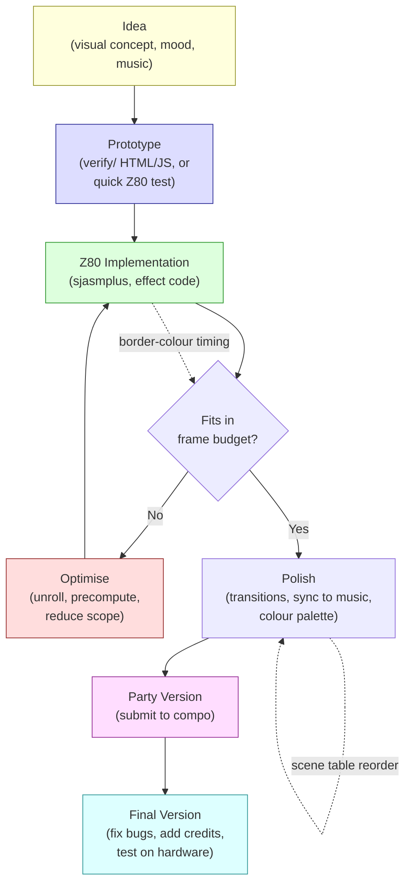

# Capítulo 20: Flujo de Trabajo de una Demo --- De la Idea a la Compo

> *"Design is the complete aggregate of all demo components, both visible and concealed. Design characterises realizational, stylistic, ideological integrity."*
> -- Introspec, "For Design," Hype, 2015

---

Una demo no se construye en una sola sesión de programación inspirada. Es un proyecto -- uno con plazos, dependencias, decisiones creativas que deben fijarse semanas antes de la fiesta, apuestas técnicas que dan resultado o no, y una entrega final que funciona en la máquina de la compo o falla frente a una audiencia. La distancia entre "tengo una idea para una demo" y "quedó tercera en DiHalt" no se mide en líneas de código sino en flujo de trabajo: cómo organizas los efectos, cómo planificas tu tiempo, cómo compilas y pruebas, cómo manejas el momento inevitable en que la música no está lista y la fiesta es en cuatro días.

Este capítulo trata sobre ese flujo de trabajo. Hemos dedicado diecinueve capítulos a las técnicas -- bucles internos, conteo de ciclos, compresión, sonido, sincronización. Ahora damos un paso atrás y preguntamos: ¿cómo se junta realmente una demo? ¿Cómo pasas de una pantalla en blanco a una producción de dos minutos que se ejecuta de forma fiable, parece intencional y llega a la fiesta correcta el día correcto?

Las respuestas vienen de tres fuentes. El artículo making-of de restorer para Lo-Fi Motion (Hype, 2020) proporciona un estudio de caso detallado de un pipeline de producción funcional -- catorce efectos construidos en dos semanas de programación vespertina, con un sistema de tabla de escenas y una cadena de herramientas que cualquier lector puede replicar. Los ensayos filosóficos de Introspec en Hype -- "For Design" y "MORE" (ambos de 2015) -- articulan el pensamiento de diseño que separa una colección de efectos de una demo coherente. Y la cultura making-of más amplia de la escena ZX Spectrum -- desde el NFO detallado de Eager hasta el flujo de trabajo con editor de video iOS de GABBA y el rompecabezas de 256 bytes de NHBF -- nos da una galería de enfoques de los que aprender.

---

## 20.1 Qué Significa "Diseño" en una Demo

Cuando los demosceners dicen "diseño", no se refieren a diseño gráfico. No se refieren a disposición de interfaz o teoría del color, aunque esas importan. La definición de Introspec, publicada en Hype en enero de 2015, es más amplia y más exigente:

> El diseño es el agregado completo de todos los componentes de la demo, tanto visibles como ocultos.

Esta definición incluye los efectos que la audiencia ve, las transiciones entre ellos, la elección de música y cómo se sincroniza con los visuales, la paleta de colores, el ritmo, el arco emocional -- pero también la arquitectura del código, el mapa de memoria, la estrategia de compresión, el pipeline de compilación y las decisiones sobre qué dejar fuera. Una demo con pixel art hermoso y ritmo terrible tiene diseño pobre. Una demo con visuales crudos pero sincronización musical perfecta y un arco emocional claro podría tener diseño excelente. Una demo deliberadamente fea, una que elige su estética con intención, puede tener diseño sobresaliente.

Las implicaciones para el flujo de trabajo son inmediatas. Si el diseño lo abarca todo, entonces las decisiones de diseño ocurren en cada etapa. La elección de ensamblador limita lo que tu pipeline de compilación puede hacer. El mapa de memoria determina qué efectos pueden coexistir. El orden en que construyes los efectos determina qué puedes recortar si el tiempo se agota. Cada elección técnica tiene una consecuencia estética, y cada elección estética tiene un coste técnico.

La producción de demos debe ser simultáneamente ascendente y descendente, con retroalimentación constante entre visión creativa y realidad técnica. El flujo de trabajo debe soportar ese bucle de retroalimentación.

---

## 20.2 Lo-Fi Motion: Un Estudio de Caso Completo

En septiembre de 2020, restorer publicó un artículo making-of para Lo-Fi Motion, una demo de ZX Spectrum lanzada en DiHalt 2020. El artículo es valioso no por ninguna idea técnica individual sino porque documenta un *pipeline de producción completo* -- desde el concepto inicial hasta el binario terminado -- con suficiente detalle para reproducirlo.

### El Concepto: "Pixel Bielorruso"

Lo-Fi Motion usa gráficos de resolución de atributos -- lo que restorer llama renderizado "lo-fi". La mayoría de los efectos funcionan en la cuadrícula de atributos de 32x24 o en una resolución duplicada de 32x48 usando medias filas de caracteres. Sin renderizado a nivel de píxel. La estética es deliberadamente cuadriculada, abrazando la cuadrícula de atributos del ZX Spectrum en lugar de luchar contra ella. El nombre lo dice: esto es lo-fi, y el movimiento es lo importante.

Esta es una decisión de diseño con beneficios técnicos en cascada. Los efectos de resolución de atributos son baratos de calcular (192 o 384 bytes por fotograma en lugar de 6.144), baratos de almacenar (búferes de fotograma pequeños significan más espacio para datos comprimidos) y rápidos de mostrar (escribir 768 bytes a la RAM de atributos cabe fácilmente en un fotograma). La estética lo-fi no es un compromiso -- es una elección que desbloquea catorce efectos en dos semanas de trabajo vespertino.

### La Tabla de Escenas

En el centro de la arquitectura de Lo-Fi Motion está la **tabla de escenas** -- una estructura de datos que impulsa toda la demo. Cada entrada en la tabla describe una escena:

```z80 id:ch20_the_scene_table
; Scene table entry (conceptual structure)
scene_entry:
    DB  bank_number          ; which 16K memory bank holds this effect's code
    DW  entry_address        ; start address of the effect routine
    DW  frame_duration       ; how many frames this scene runs
    DB  param_byte_1         ; effect-specific parameter
    DB  param_byte_2         ; effect-specific parameter
    ; ... additional parameters as needed
```

El motor de demo lee la tabla de escenas linealmente. Para cada entrada, pagina el banco de memoria especificado, salta a la dirección de entrada y ejecuta el efecto durante el número de fotogramas especificado. Cuando la duración expira, avanza a la siguiente entrada. Toda la demo -- los catorce efectos, todas las transiciones, toda la temporización -- está codificada en esta única tabla.

Este es el mismo patrón arquitectónico que vimos en el motor de scripts del Capítulo 12, reducido a lo esencial. El motor de scripts de Eager tenía dos niveles (script exterior para efectos, script interior para variaciones de parámetros) y el comando kWORK para generación asíncrona de fotogramas. La tabla de escenas de Lo-Fi Motion es más simple: un nivel, generación síncrona, sin búfer asíncrono. La simplicidad es el punto. Funciona. Se construyó en dos semanas.

El patrón de tabla de escenas tiene una ventaja crítica para el flujo de trabajo: separa el contenido del motor. Añadir un nuevo efecto significa escribir la rutina del efecto y añadir una entrada a la tabla. Reordenar la demo significa reorganizar las entradas de la tabla. Ajustar la temporización significa cambiar los valores de duración. El código del motor no cambia. Esta separación significa que puedes iterar sobre la estructura de la demo -- su ritmo, su orden, su temporización -- sin tocar el motor, e iterar sobre efectos individuales sin tocar la estructura.

### Catorce Efectos

Lo-Fi Motion contiene aproximadamente catorce efectos visuales distintos. restorer los enumera por sus nombres de trabajo: raskolbas, slime, fire, interp, plasma, rain, dina, rtzoomer, rbars, bigpic, y varios otros. Cada efecto es una rutina autocontenida que renderiza en un búfer virtual.

El búfer virtual es una elección arquitectónica clave. La mayoría de los efectos no escriben directamente en la memoria de pantalla. En su lugar, renderizan en un **búfer de 1 byte por píxel** -- un bloque de RAM donde cada byte representa el valor de color de una celda de atributos. El búfer tiene típicamente 32 bytes de ancho y 24 o 48 bytes de alto (para resolución de medio carácter). Después de que el efecto renderiza en el búfer, una rutina de salida separada copia el búfer a la RAM de atributos, realizando cualquier conversión de formato necesaria.

Esta indirección cuesta unos pocos cientos de T-states por fotograma pero proporciona dos beneficios. Primero, los efectos están aislados del diseño físico de la pantalla. Un efecto que renderiza en un búfer lineal no necesita conocer la estructura de direcciones de la memoria de atributos. Segundo, los efectos se pueden componer: dos efectos pueden renderizar en búferes separados, y una rutina de mezcla puede combinarlos antes de la salida. Lo-Fi Motion usa esto para las transiciones -- fundidos cruzados entre dos efectos interpolando los valores de sus búferes.

El búfer también habilita el modo de resolución de medio carácter. Un búfer de 32x48 se mapea a la pantalla usando dos escrituras de atributos por celda de caracteres (una para la "mitad superior" y otra para la "mitad inferior"), explotando el truco de temporización de reescribir atributos a mitad de línea de escaneo. Esto duplica la resolución vertical a costa de código de salida más complejo y restricciones de temporización más estrictas.

### Los Efectos en Sí

Cada efecto es una variación sobre temas de capítulos anteriores: **plasma** (suma de senos del Capítulo 9), **rotozoomer** (recorrido de textura del Capítulo 7), **fire** (autómata celular promediando vecinos), **rain** (sistema de partículas) y **bigpic** (animación de bitmap precomprimida descomprimida fotograma a fotograma, usando técnicas del Capítulo 14). Ninguno de estos efectos es novedoso. El punto es que a resolución de atributos, cada uno de ellos es lo suficientemente barato como para que catorce quepan en una demo construida en dos semanas. La decisión lo-fi es un multiplicador de fuerza.

### La Cadena de Herramientas

La cadena de herramientas de restorer para Lo-Fi Motion es una respuesta concreta a la pregunta "¿qué herramientas necesito para hacer una demo?"

**Ensamblador: sjasmplus.** El ensamblador macro Z80 estándar para la escena ZX moderna. Conmutación de bancos de memoria (directivas SLOT/PAGE), ensamblaje condicional, macros, INCBIN para datos incrustados, DISPLAY para diagnósticos en tiempo de compilación, salida a .tap/.sna/.trd. La tabla de escenas, el código de efectos, los datos comprimidos y el motor se compilan en una sola invocación de sjasmplus.

**Emulador: zemu.** El emulador que restorer eligió para Lo-Fi Motion. Unreal Speccy y Fuse son igualmente comunes. Lo que importa es temporización precisa y recarga rápida -- necesitas probar una nueva compilación cada pocos minutos.

**Gráficos: BGE 3.05 + Photoshop.** BGE (Burial Graphics Editor, por Sinn/Delirium Tremens) es un editor gráfico nativo del ZX Spectrum, ampliamente usado en la escena rusa para crear arte a nivel de atributos directamente en la plataforma objetivo. Las imágenes pre-renderizadas en PC pasan por Photoshop (o Multipaint, GIMP) y scripts personalizados.

**Scripts: Ruby.** Automatización del pipeline de conversión: imágenes a datos de atributos, tablas de seno a includes binarios, secuencias de animación a flujos comprimidos por delta. Python, Perl y Processing son igualmente comunes. Lo que importa es que la conversión sea automatizada y repetible.

**Compresión: hrust1opt.** Hrust 1 con análisis óptimo. El descompresor Z80 es reubicable (usa la pila como búfer de trabajo), conveniente para demos que paginan datos dentro y fuera de la memoria banqueada.

La lección práctica: no hay una única cadena de herramientas "correcta". La correcta es aquella donde cada paso desde el recurso fuente hasta el binario final está automatizado, cambiar una entrada regenera todas las salidas dependientes, y toda la compilación se completa en segundos. Cualquier paso manual es un error esperando ocurrir a las 2 AM antes del plazo de la compo.

### El Pipeline de Compilación

Las herramientas se encadenan mediante un **Makefile** (o script de compilación equivalente). El pipeline para Lo-Fi Motion se ve aproximadamente así:

```text
Source assets (PNG, raw data)
    |
    v
Ruby conversion scripts
    |
    v
Binary includes (.bin, .hru)
    |
    v
sjasmplus assembly
    |
    v
Output binary (.trd or .sna)
    |
    v
Test in emulator (zemu)
```

Cada flecha es una regla del Makefile. Cambias un PNG, ejecutas `make`, y toda la cadena se re-ejecuta -- conversión, compresión, ensamblaje -- produciendo un binario fresco en segundos. Lo cargas en el emulador, observas el resultado, decides qué cambiar, editas el fuente, ejecutas `make` de nuevo. Este bucle editar-compilar-probar, medido en segundos, es lo que hace posible construir catorce efectos en dos semanas.

El Makefile también sirve como documentación. Leer las reglas de compilación te dice exactamente qué scripts producen qué salidas, qué efectos dependen de qué archivos de datos, y cómo se ve el grafo completo de dependencias. Cuando regresas al proyecto después de una pausa de seis meses, el Makefile te dice cómo encaja todo.

### La Línea de Tiempo: Dos Semanas de Noches

Lo-Fi Motion se construyó en aproximadamente dos semanas de sesiones de programación vespertina. restorer tenía un trabajo diurno. Las noches eran el único tiempo disponible.

Esta línea de tiempo es realista para una demo lo-fi de atributos, e instructiva para cualquiera que planifique su primera producción. El desglose se ve aproximadamente así:

- **Días 1-2:** Arquitectura del motor. Sistema de tabla de escenas, búfer virtual, rutina de salida, framework básico. Pon un efecto (plasma) funcionando a través del pipeline completo.
- **Días 3-7:** Efectos. Dos a tres efectos por noche una vez que el framework está sólido. Cada efecto son 100-300 líneas de ensamblador, renderizando en el búfer virtual. Prueba cada uno individualmente.
- **Días 8-10:** Contenido. Imágenes pre-renderizadas, datos de fuentes, scripts de conversión. Aquí es donde los scripts de Ruby demuestran su valor.
- **Días 11-12:** Integración. Todos los efectos en la tabla de escenas, temporización ajustada a la música, transiciones afinadas. Aquí es donde el flujo de trabajo de editar-y-recompilar de la tabla de escenas da sus frutos.
- **Días 13-14:** Pulido y depuración. Colores de borde para visualización de temporización (Capítulo 1), corrección de efectos que fallan en casos límite, pasada final de compresión para que todo quepa en memoria.

La observación crítica: el motor y el pipeline consumen los dos primeros días. Cada día subsiguiente se beneficia de esa inversión. Si te saltas el trabajo de pipeline y codificas tu primer efecto directamente en la memoria de pantalla, ahorras un día al principio y pierdes una semana después cuando intentas añadir un segundo efecto y descubres que nada es modular.

---

## 20.3 Cultura del Making-of

La demoscene del ZX Spectrum tiene una fuerte cultura de documentar cómo se hacen las demos. Esto no es universal en la demoscene más amplia -- en muchas plataformas, las demos se distribuyen sin documentación más allá de los créditos. En la escena Spectrum, los artículos making-of detallados son una tradición, y Hype (hype.retroscene.org) es el lugar principal para publicarlos.

### Eager: El NFO Técnico

Cuando Introspec lanzó Eager (to live) en 3BM Open Air 2015, el archivo ZIP incluía un file_id.diz -- el archivo de información de demo tradicional -- que iba mucho más allá de créditos y saludos. Era una descripción técnica: el enfoque del túnel de atributos, la optimización de simetría cuádruple, la técnica híbrida de tambores digitales, la arquitectura de generación asíncrona de fotogramas. Kylearan, reseñando la demo en Pouet, escribió: "Big thanks for the nfo file alone, I love reading technical write-ups! Helps in understanding what I'm seeing/hearing, too."

Introspec luego publicó un artículo making-of aún más detallado en Hype, que se convirtió en la fuente principal para los Capítulos 9 y 12 de este libro. El artículo explicaba no solo *qué* hace la demo sino *por qué* -- el razonamiento detrás de cada decisión técnica, las restricciones que impulsaron la arquitectura, los objetivos creativos que dieron forma al diseño visual.

Este nivel de documentación cumple múltiples propósitos. Para la audiencia, profundiza la apreciación -- entender cómo funciona un efecto hace que verlo sea más gratificante, no menos. Para otros programadores, es educación -- los artículos making-of en Hype son lo más cercano que tiene la escena ZX a un currículo técnico. Para el autor, es una forma de cierre -- articular las decisiones te obliga a entender tu propio trabajo, y la retroalimentación de la comunidad (los comentarios en Hype pueden tener cientos de publicaciones) pone a prueba tu razonamiento.

### GABBA: Un Flujo de Trabajo Diferente

El artículo making-of de diver4d para GABBA (2019) documenta un flujo de trabajo radicalmente diferente al de Eager. Donde Introspec pasó semanas en un motor de scripts y un búfer de fotogramas asíncrono, diver4d usó Luma Fusion -- un editor de video para iOS -- como su herramienta de sincronización.

Cubrimos los detalles técnicos en el Capítulo 12. La idea sobre el flujo de trabajo es lo que importa aquí: diver4d reconoció que la sincronización audiovisual a nivel de fotograma es un problema de *edición de video*, no un problema de *programación*. Al hacer el trabajo de sincronización en una herramienta diseñada para ello, podía iterar sobre la temporización en segundos en lugar de minutos. El código Z80 era la capa de implementación; las decisiones creativas ocurrían en el editor de video.

Este es un principio general. El flujo de trabajo de una demo no consiste en hacerlo todo en ensamblador. Consiste en usar la herramienta correcta para cada tarea. Ensamblador para bucles internos. Processing o Ruby para generación de código. Photoshop o Multipaint para gráficos. Un editor de video para temporización. Un Makefile para unirlo todo. La demo es la salida; las herramientas son lo que sea que te lleve allí más rápido.

### NHBF: El Rompecabezas

El making-of de UriS para NHBF (2025) documenta un flujo de trabajo en el extremo opuesto al pipeline de catorce efectos de Lo-Fi Motion. NHBF es un intro de 256 bytes -- el programa completo, código y datos, cabe en menos espacio que un solo fotograma de atributos. El "flujo de trabajo" es una persona mirando un volcado hexadecimal, reorganizando constantemente instrucciones para encontrar codificaciones más cortas, descubriendo que los valores de registros de una rutina coinciden casualmente con las necesidades de datos de otra.

Cubrimos las técnicas específicas en el Capítulo 13. La lección sobre flujo de trabajo trata sobre la creatividad impulsada por restricciones. UriS describe el proceso como "jugar juegos tipo rompecabezas" -- una metáfora acertada porque el espacio de optimización en la programación de 256 bytes es combinatorio. No puedes planificar un camino hacia la solución. Solo puedes seguir reorganizando piezas y permanecer alerta ante alineaciones fortuitas. El descubrimiento de Art-Top de que los valores de registros de la rutina de limpieza de pantalla coincidían con la longitud de la cadena de texto no fue planificado. Fue notado.

Esto importa para el flujo de trabajo de demos a cualquier escala. Incluso en una demo de tamaño completo con un motor apropiado y un Makefile y una tabla de escenas, hay momentos en que la mejor solución viene de dar un paso atrás y mirar el panorama completo, notando una alineación accidental entre dos sistemas que fueron diseñados independientemente. La mentalidad de resolver rompecabezas no es exclusiva del sizecoding. Es un modo de pensamiento que mejora todo el trabajo con demos.

---

## 20.4 La Cadena de Herramientas en Detalle

La cadena de herramientas de la demoscene del ZX Spectrum ha convergido en un conjunto estándar. Aquí hay una disposición típica de proyecto:

```text
src/
    main.asm            ; entry point, scene table, engine loop
    engine.asm          ; scene table interpreter, buffer management
    effects/
        plasma.asm      ; individual effect routines
        fire.asm
        rotozoomer.asm
    sound/
        player.asm      ; music player (PT3 or custom)
        drums.asm       ; digital drum sample playback
    data/
        music.pt3       ; music file (INCBIN)
        screens.zx0     ; compressed graphics (INCBIN)
        sinetable.bin   ; pre-generated lookup table (INCBIN)
Makefile
tools/
    gen_sinetable.rb    ; Ruby script: generate sine table
    convert_gfx.rb      ; Ruby script: PNG to attribute data
```

### Ensamblador: sjasmplus

El caballo de batalla. Conmutación de bancos de memoria mediante directivas SLOT/PAGE, ensamblaje condicional, macros, INCBIN para datos incrustados, DISPLAY para diagnósticos en tiempo de compilación, y salida a .tap/.sna/.trd. Una demo típica se compila en una sola invocación de sjasmplus.

### Emuladores

**Unreal Speccy** es preferido por muchos demosceners de la escena rusa por su temporización determinista y emulación precisa de Pentagon, con soporte para TR-DOS, TurboSound y múltiples modelos de clon. **Fuse** está ampliamente disponible en Linux y macOS. **zemu** es otra opción, usado por restorer para Lo-Fi Motion. Para depuración a nivel de código fuente, **DeZog** en VS Code se conecta a ZEsarUX y proporciona puntos de interrupción, inspección de registros y vistas de memoria.

Elige un emulador para el desarrollo principal. Prueba en otros antes del lanzamiento. Las demos que funcionan en un emulador y fallan en otro son una tradición de las fiestas que es mejor evitar.

### Gráficos y Generación de Código

**Multipaint** aplica restricciones de atributos en tiempo real -- diseñado específicamente para pixel art de 8 bits. **Photoshop, GIMP o Aseprite** ofrecen libertad creativa pero requieren scripts de conversión (Python, Ruby, Processing) para cuantizar y exportar. **Processing** maneja gráficos generativos y generación de código -- Introspec lo usó para generar las secuencias de código desenrollado del chaos zoomer (Capítulo 9).

### Automatización de Compilación y CI

Tu Makefile debe automatizar el pipeline completo: recursos fuente a scripts de conversión a compresión a ensamblaje. Si algún paso requiere intervención manual, fallará a las 2 AM antes del plazo.

La integración continua mediante GitHub Actions es cada vez más común. Un flujo de trabajo que compila en cada push detecta dependencias implícitas -- la demo se ensambla en tu máquina pero falla en un entorno limpio porque no declaraste la versión de una herramienta. El código fuente de Lo-Fi Motion está en GitHub, publicado como implementación de referencia: clónalo, ejecuta `make`, obtén un binario funcional. Esta apertura es inusual en la demoscene y valiosa para el aprendizaje.

### Sincronización y Composición

La parte más difícil de una demo no son los efectos --- es la *temporización*. Cuándo iniciar el plasma. Cuándo cortar al desplazamiento. Qué golpe de batería dispara el destello de color. Esto es sincronización, y la escena del ZX Spectrum ha desarrollado un enfoque por capas que combina herramientas específicas de la demoscene con edición de video de propósito general.

**La tabla de sincronización.** A nivel de Z80, la sincronización es una tabla de datos:

```z80
sync_table:
    dw 0,     effect_logo       ; frame 0: show logo
    dw 150,   effect_plasma     ; frame 150: start plasma
    dw 312,   flash_border      ; frame 312: beat hit, flash
    dw 500,   effect_scroll     ; frame 500: start scroller
    dw 0                        ; end marker
```

El motor incrementa un contador de fotogramas en cada VBlank, lo compara con la siguiente entrada de la tabla y despacha cuando el fotograma llega. Este es el mecanismo de sincronización más simple posible. También es lo que toda demo de ZX Spectrum ejecuta en última instancia --- independientemente de cómo se determinaron esos números de fotograma.

La pregunta es: ¿cómo *encuentras* los números de fotograma correctos? Existen cinco enfoques, del más simple al más sofisticado. (El Apéndice J cubre el flujo de trabajo completo de cada herramienta, los pipelines de exportación y recetas paso a paso.)

**Enfoque 1: Vortex Tracker + temporización manual.** Abre tu .pt3 en Vortex Tracker II. La esquina inferior derecha muestra la posición actual (patrón, fila, fotograma). Reproduce la canción, anota los números de fotograma donde ocurren golpes, acentos y transiciones de frase. Escríbelos en tu tabla de sincronización. Recompila, prueba, ajusta. Este es el enfoque que la mayoría de los demosceners de ZX usan, incluyendo Kolnogorov (Vein): "Vortex + video editor. In Vortex the frame is shown in the bottom-right corner --- I looked at which frames to hook onto, created a table with `dw frame, action` entries, and synced from that."

La ventaja: escuchas la música y ves los números simultáneamente. La desventaja: iterar es lento --- cada cambio requiere recompilar la demo y verla desde el principio.

**Enfoque 2: Editor de video como planificador de sincronización.** El flujo de trabajo de diver4d para GABBA reconoció que la sincronización a nivel de fotograma es un problema de edición de video. Captura cada efecto como un clip de video, importa los clips y la música en un editor de video (DaVinci Resolve, Blender VSE), desplázate para encontrar los puntos de corte perfectos y lee los números de fotograma. Kolnogorov: "I exported effect clips to video, assembled them in a video editor, attached the music track, and looked at what order the effects work best in, noting the frames where events should happen." La palabra importante es *miré* --- esto es un proceso visual e intuitivo. (Los Apéndices J.2-J.3 cubren Blender VSE, DaVinci Resolve y el flujo de trabajo de GABBA en detalle.)

**Enfoque 3: GNU Rocket.** La herramienta de sincronización estándar en las demoscenes de PC y Amiga --- un editor tipo tracker donde las columnas son parámetros con nombre y las filas son pasos de tiempo. Estableces fotogramas clave con interpolación (escalón, lineal, suave, rampa) y editas en vivo mientras la demo se ejecuta vía TCP. Un cliente Z80 es impráctico, pero el flujo de trabajo se transfiere: diseña curvas de sincronización en Rocket, exporta fotogramas clave, conviértelos a tablas Z80 `dw`/`db` con un script Python. (El Apéndice J.2 describe el pipeline completo de Rocket a Z80; el Apéndice J.7 proporciona una receta paso a paso.)

**Enfoque 4: Blender para pre-visualización.** Para demos complejas, crea un storyboard de efectos como tiras de colores en la línea de tiempo del VSE con la pista musical, anima parámetros de marcador de posición en el Graph Editor, luego exporta números de fotograma y valores de fotograma clave mediante la API Python de Blender directamente como datos listos para Z80. (Los Apéndices J.2-J.3 cubren tanto los flujos de trabajo del VSE como del Graph Editor.)

**Enfoque 5: Motores de juego como generadores de datos.** Unity y Unreal son excesivos como *motores de demo* pero perfectos como *generadores de datos*: captura de movimiento VR (dibuja trayectorias con un controlador), simulación de partículas en GPU (exporta posiciones por fotograma) y prototipado de shaders (itera un algoritmo a máxima velocidad, luego tradúcelo a Z80). Blender cubre la mayor parte de esto para trabajo sin VR. El pipeline de exportación es siempre el mismo: float -> punto fijo de 8 bits -> codificación delta -> transposición -> compresión -> INCBIN. (El Apéndice J.4 cubre el pipeline completo con tablas comparativas y una receta paso a paso de captura VR.)

> La demoscene de PC tiene un ecosistema paralelo de herramientas para crear demos construido sobre la misma filosofía de generación procedimental y compresión extrema: Werkkzeug/kkrunchy de Farbrausch (código abierto en 2012), TiXL (gráficos de movimiento basados en nodos, MIT), Bonzomatic (programación de shaders en vivo) y sintetizadores de música como Sointu y WaveSabre. Ninguno apunta al Z80 directamente, pero el pensamiento es idéntico --- el equivalente en ZX Spectrum del grafo de nodos de Werkkzeug es tu script Python que genera tablas de consulta y emite directivas INCBIN. El Apéndice J.5 cubre la historia y el Apéndice J.6 examina las herramientas musicales, incluyendo Furnace --- un tracker moderno con soporte directo para AY-3-8910.

<!-- figure: ch20_vortex_tracker_frame_counter -->
```text
┌─────────────────────────────────────────────────────────────────────┐
│              FIGURE: Vortex Tracker II — frame counter              │
│                                                                     │
│  VT2 main window with pattern editor visible.                       │
│  Bottom-right: position display showing pattern:row and             │
│  absolute frame number.                                             │
│  Highlight/circle the frame counter.                                │
│                                                                     │
│  Caption: "The frame number in VT2's status bar maps directly to    │
│  the PT3 player's interrupt counter on the Spectrum. What you see   │
│  here is what your sync table references."                          │
│                                                                     │
│  Screenshot needed: open any .pt3 in VTI fork, play to a           │
│  mid-song position, capture with frame number visible.              │
└─────────────────────────────────────────────────────────────────────┘
```

> *Consulta el Apéndice J para pseudo-capturas de pantalla de GNU Rocket, Blender VSE, Blender Graph Editor y TiXL, además de descripciones detalladas de herramientas y cinco recetas de exportación paso a paso.*

**El toque humano.** Kolnogorov articula un principio que todos los demosceners experimentados entienden pero rara vez declaran explícitamente: "Even if we know the snare hits every 16 notes, and we flash the border every 16 notes --- it will look dead and robotic. The essence of sync is that it should be deliberately uneven and broken in places."

La sincronización algorítmica --- disparar en cada golpe, desvanecer en cada límite de frase --- se siente mecánica. La mejor sincronización de demos sigue las *frases* musicales, no los golpes individuales. Algunos eventos se disparan ligeramente antes del golpe (generando tensión). Algunos se disparan después (sorpresa). Algunas frases no tienen cambio visual en absoluto (creando anticipación para el siguiente impacto). Por eso las tablas de sincronización manuales, ensambladas tediosamente por un humano mirando y escuchando, producen consistentemente mejores resultados que cualquier sistema automatizado.

La consecuencia práctica: incluso si usas Rocket o Blender para planificar tu sincronización, la pasada final siempre es manual. Mira la demo con la música. Ajusta los números de fotograma de oído. Añade los golpes fuera de tiempo y los silencios deliberados que hacen que la sincronización se sienta viva.

---

## 20.5 Cultura de la Compo

Una demo sin compo es un video en YouTube. Una demo en una compo es una actuación -- mostrada en una pantalla grande, con audiencia, con otras entradas contra las que compararse, con premios en juego. La compo es donde el trabajo se encuentra con su audiencia, y la cultura alrededor de las compos moldea el trabajo.

### Las Fiestas Principales

La demoscene del ZX Spectrum está servida por un puñado de fiestas recurrentes, cada una con su propio carácter.

**Chaos Constructions (CC)** es el evento de demos ZX más grande y prestigioso, celebrado en San Petersburgo, Rusia. La compo de demos ZX en CC atrae las entradas más fuertes: Break Space (2016), los sucesores de Eager y producciones de grupos como Thesuper, 4D+TBK y Placeholders. CC es a donde vas para competir al más alto nivel. La audiencia es grande, conocedora e implacable.

**DiHalt** se celebra en Nizhni Nóvgorod, Rusia, y tiene tanto un evento de verano como una edición de invierno "Lite". DiHalt tiende a ser más experimental que CC -- la audiencia es acogedora con los participantes primerizos, y la atmósfera fomenta la toma de riesgos. Lo-Fi Motion se lanzó en DiHalt 2020. Si vas a participar en tu primera compo, DiHalt Lite es una buena elección.

**Multimatograf** es un evento más pequeño con tradición de fomentar trabajo nuevo. Las categorías de la compo son amplias, los requisitos de entrada son mínimos y el ambiente es de apoyo. Introspec ha reseñado compos de Multimatograf en Hype, a veces críticamente -- mantiene el mismo estándar para todas las fiestas -- pero el evento en sí es acogedor para principiantes.

**CAFe (Creative Art Festival)** es un evento de la demoscene con un alcance más amplio (no exclusivamente ZX), pero las categorías ZX atraen entradas fuertes. GABBA obtuvo el primer lugar en CAFe 2019.

**Revision** es el evento de demoscene más grande del mundo, celebrado anualmente en Saarbrucken, Alemania. No es específico de ZX, pero las categorías "8-bit demo" y "oldschool" dan la bienvenida a entradas de ZX Spectrum. Competir en Revision significa mostrar tu trabajo a la demoscene global -- una audiencia de miles, la mayoría de los cuales nunca ha visto una demo de Spectrum. Megademica de SerzhSoft ganó la compo de intros de 4K en Revision 2019, demostrando que las entradas de ZX pueden competir en el escenario global.

### Cómo Participar en Tu Primera Compo

El proceso es menos intimidante de lo que parece.

**1. Elige una fiesta.** Empieza con un evento más pequeño -- DiHalt Lite, Multimatograf o una fiesta local si existe en tu zona. Las fiestas más grandes tienen expectativas más altas, y la presión de competir contra grupos experimentados en CC puede ser contraproducente para una primera entrada.

**2. Conoce las reglas.** Cada fiesta publica reglas de la compo especificando: requisitos de plataforma (qué modelo de Spectrum, qué configuración de emulador), formato de archivo (.tap, .trd, .sna), tamaño máximo de archivo, si se aceptan entradas remotas y plazos de entrega. Lee las reglas. Sigue las reglas. Una demo técnicamente impresionante que se envía como .tzx cuando las reglas requieren .trd será descalificada.

**3. Prueba en la plataforma objetivo.** Si la fiesta ejecuta entradas en hardware real (un Pentagon o Scorpion físico), prueba en ese hardware o en un emulador configurado para coincidir. Las demos que funcionan perfectamente en un modelo de máquina y fallan en otro son inquietantemente comunes. Las diferencias son sutiles: temporizaciones de memoria contendida, retardos de conmutación de bancos, peculiaridades del chip AY. El Capítulo 15 cubre los detalles específicos de cada máquina; el Capítulo 5 de la serie GO WEST de Introspec cubre las trampas de portabilidad.

**4. Envía temprano.** La mayoría de las fiestas aceptan entradas remotas por correo electrónico o formulario web. Envía un día antes si es posible. Las entregas de último momento son estresantes y propensas a errores (subir el archivo equivocado, olvidar incluir un archivo de metadatos requerido). La versión de fiesta puede ser imperfecta -- muchas demos se actualizan a versiones "finales" después de la fiesta, corrigiendo errores descubiertos durante la proyección de la compo.

**5. Escribe un file_id.diz o NFO.** Incluye un archivo de texto con créditos (quién hizo qué), requisitos de plataforma (qué modelo, qué modo) y -- si estás dispuesto -- una breve descripción técnica. La audiencia aprecia saber qué está viendo. La escena aprecia la documentación. Y tú apreciarás haberlo escrito cuando, tres años después, intentes recordar cómo funciona la generación de la tabla de plasma.

**6. Mira la compo.** Si estás en la fiesta en persona, mira tu demo en la pantalla grande con la audiencia. La experiencia de ver tu trabajo expuesto públicamente, de escuchar la reacción de la audiencia, de comparar tu entrada con las demás -- para esto existen las compos. Si envías remotamente, mira la transmisión en directo si hay una disponible. Algunas fiestas publican grabaciones de las compos en YouTube después.

**7. No esperes ganar.** Tu primera entrada es una experiencia de aprendizaje. El objetivo es terminar algo, enviarlo y verlo proyectado. Quedar bien es un bonus. La retroalimentación que recibes -- de la audiencia, de otros sceners, de tu propia reacción al verlo en una pantalla grande -- vale más que cualquier premio.

Las entradas remotas se aceptan en la mayoría de los eventos ZX. Lo-Fi Motion fue una entrada remota en DiHalt 2020. Algunas fiestas organizan eventos exclusivamente en línea retransmitidos por YouTube o Twitch. Si tu evento de demoscene más cercano está a 12 horas de vuelo, las compos en línea son un punto de partida viable.

---

## 20.6 La Comunidad

La demoscene del ZX Spectrum es lo suficientemente pequeña como para que la mayoría de los participantes activos se conozcan entre sí, y lo suficientemente grande como para sostener múltiples comunidades activas.

### Hype (hype.retroscene.org)

El foro principal en lengua rusa para la discusión de la demoscene del ZX Spectrum. Fundado y moderado por Introspec, alberga los artículos making-of, tutoriales técnicos, reseñas de compos y discusiones de diseño que forman el material fuente principal de este libro. Los hilos llegan a cientos de comentarios, con programadores experimentados debatiendo conteos de ciclos en detalle. Para un hablante no ruso, las herramientas de traducción del navegador manejan la prosa bastante bien, y el ensamblador Z80 se lee igual en cualquier alfabeto.

La cultura es directa. Si publicas una demo con un error de temporización, alguien te dirá exactamente qué T-state está mal. Esta franqueza produce discusión técnica genuina en lugar de estímulos corteses pero inútiles.

### ZXArt (zxart.ee)

El archivo exhaustivo de obras creativas del ZX Spectrum -- demos, música, gráficos, juegos, revistas y metadatos. Cada producción en este libro se puede encontrar en ZXArt con capturas de pantalla, créditos, resultados de fiestas y descargas. ZXArt también alberga revistas ZX digitalizadas en formato TRD (Spectrum Expert, Born Dead, ZX Format), que contienen los artículos originales que establecieron las técnicas que este libro enseña.

### Pouet (pouet.net)

La base de datos global de producciones de la demoscene. Para la escena ZX, Pouet tiende puentes hacia la comunidad más amplia -- demos de ZX calificadas por personas que miran principalmente producciones de PC o Amiga. El cambio de perspectiva es valioso: un bucle interno técnicamente brillante que impresiona a los lectores de Hype podría ser invisible para un comentarista de Pouet que se enfoca en impacto visual y sincronización musical. Pouet también alberga archivos NFO -- cuando no encuentres un artículo making-of en Hype, busca el NFO en Pouet.

---

## 20.7 Gestión de Proyectos para Creadores de Demos

Hacer demos es gestión de proyectos. El proyecto tiene un plazo (la fecha de la fiesta), entregables (el binario final), dependencias (música, gráficos, efectos, motor) y generalmente un equipo de colaboradores con prioridades en competencia. Gestionar esto no es glamuroso, pero es lo que separa las demos terminadas de los prototipos abandonados.

### La Demo Mínima Viable

Empieza con la versión más simple posible de tu demo que esté completa -- no pulida, no impresionante, pero completa. Un efecto, una pieza musical, un principio y un final apropiados. Pon esto funcionando de extremo a extremo a través del pipeline completo de compilación dentro de los primeros días. Esta es tu red de seguridad. Si todo sale mal -- si el efecto complejo que planeaste no funciona, si el músico se retrasa con la pista final, si tu disco duro muere una semana antes de la fiesta -- tienes algo que enviar.

Luego itera. Añade efectos uno a la vez. Reemplaza la música provisional cuando llegue la pista final. Añade transiciones, pule la temporización, optimiza el uso de memoria. Cada iteración produce una demo completa y enviable que es mejor que la anterior. En cualquier momento, puedes parar y enviar lo que tienes.

Este enfoque incremental es como se construyó Lo-Fi Motion. restorer no escribió catorce efectos y luego los unió. Construyó el motor y un efecto, verificó que funcionaban, luego añadió efectos uno por uno. Cada sesión vespertina de trabajo producía una demo ligeramente mejor. Si se hubiera quedado sin tiempo en diez efectos en lugar de catorce, la demo igualmente habría estado completa y lista para enviar.

### Trabajar con Colaboradores

La mayoría de las demos son colaboraciones. Tres principios las mantienen en camino:

**Establece el formato de datos temprano.** El músico necesita saber: ¿PT3 o reproductor personalizado? ¿AY simple o TurboSound? ¿Cómo se señalan los disparadores de tambores? El artista necesita saber: ¿resolución de atributos o resolución de píxeles? ¿Restricciones de color? ¿Tamaño máximo de archivo? Recibir una composición TurboSound cuando tu motor solo soporta AY simple es un desastre, y es tu culpa por no especificar las restricciones.

**Comunica la línea de tiempo.** Si la fiesta es en cuatro semanas, dile al músico que necesitas la pista en dos. El margen es para integración, depuración y sorpresas.

**Proporciona sustitutos provisionales.** Usa un .pt3 provisional con el tempo correcto hasta que llegue la pista final. Usa arte de programador hasta que lleguen los gráficos finales. El motor nunca debería depender de recursos finales. Cuando lleguen los recursos reales, introdúcelos en el pipeline y recompila.

### Depuración y Pruebas

Los errores en demos son particularmente dolorosos porque se manifiestan frente a una audiencia. Un fallo durante la proyección de la compo es tanto un fracaso técnico como una vergüenza social. Las pruebas no son opcionales.

**Prueba en múltiples emuladores.** Cada emulador tiene temporización, inicialización de memoria y comportamiento del AY ligeramente diferentes. Una demo que funciona en Unreal Speccy pero falla en Fuse probablemente tiene una suposición de temporización o memoria que es válida en Pentagon pero no en un Spectrum estándar.

**Prueba desde un arranque en frío.** Limpia toda la memoria antes de cargar la demo. No asumas ningún valor de registros o contenido de memoria de un programa anterior. Si tu demo funciona después de ejecutar una demo anterior pero falla desde un arranque limpio, tienes un error de inicialización.

**Prueba el archivo de la compo, no el binario de desarrollo.** El archivo que envías debe ser el archivo exacto que probaste. No una versión "rápidamente recompilada" con una corrección de último momento. Las correcciones de último momento introducen errores de último momento.

**Usa colores de borde para temporización.** La técnica del Capítulo 1: establece el borde en diferentes colores en diferentes puntos del bucle de fotograma. Si el destello del borde se extiende al área visible, tu código es demasiado lento. Si no lo hace, tienes margen. Esta es la forma más rápida de verificar que un efecto cabe dentro del presupuesto de fotograma.

---

## 20.8 Trascender la Plataforma: "MORE" de Introspec

En febrero de 2015, Introspec publicó un breve ensayo en Hype titulado simplemente "MORE." No es un artículo técnico. No contiene código, ni conteos de ciclos, ni bucles internos. Es un desafío a la escena del ZX Spectrum -- y por extensión, a todos los que trabajan dentro de las restricciones del hardware.

El argumento es que las mejores demos no son las que hacen las cosas más impresionantes *a pesar de* las limitaciones de la plataforma. Son las que trascienden la plataforma por completo -- las que crean experiencias que serían significativas en cualquier hardware. Las restricciones de la plataforma dan forma a la técnica pero no deberían limitar la ambición.

> Two pixels suffice to tell a story.

Esta es la línea más citada de Introspec. Significa: el contenido artístico de una demo no está determinado por su resolución, su profundidad de color, su cuenta de polígonos o su tasa de muestreo. Dos píxeles -- dos celdas de atributos, dos puntos en una cuadrícula de 32x24 -- pueden contar una historia si la temporización es correcta, el contexto es claro y la intención es genuina. La tecnología sirve al arte, no al revés.

Introspec hace referencia a "Big Ideas (Don't Get Any)" de James Houston -- un video donde un Sinclair ZX Spectrum, una impresora matricial y otro hardware obsoleto interpretan una canción de Radiohead. El proyecto es conmovedor no por el logro técnico sino porque la elección del hardware *significa* algo. La obsolescencia es el punto. La fragilidad es la belleza.

La implicación práctica: la técnica es necesaria pero no suficiente. Puedes dominar cada efecto en este libro y aún producir una demo que nadie recuerde. Lo que hace una demo memorable no es lo que hace sino lo que dice. Incluso una demo abstracta tiene personalidad: su ritmo dice algo sobre tensión y liberación; su paleta de colores evoca un estado de ánimo; su elección musical crea contexto emocional. El programador que trata estos como detalles secundarios produce una tech demo. El programador que los trata como decisiones de diseño produce una demo.

Lo-Fi Motion abrazó su estética lo-fi como identidad. Eager convirtió la cuadrícula de 32x24 de restricción en elección creativa. NHBF encontró belleza en el rompecabezas de 256 bytes. En cada caso, la limitación se convirtió en el medio.

Esto es lo que "MORE" exige. No más polígonos, no más colores, no más efectos. Más ambición. Más intención. Más voluntad de tratar una demo de ZX Spectrum como una forma de arte.

---

## 20.9 Tu Primera Demo: Una Hoja de Ruta Práctica

Para el lector que ha seguido este libro desde el Capítulo 1 y quiere hacer una demo, aquí hay un camino concreto.

<!-- figure: ch20_demo_workflow_pipeline -->


> **El bucle iterativo:** El camino de la implementación a la verificación de temporización y de vuelta es donde se pasa la mayor parte del tiempo de desarrollo. La etapa de prototipo (HTML/JS o boceto rápido en Z80) valida el concepto visual antes de comprometerse con la implementación completa. La tabla de escenas hace que reordenar efectos sea trivial durante la fase de pulido.


### Semana 1: Fundamentos

1. **Configura la cadena de herramientas.** Instala sjasmplus, elige un emulador (Unreal Speccy, Fuse o ZEsarUX), configura un directorio de proyecto con un Makefile. Verifica que puedes ensamblar un programa mínimo y ejecutarlo en el emulador.

2. **Construye el motor de tabla de escenas.** Escribe un motor mínimo que lea una tabla de escenas y llame a rutinas de efectos durante la duración especificada. Empieza con la arquitectura de Lo-Fi Motion: número de banco, dirección de entrada, conteo de fotogramas. Hazlo funcionar con un solo efecto de prueba (llena la pantalla con un color, incrementa el color en cada fotograma).

3. **Añade música.** Integra un reproductor de PT3 en tu manejador de interrupciones IM2 (Capítulo 11). Carga cualquier archivo .pt3 como sustituto provisional. Verifica que la música suena mientras el efecto de prueba se ejecuta.

### Semana 2: Efectos

4. **Construye tu primer efecto real.** El plasma de atributos es el punto de partida natural -- es barato, visualmente rico y bien entendido (Capítulo 9). Renderiza en un búfer virtual y copia a la RAM de atributos.

5. **Construye tu segundo efecto.** Fuego, rotozoomer, lluvia, barras de color -- elige uno de los efectos cubiertos en la Parte II. Dos efectos y una transición entre ellos constituyen una demo mínima.

6. **Añade una transición.** Un fundido cruzado simple entre dos búferes de atributos: interpola los valores de color durante 25-50 fotogramas. O un corte directo sincronizado con un golpe en la música.

### Semana 3: Pulido

7. **Reemplaza la música provisional.** Si tienes un músico colaborador, integra la pista final. Si no, dedica tiempo a elegir un .pt3 que encaje con el estado de ánimo y el ritmo de tu demo.

8. **Ajusta la temporización.** Aquí es donde la tabla de escenas demuestra su valor. Reorganiza efectos, ajusta duraciones, alinea transiciones con eventos musicales. Recompila y prueba repetidamente.

9. **Añade un principio y un final.** Una pantalla de carga (comprimida con ZX0, Capítulo 14), un título de apertura, una pantalla de créditos de cierre. Las primeras y últimas impresiones importan.

### Semana 4: Lanzamiento

10. **Prueba.** Múltiples emuladores. Arranque en frío. El archivo exacto que vas a enviar.

11. **Escribe el NFO.** Créditos, requisitos de plataforma, saludos y -- si te sientes generoso -- una descripción técnica de cómo funcionan los efectos. Tu yo del futuro te lo agradecerá.

12. **Envía.** Elige una fiesta. Sigue las reglas. Sube el archivo. Luego mira la compo y disfruta viendo tu trabajo en pantalla.

Es poco probable que tu primera entrada quede bien posicionada. Trátala como un ejercicio de aprendizaje: la retroalimentación de ver tu trabajo en la pantalla grande y compararlo con otras entradas es más valiosa que cualquier premio. Cada demo subsiguiente será mejor porque sabrás qué corregir.

---

## Resumen

- **El diseño lo es todo.** Introspec define el diseño de una demo como "el agregado completo de todos los componentes de la demo, tanto visibles como ocultos" -- la arquitectura del código, el mapa de memoria, el ritmo y el arco emocional, no solo los efectos visuales.

- **Lo-Fi Motion proporciona una plantilla de producción replicable:** una tabla de escenas impulsa la estructura de la demo, los efectos renderizan en búferes virtuales de 1 byte por píxel, y la cadena de herramientas (sjasmplus + zemu + scripts Ruby + hrust1opt) se encadena mediante un Makefile. Catorce efectos se construyeron en dos semanas de trabajo vespertino.

- **El patrón de tabla de escenas** separa contenido de motor. Añadir, eliminar o reordenar efectos significa editar una tabla de datos, no reestructurar código. Esto soporta iteración rápida sobre ritmo y estructura.

- **La cultura making-of es una fortaleza de la escena ZX.** Descripciones técnicas detalladas -- desde el NFO de Eager hasta el flujo de trabajo con editor de video de GABBA y el rompecabezas de 256 bytes de NHBF -- sirven como educación, documentación y construcción de comunidad.

- **La cadena de herramientas estándar** converge en sjasmplus (ensamblador), Unreal Speccy o Fuse (emulador), BGE o Multipaint (gráficos), scripts Ruby o Python (conversión y generación de código), ZX0 o hrust1opt (compresión) y un Makefile (automatización de compilación). La integración continua mediante GitHub Actions es cada vez más común.

- **La sincronización** es la parte más difícil de una demo. El enfoque por capas: determina números de fotograma en Vortex Tracker o un editor de video (DaVinci Resolve, Blender VSE), opcionalmente planifica curvas de parámetros interpolados en GNU Rocket, exporta a tablas Z80 `dw fotograma, acción`. La pasada final siempre es manual --- la sincronización algorítmica se siente robótica; la sincronización colocada por humanos sigue frases, no golpes. (El Apéndice J cubre todas las herramientas de sincronización, pipelines de generación de datos y recetas de exportación paso a paso.)

- **La cultura de la compo** se centra en eventos como Chaos Constructions, DiHalt, Multimatograf, CAFe y Revision. Participar en tu primera compo requiere elegir un evento apropiado, seguir las reglas, probar exhaustivamente y enviar temprano.

- **La comunidad** vive en Hype (discusión técnica, artículos making-of), ZXArt (archivo de producciones) y Pouet (base de datos global de la demoscene).

- **La gestión de proyectos importa.** Construye la demo mínima viable primero, luego itera. Establece formatos de datos con los colaboradores temprano. Prueba en múltiples emuladores desde un arranque en frío. Envía el archivo exacto que probaste.

- **"MORE" de Introspec** desafía a los creadores de demos a trascender las limitaciones de la plataforma: "Two pixels suffice to tell a story." La tecnología sirve al arte, no al revés. Las mejores demos no son las más técnicamente impresionantes -- son aquellas donde cada componente, visible y oculto, sirve a una visión creativa coherente.

---

*Siguiente: Capítulo 21 -- Juego Completo: ZX Spectrum 128K. Pasamos de las demos a los juegos, integrando todo desde las Partes I a V en un plataformas con desplazamiento lateral completo.*

> **Fuentes:** restorer, "Making of Lo-Fi Motion," Hype, 2020 (hype.retroscene.org/blog/demo/1023.html); Introspec, "For Design," Hype, 2015 (hype.retroscene.org/blog/demo/64.html); Introspec, "MORE," Hype, 2015 (hype.retroscene.org/blog/demo/87.html); Introspec, "Making of Eager," Hype, 2015 (hype.retroscene.org/blog/demo/261.html); diver4d, "Making of GABBA," Hype, 2019 (hype.retroscene.org/blog/demo/948.html); UriS, "NHBF Making-of," Hype, 2025 (hype.retroscene.org/blog/dev/1120.html)
