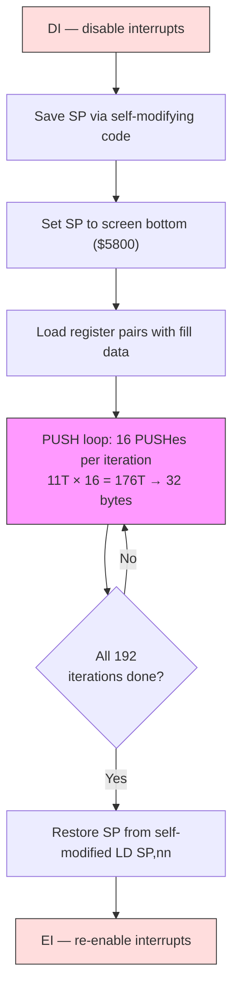

# Глава 3: Инструментарий демосценера

В каждом ремесле есть свой набор приёмов --- паттернов, к которым мастера тянутся настолько инстинктивно, что перестают воспринимать их как приёмы. Демосценер на Z80 тянется к техникам из этой главы.

Эти паттерны --- развёрнутые циклы, самомодифицирующийся код, стек как канал данных, LDI-цепочки, генерация кода и RET-цепочки --- встречаются практически в каждом эффекте, который мы будем строить во второй части. Именно они отличают демо, укладывающееся в один кадр, от демо, которому нужно три. Освой их здесь --- и ты будешь узнавать их повсюду.

---

## Развёрнутые циклы и самомодифицирующийся код

### Стоимость цикла

Рассмотрим простейший внутренний цикл: заполнение нулями 256 байт памяти.

```z80 id:ch03_the_cost_of_looping
; Looped version: clear 256 bytes at (HL)
    ld   b, 0            ; 7 T   (B=0 means 256 iterations)
    xor  a               ; 4 T
.loop:
    ld   (hl), a         ; 7 T
    inc  hl              ; 6 T
    djnz .loop           ; 13 T  (8 on last iteration)
```

Каждая итерация стоит 7 + 6 + 13 = 26 тактов на запись одного байта. Из них лишь 7 тактов делают полезную работу --- остальное накладные расходы. Это 73% впустую. На 256 байт: 256 x 26 - 5 = 6 651 такт. На машине с бюджетом 71 680 тактов на кадр эти потерянные такты ощутимы.

### Развёртка: размен RAM на скорость

Решение жёсткое и эффективное: выписать тело цикла N раз и убрать цикл.

```z80 id:ch03_unrolling_trade_ram_for_speed
; Unrolled version: clear 256 bytes at (HL)
    xor  a               ; 4 T
    ld   (hl), a         ; 7 T
    inc  hl              ; 6 T
    ld   (hl), a         ; 7 T
    inc  hl              ; 6 T
    ld   (hl), a         ; 7 T
    inc  hl              ; 6 T
    ; ... repeated 256 times total
```

Теперь каждый байт стоит 7 + 6 = 13 тактов. Нет DJNZ. Нет счётчика. Итого: 256 x 13 = 3 328 тактов --- вдвое меньше цикловой версии.

Цена --- размер кода: 256 повторений занимают 512 байт против 7 у цикла. Ты размениваешь RAM на скорость.

**Когда развёртывать:** Внутренние циклы, выполняющиеся тысячи раз за кадр --- очистка экрана, отрисовка спрайтов, копирование данных.

**Когда НЕ развёртывать:** Внешние циклы, выполняющиеся один-два раза за кадр. Экономия 5 тактов на 24 итерациях даёт 120 тактов --- меньше трёх NOP. Не стоит раздувания.

Практический компромисс --- *частичная развёртка*: развернуть 8 или 16 итераций внутри цикла, оставить DJNZ для внешнего счётчика. Пример `push_fill.a80` в каталоге `examples/` этой главы делает именно это: 16 PUSH за итерацию, 192 итерации.

### Самомодифицирующийся код: секретное оружие Z80

У Z80 нет кэша инструкций, нет буфера предвыборки, нет конвейера. Когда процессор считывает байт инструкции из ОЗУ, он читает то, что там находится *прямо сейчас*. Если ты изменил этот байт один цикл назад, процессор увидит новое значение. Это гарантированное свойство архитектуры.

Самомодифицирующийся код (SMC) означает запись в байты инструкций во время выполнения. Классический паттерн --- подмена непосредственного операнда:

```z80 id:ch03_self_modifying_code_the_z80_s
; Self-modifying code: fill with a runtime-determined value
    ld   a, (fill_value)       ; load the fill byte from somewhere
    ld   (patch + 1), a        ; overwrite the operand of the LD below
patch:
    ld   (hl), $00             ; this $00 gets replaced at runtime
    inc  hl
    ; ...
```

Инструкция `ld (patch + 1), a` записывает в непосредственный операнд следующей `ld (hl), $00`, превращая её в `ld (hl), $AA` или что угодно другое. Процессор выполняет те байты, которые находит. Вот несколько распространённых паттернов SMC:

**Подмена опкодов.** Можно заменить саму инструкцию. Нужен цикл, который иногда инкрементирует HL, а иногда декрементирует? Перед циклом запиши опкод INC HL ($23) или DEC HL ($2B) в байт инструкции. Внутри внутреннего цикла вообще нет ветвления --- нужная инструкция уже на месте. Сравни с подходом «ветвление на каждую итерацию», который стоил бы 12 тактов (JR NZ) на каждый пиксель.

**Сохранение и восстановление указателя стека.** Этот паттерн встречается постоянно при использовании PUSH-трюков (ниже):

```z80 id:ch03_self_modifying_code_the_z80_s_2
    ld   (restore_sp + 1), sp     ; save SP into the operand below
    ; ... do stack tricks ...
restore_sp:
    ld   sp, $0000                ; self-modified: the $0000 was overwritten
```

Инструкция `ld (nn), sp` сохраняет текущий SP прямо в операнд последующей `ld sp, nn`. Никаких временных переменных. Это идиоматический код демосцены на Z80.

### Самомодифицирующиеся переменные: паттерн `$+1`

Самый распространённый паттерн SMC на ZX Spectrum --- это не подмена опкодов и не сохранение SP, а встраивание *переменной* непосредственно в непосредственный операнд инструкции. Идея проста: вместо того чтобы хранить счётчик в именованной ячейке памяти и загружать его через `LD A,(nn)` за 13 тактов, ты позволяешь байту операнда самой инструкции *быть* переменной.

```z80 id:ch03_smc_dollar_plus_one
.smc_counter:
    ld   a, 0                    ; 7T — this 0 is the "variable"
    inc  a                       ; 4T
    ld   (.smc_counter + 1), a   ; 13T — write back to the operand byte
```

`ld a, 0` извлекает свой операнд как часть обычного декодирования инструкции --- всего 7 тактов, и значение уже в A. Сравни с загрузкой из отдельного адреса памяти: `ld a, (counter)` стоит 13 тактов, плюс тебе всё равно нужен отдельный `ld (counter), a` за 13 тактов для обратной записи. Версия с SMC читает переменную бесплатно (это часть выборки инструкции) и платит 13 тактов лишь однажды --- за обратную запись.

В sjasmplus можно поставить метку на `$+1`, чтобы дать встроенной переменной читаемое имя:

```z80 id:ch03_smc_named_variable
    ld   a, 0                    ; 7T
.scroll_pos EQU $ - 1           ; .scroll_pos names the operand byte above
    add  a, 4                   ; 7T — advance by 4 pixels
    ld   (.scroll_pos), a       ; 13T — store back into the operand
```

Этот паттерн встречается повсюду в коде для ZX Spectrum: позиции скроллинга, счётчики кадров анимации, аккумуляторы фаз эффектов, флаги направления. Любое однобайтовое значение, которое сохраняется между вызовами, --- кандидат. Ты будешь постоянно видеть его в частях II и V --- практически каждая процедура эффекта в этой книге использует как минимум одну самомодифицирующуюся переменную.

Принято именовать такие метки с префиксом `.smc_` или размещать их сразу после инструкции, которую они модифицируют. В любом случае намерение должно быть понятно каждому, кто читает исходный код. Как мы отмечали в главе 2, локальные метки (`.label`) предотвращают коллизии имён, когда несколько подпрограмм имеют собственные встроенные переменные.

**Предупреждение.** SMC безопасен на Z80, eZ80 и любом клоне Spectrum. Он *не безопасен* на современных процессорах с кэшем (x86, ARM) без явного сброса кэша инструкций. Если будешь портировать на другую архитектуру, это первое, что сломается.

---

## Стек как канал данных

### Почему PUSH --- самая быстрая запись на Z80

Инструкция PUSH записывает 2 байта в память и декрементирует SP, всё за 11 тактов. Сравним альтернативы записи данных по экранному адресу:

| Метод | Записано байт | Такты | Тактов на байт |
|--------|--------------|----------|-------------------|
| `ld (hl), a` + `inc hl` | 1 | 13 | 13,0 |
| `ld (hl), a` + `inc l` | 1 | 11 | 11,0 |
| `ldi` | 1 | 16 | 16,0 |
| `ldir` (за байт) | 1 | 21 | 21,0 |
| `push hl` | 2 | 11 | **5,5** |

PUSH записывает два байта за 11 тактов --- 5,5 такта на байт. Почти в 4 раза быстрее LDIR. Подвох: PUSH пишет туда, куда указывает SP, а SP --- это обычно твой стек. Чтобы использовать PUSH как канал данных, нужно перехватить указатель стека.

### Техника

Паттерн всегда один и тот же:

1. Запретить прерывания (DI). Если прерывание сработает, пока SP указывает на экран, процессор протолкнёт адрес возврата в пиксельные данные. Наступит хаос.
2. Сохранить SP. Использовать самомодифицирующийся код, чтобы спрятать его.
3. Установить SP в *конец* целевой области. Стек растёт вниз --- PUSH декрементирует SP перед записью. Поэтому если хочешь заполнить с $4000 до $57FF, установи SP в $5800.
4. Загрузить данные в регистровые пары и PUSHить многократно.
5. Восстановить SP и разрешить прерывания (EI).

<!-- figure: ch03_push_fill_pipeline -->



> **Почему PUSH выигрывает:** `LD (HL),A` + `INC HL` записывает 1 байт за 13T (13,0 T/байт). `PUSH HL` записывает 2 байта за 11T (**5,5 T/байт**) --- почти в 2,4 раза быстрее на байт. Цена: прерывания должны быть отключены, пока SP перехвачен.

Вот суть примера `push_fill.a80` из каталога `examples/` этой главы:

```z80 id:ch03_the_technique_2
stack_fill:
    di                          ; critical: no interrupts while SP is moved
    ld   (restore_sp + 1), sp   ; self-modifying: save SP

    ld   sp, SCREEN_END         ; SP points to end of screen ($5800)
    ld   hl, $AAAA              ; pattern to fill

    ld   b, 192                 ; 192 iterations x 16 PUSHes x 2 bytes = 6144
.loop:
    push hl                     ; 11 T  \
    push hl                     ; 11 T   |
    push hl                     ; 11 T   |
    push hl                     ; 11 T   |
    push hl                     ; 11 T   |
    push hl                     ; 11 T   |  16 PUSHes = 32 bytes
    push hl                     ; 11 T   |  = 176 T-states
    push hl                     ; 11 T   |
    push hl                     ; 11 T   |
    push hl                     ; 11 T   |
    push hl                     ; 11 T   |
    push hl                     ; 11 T   |
    push hl                     ; 11 T   |
    push hl                     ; 11 T   |
    push hl                     ; 11 T   |
    push hl                     ; 11 T  /
    djnz .loop                  ; 13 T (8 on last)

restore_sp:
    ld   sp, $0000              ; self-modified: restores original SP
    ei
    ret
```

Внутреннее тело из 16 PUSH записывает 32 байта за 176 тактов. Итого для всей пиксельной области в 6 144 байта: примерно 36 000 тактов. Сравни с LDIR: 6 144 x 21 - 5 = 129 019 тактов. Метод PUSH примерно в 3,6 раза быстрее --- разница между «укладывается в один кадр» и «вылезает в следующий».


### POP как быстрое чтение

PUSH --- самая быстрая запись, но POP --- самое быстрое *чтение*. POP загружает 2 байта из (SP) в регистровую пару за 10 тактов --- это 5,0 тактов на байт. Сравни альтернативы:

| Метод | Прочитано байт | Такты | Тактов на байт |
|--------|-----------|----------|-------------------|
| `ld a, (hl)` + `inc hl` | 1 | 13 | 13,0 |
| `ld a, (hl)` + `inc l` | 1 | 11 | 11,0 |
| `ldi` (как чтение+запись) | 1 | 16 | 16,0 |
| `pop hl` | 2 | 10 | **5,0** |

Паттерн: заранее строишь в памяти таблицу 16-битных значений, направляешь SP на начало таблицы и выполняешь POP в регистровые пары. Каждый POP продвигает SP на 2, автоматически проходя по таблице. Это дополнение к PUSH-трюку записи на стороне чтения.

Скомбинируй POP и PUSH --- и получишь быстрый конвейер «память-в-память»: POP значения из исходной таблицы (10T), при необходимости обработай регистровую пару, затем PUSH в место назначения (11T). Итого: 21 такт на 2 байта --- та же пропускная способность, что у LDIR, но с регистровой парой, доступной для обработки между чтением и записью. Ты можешь маскировать биты, прибавлять смещения, менять байты местами или применять любое преобразование «регистр-в-регистр» без дополнительных расходов на доступ к памяти. Этот конвейер POP-обработка-PUSH --- основа многих процедур скомпилированных спрайтов.

### Где используются PUSH-трюки

- **Очистка экрана.** Самое распространённое применение. Каждому демо нужно очищать экран между эффектами.
- **Скомпилированные спрайты.** Спрайт компилируется в последовательность инструкций PUSH с предзагруженными регистровыми парами. Максимально быстрый вывод спрайтов на Z80.
- **Быстрый вывод данных.** Когда нужно перебросить блок данных в непрерывный диапазон адресов: заливки атрибутов, копирования буферов, построение списков вывода.

Цена: прерывания выключены. Если музыкальный плеер работает через прерывание IM2, он пропустит удар во время длинной последовательности PUSH. Демо-кодеры планируют с учётом этого --- размещают PUSH-заливки во время бордюра или разбивают их на несколько кадров.

---

## LDI-цепочки

### LDI vs LDIR

LDI копирует один байт из (HL) в (DE), инкрементирует оба и декрементирует BC. LDIR делает то же самое, но повторяет до BC = 0. Разница --- тайминг:

| Инструкция | Такты | Примечания |
|-------------|----------|-------|
| LDI | 16 | Копирует 1 байт, всегда 16 T |
| LDIR (за байт) | 21 | Копирует 1 байт, возвращается назад. Последний байт: 16 T |

LDIR стоит на 5 тактов больше за байт из-за внутренней проверки зацикливания. Эти 5 тактов быстро накапливаются.

Для 256 байт:
- LDIR: 255 x 21 + 16 = 5 371 такт
- 256 x LDI: 256 x 16 = 4 096 тактов
- Экономия: 1 275 тактов (24%)

Цепочка из отдельных инструкций LDI --- это просто 256 повторений двухбайтового опкода `$ED $A0`. Это 512 байт кода ради 24% экономии --- тот же размен RAM на скорость, что и при развёртке циклов.

### Когда LDI-цепочки блистают

Оптимальный случай --- копирование блоков известного размера. Цепочка из 32 LDI экономит 160 тактов по сравнению с LDIR для строки спрайта. На 24 строках это 3 840 тактов за кадр.

Но настоящая мощь проявляется при комбинации LDI-цепочек с *арифметикой точек входа*. Если у тебя цепочка из 256 LDI и нужно скопировать только 100 байт, прыгай в цепочку на позицию 156. Никакого счётчика цикла, никакой настройки. Эта техника использована в хаотическом зумере Introspec'а в Eager (2015):

```z80 id:ch03_when_ldi_chains_shine
; Chaos zoomer inner loop (simplified from Eager)
; Each line copies a different number of bytes from a source buffer.
; Entry point into the LDI chain is calculated per line.
    ld   hl, source_data
    ld   de, dest_screen
    ; ... calculate entry point based on zoom factor ...
    jp   (ix)             ; jump into the LDI chain at the right point

ldi_chain:
    ldi                   ; byte 255
    ldi                   ; byte 254
    ldi                   ; byte 253
    ; ... 256 LDIs total ...
    ldi                   ; byte 0
    ; falls through to next line setup
```

Это копирование переменной длины с нулевыми накладными расходами за байт --- техника, которую принципиально невозможно реализовать с LDIR. Это одна из причин, почему LDI --- лучший друг в демосценовом коде.


---

## Битовые трюки: SBC A,A и компания

### `SBC A,A` как условная маска

После любой инструкции, устанавливающей флаг переноса, `SBC A,A` преобразует этот флаг в полный байт: $FF, если перенос был установлен, $00, если нет. Цена: 4 такта. Сравни с альтернативой на ветвлении --- `JR C,.set` / `LD A,0` / `JR .done` / `.set: LD A,$FF` / `.done:` --- которая стоит 17–22 такта в зависимости от пути, плюс нарушение конвейера из-за условного перехода.

Каноническое применение --- *раскрытие бита в байт*. Имея байт, где каждый бит представляет пиксель (пиксельный формат Spectrum), можно раскрыть каждый бит в полный байт атрибута:

```z80 id:ch03_sbc_bit_expand
    rlc  (hl)            ; rotate top bit into carry    — 15T
    sbc  a, a            ; A = $FF if set, $00 if not   — 4T
    and  $47             ; A = bright white ($47) or $00 — 7T
```

Три инструкции, 26 тактов, без ветвлений. Чтобы выбирать между двумя *произвольными* значениями, а не нулём и маской, используй паттерн `SBC A,A : AND mask : XOR base`. AND выбирает, какие биты различаются между двумя значениями, а XOR переключает их на нужную базу. Этот паттерн заменяет каждую проверку «если бит установлен, то значение A, иначе значение B» во внутренних циклах.

### `ADD A,A` vs `SLA A`

Обе инструкции сдвигают A влево на один бит. Но `ADD A,A` --- это 4 такта и 1 байт, тогда как `SLA A` --- 8 тактов и 2 байта. Нет ситуации, в которой SLA A предпочтительнее --- `ADD A,A` строго быстрее и компактнее. Аналогично, `ADD HL,HL` сдвигает HL влево за 11 тактов (1 байт), заменяя двухинструкционную последовательность `SLA L : RL H` за 16 тактов (4 байта). Для 16-битного сдвига влево во внутреннем цикле, выполняемом 192 раза за кадр, одна эта замена экономит 960 тактов --- более четырёх строк развёртки бордюрного времени.

Это не трюки. Это словарный запас. Точно так же, как свободно владеющий языком не останавливается, чтобы проспрягать обычный глагол, Z80-программист тянется к `ADD A,A` и `SBC A,A` без осознанных усилий. Если ты ловишь себя на том, что пишешь `SLA A` или условный переход для выбора между двумя значениями, остановись и возьми более короткую форму. Такты складываются.

---

## Генерация кода

### Генерация кода: написание программы, которая рисует

Всё вышеописанное --- фиксированные оптимизации: код работает одинаково в каждом кадре. Генерация кода идёт дальше: твоя программа пишет программу, которая рисует экран. Есть два варианта: офлайн (до ассемблирования) и рантайм (во время выполнения).

### Офлайн: генерация ассемблера из языка высокого уровня

Introspec использовал Processing (среду для творческого кодирования на Java) для генерации Z80-ассемблера хаотического зумера в Eager (2015). Хаотический зумер меняет масштаб каждый кадр --- разные исходные пиксели отображаются на разные экранные позиции. Вместо вычисления этих отображений в реальном времени скрипт Processing предвычислял каждое отображение и выдавал исходные файлы .a80, содержащие оптимизированные LDI-цепочки и инструкции LD.

Рабочий процесс: скрипт Processing вычисляет для каждого кадра, какой байт источника отображается на какой байт экрана. Он выдаёт исходный код Z80 --- последовательности `ld hl, source_addr` и `ldi` --- которые ассемблер (sjasmplus) собирает вместе с рукописным кодом движка. При выполнении движок просто вызывает предсгенерированный код для текущего кадра.

Это не «жульничество». Это фундаментальное понимание того, что разделение труда между временем компиляции и временем выполнения может полностью убрать ветвления, поиск и арифметику из внутреннего цикла. Скрипт Processing делает тяжёлую математику один раз, медленно, на современной машине. Z80 делает простую часть --- копирование байтов --- с максимально возможной скоростью.

### Рантайм: программа пишет машинный код во время выполнения

Иногда параметры меняются каждый кадр, и офлайн-генерации недостаточно. Процедура отображения сферы в Illusion от X-Trade (ENLiGHT'96) генерирует машинный код в буфер ОЗУ в реальном времени. Геометрия сферы меняется при вращении --- разным пикселям нужны разные расстояния пропуска. Перед каждым кадром движок эмитирует байты опкодов в буфер, а затем исполняет их:

```z80 id:ch03_runtime_the_program_writes
; Runtime code generation (conceptual, simplified from Illusion)
; Generate an unrolled rendering loop for this frame's sphere slice

    ld   hl, code_buffer
    ld   de, sphere_table       ; per-frame skip distances

    ld   b, SPHERE_WIDTH
.gen_loop:
    ld   a, (de)                ; load skip distance for this pixel
    inc  de

    ; Emit: ld a, (hl) -- opcode $7E
    ld   (hl), $7E
    inc  hl

    ; Emit: add a, N   -- opcodes $C6, N
    ld   (hl), $C6
    inc  hl
    ld   (hl), a                ; the skip distance, as immediate operand
    inc  hl

    djnz .gen_loop

    ; Emit: ret -- opcode $C9
    ld   (hl), $C9

    ; Now execute the generated code
    call code_buffer
```

Сгенерированный код --- линейная последовательность без ветвлений, без поиска, без накладных расходов цикла, но это *разный код каждый кадр*. Вместо «if pixel_skip == 3 then...» по 12 тактов на ветвление ты эмитируешь точно нужные инструкции и исполняешь их без ветвлений.

### Стоимость генерации

Генерация кода во время выполнения не бесплатна. Посмотри на цикл генератора выше: на каждую эмитированную инструкцию нужно загрузить байт опкода, записать его, продвинуть указатель и, возможно, загрузить операнд --- примерно 30–50 тактов на эмитированный байт, в зависимости от сложности. Примем ~40 тактов в среднем. Для сгенерированной процедуры из 100 байт инструкций это около 4 000 тактов накладных расходов на генерацию.

Точка безубыточности: генерация окупается, когда сгенерированный код выполняется более одного раза за кадр, или когда он заменяет логику ветвления, которая стоит дороже самой генерации. В сферическом маппере Illusion каждый сгенерированный проход рендеринга выполняется один раз за кадр --- но он заменяет попиксельные условные переходы, которые стоили бы куда дороже. Alone Coder документировал аналогичный компромисс в своём движке вращения: генерация последовательности инструкций INC H/INC L для пошагового прохода по координатам стоит примерно 5 000 тактов на эмиссию, но устраняет координатную арифметику, которая обошлась бы примерно в 146 000 тактов при инлайн-вычислении. Накладные расходы генерации --- менее 4% от стоимости, которую она заменяет.

Эмпирическое правило: если ты обнаруживаешь, что пишешь цикл с ветвлениями, выбирающими между разными последовательностями инструкций на основе попиксельных или построчных данных, этот цикл --- кандидат на генерацию кода. Эмитируй правильные инструкции один раз, выполни их без ветвлений и перегенерируй только при изменении параметров.

**Когда генерировать код:** Если одни и те же операции выполняются каждый кадр и меняются только данные, самомодифицирующегося кода (подмены операндов) достаточно. Если меняется *структура* --- разное число итераций, разные последовательности инструкций --- генерируй код. Если вариации можно предвычислить на современной машине, предпочитай офлайн-генерацию: она отлаживаема, верифицируема и не стоит ничего в рантайме. Рантайм-генерация окупается, когда сгенерированный код выполняется гораздо чаще, чем стоит его генерация.

---

## RET-цепочки

### Превращение стека в таблицу диспетчеризации

В 2025 году DenisGrachev опубликовал на Hype технику, разработанную для его игры Dice Legends. Задача: отрисовка тайлового игрового поля требует вывода десятков тайлов за кадр. Наивный подход использует CALL:

```z80 id:ch03_turning_the_stack_into_a
; Naive approach: call each tile renderer
    call draw_tile_0
    call draw_tile_1
    call draw_tile_2
    ; ...
```

Каждый CALL стоит 17 тактов. Для игрового поля 30 x 18 (540 тайлов) это 9 180 тактов только на диспетчеризацию.

Идея DenisGrachev'а: установить SP на *список рендеринга* --- таблицу адресов --- и завершать каждую процедуру отрисовки тайла инструкцией RET. RET извлекает 2 байта из (SP) в PC. Если SP указывает на твой список рендеринга, RET не возвращается к вызывающему --- он переходит к следующей процедуре в списке.

```z80 id:ch03_turning_the_stack_into_a_2
; RET-chaining: zero call overhead
    di
    ld   (restore_sp + 1), sp   ; save SP
    ld   sp, render_list        ; SP points to our dispatch table

    ; "Call" the first tile routine by falling into it or using RET:
    ret                         ; pops first address from render_list

; Each tile routine ends with:
draw_tile_N:
    ; ... draw the tile ...
    ret                         ; pops NEXT address from render_list

; The render list is a sequence of addresses:
render_list:
    dw   draw_tile_42           ; first tile to draw
    dw   draw_tile_7            ; second tile
    dw   draw_tile_42           ; third tile (same tile type, different position)
    ; ... one entry per tile on screen ...
    dw   render_done            ; sentinel: address of cleanup code

render_done:
restore_sp:
    ld   sp, $0000              ; self-modified: restore SP
    ei
```

Теперь каждая диспетчеризация стоит 10 тактов (RET) вместо 17 (CALL). Для 540 тайлов: экономия 3 780 тактов. Но настоящий выигрыш --- бесплатная диспетчеризация: каждая запись может указывать на разную процедуру (широкий тайл, пустой тайл, анимированный тайл). Никакой таблицы переходов, никакого косвенного вызова. Список рендеринга *и есть* программа.

### Три стратегии для списка рендеринга

DenisGrachev исследовал три подхода к построению списка рендеринга:

1. **Карта как список рендеринга.** Тайловая карта сама является списком рендеринга: каждая ячейка содержит адрес процедуры отрисовки для данного типа тайла. Просто, но негибко --- смена тайла означает перезапись 2 байт в карте.

2. **Сегменты на основе адресов.** Экран делится на сегменты. Список рендеринга каждого сегмента --- блок адресов, скопированный из мастер-таблицы. Смена тайлов --- копирование нового блока адресов.

3. **Байтовый подход с 256-байтовыми таблицами поиска.** Каждый тип тайла --- один байт (индекс тайла). 256-байтовая таблица поиска отображает индексы тайлов в адреса процедур. Список рендеринга строится проходом по байтам тайловой карты с поиском каждого адреса. Этот подход DenisGrachev выбрал для Dice Legends.

Используя байтовый подход, он расширил игровое поле с 26 x 15 тайлов (предел предыдущего движка) до 30 x 18 тайлов, сохраняя целевую частоту кадров. Экономия от устранения накладных расходов CALL в сочетании с бесплатной диспетчеризацией освободила достаточно тактов для рендеринга на 40% больше тайлов.

### Компромиссы

Как и все стековые трюки, прерывания должны быть запрещены, пока SP перехвачен. Каждая процедура тайла должна быть самодостаточной --- заканчиваться RET и не использовать CALL, поскольку настоящий стек недоступен. На практике процедуры тайлов достаточно коротки, чтобы это не было ограничением.

---

## Врезка: «Код мёртв» (Introspec, 2015)

В январе 2015 года Introspec опубликовал на Hype короткое, провокационное эссе «Код мёртв» (Kod myortv). Аргумент проводит параллель с «Смертью автора» Ролана Барта: подобно тому как Барт утверждал, что смысл текста принадлежит читателю, а не автору, Introspec утверждает, что демо-код по-настоящему живёт только тогда, когда кто-то его читает --- в отладчике, в листинге дизассемблера, в исходниках, расшаренных на форуме.

Неудобная правда: современные демо потребляются как визуальный контент. Люди смотрят их на YouTube. Голосуют на Pouet по видеозаписям. Никто не видит внутренние циклы. Блестящая оптимизация, экономящая 3 такта на пиксель, невидима для 99% аудитории. «Писать код чисто ради него самого», --- написал Introspec, --- «потеряло актуальность».

И всё же.

Ты читаешь эту книгу. Мы открываем отладчик. Мы считаем такты. Мы заглядываем внутрь. Техники в этой главе --- не музейные экспонаты. Это живые инструменты, и то, что большинство людей их никогда не увидит, не умаляет их мастерства.

Эссе Introspec'а --- это вызов, а не капитуляция. После него он опубликовал одни из самых детальных технических анализов, которые ZX-сцена когда-либо видела --- включая разбор Illusion и бенчмарки компрессии, упоминаемые на протяжении всей этой книги. Код может быть мёртв для зрителя YouTube. Но для читателя с дизассемблером и пытливым умом он очень даже жив.

---

## Собираем всё вместе

Техники в этой главе не независимы. На практике они комбинируются:

- **Очистка экрана** сочетает *развёрнутые циклы* с *PUSH-трюками*: частично развёрнутый цикл из 16 PUSH за итерацию, с SP, перехваченным через *самомодифицирующийся код*.
- **Скомпилированные спрайты** сочетают *генерацию кода* (каждый спрайт компилируется в исполняемый код), *чтение через POP* и *вывод через PUSH* (самый быстрый способ перемещать пиксельные данные через регистры), *битовые трюки* (SBC A,A для раскрытия маски) и *самомодификацию* (подмена экранных адресов каждый кадр).
- **Тайловые движки** сочетают *RET-цепочки* для диспетчеризации с *LDI-цепочками* внутри каждой процедуры тайла для быстрого копирования данных.
- **Хаотические зумеры** сочетают *офлайн-генерацию кода* (скрипты Processing, эмитирующие ассемблер) с *LDI-цепочками* (сгенерированный код --- в основном последовательности LDI) и *самомодификацией* (подмена адресов источника каждый кадр).
- **Атрибутные эффекты** сочетают *чтение через POP* из предвычисленных таблиц с *битовыми трюками* (SBC A,A для раскрытия битовых масок в цветовые значения) и *записью через PUSH* для быстрого вывода атрибутов.

Общая нить: каждая техника убирает что-то из внутреннего цикла. Развёртка убирает счётчик цикла. Самомодификация убирает ветвления. PUSH убирает побайтовые накладные расходы на запись. POP убирает побайтовые накладные расходы на чтение. LDI-цепочки убирают штраф повтора LDIR. Битовые трюки убирают условные ветвления. Генерация кода убирает само различие между кодом и данными. RET-цепочки убирают накладные расходы CALL.

Z80 работает на 3,5 МГц. У тебя 71 680 тактов на кадр. Каждый такт, который ты сэкономишь во внутреннем цикле --- это такт, который можно потратить на больше пикселей, больше цветов, больше движения. Инструментарий этой главы --- вот как туда добраться.

В последующих главах ты увидишь каждую из этих техник в работе в реальных демо --- текстурированная сфера Illusion, атрибутный туннель Eager, мультиколорный движок Old Tower. Цель этой главы --- дать тебе словарь. Теперь посмотрим, что мастера с ним построили.

---

## Попробуй сам

1. **Измерь разницу.** Возьми тестовую обвязку из главы 1 и измерь три версии заполнения 256 байт: (a) цикл `ld (hl), a : inc hl : djnz`, (b) полностью развёрнутая `ld (hl), a : inc hl` x 256, и (c) PUSH-заливка из `examples/push_fill.a80`. Сравни ширину бордюрных полос. Полоса PUSH-версии должна быть заметно короче.

2. **Построй самомодифицирующуюся очистку.** Напиши процедуру очистки экрана, принимающую паттерн заливки как параметр и подставляющую его в PUSH-цикл заливки через самомодифицирующийся код. Вызови её дважды с разными паттернами и наблюдай, как экран чередуется.

3. **Замерь LDI-цепочку.** Напиши 32-байтовое копирование с помощью LDIR и другое с помощью 32 x LDI. Измерь оба бордюрным методом. LDI-цепочка должна сэкономить 160 тактов --- это заметно, если запускать копирование в тесном цикле.

4. **Поэкспериментируй с точками входа.** Построй LDI-цепочку из 128 записей и маленькую процедуру, вычисляющую точку входа по значению в регистре A (0--128). Прыгай в цепочку в разных точках. Это упрощённая версия копирования переменной длины, используемого в настоящих хаотических зумерах.

5. **Копировщик переменной длины с вычисляемой точкой входа.** Построй LDI-цепочку из 256 элементов и фронтенд, принимающий количество байт в регистре B (1–256). Вычисли точку входа: каждый LDI занимает 2 байта, значит смещение равно (256 - B) x 2 от начала цепочки. Прибавь его к базовому адресу цепочки, затем JP (HL) в неё. Оберни всё это в тестовую обвязку с цветом бордюра и сравни ширину полосы с LDIR для того же количества байт. Для малых значений (менее 16) разница невелика. Для значений выше 64 LDI-цепочка заметно вырывается вперёд.

6. **Распаковщик бита в атрибут.** Напиши подпрограмму, которая читает байт из (HL), вращает каждый бит наружу через RLC (HL) и использует `SBC A,A : AND $47` для раскрытия каждого бита в байт атрибута (ярко-белый или чёрный). Сохрани 8 результирующих байт атрибутов в буфер назначения через (DE) / INC DE. Это зародыш записи атрибутов скомпилированного спрайта --- в следующих главах ты увидишь, как этот паттерн генерирует целые спрайтовые процедуры.

> **Источники:** DenisGrachev «Tiles and RET» (Hype, 2025); Introspec «Making of Eager» (Hype, 2015); Introspec «Technical Analysis of Illusion» (Hype, 2017); Introspec «Код мёртв» (Hype, 2015)
