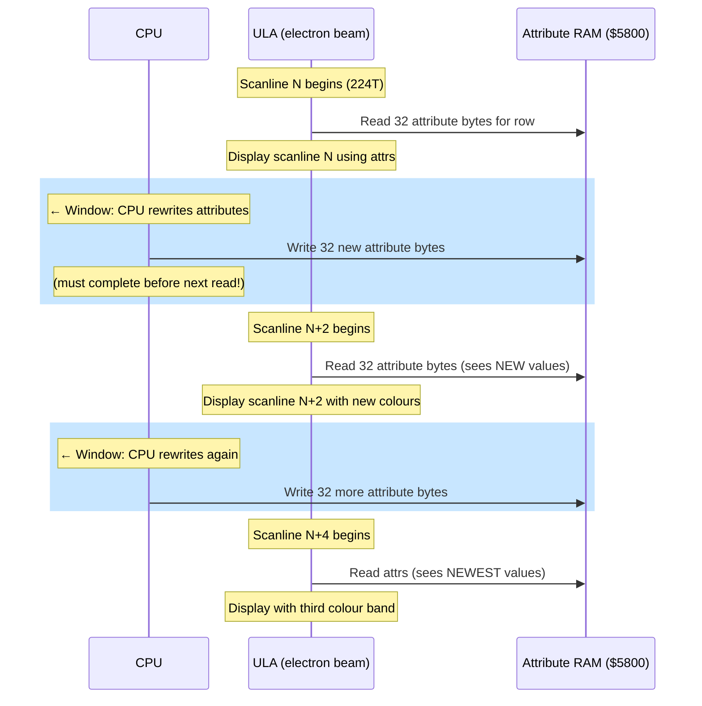

# Глава 8: Мультиколор --- Преодоление атрибутной сетки

> *«Мультиколор будет побеждён.»*
> --- DenisGrachev, Hype, 2019

---

Каждый кодер ZX Spectrum знает правило. Два цвета на ячейку 8x8. Ink и paper. Вот что даёт ULA, и это всё, что она даёт. Если у твоего персонажа красная шапка и синее пальто и два цвета попадают в одну атрибутную ячейку, один из них проигрывает. Результат --- кричащая окантовка, ошибочно окрашенные спрайты, персонажи, меняющие цвет при движении мимо декораций --- это конфликт атрибутов, и он является определяющим визуальным ограничением платформы.

Конфликт атрибутов настолько фундаментален для идентичности Spectrum, что многие кодеры просто принимают его. Они проектируют вокруг него. Подбирают палитры для его минимизации. Ограничивают размеры спрайтов или избегают определённых цветовых сочетаний. Тридцать лет сетка 8x8 была фактом жизни.

Но ULA не знает этого.

ULA читает байты атрибутов по мере отрисовки экрана, строка развёртки за строкой. Она не читает все 768 байт атрибутов сразу. Она читает каждую строку из 32 атрибутов именно тогда, когда они ей нужны, восемь строк развёртки спустя читает ту же строку снова для следующей пиксельной линии внутри символьной строки, и так далее. Атрибут для любой ячейки читается восемь раз за кадр --- по одному разу на каждую пиксельную строку в этой ячейке.

Трюк очевиден, как только его увидишь: если изменить байт атрибута между чтениями, ULA применит другой цвет к разным пиксельным строкам внутри одной ячейки. Вместо двух цветов на все восемь строк получаешь два цвета на *группу строк*. Сетка 8x8 ломается не потому, что оборудование перепроектировали. Она ломается потому, что ты перезаписал данные быстрее, чем оборудование могло их потребить.

Это мультиколор. Он известен как минимум с начала 2000-х, когда российский ZX-журнал Black Crow опубликовал алгоритм и пример кода в пятом выпуске. Но годами мультиколор оставался диковинкой --- впечатляющей в демо, непрактичной в играх, потому что процессор тратил столько тактов на смену атрибутов, что ничего не оставалось на игровую логику.


А потом DenisGrachev придумал, как делать с этим игры.

---

## Точка зрения ULA

Чтобы понять мультиколор, нужно увидеть экран с точки зрения ULA.

ULA рисует 192 видимые строки развёртки за кадр, сверху вниз. Каждая строка занимает 224 такта (T-state) (на Pentagon). Для каждой строки ULA читает 32 пиксельных байта и 32 байта атрибутов из памяти. Пиксельные байты определяют, какие точки -- ink, а какие -- paper. Байты атрибутов определяют, какими цветами на самом деле являются «ink» и «paper».

Внутри символьной строки (8 пиксельных линий) ULA читает одни и те же 32 байта атрибутов для каждой строки развёртки. Она не кэширует их --- читает заново каждый раз. Это означает окно возможности между чтением атрибутов одной строки и следующей для изменения данных атрибутов.

«Традиционный» подход к мультиколору использует это напрямую. После HALT (который синхронизирует процессор с кадровым прерыванием) ты считаешь такты, чтобы знать точно, когда ULA прочитает каждую строку атрибутов. Затем, в промежутке между чтениями, перезаписываешь байты атрибутов новыми значениями. Когда ULA прочитает их для следующей строки, она увидит новые цвета.

Ограничение жёсткое: точный подсчёт тактов, изменение 32 байт между строками, затем ожидание следующей возможности. Процессор проводит почти всё время на этой бухгалтерии. В типичном традиционном мультиколорном движке можно менять атрибуты каждые 2 или 4 строки, давая цветовое разрешение 8x2 или 8x4. Но бюджет тактов, потреблённый кодом смены атрибутов, не оставляет почти ничего для игровой логики, рендеринга спрайтов или звука.

Поэтому мультиколор оставался в демо. Демо могут позволить себе тратить 100% процессора на визуальные эффекты. Игры --- нет.

---

## Прозрение LDPUSH

В январе 2019 года DenisGrachev опубликовал статью на Hype под названием «Мультиколор будет побеждён» (Mul'tikolor budet pobezhdon). Заголовок был заявлением о намерениях. Он разрабатывал Old Tower, игру для ZX Spectrum с мультиколором 8x2 --- атрибуты меняются каждые две пиксельные строки --- и хотел объяснить, как он решил проблему бюджета тактов, делавшую мультиколор непрактичным в играх.

Ключевая идея из тех, что кажутся неизбежными задним числом: код, выводящий пиксельные данные, *сам является* дисплейным буфером.

Традиционный мультиколор разделяет код и данные. Где-то в памяти есть буфер байтов атрибутов и рендерящий код, копирующий их на экран в нужный момент. Техника DenisGrachev'а сливает их воедино. «Буфер» --- это последовательность Z80-инструкций --- а именно, `LD DE,nn`, за которым следует `PUSH DE` --- и исполнение этих инструкций записывает дисплейные данные непосредственно в экранную память через указатель стека.

Вот как это работает.

### LD DE,nn / PUSH DE

Инструкция `LD DE,nn` загружает 16-битное непосредственное значение в регистровую пару DE. Она занимает 10 тактов и имеет длину 3 байта: байт опкода `$11`, за ним два байта данных (загружаемое значение, младший байт первым). Инструкция `PUSH DE` уменьшает SP на 1, записывает старший байт DE, снова уменьшает SP на 1, затем записывает младший байт. Результат: SP оказывается на 2 ниже, старший байт --- по старшему адресу, младший байт --- по младшему адресу. Она занимает 11 тактов.

Вместе `LD DE,nn : PUSH DE` стоят 21 такт, занимают 4 байта и записывают 2 байта данных на экран. «Данные» --- это непосредственный операнд инструкции LD. Чтобы изменить то, что рисуется, ты не перезаписываешь дисплейный буфер --- ты патчишь байты операнда внутри самих инструкций LD.

```z80 id:ch08_ld_de_nn_push_de
; One LDPUSH pair: writes 2 bytes to screen memory
    ld   de,$AA55       ; 10 T  load pixel data
    push de             ; 11 T  write to (SP), SP = SP - 2
                        ; ---
                        ; 21 T total, 2 bytes output
```

Строка развёртки пиксельных данных --- 32 байта в ширину. Но нельзя заполнить все 32 байта одним PUSH, потому что PUSH пишет вниз (SP декрементируется), а данные должны появляться слева направо на экране. Раскладка экранной памяти Spectrum справляется с этим: в пределах одной строки развёртки последовательные байты находятся по возрастающим адресам. PUSH пишет по убывающим адресам. Поэтому данные выходят наоборот --- последний записанный байт оказывается по наименьшему адресу, что соответствует самому левому байту на экране.

Это значит, что LDPUSH-последовательность строится в обратном порядке отображения. Первая `LD DE,nn : PUSH DE` в коде записывает два самых правых байта строки. Последняя записывает два самых левых. При исполнении push'ы заполняют строку справа налево.

### Сколько помещается в строку развёртки?

DenisGrachev не заполняет все 32 байта. Движок GLUF (который приводит в действие Old Tower и другие игры) использует игровую область шириной 24 символа, обрамлённую бордюрами с каждой стороны. Это 24 байта на строку развёртки в игровой области.

При 4 байтах кода на 2 байта вывода нужно 48 байт кода для заполнения 24 байт экрана. Но есть дополнительный байт на начальную `LD SP,nn` и смену атрибутов между группами строк. DenisGrachev сообщает о 51 байте на строку сгенерированного кода.

Красота подхода: нет отдельного прохода рендеринга. Инструкции, заполняющие экран, ЯВЛЯЮТСЯ исполнимым кодом. Когда нужно обновить тайл или спрайт, ты патчишь непосредственные операнды инструкций LD. Когда дисплейный код выполняется, он выводит пропатченные данные. Код --- это данные. Данные --- это код.

### Указатель стека как курсор

При исполнении SP указывает на правый край текущей строки развёртки в экранной памяти. Каждый PUSH записывает 2 байта и уменьшает SP на 2, перемещая «курсор записи» влево по строке. В конце вывода одной строки SP указывает на левый край. Затем код корректирует SP на правый край следующей строки и повторяет.

Фундаментальное ограничение: прерывания должны быть отключены, пока SP перехвачен. Если бы прерывание сработало, процессор записал бы адрес возврата в экранную память, повредив изображение. Это значит, что код мультиколорного рендеринга выполняется с `DI` и повторно включает прерывания через `EI` только после восстановления SP в настоящий стек. Весь проход рендеринга --- все 192 видимые строки --- происходит в одном непрерываемом блоке.

---

## Движок GLUF: мультиколор в настоящей игре

Old Tower была доказательством концепции. GLUF (игровой фреймворк DenisGrachev'а) стал продакшн-движком. Вот цифры:

| Параметр | Значение |
|-----------|-------|
| Разрешение мультиколора | 8x2 (атрибуты меняются каждые 2 пиксельные строки) |
| Игровая область | 24x16 символов (192x128 пикселей) |
| Буферизация | Двойная (два набора дисплейного кода) |
| Размер спрайта | 16x16 пикселей |
| Размер тайла | 16x16 пикселей |
| Звук | 25 Гц (каждый второй кадр) |
| Тактов на кадр | ~70 000 (почти весь бюджет Pentagon) |

Разрешение 8x2 означает, что движок меняет атрибуты четыре раза на символьную строку вместо одного. Каждая символьная строка содержит 8 строк развёртки; смена атрибутов каждые 2 строки даёт четыре различные цветовые полосы внутри одной символьной ячейки. Символ, обычно ограниченный ink-на-paper, внезапно получает до восьми цветов (два на полосу, четыре полосы). На практике эффект разителен --- спрайты и тайлы показывают куда больше цветовых деталей, чем архитектура Spectrum была рассчитана обеспечить.

### Двойная буферизация

GLUF поддерживает два полных набора LDPUSH-дисплейного кода. Пока один набор исполняется (рисуя текущий кадр), другой патчится новыми данными тайлов и спрайтов для следующего кадра. Это устраняет мерцание, которое возникло бы при модификации дисплейного кода во время его исполнения.

Цена --- память. Каждый набор дисплейного кода покрывает игровую область 24x16 символов по 51 байту на строку, умноженных на 128 строк: примерно 6 500 байт на буфер. Два буфера потребляют около 13 000 байт. На 128K Spectrum с банковой памятью это управляемо, но значительно --- требуется тщательное планирование памяти для остальных ресурсов игры.

### Двухкадровая архитектура

Вот где инженерия становится жёсткой. GLUF не рендерит полный кадр каждую 1/50 секунды. Он использует двухкадровую архитектуру:

**Кадр 1:** Сменить атрибуты для мультиколорного эффекта, затем отрендерить столько тайлов, сколько возможно, в буфер дисплейного кода. Смена атрибутов --- критичная по времени часть; она должна произойти в точно правильный момент относительно луча развёртки.

**Кадр 2:** Закончить рендеринг оставшихся тайлов, затем наложить спрайты на буфер дисплейного кода.

Разделение необходимо, потому что объём работы просто не влезает в один кадр. Рендеринг тайлов в LDPUSH-буфер означает патчинг байтов операндов внутри дисплейного кода --- для каждого пикселя тайла ты вычисляешь, на какую инструкцию LD он влияет, и записываешь новое значение в правильное байтовое смещение. Это не простое блочное копирование. Чередующаяся структура дисплейного кода (опкод-данные-данные-опкод-данные-данные...) означает, что рендеринг тайлов включает разрозненные записи, а не последовательные.

Общий бюджет рендеринга --- примерно 70 000 тактов на кадр --- почти весь бюджет Pentagon в 71 680. Что остаётся, едва хватает на игровую логику, обработку ввода и периодическое обновление звука.

Звук работает на 25 Гц вместо 50. Каждый второй кадр движок полностью пропускает обновление звука, чтобы вернуть эти такты на рендеринг. Игрок не замечает половинную частоту обновления для простых звуковых эффектов. Для музыки частота 25 Гц означает, что каждая нота длится вдвое больше кадров, что требует написания музыкального движка специально под это ограничение.

### Что видит игрок

Игрок не видит ничего из этого. Он видит скролл-игру с большим количеством цветов, чем должен иметь Spectrum. Спрайты перемещаются поверх декораций без обычного конфликта атрибутов. Тайлы показывают затенение, текстуру и многоцветные детали, невозможные со стандартными атрибутами 8x8. Игра ощущается так, будто принадлежит более мощной платформе.

Именно это убедительно демонстрирует работа DenisGrachev'а: мультиколор --- не демо-трюк. Это техника игрового движка. Инженерия экстремальна --- двойные буферы, двухкадровый рендеринг, звук на 25 Гц --- но результат --- играбельная игра с визуалом, действительно ломающим воспринимаемые пределы Spectrum.


---

## Ringo: мультиколор другого рода

В декабре 2022 года DenisGrachev опубликовал вторую статью на Hype: «Ringo Render 64x48». Если GLUF расширил атрибутную сетку до 8x2, то Ringo вообще отбросил её и построил нечто более близкое к чанки-пиксельному фреймбуферу с поточечным цветом.

Подход концептуально прост и технически изощрён.

### Паттерн 11110000b

Заполни каждый пиксельный байт экранной памяти значением `$F0` --- двоичное `11110000`. Левые четыре пикселя каждого байта установлены (цвет ink), правые четыре --- сброшены (цвет paper). Теперь, если изменить атрибут этой ячейки, левая половина отобразит цвет ink, а правая --- цвет paper. Одна ячейка шириной 8 пикселей показывает два различных цвета бок о бок.

Со стандартными атрибутами 8x8 это даёт сетку 64x24 независимо окрашенных «пикселей», каждый шириной 4 реальных пикселя и высотой 8. Неплохо, но не революционно.

### Переключение двух экранов

Трюк, делающий Ringo работающим: ZX Spectrum 128K имеет два экранных буфера. Экран 0 находится по адресу `$4000`, Экран 1 --- по адресу `$C000` (в банке 7). Один `OUT` в порт `$7FFD` переключает, какой экран отображает ULA.

Ringo подготавливает оба экрана с паттерном `11110000b`, но с *разными* атрибутами на каждом экране. Затем он переключается между двумя экранами каждые 4 строки развёртки. Эффект: внутри каждой символьной строки высотой 8 пикселей верхние 4 строки показывают атрибуты Экрана 0, а нижние 4 --- атрибуты Экрана 1. Каждая половина может задавать независимые цвета ink и paper.

В сочетании с пиксельным паттерном `11110000b` это даёт:

- 2 цветовых столбца на символьную ячейку (левые 4 пикселя = ink, правые 4 = paper)
- 2 цветовые строки на символьную ячейку (верхние 4 строки развёртки от Экрана 0, нижние 4 от Экрана 1)
- Итого: 4 независимо окрашенные субъячейки на ячейку 8x8

По всему экрану: 64 столбца x 48 строк = **3 072 независимо окрашенных пикселя**, каждый размером 4x4 реальных пикселя. Эффективное разрешение 64x48 с полным поточечным цветом из 15-цветной палитры Spectrum.


Это принципиально другой подход по сравнению с мультиколором GLUF 8x2. GLUF меняет атрибуты синхронно с лучом, требуя точного тайминга и потребляя огромные бюджеты тактов. Ringo использует аппаратное переключение двух экранов, требующее лишь одной инструкции `OUT` каждые 4 строки развёртки. Накладные расходы процессора на само переключение экранов минимальны.

### Куда уходят такты

Дешёвое переключение экранов означает больше тактов для игровой логики. Но рендеринг в два экрана одновременно не бесплатен. Каждое обновление тайла и спрайта должно быть записано и в Экран 0, и в Экран 1, потому что игрок видит композицию обоих.

Спрайты Ringo --- 12x10 «пикселей» в сетке 64x48, что означает 12 байт атрибутов в ширину и 10 атрибутных строк в высоту (разделённых между двумя экранами). Каждый спрайт занимает 120 байт данных. Рендеринг спрайтов использует макросы с фиксированным числом тактов --- последовательности инструкций с известным, постоянным временем исполнения, критичные для поддержания синхронизации с переключением экранов.

Рендеринг тайлов сложнее. DenisGrachev предгенерирует код рендеринга тайлов в страницы памяти, используя паттерны `pop af : or (hl)`:

```z80 id:ch08_where_the_t_states_go
; Tile rendering fragment (conceptual)
    pop  af             ; 10 T  load tile data from stack-based source
    or   (hl)           ;  7 T  combine with existing screen data
    ld   (hl),a         ;  7 T  write back
    inc  l              ;  4 T  next attribute column
                        ; ---
                        ; 28 T per attribute byte
```

`pop af` --- стековый трюк: данные тайла организованы как таблица в стековом формате в памяти. SP указывает на данные тайла, и POP читает два байта за раз. `or (hl)` комбинирует цвет тайла с тем, что уже есть на экране, позволяя прозрачные тайлы и слоёные фоны.

### Горизонтальный скроллинг

Ringo реализует горизонтальный скроллинг со смещением в полсимвола. Поскольку каждый «пиксель» в сетке 64x48 имеет ширину 4 реальных пикселя, скроллинг на один «пиксель» означает сдвиг паттерна `11110000b` на 4 бита. Но паттерн фиксирован --- его нельзя легко сдвинуть, не нарушив цветовой трюк.

Вместо этого DenisGrachev скроллит, перемещая данные атрибутов. Скролл на один пиксель сдвигает все атрибуты на один столбец влево или вправо и рисует новый столбец на краю. Поскольку меняются только атрибуты (пиксельный паттерн остаётся фиксированным `$F0`), скролл --- это просто блочное копирование байтов атрибутов. Для сетки 64x48 это 48 байт на смещение столбца (один байт на строку), куда дешевле пиксельного скроллинга.

Для суб-«пиксельного» скроллинга --- плавного движения в пределах 4-пиксельного столбца --- DenisGrachev чередует `$F0` и `$E0` (или аналогичные сдвинутые паттерны) в пиксельных данных. Это требует больше бухгалтерии, но достигает смещения в полсимвола, создавая иллюзию горизонтального разрешения в 128 столбцов.

---

## Традиционный мультиколор: подход на прерываниях

Прежде чем перейти к практике, стоит разобраться в «классическом» подходе, который GLUF и Ringo вытеснили. Традиционный мультиколор концептуально прост: менять атрибуты в точно нужный момент, и ULA отобразит разные цвета на разных строках развёртки.

Техника работает так:

1. Выполнить `HALT` для синхронизации с кадровым прерыванием. После HALT процессор находится в известной позиции по тактам относительно начала отображения.

2. Считать такты от HALT. ULA читает каждую строку из 32 атрибутов в известный момент каждой строки развёртки. Дополняя `NOP`'ами или другими инструкциями известной длины, ты можешь расположить свой код в точно нужный момент.

3. В точный такт, когда ULA закончила читать атрибуты текущей строки (но до того, как прочитает их для следующей), перезаписать 32 байта атрибутов новыми значениями.

4. Подождать, пока ULA прочитает новые значения, затем перезаписать снова для следующей смены.

Тайминг жёсток. Каждая строка развёртки занимает 224 такта на Pentagon. ULA читает 32 байта атрибутов в начале каждой строки, и процессор должен изменить все 32 байта в промежутке до следующего чтения. С `LD (HL),A : INC L` по 11 тактов на байт запись 32 байт занимает 352 такта --- больше одной целой строки развёртки. Нельзя менять каждую строку. В лучшем случае можно менять каждую вторую (разрешение 8x2), если использовать самый быстрый метод вывода (на основе PUSH), и даже тогда допуски по таймингу бритвенно тонки.

<!-- figure: ch08_multicolor_beam_racing -->



> **Гонка:** При 224 тактах на строку развёртки запись 32 байтов через `LD (HL),A : INC L` стоит 352T --- больше одной строки развёртки. Именно поэтому разрешение 8x2 (смена каждые 2 строки развёртки) --- практический предел при программной перезаписи атрибутов, и именно поэтому LDPUSH объединяет вывод пикселей и атрибутов, чтобы избежать отдельного прохода по атрибутам.

Практический результат: традиционный мультиколор потребляет 80–90% процессора на управление атрибутами. В демо, где мультиколор *и есть* эффект, это приемлемо. В игре --- летально. На игровую логику, определение коллизий или звук тактов не остаётся.

Техника LDPUSH DenisGrachev'а решает это, объединяя вывод атрибутов с выводом пикселей. Один и тот же код, записывающий пиксельные данные, записывает и атрибуты, и оба встроены в исполнимые инструкции. Нет отдельной фазы «управления атрибутами», пожирающей бюджет. Проход рендеринга обрабатывает всё.

---

## Врезка: Black Crow #05 --- ранний мультиколор

Техника смены атрибутов между строками развёртки была задокументирована уже в 2001 году в Black Crow #05, российском журнале ZX Spectrum-сцены, распространявшемся на TRD-образах дискет. Статья представляла базовый алгоритм --- синхронизация с растром, подсчёт тактов, смена атрибутов --- вместе с рабочим примером кода.

Black Crow важен как исторический маркер. К 2001 году демосцена ZX Spectrum эволюционировала далеко за пределы коммерческого срока жизни платформы, и кодеры систематически каталогизировали трюки, выводящие оборудование за пределы его проектных спецификаций. Мультиколор был одной из многих техник, распространявшихся через экосистему сценовых журналов: Spectrum Expert, ZX Format, Born Dead, Black Crow и позже онлайн-платформа Hype.

Вклад DenisGrachev'а, почти два десятилетия спустя, был не в изобретении мультиколора, а в решении его практических проблем для разработки игр. Журнальные статьи задокументировали, что *возможно*. DenisGrachev показал, что *применимо*.

---

## Палитра Spectrum и мультиколор

Краткая заметка о механике цвета, потому что визуальное воздействие мультиколора целиком зависит от палитры.

ZX Spectrum имеет 15 цветов: 8 базовых (чёрный, синий, красный, пурпурный, зелёный, голубой, жёлтый, белый) и 7 ярких вариантов (яркий чёрный совпадает с чёрным, поэтому только 7 дополнительных). Каждый байт атрибута задаёт цвет ink (3 бита), цвет paper (3 бита), флаг BRIGHT (1 бит, применяется и к ink, и к paper одновременно) и флаг FLASH (1 бит).

С мультиколором 8x2 каждая символьная ячейка получает четыре атрибутные строки вместо одной. Каждая строка задаёт независимые цвета ink и paper. Это до восьми цветов на ячейку (два на строку, четыре строки) --- хотя на практике ограничение BRIGHT (применяется к обоим ink и paper) сужает реальные комбинации.

С подходом Ringo 64x48 каждая субъячейка полностью независима. 15-цветная палитра доступна в каждой из 3 072 позиций. Результат ближе к тому, что 8-битные домашние компьютеры с более мощным оборудованием --- MSX2, Amstrad CPC --- могли достичь аппаратно. На Spectrum это достигается полностью программно, эксплуатируя временное соотношение между процессором и ULA.

---

## Практика: мультиколорный игровой экран

Построим упрощённый мультиколорный рендерер. Цель: игровая область шириной 24 символа с цветовым разрешением 8x2 и одним движущимся спрайтом поверх. Это не дотянет до полного набора функций GLUF, но продемонстрирует ядро техники LDPUSH и двухкадрового подхода к рендерингу.

### Шаг 1: Буфер дисплейного кода

Нужен блок памяти, заполненный парами LDPUSH-инструкций. Для каждой строки развёртки в 24-символьной игровой области нужно 12 пар `LD DE,nn : PUSH DE` (каждая пара выводит 2 байта, 12 пар выводят 24 байта = полная ширина игровой области).

```z80 id:ch08_step_1_the_display_code
; Structure of one scanline's display code (conceptual)
; SP is pre-set to the right edge of this scanline in screen memory

    ld   de,$0000       ; 10 T  rightmost 2 bytes (will be patched)
    push de             ; 11 T
    ld   de,$0000       ; 10 T  next 2 bytes leftward
    push de             ; 11 T
    ld   de,$0000       ; 10 T
    push de             ; 11 T
    ; ... 12 pairs total ...
    ld   de,$0000       ; 10 T  leftmost 2 bytes
    push de             ; 11 T
    ; --- 252 T per scanline (12 x 21) ---

    ; Then: adjust SP for the next scanline
    ; Then: change attributes (every 2nd scanline)
```

Полный дисплейный код для 128 строк развёртки (16 символьных строк x 8 строк развёртки каждая) при примерно 51 байте на строку --- около 6 500 байт.

### Шаг 2: Смена атрибутов внутри дисплейного кода

Каждые две строки развёртки дисплейный код должен включать запись атрибутов. Между LDPUSH-последовательностями для строк N и N+2 вставляем код, перезаписывающий 32 байта атрибутов текущей символьной строки:

```z80 id:ch08_step_2_attribute_changes
; After outputting scanline N...
; Attribute change for the next 2-scanline band

    ld   sp,attr_row_end       ; point SP at end of attribute row
    ld   de,attr_data_0        ; 10 T  rightmost 2 attribute bytes
    push de                    ; 11 T
    ld   de,attr_data_1        ; 10 T
    push de                    ; 11 T
    ; ... 16 pairs for 32 attribute bytes ...

    ld   sp,next_scanline_end  ; point SP at next scanline's right edge
    ; Continue with pixel LDPUSH pairs for scanlines N+2, N+3
```

Смена атрибутов встроена непосредственно в поток дисплейного кода. Она выполняется в точно нужный момент, потому что *позиционирована* в точно нужном месте последовательности инструкций. Никакого подсчёта тактов. Никакого NOP-заполнения. Структура кода гарантирует тайминг.

### Шаг 3: Рендеринг тайлов через патчинг операндов

Чтобы нарисовать тайл в игровой области, нужно пропатчить байты операндов инструкций LD в буфере дисплейного кода. Тайл 16x16 пикселей покрывает 2 байта в ширину и 16 строк развёртки в высоту. В дисплейном коде эти 2 байта --- операнд конкретной инструкции LD DE. Чтобы обновить тайл:

```z80 id:ch08_step_3_tile_rendering_via
; Patch one scanline of a 16x16 tile into the display buffer
; IX points to the LD DE instruction for this position in the buffer
; HL points to the tile's pixel data for this scanline

    ld   a,(hl)             ;  7 T  read tile byte 0
    ld   (ix+1),a           ; 19 T  patch into LD DE operand (low byte)
    inc  hl                 ;  6 T
    ld   a,(hl)             ;  7 T  read tile byte 1
    ld   (ix+2),a           ; 19 T  patch into LD DE operand (high byte)
    inc  hl                 ;  6 T
    ; advance IX to the next scanline's LD DE instruction
    ; (stride depends on display code structure)
```

При 19 тактах на IX-индексированную запись это недёшево. Для полного тайла 16x16 (16 строк x 2 байта x 2 патча на байт): примерно 1 200 тактов на тайл. В 24x16-символьной игровой области с тайлами шириной 2 символа может быть до 192 тайлов. Даже с частичным обновлением (перерисовка только изменившихся тайлов) рендеринг тайлов доминирует в бюджете.

Вот почему GLUF разбивает рендеринг на два кадра. Кадр 1 обрабатывает критичную по времени смену атрибутов и рендерит столько тайлов, сколько возможно. Кадр 2 завершает тайлы и компонует спрайты поверх.

### Шаг 4: Наложение спрайтов

Спрайты рендерятся поверх тайлов той же техникой патчинга операндов, но с дополнительным шагом: сохранить исходные байты операндов перед перезаписью, чтобы спрайт можно было стереть в следующем кадре, восстановив сохранённые данные.

```z80 id:ch08_step_4_sprite_overlay
; Sprite rendering: save background, patch sprite data
    ld   a,(ix+1)           ; read current (background) byte
    ld   (save_buffer),a    ; save for later restoration
    ld   a,(sprite_data)    ; load sprite pixel
    ld   (ix+1),a           ; patch into display code
```

Механизм сохранения/восстановления --- мультиколорный эквивалент рендеринга спрайтов методом грязных прямоугольников. Сохраняешь то, что было, рисуешь спрайт, отображаешь, затем восстанавливаешь сохранённые байты для стирания спрайта перед рисованием в новой позиции.

### Шаг 5: Главный цикл

```z80 id:ch08_step_5_the_main_loop
main_loop:
    halt                    ; synchronise with frame

    ; --- Frame 1: attributes + tiles ---
    di
    ld   (restore_sp+1),sp  ; save real SP
    call execute_display     ; run the LDPUSH display code
restore_sp:
    ld   sp,$0000           ; restore SP
    ei

    call update_tiles        ; patch changed tiles into buffer B
    call read_input          ; handle player input
    call update_game_logic   ; move entities, check collisions

    halt                    ; synchronise with next frame

    ; --- Frame 2: remaining tiles + sprites ---
    di
    ld   (restore_sp2+1),sp
    call execute_display     ; display the current frame
restore_sp2:
    ld   sp,$0000
    ei

    call finish_tiles        ; patch any remaining tiles
    call erase_old_sprite    ; restore saved bytes
    call render_sprite       ; patch sprite into new position
    call update_sound        ; sound at 25 Hz (every other frame pair)

    jr   main_loop
```

Этот каркас отражает основной ритм: два кадра на логический игровой кадр, дисплейный код исполняется с выключенными прерываниями, рендеринг тайлов и спрайтов происходит между проходами отображения. Чередование рендеринга и игровой логики в рамках двухкадровой структуры --- инженерное сердце мультиколорного игрового движка.

---

## Что значит работа DenisGrachev'а

Достижение DenisGrachev'а --- не в изобретении мультиколора --- техника была известна. Оно в решении инженерной проблемы: как уместить мультиколорный рендеринг, тайловые движки, наложение спрайтов, двойную буферизацию, звук и игровую логику в один бюджет кадра. Двухкадровая архитектура, объединённый буфер кода-как-данных и компромисс звука на 25 Гц --- это решения игрового движка, а не демо-трюки. Ringo пошёл дальше, обменяв цветовое разрешение (64x48 против пиксельной сетки 192x128 у GLUF) на более дешёвый путь рендеринга через переключение двух экранов.

---

## Итого

- **Конфликт атрибутов** (два цвета на ячейку 8x8) --- определяющее визуальное ограничение Spectrum. ULA читает атрибуты построчно, а не покадрово --- если менять их между чтениями, получаешь больше цветов на ячейку.
- Техника **LDPUSH** сливает дисплейные данные с исполнимым кодом: последовательности `LD DE,nn : PUSH DE` записывают пиксельные данные в экранную память при исполнении, а непосредственные операнды служат дисплейным буфером. Патчинг операндов меняет то, что рисуется.
- **GLUF** достигает мультиколора 8x2 в 24x16-символьной игровой области с двойной буферизацией дисплейного кода, 16x16 спрайтами и тайлами и двухкадровой архитектурой, разносящей рендеринг на 2/50 секунды.
- **Ringo** использует пиксельный паттерн `11110000b` с переключением двух экранов каждые 4 строки для достижения сетки 64x48 с поточечным цветом --- принципиально другой компромисс, отдающий предпочтение цветовой независимости над пространственным разрешением.
- **Традиционный мультиколор** (смена атрибутов на прерываниях) концептуально проще, но потребляет 80–90% процессора, делая его непрактичным для игр.
- Журнал **Black Crow #05** задокументировал мультиколор уже в 2001 году. Вклад DenisGrachev'а --- в том, что он сделал его практичным для разработки игр.
- Работа DenisGrachev'а демонстрирует, что техники демосцены --- это инженерные инструменты, а не только демо-трюки. Различие между «возможно в демо» и «применимо в игре» --- это инженерная задача.

---

## Попробуй сам

1. **Построй дисплейный буфер.** Напиши программу, генерирующую блок пар `LD DE,nn : PUSH DE` в памяти, направь SP на экранную память и исполни блок. Ты должен увидеть паттерн на экране, соответствующий выбранным непосредственным значениям. Измени значения и повторно исполни, чтобы увидеть обновление экрана.

2. **Добавь смену атрибутов.** Расширь дисплейный буфер, включив запись атрибутов каждые 2 строки. Заполни чередующиеся полосы разными цветами. Ты должен увидеть горизонтальные цветные полосы внутри одной символьной строки --- доказательство работы мультиколорного эффекта.

3. **Пропатчи тайл.** Напиши подпрограмму, которая берёт пиксельный тайл 16x16 и патчит его в дисплейный буфер в заданной позиции, модифицируя байты операндов LD. Нарисуй несколько тайлов для заполнения игровой области.

4. **Подвигай спрайт.** Реализуй сохранение/восстановление фонового патчинга: перед рисованием спрайта сохрани байты операндов, которые он перезапишет. После отображения кадра восстанови сохранённые байты. Двигай спрайт на один символ за кадр и убедись, что он перемещается чисто, без следов.

5. **Измерь бюджет.** Используй тайминговую обвязку с цветом бордюра из Главы 1, чтобы измерить, сколько кадра потребляет твой дисплейный код. На Pentagon красная полоса должна почти заполнить бордюр --- GLUF использует ~70 000 из доступных 71 680 тактов. Посмотри, сколько остаётся на игровую логику.

---

> **Источники:** DenisGrachev, «Мультиколор будет побеждён» (Hype, 2019); DenisGrachev, «Ringo Render 64x48» (Hype, 2022); Black Crow #05 (ZXArt, 2001). Игровые движки: Old Tower, GLUF, Ringo от DenisGrachev'а.
