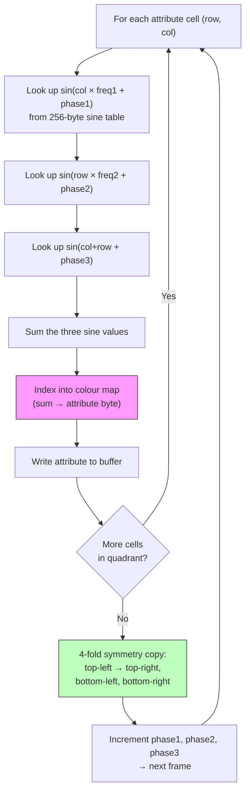

# Глава 9: Атрибутные туннели и хаос-зумеры

> *«Это ОЧЕНЬ ГЛЮЧНОЕ демо. Это САМАЯ сложная вещь, которую я когда-либо делал в демо — без шуток.»*
> -- Introspec, file_id.diz партийной версии Eager (to live), 3BM Open Air 2015

---

Летом 2015 года Introspec сел делать то, за что раньше не брался. Демо, которое вышло — Eager (to live), выпущенное под лейблом Life on Mars на 3BM Open Air — заняло первое место в компо ZX Spectrum демо. Оно крутилось две минуты, зацикленное, и каждый кадр рендерился на 50 Гц с настоящими цифровыми барабанами, подмешанными в вывод AY-чипа. Визуальным центром был туннель, который, казалось, ввинчивался в экран, цвета расходились наружу органическими волнами. Многие зрители предположили, что задействована тяжёлая пиксельная манипуляция. На самом деле туннель ни разу не затронул ни одного пикселя. Весь эффект жил в области атрибутов.

Эта глава — making-of. Мы разберём два ключевых визуальных эффекта из Eager — атрибутный туннель и хаос-зумер — прослеживая творческое мышление наряду с кодом. По пути мы встретим скриптовый движок, намекающий на архитектуру синхронизации, рассмотренную в Главе 12, и философский спор о предвычислении, разделявший ZX-сцену годами. Но начнём там, где начал Introspec: глядя на 768 байт и осознавая, что их достаточно.

---

## Атрибутная сетка как фреймбуфер

Каждый ZX Spectrum-кодер знает область атрибутов по адресам `$5800`–`$5AFF`. Каждый из 768 байт управляет цветами ink и paper для блока пикселей 8x8, образуя сетку 32x24. В разработке игр атрибуты — источник головной боли из-за конфликта атрибутов. В Главе 8 мы видели, как мультиколорные движки перезаписывают атрибуты синхронно с лучом развёртки для борьбы с сеткой 8x8. Атрибутный туннель делает обратное: он принимает сетку.

Идея обезоруживающе проста. Если заполнить пиксельную память фиксированным паттерном — скажем, чередующимися полосами ink/paper или шахматной доской — то байт атрибута сам по себе определяет, что зритель видит в каждой ячейке 8x8. Измени цвета ink и paper, и визуальное содержимое ячейки полностью меняется. Теперь у тебя 32x24 «пикселя» цвета, каждый — байт атрибута. Запись полного кадра означает запись 768 байт. Никакого чередования адресов экрана. Никаких битовых манипуляций. Никакой попиксельной отрисовки. Просто линейное блочное копирование в RAM атрибутов.

При 32x24 разрешение ужасно по любым обычным стандартам. Но Introspec строил не обычный эффект. Он строил туннель.

Подумай, как туннель выглядит с точки зрения зрителя. «Устье» туннеля — центр экрана — туда притягивается взгляд. Стены уходят к краям. Вблизи центра детали мелки и размыты глубиной. У краёв стены близко, и видна текстура. Это красиво ложится на дисплей с переменным разрешением: грубое разрешение в центре (где туннель далеко и детали не важны) и более тонкое у краёв (где они важны).

Introspec пошёл дальше с псевдо-чанки-рендерингом. В центре экрана несколько атрибутных ячеек разделяют один цвет, создавая более крупные «пиксели». К краям каждая ячейка 8x8 получает своё значение. Глаз принимает блочный центр, потому что там устье туннеля — глубина естественно уничтожает детали. Периферийное зрение улавливает более тонкое разрешение на краях, создавая впечатление более высокой точности, чем данные реально содержат.

Вот первый урок Eager: атрибутная сетка — не ограничение, которое нужно обходить. Это фреймбуфер, с которым можно работать.

---

## Плазма: цветовой движок

Цвета туннеля происходят не из сохранённой текстуры, наложенной на трубу. Они исходят из плазменного расчёта — классического подхода с суммой синусоид, ставшего демосценовым стандартом со времён Amiga, адаптированного здесь под атрибутную палитру Spectrum.

Основная идея: для каждой позиции в сетке 32x24 суммируем несколько синусоид с разными частотами и фазами. Результат, после приведения к доступному цветовому диапазону, определяет байт атрибута. Меняем фазы со временем — и плазма анимируется, создавая органическое, волнистое течение.

На Z80 это означает поиск по таблицам. 256-байтная таблица синусов, выровненная по странице для индексации одним регистром, обеспечивает базовую функцию. Для каждой ячейки ищем `sin(x * freq1 + phase1) + sin(y * freq2 + phase2) + ...`, где умножения на частоту — на самом деле просто сложения индекса (умножить на 2 = искать каждую вторую запись, на 3 = сложить индекс с собой дважды). Накопленное значение индексирует цветовую карту, выдающую байт атрибута.

Форма туннеля неявна, не явна. Нет вычисления расстояния от центра, нет таблицы углов, нет преобразования в полярные координаты. Вместо этого параметры частот и фаз плазмы подобраны так, что результирующий цветовой паттерн естественно образует концентрические кольца на экране. Кольца возникают из интерференции синусоид, подобно тому как паттерны муара возникают из наложения сеток. Подстрой параметры — и кольца стянутся к центру, создавая иллюзию глубины — взгляда вниз в туннель.

<!-- figure: ch09_tunnel_plasma_computation -->



> **Ключевое наблюдение:** Здесь нет вычисления расстояния от центра, нет таблицы углов, нет преобразования в полярные координаты. Форма туннеля возникает из интерференции синусоид --- концентрические кольца появляются естественным образом при наложении частот. Вычисляется только одна четверть (16x12); остальное отражается.

Это дешевле настоящего геометрического туннеля (который потребовал бы попиксельного поиска расстояния и угла) и даёт визуально богатый результат. Компромисс — меньшая геометрическая точность, но при разрешении 32x24 геометрическая точность никогда и не стояла на повестке.


---

## Четвёртная симметрия: разделяй и властвуй

Даже при 32x24 расчёт плазмы для всех 768 ячеек каждый кадр дорог на Z80 с частотой 3.5 МГц. Introspec сократил нагрузку вчетверо классической оптимизацией: использовать естественную симметрию туннеля.

Туннель, видимый анфас, симметричен относительно горизонтальной и вертикальной осей. Если рассчитать одну четверть экрана — верхний левый блок 16x12 — можно скопировать её в три остальные четверти отражением. Верхний левый в верхний правый — горизонтальное отражение. Верхний левый в нижний левый — вертикальное. Верхний левый в нижний правый — оба.

Подпрограмма копирования компактна. В реализации Introspec'а HL указывает на исходный байт в верхней левой четверти, а три адреса назначения (верхний правый, нижний левый, нижний правый) поддерживаются комбинацией абсолютных адресов и регистровой пары BC:

```z80 id:ch09_four_fold_symmetry_divide_and
    ld a,(hl)      ; read source byte from top-left quarter
    ld (nn),a      ; write to upper-right quarter (mirrored)
    ld (mm),a      ; write to lower-left quarter (mirrored)
    ld (bc),a      ; write to lower-right quarter (mirrored)
    ldi            ; copy source to its own destination AND advance HL, DE
```

Инструкции `ld (nn),a` и `ld (mm),a` используют абсолютную адресацию — целевые адреса встроены непосредственно в код, подставленные через самомодификацию или генерацию кода для каждой позиции ячейки. Инструкция `ldi` в конце выполняет двойную функцию: копирует байт из (HL) в (DE) для позиции верхней левой четверти в атрибутном буфере и автоинкрементирует оба HL и DE, одновременно декрементируя BC. Это значит, что счётчик цикла, продвижение указателя источника и одна из четырёх записей — всё свёрнуто в одну двухбайтную инструкцию.

Суммарная стоимость: менее 15 тактов на байт для четырёхстороннего копирования. Для 192 исходных байт (одна четверть 768-байтной области атрибутов) это примерно 2 880 тактов на заполнение всего экрана. При 3.5 МГц с бюджетом кадра ~70 000 тактов подавляющее большинство кадра остаётся на плазменный расчёт, музыкальный движок и воспроизведение цифровых барабанов, сделавшее Eager особенным.

Адреса `(nn)` и `(mm)` — литеральные двухбайтные значения, вшитые в инструкции `LD (addr),A`, подставленные через самомодификацию или генерацию кода для каждой позиции ячейки. Это стандартная демосценовая практика: отсутствие кэша инструкций у Z80 означает, что самомодифицирующийся код выполняется надёжно.

---

## Хаос-зумер

Второй крупный визуальный эффект в Eager — хаос-зумер. Если туннель гладок и органичен, зумер угловат и фрактоподобен — поле атрибутных данных, зумирующееся к зрителю или от него, с новыми деталями, проступающими на краях по мере продвижения зума.

«Хаос» — от визуального результата, а не от алгоритма. Эффект зумирует в область атрибутных данных, увеличивая центр, пока края смещаются внутрь. Поскольку исходные данные содержат паттерны на нескольких масштабах, зумирование выявляет самоподобную структуру, которую глаз воспринимает как фрактальную.

Реализация опирается на развёрнутые последовательности `ld hl,nn : ldi`. Каждый `ld hl,nn` загружает новый адрес источника — позицию в исходном буфере для выборки данной выходной ячейки. Следующий `ldi` копирует из (HL) в (DE), продвигая DE к следующей выходной позиции. Адреса источника организованы так, что ячейки вблизи центра экрана выбирают из соседних позиций исходных данных (увеличение), а ячейки у краёв — из далеко разнесённых позиций (сжатие). Меняй маппинг со временем — и зум анимируется.

```z80 id:ch09_the_chaos_zoomer
    ; Unrolled chaos zoomer fragment
    ld hl,src_addr_0    ; source for output cell 0
    ldi                 ; copy to output, advance DE
    ld hl,src_addr_1    ; source for output cell 1
    ldi
    ld hl,src_addr_2    ; source for output cell 2
    ldi
    ; ... repeated for all 768 cells (or one quarter, with symmetry)
```

Ключевая оптимизация: поскольку `ldi` автоинкрементирует DE, никогда не нужно вычислять или загружать адрес назначения. Вывод всегда записывается последовательно в RAM атрибутов. Варьируют только адреса источника, и они встроены непосредственно в поток инструкций как непосредственные операнды. Это делает зумер длинной последовательностью пар `ld hl,nn : ldi` --- концептуально просто, но каждая пара занимает лишь 5 байт (3 для `ld hl,nn` + 2 для `ldi`) и 26 тактов. Для полной четвертиэкранной области из 192 ячеек это примерно 5 000 тактов чистого копирования, плюс четырёхстороннее копирование симметрии поверх.

Сложность в том, что адреса источника меняются каждый кадр по мере продвижения зума. Обновление 192 двухбайтных адресов, встроенных в код, стоило бы почти столько же, сколько само копирование. Тут в дело вступает генерация кода.

---

## Генерация кода: Processing пишет Z80

Introspec не писал развёрнутый код зумера вручную. Последовательности адресов различны для каждого уровня зума, и вычислять их в рантайме сожрало бы бюджет кадра. Вместо этого он написал генератор кода на Processing, Java-основанной среде для креативного программирования. Скетч Processing вычислял для каждого кадра и каждой выходной ячейки, какую исходную ячейку выбирать, а затем выдавал полный `.a80`-файл, содержащий развёрнутую последовательность `ld hl,nn : ldi` со всеми заполненными адресами. sjasmplus компилировал этот сгенерированный исходник вместе с написанным вручную кодом движка.

Конвейер: Processing вычисляет маппинг зума, записывает `.a80`-исходник, ассемблер компилирует его, и в рантайме скриптовый движок выбирает, какой предгенерированный кадр исполнять. Z80 не вычисляет маппинг. Он лишь воспроизводит его.

Это обменивает память на скорость — предгенерированный код для всех кадров зума занимает значительный объём RAM, отсюда требование 128K — но стоимость в рантайме на кадр минимальна.

---

## Вопрос запилятора

ZX-сцена давно и порой горячо относится к предвычислениям. Российская демосцена породила термин *запилятор* — примерно «предвычислятор» — для демо, которые сильно зависят от предгенерированных данных, а не от вычислений в реальном времени. Слово несёт лёгкий оттенок неодобрения. Если PC делает всю интересную работу, что на самом деле делает Spectrum? Это демо или слайд-шоу?

Ответ Introspec'а характерно нюансирован. Искусство, утверждает он, не в самом вычислении, а в *проектировании того, что предвычислять*. Выбор правильного маппинга зума, правильной интерполяции, правильного способа декомпозиции задачи так, чтобы предгенерированный код уместился в память, а воспроизведение шло на 50 Гц — это инженерия. Processing-скетч не пишет себя сам. Структура Z80-кода, делающая воспроизведение эффективным, не возникает автоматически. Творчество живёт в архитектуре, а не в том, содержит ли внутренний цикл `add` или `ldi`.

И он прав. Визуальное качество хаос-зумера зависит от исходных данных, функции маппинга, кривой зума, цветовой палитры и взаимодействия с музыкой. Всё это — художественные решения. Факт, что расчёт адресов происходит на этапе компиляции, а не в рантайме — деталь реализации, которая обеспечивает визуальное качество, невозможное при вычислениях в реальном времени на 3.5 МГц. Ограничения машины — её память, набор инструкций, тайминг — формировали каждое решение. То, что формирование отчасти происходило в Processing, а отчасти в Z80-ассемблере, не умаляет результата.

Для целей этой книги практический вывод таков: генерация кода — законная и мощная техника. Если твоему эффекту нужны расчёты, превышающие бюджет кадра Z80, рассмотри перенос их на этап сборки. Макроязык твоего ассемблера, Lua-скрипт внутри sjasmplus или внешняя программа на Python или Processing — все они могут служить генераторами кода. Z80 получает возможность делать то, что он делает лучше всего: копировать данные на максимальной скорости.

---

## Вкус скриптового движка

Eager содержит больше, чем туннель и зумер. Оно крутится две минуты, с множеством визуальных вариаций, переходов и воспроизведением цифровых барабанов, придающим демо ритмический пульс. Координация всего этого — скриптовый движок, тема, которую мы подробно исследуем в Главе 12 при обсуждении синхронизации с музыкой. Но краткий набросок здесь подготавливает к той дискуссии.

Движок Introspec'а использует два уровня скриптов. **Внешний скрипт** управляет последовательностью эффектов: проигрывать туннель N кадров, перейти к зумеру, вернуться к туннелю с другими параметрами, и так далее. **Внутренний скрипт** управляет вариациями внутри одного эффекта: сменой частот плазмы, ротацией цветовой палитры, изменением скорости зума.

Критически важная команда в скриптовом языке — то, что Introspec называет **kWORK**: «сгенерировать N кадров, затем показывать их независимо». Это ключ к асинхронной генерации кадров Eager. Движок предрендерит несколько кадров текущего эффекта в буферы памяти. Затем, пока эти кадры отображаются (по одному за обновление экрана), движок может заниматься другой работой — например, воспроизводить сэмпл цифрового барабана через AY-чип.

Эта асинхронная архитектура и сделала Eager таким сложным в создании. Когда происходит удар барабана, процессор поглощён воспроизведением цифрового сэмпла. Генерация кадров останавливается. Визуальный эффект выживает на предрендеренных кадрах, пока барабан не закончится и генерация не возобновится. При частых ударах генератор отстаёт; между ударами догоняет. «Мой мозг плохо справляется с асинхронным кодированием», — написал Introspec в file_id.diz партийной версии. Честное изнеможение в этой записке отражает реальность переплетения критичной по таймингу аудиоподпрограммы с конвейером генерации кадров на машине с одним потоком и без операционной системы.

Мы вернёмся к этой архитектуре в Главе 12, где также рассмотрим технику цифровых барабанов n1k-o и двойную буферизацию атрибутных кадров, на которой строится вся система.

---

## Making-of: хронология и вдохновение

Eager разрабатывался с июня по август 2015 года. Introspec говорил, что изначальное вдохновение пришло от увиденного эффекта twister в **Bomb** от Atebit — визуального трюка, использующего манипуляции атрибутами для создания иллюзии трёхмерного вращающегося столба. «Что ещё можно сделать только с атрибутами?» — вопрос, запустивший проект.

Музыку написал n1k-o (из Skrju), чей трек задал ритмическую структуру демо. Гибридная техника барабанов — цифровой сэмпл для атаки, AY-огибающая для затухания — была находкой n1k-o, и она определила всё архитектурное решение о построении движка асинхронной генерации кадров. Без барабанов Eager могло бы быть более простым демо. С ними оно стало тем, что Introspec назвал «самой сложной вещью, которую я делал в демо».

Разработка уложилась примерно в десять недель. Пати-версия, представленная на 3BM Open Air 2015, всё ещё содержала баги --- file_id.diz нёс благодарность diver'у из 4D+TBK «за крутую подсказку» и извинения за нестабильность. Финальная версия исправила проблемы тайминга на разных моделях Spectrum (128K, +2, +2A/B, +3, Pentagon --- все только на 3,5 МГц, без турбо). Это перекрёстное опыление --- сценер из одной группы передаёт технический инсайт кодеру из другой --- именно так эволюционирует ZX-демосцена.

---

## Практика: построение упрощённого атрибутного туннеля

Построим упрощённую версию атрибутного туннеля Eager. Мы реализуем:

1. Фиксированный пиксельный паттерн в растровой памяти (чтобы атрибутам было что окрашивать).
2. Плазменный расчёт по атрибутной сетке 32x24.
3. Четвёртную симметрию для сокращения расчёта до одной четверти.
4. Анимацию через инкремент фазы плазмы каждый кадр.

Это не дотянет до визуальной изощрённости Eager — мы опускаем псевдо-чанки-пиксели переменного размера, генерируемый кодом зумер и асинхронную архитектуру. Но продемонстрирует ядро принципа: атрибутная сетка как фреймбуфер.

### Шаг 1: Заполнение пиксельной памяти паттерном

Нужен фиксированный пиксельный паттерн, чтобы оба цвета ink и paper были видны. Простая шахматная доска подойдёт:

```z80 id:ch09_step_1_fill_pixel_memory_with
; Fill bitmap memory ($4000-$57FF) with checkerboard pattern
    ld hl,$4000
    ld de,$4001
    ld bc,$17FF          ; 6143 bytes
    ld a,$55             ; 01010101 binary -- alternating pixels
    ld (hl),a
    ldir
```

Каждая ячейка 8x8 теперь будет отображать чередующиеся пиксели ink и paper. При смене атрибута шахматная доска покажет оба цвета.

### Шаг 2: Таблица синусов

Выравниваем 256-байтную таблицу синусов по странице для быстрой индексации. Её можно сгенерировать при ассемблировании через Lua-скриптинг sjasmplus или предвычислить и включить как бинарные данные:

```lua id:ch09_step_2_sine_table
    ALIGN 256
sin_table:
    LUA ALLPASS
    for i = 0, 255 do
        -- Sine scaled to 0..63 (6-bit unsigned)
        sj.add_byte(math.floor(math.sin(i * math.pi / 128) * 31 + 32))
    end
    ENDLUA
```

### Шаг 3: Плазма для одной четверти

Рассчитываем плазменное значение для каждой ячейки верхней левой четверти 16x12. Результат — индекс в цветовую таблицу, выдающую байт атрибута:

```z80 id:ch09_step_3_plasma_for_one_quarter
; Calculate plasma for top-left quarter (16 columns x 12 rows)
; Input: frame_phase is incremented each frame
; Output: attr_buffer filled with 192 attribute bytes

calc_plasma:
    ld iy,attr_buffer
    ld h,sin_table / 256     ; H = high byte of sine table page
    ld b,12                  ; 12 rows (half of 24)
.row_loop:
    ld c,16                  ; 16 columns (half of 32)
.col_loop:
    ; Plasma = sin(x*2 + phase1) + sin(y*3 + phase2) + sin(x+y + phase3)

    ; Term 1: sin(x*2 + phase1)
    ld a,c
    add a,a                  ; x * 2
    add a,(ix+0)             ; + phase1 (self-modifying or IX-indexed)
    ld l,a
    ld a,(hl)                ; sin_table[x*2 + phase1]
    ld d,a                   ; accumulate in D

    ; Term 2: sin(y*3 + phase2)
    ld a,b
    add a,a
    add a,b                  ; y * 3
    add a,(ix+1)             ; + phase2
    ld l,a
    ld a,(hl)                ; sin_table[y*3 + phase2]
    add a,d
    ld d,a

    ; Term 3: sin((x+y) + phase3)
    ld a,c
    add a,b                  ; x + y
    add a,(ix+2)             ; + phase3
    ld l,a
    ld a,(hl)                ; sin_table[x+y + phase3]
    add a,d                  ; total plasma value

    ; Map to attribute byte
    rrca
    rrca
    rrca                     ; shift to get ink bits in position
    and %00000111            ; 8 ink colours
    or  %00111000            ; white paper (bits 3-5 = 7)
    ld (iy+0),a              ; store in buffer
    inc iy

    dec c
    jr nz,.col_loop
    djnz .row_loop
    ret
```

Это намеренно упрощено. Продакшн-версия использовала бы самомодифицирующийся код для встраивания значений фаз (7 тактов на загрузку вместо 19 для IX-индексированных) и 256-байтную цветовую таблицу подстановки вместо цепочки `rrca`.

### Шаг 4: Четырёхстороннее копирование

Упрощённый подход копирует строку за строкой, зеркально отражая горизонтально для правой половины и индексируя снизу для нижней. Но продакшн-техника — однопроходное копирование Introspec'а, которое мы видели ранее, — записывает все четыре квадранта одновременно из одного исходного байта, используя самомодифицирующиеся инструкции `ld (nn),a` с предподставленными адресами. Практический код для этого паттерна — в каталоге примеров главы как `tunnel_4way.a80`.

### Шаг 5: Главный цикл

```z80 id:ch09_step_5_main_loop
main_loop:
    halt                     ; wait for vsync

    call calc_plasma         ; calculate one quarter
    call copy_four_way       ; mirror to full screen

    ; Advance plasma phases
    ld hl,phase1
    inc (hl)
    inc (hl)                 ; phase1 += 2
    ld hl,phase2
    inc (hl)                 ; phase2 += 1
    ld hl,phase3
    dec (hl)                 ; phase3 -= 1 (counter-rotating)

    jr main_loop
```

Разные приращения фаз заставляют плазменные слагаемые вращаться с разными скоростями. Экспериментируй с этими значениями — даже малые изменения дают кардинально разные визуальные текстуры.


### Ключевое наблюдение

Атрибутная сетка И ЕСТЬ твой фреймбуфер для этого эффекта. Ты никогда не трогаешь пиксельную память после начального заполнения шахматной доской. Вся анимация состоит из записи 768 байт за кадр в `$5800`–`$5AFF`. Чередование экранных адресов Z80, делающее пиксельные манипуляции такими мучительными, совершенно неуместно. Область атрибутов линейна. Копирование быстро. Визуальный результат на 50 Гц плавен и на удивление убедителен.

Это урок, который Introspec извлёк из создания Eager, и он применим далеко за пределами туннелей. Всякий раз, когда цветовая система ZX Spectrum тебя расстраивает, подумай об инверсии задачи. Вместо борьбы с атрибутной сеткой используй её. Эти 768 байт — самый дешёвый полноэкранный анимационный буфер на этой машине.

---

## Источники

- Introspec, «Making of Eager», Hype, 2015 (hype.retroscene.org/blog/demo/261.html)
- Introspec, file_id.diz из Eager (to live) партийная версия, 3BM Open Air 2015
- Introspec, «Код мёртв» (Code is Dead), Hype, 2015
- Introspec, «За дизайн» (For Design), Hype, 2015

> **Далее:** Глава 10 переносит нас к точечному скроллеру Illusion и четырёхфазной цветовой анимации Eager — где два обычных кадра и два инвертированных создают иллюзию палитры, которой у Spectrum нет.
