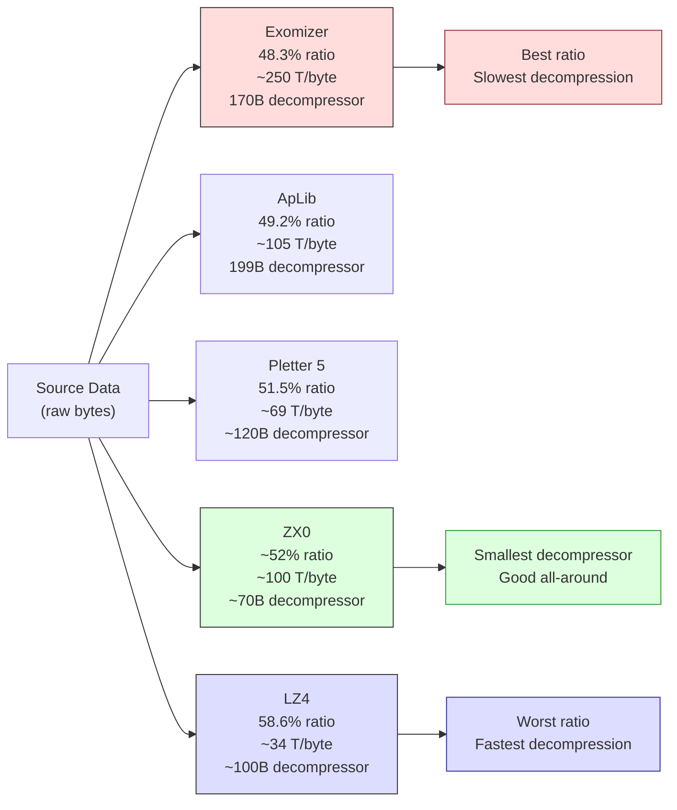

# Глава 14: Сжатие --- больше данных в меньшем пространстве

ZX Spectrum 128K имеет 128 килобайт ОЗУ. Это звучит щедро, пока ты не начнёшь вычитать: экран забирает 6 912 байт (6 144 пикселей + 768 атрибутов), системные переменные претендуют на свою долю, музыкальному проигрывателю AY и его данным паттернов нужен банк-другой, твой код занимает ещё несколько тысяч байт, и стеку нужно пространство для дыхания. К тому моменту, когда ты садишься хранить фактическое содержимое своего демо --- графику, кадры анимации, предрассчитанные таблицы подстановки --- ты борешься за каждый байт.

Одно полноэкранное изображение на Spectrum --- это 6 912 байт. 4K интро может вместить примерно 0,6 одного. 48K демо теоретически могло бы содержать семь экранов без ничего другого. Но демо --- не слайд-шоу. В них есть музыка. Есть код. Есть эффекты, требующие таблиц предрассчитанных данных. Вопрос не в том, сжимать ли --- а какой упаковщик использовать и когда.

Эта глава построена вокруг бенчмарка. В 2017 году Introspec (spke, Life on Mars) опубликовал "Data Compression for Modern Z80 Coding" на Hype --- скрупулёзное сравнение десяти инструментов сжатия, протестированных на тщательно разработанном корпусе. Та статья с её 22 000 просмотров и сотнями комментариев стала справочником, к которому обращаются ZX-кодеры при выборе упаковщика. Мы пройдём через его результаты, поймём компромиссы и научимся выбирать правильный инструмент для каждой задачи.

---

## Проблема памяти

Давай будем конкретны насчёт ограничений. Рассмотрим Break Space от Thesuper (Chaos Constructions 2016, 2-е место) --- демо с 19 сценами, работающее на ZX Spectrum 128K. Одна из этих сцен, Magen Fractal от psndcj, показывает 122 кадра анимации. Каждый кадр --- полный 6 912-байтный экран. Без сжатия это 843 264 байта --- более чем в шесть раз больше общего ОЗУ машины.

psndcj сжал все 122 кадра в 10 512 байт. Это 1,25% от оригинального размера. Вся анимация, каждый её кадр, помещается в пространство меньше двух несжатых экранов.

Другая сцена в Break Space, анимация Mondrian, упаковывает 256 нарисованных вручную кадров --- каждый квадрат вырезан отдельно, индивидуально сжат --- в 3 килобайта.

Это не теоретические упражнения. Это продакшн-техники из демо, участвовавшего в одном из самых престижных комп сцены. Сжатие --- не оптимизация, применяемая в конце. Это фундаментальное архитектурное решение, определяющее, что может содержать твоё демо.

### Сжатие как усилитель пропускной способности

Introspec сформулировал идею, возвышающую сжатие от трюка хранения до техники производительности: **сжатие действует как метод увеличения эффективной пропускной способности памяти**.

Допустим, эффекту нужно 2 КБ данных на кадр. Сохрани их сжатыми до 800 байт и распакуй с помощью LZ4 при 34 тактах (T-state) на выходной байт. Распаковка стоит 69 632 такта --- почти ровно один кадр. Но ты можешь перекрыть её со временем бордюра, буферизовать кадр вперёд с двойной буферизацией и чередовать с рендерингом эффекта. Результат: больше данных проходит через систему, чем шина могла бы доставить из несжатого хранилища. Распаковщик --- усилитель данных.

---

## Бенчмарк

Introspec не просто прогнал каждый упаковщик на нескольких файлах и оценил результаты на глаз. Он разработал корпус и измерил систематически.

### Корпус

Тестовые данные составили 1 233 995 байт в пяти категориях:

- **Calgary corpus** --- стандартный академический бенчмарк сжатия (текст, бинарные, смешанные)
- **Canterbury corpus** --- более современный академический стандарт
- **30 графических файлов ZX Spectrum** --- загрузочные экраны, мультиколорные изображения, игровые экраны
- **24 музыкальных файла** --- PT3-паттерны, дампы регистров AY, данные сэмплов
- **Разнообразные ZX-данные** --- тайловые карты, таблицы подстановки, смешанные данные демо

Этот микс имеет значение. Упаковщик, превосходный на английском тексте, может буксовать на ZX-графике, где длинные ряды нулей в пиксельной области чередуются с почти случайными атрибутными данными. Тестирование на реальных данных Spectrum --- данных, которые ты реально будешь сжимать --- необходимо.

### Результаты

Десять инструментов. Измерены по общему сжатому размеру (меньше --- лучше), скорости распаковки в тактах (T-state) на выходной байт (меньше --- быстрее) и размеру кода распаковщика в байтах (меньше --- лучше для sizecoding-продукций).

| Инструмент | Сжатый (байт) | Степень сжатия | Скорость (T/байт) | Размер распаковщика | Примечания |
|------------|--------------|----------------|-------------------|---------------------|------------|
| **Exomizer** | 596 161 | 48,3% | ~250 | ~170 байт | Лучшая степень сжатия |
| **ApLib** | 606 833 | 49,2% | ~105 | 199 байт | Хороший баланс |
| PuCrunch | 616 855 | 50,0% | --- | --- | Сложная альтернатива LZ |
| Hrust 1 | 613 602 | 49,7% | --- | --- | Перемещаемый стековый распаковщик |
| **Pletter 5** | 635 797 | 51,5% | ~69 | ~120 байт | Быстрый + приличное сжатие |
| MegaLZ | 636 910 | 51,6% | ~130 | ~110 байт | Воскрешён Introspec'ом в 2019 |
| **ZX7** | 653 879 | 53,0% | ~107 | **69 байт** | Крошечный распаковщик |
| **ZX0** | --- | ~52% | ~100 | **~70 байт** | Преемник ZX7 |
| **LZ4** | 722 522 | 58,6% | **~34** | ~100 байт | Самая быстрая распаковка |
| Hrum | --- | ~52% | --- | --- | Объявлен устаревшим |

Только Exomizer пробил барьер 600 000 байт по всему корпусу. Но скорость распаковки Exomizer --- примерно 250 тактов (T-state) на выходной байт --- делает его непрактичным для всего, что нужно распаковывать во время воспроизведения.

### Треугольник компромиссов

Каждый упаковщик делает компромисс между тремя качествами:

1. **Степень сжатия** --- насколько маленькими становятся сжатые данные
2. **Скорость распаковки** --- сколько тактов (T-state) на выходной байт
3. **Размер кода распаковщика** --- сколько байт занимает подпрограмма распаковки

Ты не можешь получить все три. Exomizer побеждает по степени сжатия, но медленно распаковывается и имеет большой распаковщик. LZ4 --- самый быстрый для распаковки, но теряет 10 процентных пунктов степени сжатия. ZX7 имеет 69-байтный распаковщик, но сжимает менее агрессивно, чем Exomizer.

Гений Introspec'а в том, что он отобразил эти компромиссы на Парето-фронтире --- кривой, где ни один инструмент не может улучшиться по одному измерению без потери по другому. Если упаковщик доминируется по всем трём осям другим инструментом, он устарел. Если он лежит на фронтире --- он правильный выбор для какого-то сценария.

<!-- figure: ch14_compression_tradeoff -->



> **Компромисс:** Меньший размер сжатых данных = более медленная распаковка. Ни один упаковщик не побеждает по всем трём осям (степень сжатия, скорость, размер распаковщика). Выбирай исходя из задачи: Exomizer для одноразовой загрузки, LZ4 для потокового чтения в реальном времени, ZX0 для sizecoding-интро.

Его практические рекомендации чётки:

- **Максимальное сжатие, скорость не важна:** Exomizer. Используй для однократной распаковки при загрузке --- загрузочные экраны, данные уровней, всё, что ты распаковываешь один раз в буфер и используешь многократно.
- **Хорошее сжатие, умеренная скорость (~105 T/байт):** ApLib. Надёжный универсальный выбор, когда нужна приличная степень и можно позволить ~105 тактов на байт.
- **Быстрая распаковка (~69 T/байт):** Pletter 5. Когда нужно распаковывать во время геймплея или между сценами и нельзя позволить медленную распаковку Exomizer.
- **Самая быстрая распаковка (~34 T/байт):** LZ4. Единственный выбор для потоковой передачи в реальном времени --- распаковки данных по мере их воспроизведения. При 34 тактах (T-state) на выходной байт LZ4 может распаковать более 2 000 байт за кадр. Это труба данных 2 КБ/кадр.
- **Самый маленький распаковщик (69--70 байт):** ZX7 или ZX0. Когда сам распаковщик должен быть крошечным --- в 256-байтных, 512-байтных или 1K интро, где каждый байт кода на счету.

Пусть эти числа направляют твои решения. Нет универсально "лучшего" упаковщика. Есть только лучший упаковщик для твоих конкретных ограничений.

---

## Как работает LZ-сжатие

Все упаковщики в таблице выше принадлежат к семейству Лемпеля-Зива. Понимание основной идеи поможет предсказать, какие данные хорошо сжимаются, а какие нет.

LZ-сжатие заменяет повторяющиеся последовательности байт обратными ссылками. Совпадение говорит: "скопируй N байт с позиции P байт назад в уже декодированном потоке". Сжатый поток чередуется между **литералами** (сырые байты без полезного совпадения) и **совпадениями** (пары смещение + длина, ссылающиеся на более ранний вывод).

Различия между упаковщиками сводятся к кодированию: сколько бит на смещение, сколько на длину, как сигнализировать литерал против совпадения. Exomizer использует сложные побитовые коды переменной длины, которые сжимают плотно, но требуют тщательного извлечения бит для декодирования --- отсюда ~250 тактов (T-state) на байт. LZ4 использует байт-выровненные токены, которые Z80 обрабатывает простыми сдвигами и масками --- отсюда ~34 такта на байт ценой 10 процентных пунктов степени сжатия. ZX0 использует однобитные флаги (0 = литерал, 1 = совпадение) с чередующимися кодами Элиаса для длин, попадая в точку баланса между размером и скоростью.

Данные ZX Spectrum хорошо сжимаются, потому что имеют структуру: большие области идентичных байт (чёрные фоны, пустые атрибуты), повторяющиеся паттерны (тайлы, шрифты, интерфейс), коррелированные пиксельные данные с регулярными смещениями. Музыка тоже хорошо сжимается --- PT3-паттерны полны повторяющихся нотных последовательностей и пустых строк. Что плохо сжимается: случайные данные, уже сжатые данные и очень короткие файлы, где накладные расходы кодирования превышают экономию.

---

## ZX0 --- выбор sizecoding-мастера

ZX0, созданный Einar Saukas, -- духовный преемник ZX7 и стал стандартным упаковщиком для современной ZX Spectrum-разработки. Он заслуживает особого внимания.

### Почему ZX0 существует

ZX7 уже был замечателен: 69-байтный распаковщик, достигающий уважаемой степени сжатия. Но Saukas увидел возможность для улучшения. ZX0 использует алгоритм оптимального парсинга --- он не просто находит хорошие совпадения, он находит *наилучшую возможную последовательность* совпадений и литералов для всего файла. Результат --- степень сжатия, близкая к значительно более крупным упаковщикам, с распаковщиком, остающимся в диапазоне 70 байт.

### Распаковщик

Z80-распаковщик для ZX0 --- это вручную оптимизированный ассемблер, спроектированный специально под набор инструкций Z80. Он использует регистр флагов Z80, инструкции блочной пересылки и точные тайминги условных переходов, чтобы выжать максимум функциональности в минимум байт. Вот о каком коде идёт речь:

```z80 id:ch14_the_decompressor
; ZX0 decompressor — standard version
; HL = source (compressed data)
; DE = destination (output buffer)
; Uses: AF, BC, DE, HL
dzx0_standard:
        ld      bc, $ffff       ; initial offset = -1
        push    bc
        inc     bc              ; BC = 0 (literal length counter)
        ld      a, $80          ; bit buffer: only flag bit set
dzx0s_literals:
        call    dzx0s_elias     ; read literal length
        ldir                    ; copy literals
        add     a, a            ; read flag bit
        jr      c, dzx0s_new_offset
        call    dzx0s_elias     ; read match length
        ex      (sp), hl        ; retrieve offset from stack
        push    hl              ; put it back
        add     hl, de          ; calculate match address
        ldir                    ; copy match
        add     a, a            ; read flag bit
        jr      nc, dzx0s_literals
dzx0s_new_offset:
        ; ... offset decoding continues ...
```

Каждая инструкция работает на два фронта. Аккумулятор служит одновременно битовым буфером и рабочим регистром. Стек хранит последнее использованное смещение для повторных совпадений. Инструкция LDIR обрабатывает и копирование литералов, и копирование совпадений, сохраняя код маленьким.

При примерно 70 байтах весь распаковщик занимает меньше места, чем одна строка символов ZX Spectrum. Для 256-байтного интро это оставляет 186 байт на всё остальное --- эффект, анимацию, музыку. Для 4K интро 70 байт --- ничтожные накладные расходы. Вот почему ZX0 стал повсеместным.

### Когда использовать ZX0

- **256-байтные -- 1K интро:** Крошечный распаковщик незаменим. Каждый байт, сэкономленный на распаковщике -- байт, доступный для контента.
- **4K интро:** ZX0 может распаковать 4 096 байт в 15--30 КБ кода и данных. Megademica от SerzhSoft (1-е место, Revision 2019) использовала именно эту стратегию, чтобы вместить то, что рецензенты назвали "полноценным new-school демо", в 4K интро.
- **Общая разработка демо и игр:** Когда нужен надёжный универсальный упаковщик с компактным распаковщиком. ZX0 --- не самый быстрый распаковщик, но достаточно быстрый для однократной распаковки при загрузке, а его степень сжатия конкурентна с инструментами, имеющими значительно более крупные распаковщики.
- **RED REDUX** (2025) использовал более новый вариант ZX2 (тоже от Saukas) для достижения замечательного подвига -- включения Protracker-музыки в 256-байтное интро.

ZX0 --- не правильный выбор для потоковой передачи в реальном времени (используй LZ4) или для максимального сжатия любой ценой (используй Exomizer). Но для подавляющего большинства проектов ZX Spectrum он является правильным вариантом по умолчанию.

---

## RLE и дельта-кодирование

Не всему нужен полноценный LZ-упаковщик. Две более простые техники обрабатывают определённые типы данных более эффективно.

### RLE: кодирование длин серий

Простейшая схема: замени серию идентичных байт на счётчик и значение. Распаковщик тривиален:

```z80 id:ch14_rle_run_length_encoding
; Minimal RLE decompressor — HL = source, DE = destination
rle_decompress:
        ld      a, (hl)         ; read count
        inc     hl
        or      a
        ret     z               ; count = 0 means end
        ld      b, a
        ld      a, (hl)         ; read value
        inc     hl
.fill:  ld      (de), a
        inc     de
        djnz    .fill
        jr      rle_decompress
```

Всего 12 байт кода распаковщика. RLE отлично сжимает, когда данные содержат длинные серии --- пустые экраны, одноцветные фоны, заливки атрибутов. Он ужасно сжимает сложный пиксель-арт. Преимущество перед LZ: для sizecoding-интро, где даже 70 байт ZX0 кажутся дорогими, 12-байтная RLE-схема высвобождает ценное пространство.

RLE также выигрывает от **транспонирования данных**: если твои данные — двумерный блок (например, 32×24 атрибута), где столбцы более однородны, чем строки, транспонирование в столбцовый порядок создаёт более длинные серии. Стоимость — обратное транспонирование после распаковки (~13 тактов/байт). Даст ли суммарный результат (12-байтный распаковщик + код обратного транспонирования + сжатые данные) выигрыш перед ZX0 (70-байтный распаковщик + сжатые данные), зависит от твоих данных --- измерь оба варианта.

> **Врезка: Самомодифицирующийся RLE от Ped7g --- 9 байт, которые перезаписывают сами себя**
>
> Для 256-байтных интро даже 12 байт кажутся дорогими. Ped7g (Peter Helcmanovsky, мейнтейнер sjasmplus) предложил самомодифицирующийся RLE-распаковщик, сжимающий декодер до **9 байт основного кода** --- а механизм выхода встроен в поток данных.
>
> Трюк: RLE-данные располагаются в памяти *перед* кодом распаковщика. Поток данных завершается байтами `$18, $00`, которые распаковщик записывает в целевой буфер на вычисленную позицию так, что эти байты перезаписывают инструкцию `ld (hl),c`. Последовательность байт `$18, $23` ассемблируется как `jr +$23`, что выполняет переход вперёд через распаковщик в основной код интро. Данные буквально перезаписывают код, чтобы завершить свою работу.
>
> Вот полноценное мини-интро --- 120-байтный бинарник, заполняющий экран цветными полосами исключительно средствами самомодифицирующегося RLE:
>
> ```z80 id:ch14_ped7g_rle_mini_intro
> ; Ped7g's self-modifying RLE mini-intro
> ; Assemble with sjasmplus: sjasmplus rle_intro.a80
> ;
> ; The RLE data is a stream of (value, count) pairs read via POP BC.
> ; SP walks through the data as a read pointer.
> ; The db $18,$00 at the end of the data stream overwrites ld (hl),c
> ; to become jr +$23, exiting the depack loop into intro_start.
> ;
> ; Contributed by Ped7g (Peter Helcmanovsky) — sjasmplus maintainer
> ; and ZX Spectrum Next contributor. Used with permission.
>
>     DEVICE ZXSPECTRUM48, $8000
>
> target  EQU $4000
>     ORG $5B00              ; loading address → print buffer
>
> intro_data:
>     dw  target             ; initial HL value (POP HL)
> ; RLE pairs: value, count (count=0 means 256 iterations)
>     .(4*3) db $AA, 0, $00, 0    ; alternating stripe pattern
>     db  $43, 32*2, $44, 32*4, $45, 32*3, $46, 32*2, $47, 32*2
>     db  $46, 32*2, $45, 32*3, $44, 32*4, $43, 32*2
>     db  $18, $00           ; data that will overwrite ld (hl),c
>                            ; creating jr rle_loop_inner+$25
> rle_start:
>     ei                     ; simulate post-LOAD BASIC environment
>     ld  sp, intro_data
>     pop hl                 ; HL = target address
> rle_loop_outer:
>     pop bc                 ; C = value, B = repeat count
> rle_loop_inner:
>     ld  (hl), c            ; ← THIS instruction gets overwritten
>     inc hl                 ;   by the $18,$00 data to become
>     djnz rle_loop_inner    ;   jr +$23, jumping to intro_start
>     jr  rle_loop_outer
> ; 31 bytes of space — fill with helper code
>     ds  $1F
> intro_start:
>     assert $ == rle_loop_inner + 2 + $23
>     inc a
>     and 7
>     out (254), a           ; cycle border colours
>     jr  intro_start
>
>     SAVESNA "rle_intro.sna", rle_start
>     SAVEBIN "rle_intro.bin", intro_data, $ - intro_data
> ```
>
> **Анализ размера.** Цикл распаковки занимает 9 байт: `pop bc` (1) + `ld (hl),c` (1) + `inc hl` (1) + `djnz` (2) + `jr` (2) + `pop hl` (1) + `ld sp,nn` (3) = 9 основных + 6 на инициализацию = **15 байт суммарно** для самодостаточного RLE-декодера со встроенным выходом. Сравни с 12-байтным минимальным RLE из предыдущего раздела, которому всё ещё нужна внешняя инициализация и проверка завершения.
>
> **Безопасность при прерываниях.** SP используется как указатель на данные, поэтому прерывания испортят стек. `ei` в начале поставлен намеренно --- в 256-байтном интро, загруженном из BASIC, прерывания уже разрешены. Случайное прерывание записывает в уже прочитанные данные позади указателя SP, поэтому распаковка завершается корректно. Для кода самого интро SP уже прошёл мимо данных, и стек работает нормально. Но не комбинируй эту технику с IM2 или музыкой на прерываниях.
>
> **Продвинутые варианты.** Ped7g отмечает несколько альтернативных стратегий выхода: (1) если целевая область простирается за код распаковщика, RLE-данные могут перезаписать смещение `jr rle_loop_outer` для прыжка дальше; (2) трюк с `jp $C3C3` --- размести значения `$C3` в данных с точно подобранными счётчиками, чтобы DJNZ завершился, когда в памяти сложится `jp $C3C3`, и выровняй интро так, чтобы адрес $C3C3 указывал на продолжение кода. Как говорит Ped7g: «таких штук можно изобрести много --- всё зависит от конкретной ситуации».
>
> **Авторство:** Предоставлено Ped7g (Peter Helcmanovsky) --- мейнтейнер sjasmplus и контрибьютор ZX Spectrum Next. Используется с разрешения.

### Дельта-кодирование: храни то, что изменилось

Дельта-кодирование хранит разности между последовательными значениями, а не абсолютные значения. Два кадра анимации, идентичные на 90%? Храни только изменённые байты --- список пар (позиция, новое_значение). Если только 691 байт отличаются из 6 912, дельта составляет 2 073 байта (3 байта на изменение) вместо полного кадра. Примени LZ поверх дельта-потока, и он сжимается ещё сильнее --- поток разностей содержит больше нулей и повторяющихся малых значений, чем сырые данные кадра.

Magen Fractal из Break Space использует именно это: 122 кадра по 6 912 байт каждый, сжатые до 10 512 байт суммарно, потому что каждый кадр отличается от предыдущего на малую величину. Дельта + LZ --- стандартный конвейер для многокадровых анимаций, скроллящихся тайловых карт и спрайтовых анимаций, где фигура меняет позу, но фон остаётся неподвижным.

---

## Подготовка данных перед сжатием

Дельта-кодирование — не единственный трюк. Упаковщик видит лишь поток байтов, который ты ему подаёшь. Если реструктурировать данные перед сжатием, один и тот же LZ-алгоритм может достичь кардинально разных степеней сжатия. Это искусство предварительной подготовки данных --- и зачастую оно ценнее, чем смена упаковщика.

### Энтропия: теоретический минимум

Энтропия Шеннона измеряет минимальное количество бит на байт, необходимое для представления твоих данных при идеальном кодировщике. Полностью случайный поток байтов имеет энтропию 8,0 бит/байт --- несжимаем. Файл из одинаковых байтов имеет энтропию 0,0. Реальные данные Spectrum находятся где-то между. Сырая таблица синусов может иметь энтропию 6,75 бит/байт. Примени дельта-кодирование, и она упадёт до 2,85. Примени вторую производную, и она снизится до 1,49 --- сокращение на 78%. Это теоретический запас, с которым упаковщик может работать.

Тебе не нужно вычислять энтропию вручную. Формула достаточно проста для Python-скрипта:

```python
import math
from collections import Counter

def entropy(data: bytes) -> float:
    """Shannon entropy in bits per byte. Lower = more compressible."""
    counts = Counter(data)
    n = len(data)
    return -sum(c/n * math.log2(c/n) for c in counts.values())
```

Запусти это на сырых данных, затем на данных с дельта-кодированием, затем на транспонированных данных. Преобразование, дающее наименьшую энтропию, сожмётся лучше всего, независимо от используемого упаковщика.

### Вторая производная: синусоидальные и квадратичные данные

Дельта-кодирование хранит первые разности: `d[i] = data[i] - data[i-1]`. Для линейной рампы (0, 3, 6, 9...) дельта-поток постоянен (3, 3, 3...) --- идеально для сжатия. Но синусоиды и гладкие кривые дают дельта-поток, который сам по себе меняется плавно. Вторая производная (дельта от дельты) ловит это:

| Тип данных | Сырая энтропия | 1-я производная | 2-я производная |
|---|---|---|---|
| Таблица синусов (256 байт) | 6,75 | 2,85 | **1,49** |
| Линейная рампа | 7,00 | 0,00 | 0,00 |
| Квадратичная кривая | 6,80 | 3,20 | **0,00** |
| Случайные байты | 8,00 | 8,00 | 8,00 |

Вторая производная квадратичной функции — константа. Это не абстрактное исчисление --- это разница между 6,80 и 0,00 бит на байт. 256-байтная квадратичная таблица подстановки, закодированная второй производной, сжимается почти в ничто.

Вот ключевая творческая идея: синусоидальное затухание и квадратичное затухание часто визуально неразличимы в демоэффекте. Если ты анимируешь частицу, которая замедляется, зритель не отличит `sin(t)` от `at² + bt + c`. А вот упаковщик — отличит: квадратичная версия имеет идеально линейную первую производную и постоянную вторую. Если твоя анимация допускает квадратичную аппроксимацию, ты экономишь байты не сменой упаковщика, а сменой кривой.

### Транспонирование: столбцовый порядок для табличных данных

Демосценовые данные часто табличные --- таблицы 3D-вершин (X, Y, Z на вершину), ключевые кадры анимации (угол, радиус, скорость на кадр), цветовые палитры (R, G, B на запись). При хранении построчно (X₀ Y₀ Z₀ X₁ Y₁ Z₁...) соседние байты принадлежат разным столбцам с разными статистическими свойствами. Дельта-кодирование делает ситуацию *хуже*:

```
Row-major:  128 64 200 129 63 201 130 62 202 ...
Delta:        64 136  57 190 138  57 190 138 ...  (wild jumps between columns)
```

Транспонируй в столбцовый порядок (X₀ X₁ X₂... Y₀ Y₁ Y₂... Z₀ Z₁ Z₂...), и теперь соседние байты принадлежат одному столбцу. Дельта-кодирование видит плавные прогрессии:

```
Column-major: 128 129 130 131 ... 64 63 62 61 ... 200 201 202 203 ...
Delta:          1   1   1   1 ...  -1  -1  -1 ...    1   1   1   1 ...  (trivial)
```

Цифры впечатляют. Таблица вершин на 768 байт (256 вершин × 3 столбца):

| Раскладка | Энтропия (сырая) | Энтропия (дельта) |
|---|---|---|
| Построчная (X,Y,Z чередуются) | 7,52 | 7,66 (хуже!) |
| Столбцовая, шаг 3 | 7,52 | **2,58** |

Дельта-кодирование построчных данных *увеличило* энтропию. То же самое дельта-кодирование на транспонированных данных уменьшило её на 65%. Упаковщик не знает, что твои данные табличные --- ты должен сообщить ему это, переупорядочив данные.

Правило: если в твоих данных есть столбцы с разными паттернами, **всегда транспонируй перед сжатием**. Шаг (количество столбцов) не нужно угадывать --- попробуй несколько делителей длины данных и выбери тот, что даёт наименьшую дельта-энтропию.

На Spectrum распаковщик просто записывает байты последовательно. Транспонирование происходит в твоих инструментах сборки, а не во время выполнения. Нулевые затраты во время выполнения.

### Чередование плоскостей: маски и пиксели

Спрайты с масками — частный случай транспонирования. При хранении маска-пиксель-маска-пиксель построчно соседние байты чередуются между двумя совершенно разными распределениями (маски — в основном $FF или $00; пиксели имеют разнообразные значения). Раздели все байты масок и все байты пикселей:

```
Before: FF 3C FF 18 FF 00 ...  (mask, pixel, mask, pixel)
After:  FF FF FF ... 3C 18 00 ...  (all masks, then all pixels)
```

Блок масок сжимается почти в ничто (длинные серии $FF). Блок пикселей сжимается как обычно. Совокупная степень сжатия улучшается на 10–20% по сравнению с чередующимся хранением, в зависимости от сложности спрайта.

### Обнаружение паттернов: когда не сжимать

Иногда данные имеют структуру, которую генератор может воспроизвести дешевле, чем распаковщик. Если твои данные периодичны с периодом *P*, хранение одного периода плюс крошечный цикл воспроизведения занимает *P* + ~10 байт. Если *P* мало относительно общего объёма данных, это побьёт любой упаковщик.

Таблицы синусов — канонический пример. 256-байтная таблица синусов сжимается до ~140 байт с ZX0. Но спектрумовский генератор синусов (через ROM-калькулятор или CORDIC-ядро) производит те же 256 байт из менее чем 30 байт кода. Для демосценовой точности даже простая квадратичная аппроксимация на четверть волны достаточна.

Дерево принятия решений: (1) Можешь ли ты сгенерировать данные по формуле в меньшее число байт, чем сжатый размер? Генерируй. (2) Данные периодичны? Храни один период + цикл. (3) Данные табличные? Транспонирование + дельта + LZ. (4) Данные — последовательные кадры? Дельта + LZ. (5) Ничего из вышеперечисленного? Просто сжимай.

### Практические преобразования для типичных демосценовых данных

| Тип данных | Лучшее преобразование | Почему |
|---|---|---|
| Таблицы синусов/косинусов | 2-я производная, или генерация во время выполнения | Плавное ускорение → постоянная 2-я производная |
| Таблицы 3D-вершин | Транспонирование (шаг = полей на вершину) + дельта | Разделяет оси; плавные траектории по каждой оси |
| Предвычисленная анимация | Дельта между кадрами + LZ | Высокая межкадровая избыточность |
| Дампы регистров AY | Транспонирование (шаг = 14, по одному на регистр) + дельта | Каждый регистр меняется плавно между кадрами |
| Цветовые рампы / градиенты | 1-я производная | Линейная или близкая к линейной прогрессия |
| Тайловые карты | Транспонирование (шаг = ширина карты) + дельта | Пространственная локальность: соседние тайлы похожи |
| Данные растрового шрифта | Разделение битовых плоскостей, или хранение как 1-бит + RLE | Много нулевых байт в нижних выносных элементах |
| Позиции частиц | Сортировка по одной оси, затем дельта-кодирование каждой оси | Сортированный порядок максимизирует дельта-сжатие |

Ключевая идея: **каждый байт, сэкономленный бесплатным преобразованием, — это байт, для экономии которого не нужен более медленный упаковщик**. Транспонирование + дельта + Pletter 5 (быстрый распаковщик) часто побеждает сырой Exomizer (медленный распаковщик) на структурированных данных. Ты получаешь лучшую степень сжатия *и* более быструю распаковку.

---

## Практический конвейер

Понимание алгоритмов сжатия полезно. Интеграция их в конвейер сборки необходима.

### От ассета к бинарнику

Конвейер: исходный ассет (PNG) --> конвертер (png2scr) --> упаковщик (zx0) --> ассемблер (sjasmplus) --> файл .tap. Упаковщик работает на твоей машине разработки, не на Spectrum. Для ZX0: `zx0 screen.scr screen.zx0`. Включи результат директивой INCBIN sjasmplus:

```z80 id:ch14_from_asset_to_binary
compressed_screen:
    incbin "assets/screen.zx0"
```

В рантайме распакуй простым вызовом:

```z80 id:ch14_from_asset_to_binary_2
    ld   hl, compressed_screen    ; source: compressed data
    ld   de, $4000                ; destination: screen memory
    call dzx0_standard            ; decompress
```

### Интеграция в Makefile

Шаг сжатия принадлежит твоему Makefile, а не твоей голове:

```makefile
%.zx0: %.scr
	zx0 $< $@

demo.tap: main.asm assets/screen.zx0
	sjasmplus main.asm --raw=demo.bin
	bin2tap demo.bin demo.tap
```

Измени исходный PNG, запусти `make`, и сжатый бинарник перегенерируется автоматически. Никаких ручных шагов, никакой забытой перепаковки.

### Пример: загрузочный экран с ZX0

Полный минимальный пример --- распакуй загрузочный экран в видеопамять и жди нажатия клавиши:

```z80 id:ch14_example_loading_screen_with
; loading_screen.asm — assemble with sjasmplus
        org  $8000
start:
        ld   hl, compressed_screen
        ld   de, $4000
        call dzx0_standard

.wait:  xor  a
        in   a, ($fe)
        cpl
        and  $1f
        jr   z, .wait
        ret

        include "dzx0_standard.asm"

compressed_screen:
        incbin "screen.zx0"

        display "Total: ", /d, $ - start, " bytes"
```


Используй директиву DISPLAY sjasmplus для вывода информации о размере при ассемблировании. Всегда знай точно, насколько велики твои сжатые данные --- разница между ZX0 и Exomizer на одном загрузочном экране может составлять 400 байт, а на 8 сценах это складывается.

### Выбор правильного упаковщика

Спрашивай по порядку: (1) sizecoding-интро? ZX0/ZX7 --- 69--70 байтный распаковщик не обсуждается. (2) Потоковая передача в реальном времени? LZ4 --- ничто другое не достаточно быстро. (3) Однократная загрузка? Exomizer --- максимальная степень, скорость не важна. (4) Нужен баланс? ApLib или Pletter 5, оба на Парето-фронтире. (5) Данные полны идентичных серий? Пользовательский RLE. (6) Последовательные кадры анимации? Сначала дельта-кодирование, затем LZ.

---

## Возрождение MegaLZ

В 2017 году Introspec объявил MegaLZ "морально устаревшим". Два года спустя он сам его воскресил.

Идея: *формат* сжатия и *реализация распаковщика* --- это разделяемые задачи. Формат MegaLZ был хорош --- первый Spectrum-упаковщик, использующий оптимальный парсер (LVD, 2005), с гамма-кодами Элиаса и чуть большим окном, чем Pletter 5. Что было плохо --- Z80-распаковщик. Introspec написал два новых:

- **Компактный:** 92 байта, ~98 тактов (T-state) на байт
- **Быстрый:** 234 байта, ~63 такта (T-state) на байт --- быстрее трёх последовательных LDIR

С этими распаковщиками MegaLZ "убедительно бьёт Pletter 5 и ZX7" по комбинированной метрике степень-плюс-скорость. Урок: не считай упаковщик мёртвым. Формат --- это сложная часть. Распаковщик --- это Z80-код, а Z80-код всегда можно переписать.

---

## Что значат числа на практике

**4K интро:** 4 096 байт суммарно. Распаковщик ZX0: ~70 байт. Движок + музыка + эффекты: ~2 400 байт. Остаётся ~1 626 байт на сжатые данные, которые распаковываются в ~3 127 байт сырых ассетов. Megademica от SerzhSoft (1-е место, Revision 2019) сжала туннельные эффекты, переходы, AY-музыку и быстрые смены сцен ровно в 4 096 байт. Она была номинирована на Outstanding Technical Achievement на Meteoriks.

**Потоковая передача в реальном времени:** нужно 2 КБ данных на кадр при 50 fps. LZ4 при 34 T/байт распаковывает 2 048 байт за 69 632 такта (T-state) --- почти ровно один кадр (69 888 тактов на 48K). Плотно, но выполнимо с перекрытием распаковки во время бордюра. ApLib потребовал бы 215 040 тактов на те же данные --- более трёх кадров. Exomizer --- более семи. Для потоковой передачи LZ4 --- единственный вариант.

**128K мультисценовое демо:** восемь сцен, каждая с 6 912-байтным загрузочным экраном. Exomizer сжимает каждый до ~3 338 байт; ZX0 до ~3 594 байт. Разница: 256 байт на экран, 2 048 байт на 8 сцен. Когда распаковка происходит при переходе между сценами, медленная распаковка Exomizer незаметна. Экономия 2 КБ --- заметна.

**256-байтное интро:** 70-байтный распаковщик ZX0 оставляет 186 байт на всё. Чаще при таком размере ты пропускаешь LZ и генерируешь данные процедурно с LFSR-генераторами и вызовами калькулятора ПЗУ. Но когда нужны конкретные неалгоритмические данные --- цветовая рампа, фрагмент битмапа --- ZX0 остаётся инструментом.

---

## Итого: шпаргалка по упаковщикам

| Твоя ситуация | Используй | Почему |
|---|---|---|
| Однократная загрузка, максимальная степень | Exomizer | 48,3% степень, скорость не важна |
| Универсальное, хороший баланс | ApLib | 49,2% степень, ~105 T/байт |
| Нужна скорость + приличная степень | Pletter 5 | 51,5% степень, ~69 T/байт |
| Потоковая передача в реальном времени | LZ4 | ~34 T/байт, 2+ КБ за кадр |
| sizecoding-интро (256б--1K) | ZX0 / ZX7 | 69--70 байтный распаковщик |
| 4K интро | ZX0 | Крошечный распаковщик + хорошая степень |
| Серии идентичных байт | RLE (пользовательский) | Распаковщик менее 30 байт |
| Последовательные кадры анимации | Дельта + LZ | Использовать межкадровую избыточность |

Числа --- это ответ. Не мнения, не фольклор, не "я слышал, Exomizer лучший". Introspec протестировал десять упаковщиков на 1,2 мегабайтах реальных данных Spectrum и опубликовал результаты. Используй его числа. Выбери упаковщик, подходящий под твои ограничения. Затем переходи к сложной части --- созданию чего-то, что стоит сжимать.

---

## Попробуй сам

1. **Сожми загрузочный экран.** Возьми любой .scr файл ZX Spectrum (скачай с zxart.ee или создай свой в Multipaint). Сожми его ZX0 и Exomizer. Сравни размеры. Затем напиши минимальный загрузчик, показанный в этой главе, для распаковки и отображения. Замерь время распаковки, используя тайминг через цвет бордюра из Главы 1.

2. **Измерь предел потоковой передачи.** Напиши тесный цикл, распаковывающий данные стандартным распаковщиком ZX0, и измерь, сколько байт он может распаковать за кадр. Сравни с распаковщиком LZ4. Проверь числа из таблицы бенчмарка по своим собственным измерениям.

3. **Построй дельта-упаковщик.** Возьми два экрана ZX Spectrum, отличающихся незначительно (сохрани игровой экран, перемести спрайт, сохрани снова). Напиши простой инструмент (на Python или другом языке), который производит дельта-поток: список пар (смещение, новое_значение) для отличающихся байт. Сравни размер дельта-потока с размером полного второго экрана. Затем сожми дельта-поток ZX0 и сравни снова.

4. **Интегрируй сжатие в Makefile.** Настрой проект с Makefile, который автоматически сжимает ассеты как шаг сборки. Измени исходный PNG, запусти `make` и убедись, что сжатый бинарник перегенерирован и финальный файл .tap обновлён. Это рабочий процесс, который ты будешь использовать в каждом проекте отныне.

5. **Транспонируй и измерь.** Создай 768-байтный файл из 256 троек (X, Y, Z), где X — синусоида, Y — косинусоида, Z — линейная рампа. Измерь энтропию сырого файла. Затем транспонируй его (все значения X, затем все Y, затем все Z) и измерь снова. Примени дельта-кодирование к обеим версиям и сравни. Ты должен увидеть, что транспонированная+дельта версия упадёт ниже 3 бит/байт, тогда как сырая+дельта останется выше 7. Сожми обе версии с ZX0 и сравни реальные размеры --- числа энтропии предскажут победителя.

6. **Квадратичная замена.** Сгенерируй 256-байтную таблицу синусов и 256-байтную квадратичную аппроксимацию (подгони `ax² + bx + c` к четверти волны, отзеркаль для полного цикла). Построй графики обеих --- они должны быть визуально неразличимы. Теперь вычисли вторую производную каждой. У синуса вторая производная имеет энтропию ~1,5 бит/байт; у квадратичной — ровно 0. Сожми обе с ZX0. Квадратичная версия меньше, а анимация выглядит так же.

> **Источники:** Introspec "Data Compression for Modern Z80 Coding" (Hype, 2017); Introspec "Compression on the Spectrum: MegaLZ" (Hype, 2019); Break Space NFO (Thesuper, 2016); Einar Saukas, ZX0 (github.com/einar-saukas/ZX0); Ped7g (Peter Helcmanovsky), самомодифицирующийся RLE-распаковщик (предоставлен с разрешения, 2026)
