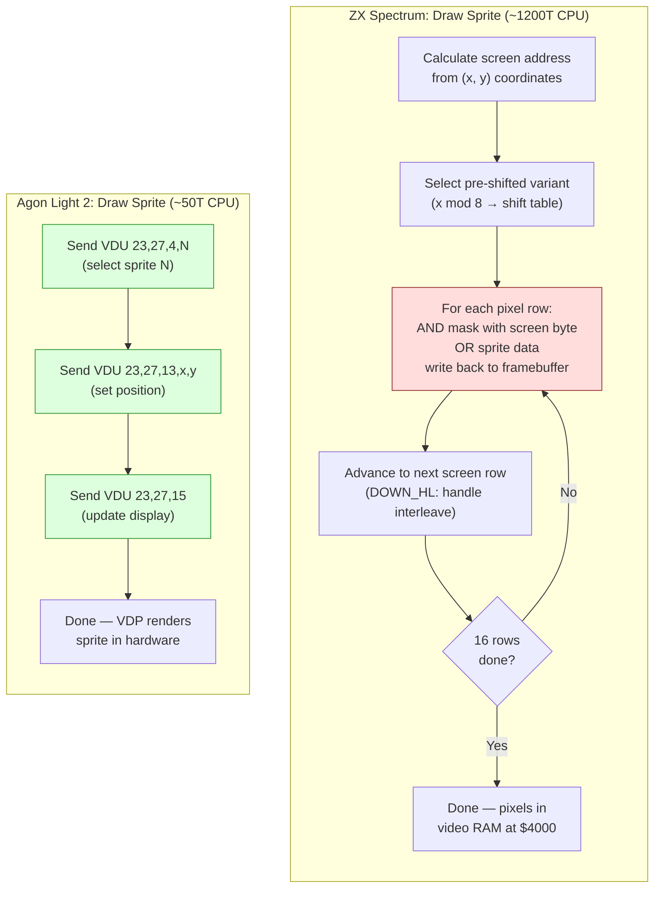

# Глава 22: Портирование --- Agon Light 2

> «Тот же набор инструкций, совершенно другая машина.»

Ты построил игру. Пять уровней, четыре типа врагов, бой с боссом, музыка на AY со звуковыми эффектами, экран загрузки и система меню --- всё работает на ZX Spectrum 128K при 3,5 МГц, в 128 килобайтах банковой памяти, рендерясь через ULA, которая не менялась с 1982 года. Каждый байт учтён. Каждый такт заработан.

Теперь ты собираешься портировать это на машину, у которой тот же набор инструкций процессора, пятикратная тактовая частота, четырёхкратный объём памяти, аппаратные спрайты, аппаратный тайловый скроллинг, SD-карта для загрузки и 24-битное плоское адресное пространство без банков.

Это должно быть просто.

Это не просто. Это *другое* в таких аспектах, которые тебя удивят, и эти сюрпризы научат тебя вещам об обеих машинах, которые ты бы не узнал никаким другим способом.

---

## Тот же ISA, другой мир

Agon Light 2 работает на Zilog eZ80 с частотой 18,432 МГц и 512 КБ плоской оперативной памяти. eZ80 --- прямой потомок Z80: он выполняет весь набор инструкций Z80, использует те же имена регистров, те же флаги, те же мнемоники. Если ты написал `LD A,(HL)` на Spectrum и `LD A,(HL)` на Agon --- опкод идентичен. Поведение идентично. Программист Z80 может сесть за Agon и сразу начать писать код.

Но Agon --- это не быстрый Spectrum. Это принципиально другая архитектура в знакомой оболочке. Различия делятся на три категории:

**Что добавляет eZ80.** 24-битные регистры, 24-битную адресацию, адресное пространство в 16 МБ (из которых 512 КБ заполнены), новые инструкции для 24-битной арифметики и систему режимов (ADL против Z80-совместимого), которая управляет шириной регистров и генерацией адресов.

**Что заменяет VDP.** ULA Spectrum --- чип, который считывает видеопамять и рисует экран --- заменяется полностью отдельным процессором. VDP Agon --- это микроконтроллер ESP32, на котором работает графическая библиотека FabGL. Он управляет выводом на экран, спрайтами, тайловыми картами и аудио. Процессор eZ80 общается с VDP через высокоскоростной последовательный канал, отправляя командные последовательности. Общей видеопамяти нет. Ты не записываешь пиксели по адресу --- ты отправляешь команды сопроцессору.

**Что исчезает.** Банковая память, спорная память, атрибутная сетка, чересстрочная раскладка экрана, фреймбуфер на 6 912 байт, бордюр как инструмент синхронизации, прямой доступ к фреймбуферу, потактовая синхронизация с лучом. Всё это пропало.

Чтобы портировать нашу игру со Spectrum, нам нужно понять, что переносится напрямую, что требует переписывания, и что нужно продумать заново.

---

## Архитектура с высоты птичьего полёта

Прежде чем погружаться в код, давай разложим две машины бок о бок.

| Параметр | ZX Spectrum 128K | Agon Light 2 |
|---------|-----------------|---------------|
| Процессор | Z80A | eZ80 (Z80-совместимый + расширения ADL) |
| Тактовая частота | 3,5 МГц (7 МГц на турбо-клонах) | 18,432 МГц |
| Оперативная память | 128 КБ (8 банков по 16 КБ, переключение через порт $7FFD) | 512 КБ плоская (24-битная адресация) |
| Адресное пространство | 16-битное (64 КБ видно одновременно) | 24-битное (16 МБ, 512 КБ заполнены) |
| Видео | ULA: 256x192, 8x8 атрибутный цвет, прямое отображение в память | VDP (ESP32 + FabGL): множество режимов, до 640x480, спрайты, тайловые карты |
| Доступ к фреймбуферу | Прямой: запись по адресам $4000--$5AFF | Косвенный: отправка команд VDP через последовательный порт |
| Спрайты | Только программные | Аппаратные: до 256, управляются VDP |
| Скроллинг | Только программный (сдвиг всего фреймбуфера) | Аппаратный тайловый скроллинг через VDP |
| Звук | AY-3-8910 (3 канала + шум) | Аудио VDP (синтез ESP32, множество форм волны, ADSR) |
| Хранилище | Лента / DivMMC (esxDOS) | SD-карта (FAT32, файловый API MOS) |
| ОС | Нет (голое железо) / esxDOS для файлового ввода-вывода | MOS (Machine Operating System) |
| Бюджет кадра | ~71 680 T-state (Pentagon) | ~368 640 T-state (при 50 Гц) |

Соотношение бюджетов кадра примерно 5:1. Но это недооценивает реальную разницу, потому что многие операции, которые потребляют процессорные такты на Spectrum --- отрисовка спрайтов, скроллинг экрана, управление фреймбуфером --- выгружены на VDP в Agon. Процессор eZ80 тратит свои такты на игровую логику, а не на перестановку пикселей.

<!-- figure: ch22_spectrum_vs_agon_sprite -->



> **Архитектурный сдвиг:** На Spectrum процессор _сам является_ движком рендеринга --- каждый пиксель размещается инструкциями Z80. На Agon процессор --- _командный секвенсор_ --- он сообщает VDP, что рисовать, а сопроцессор ESP32 выполняет собственно рендеринг. Затраты процессора падают с ~1 200T до ~50T на спрайт, но теперь ты управляешь асинхронным командным конвейером с последовательной задержкой.

---

## Режим ADL против Z80-совместимого режима

Это единственная самая важная архитектурная концепция для любого программиста Z80, приступающего к eZ80. Сделаешь неправильно --- код будет падать так, что отладить сложно. Сделаешь правильно --- раскроешь полную мощь чипа.

У eZ80 два рабочих режима:

**Z80-совместимый режим (Z80-режим).** Регистры 16-битные. Адреса 16-битные. Регистр MBASE предоставляет старшие 8 бит каждого адреса, фактически размещая твоё 64-килобайтное окно где-то в 16-мегабайтном адресном пространстве. Код ведёт себя точно как стандартный Z80 --- `LD HL,$4000` загружает 16-битное значение, `JP (HL)` прыгает по 16-битному адресу (с приклеенным MBASE), `PUSH HL` кладёт 2 байта в стек.

**Режим ADL (Address Data Long).** Регистры 24-битные. Адреса 24-битные. `LD HL,$040000` загружает 24-битное значение, `JP (HL)` прыгает по полному 24-битному адресу, `PUSH HL` кладёт 3 байта в стек. Это родной режим eZ80.

MOS загружает Agon в режиме ADL. Твоё приложение стартует в режиме ADL. Большая часть программного обеспечения Agon работает целиком в режиме ADL. Но Z80-совместимый режим существует, и понимание взаимодействия между двумя режимами критически важно.

### Зачем тебе может понадобиться Z80-режим

Если ты портируешь Z80-код со Spectrum, может возникнуть мысль: «просто переключусь в Z80-режим и запущу свой существующий код». Это работает, до определённого предела. Твои 16-битные адресные вычисления, циклы `DJNZ`, блоковые копирования `LDIR` --- всё ведёт себя идентично в Z80-режиме. MBASE настроен так, что 16-битные адреса отображаются на правильную область памяти Agon.

Проблема --- во *взаимодействии со всем остальным*. Вызовы API MOS ожидают режим ADL. Команды VDP отправляются через подпрограммы MOS, которые предполагают 24-битные стековые кадры. Если ты в Z80-режиме и вызываешь подпрограмму MOS, стековый кадр будет неправильным --- MOS кладёт 3 байта на адрес возврата, твой Z80-код положил 2. Результат --- повреждение стека и крэш.

### Механизм переключения режимов

eZ80 предоставляет специальные префиксы для переключения режима в рамках одной инструкции:

| Префикс | Эффект |
|--------|--------|
| `.SIS` (суффикс) | Выполнить следующую инструкцию в Z80-режиме (короткие регистры, короткие адреса) |
| `.LIS` | Выполнить в: длинные регистры, короткие адреса |
| `.SIL` | Выполнить в: короткие регистры, длинные адреса |
| `.LIL` | Выполнить в режиме ADL (длинные регистры, длинные адреса) |

И для вызовов и переходов:

| Инструкция | Из режима | В режим |
|-------------|-----------|---------|
| `CALL.IS addr` | ADL | Z80 |
| `CALL.IL addr` | Z80 | ADL |

Суффикс `.IS` означает «Instruction Short» --- инструкция вызова использует короткие (16-битные) соглашения для адреса возврата. `.IL` означает «Instruction Long» --- вызов кладёт 24-битный адрес возврата.

Вот практический паттерн для вызова MOS из кода в Z80-режиме:

```z80 id:ch22_the_mode_switching_mechanism
; In Z80-compatible mode, calling a MOS API function
; We need to switch to ADL mode for the call

    ; Method: use RST.LIL $08 (MOS API entry point)
    ; .LIL means "long instruction, long mode" ---
    ; pushes a 24-bit return address and enters ADL mode
    RST.LIL $08        ; call MOS API in ADL mode
    DB      mos_func   ; MOS function number follows
    ; MOS returns to us in Z80 mode (matching our caller)
```

MOS предоставляет RST $08 как единую точку входа API. Суффикс `.LIL` чисто обрабатывает переключение режима. После вызова выполнение возвращается к твоему коду в Z80-режиме с правильным состоянием стека.

### Практическое правило

Для портирования самый чистый подход: **запускай игровую логику в режиме ADL и переводи свой Z80-код на 24-битные соглашения с самого начала.** Не пытайся работать в Z80-режиме и переключаться туда-сюда при каждом вызове MOS. Накладные расходы на переключение режимов и риск рассогласования стека того не стоят.

Это означает, что твой порт не будет побайтовой копией кода Spectrum. Это будет *перевод*. Алгоритмы те же. Логика та же. Использование регистров в основном то же. Но каждый адрес --- 24 бита, каждый PUSH кладёт 3 байта, и каждая загрузка непосредственного адреса несёт лишний байт.

### Ловушка MBASE

Если всё же используешь Z80-режим, MBASE определяет старшие 8 бит каждого адреса памяти. При загрузке MOS устанавливает MBASE в $00, что означает, что Z80-адреса $0000--$FFFF отображаются на физические адреса $000000--$00FFFF. Если твой код или данные находятся выше $00FFFF (выше первых 64 КБ), код в Z80-режиме не сможет до них достучаться без изменения MBASE.

Это ловушка для портирующих со Spectrum, которые думают: «У меня 512 КБ, положу данные уровней по адресу $080000.» В Z80-режиме этого адреса не существует. Ты должен либо использовать режим ADL для доступа к нему, либо установить MBASE в $08 (чтобы адреса $0000--$FFFF отображались на $080000--$08FFFF). Но изменение MBASE влияет на *все* обращения к памяти, включая выборку инструкций --- так что твой код тоже должен быть в этом регионе, иначе ты прыгнешь в мусор.

Совет прост: оставайся в режиме ADL. Используй полное 24-битное адресное пространство нативно.

---

## Что переносится напрямую

Меняется не всё. Удивительно большая часть игровой логики Spectrum портируется с минимальными изменениями.

### Игровая логика и система сущностей

Система сущностей из Главы 18 --- массивы структур, хранящие X, Y, тип, состояние, кадр анимации, скорость, здоровье и флаги --- переносится почти дословно. Структура основного цикла (HALT, ввод, обновление, отрисовка, повтор) идентична по концепции, хотя конкретный механизм HALT и прерываний отличается.

Вот цикл обновления сущностей на Spectrum:

```z80 id:ch22_game_logic_and_entity_system
; Spectrum: Update all entities
; IX points to entity array, B = entity count
update_entities:
    ld   ix,entities
    ld   b,MAX_ENTITIES
.loop:
    ld   a,(ix+ENT_FLAGS)
    bit  0,a               ; bit 0 = active?
    jr   z,.skip

    call update_entity      ; process this entity

.skip:
    ld   de,ENT_SIZE        ; size of one entity struct
    add  ix,de              ; advance to next entity
    djnz .loop
    ret
```

И на Agon:

```z80 id:ch22_game_logic_and_entity_system_2
; Agon (ADL mode): Update all entities
; IX points to entity array, B = entity count
update_entities:
    ld   ix,entities        ; 24-bit address, loaded as 3 bytes
    ld   b,MAX_ENTITIES
.loop:
    ld   a,(ix+ENT_FLAGS)
    bit  0,a
    jr   z,.skip

    call update_entity

.skip:
    ld   de,ENT_SIZE        ; DE is now 24-bit; ENT_SIZE may differ
    add  ix,de              ; 24-bit add
    djnz .loop
    ret
```

Логика идентична. Инструкции идентичны. Разница в том, что IX, DE и счётчик команд --- все 24-битные. Ассемблер обрабатывает кодирование --- `LD IX,entities` генерирует 24-битный непосредственный операнд вместо 16-битного. Сама структура сущности может быть идентичной, или ты можешь расширить поля позиции до 24-битных для больших карт уровней. Это дизайнерское решение, а не ограничение портирования.

### Обнаружение столкновений AABB

Код столкновений из Главы 19 переносится напрямую. Проверки AABB используют 8-битные или 16-битные сравнения --- те же инструкции CP, SUB и условных переходов работают идентично на обеих машинах.

```z80 id:ch22_aabb_collision_detection
; AABB collision check: identical on both platforms
; A = entity1.x, B = entity1.x + width
; C = entity2.x, D = entity2.x + width
check_overlap_x:
    ld   a,(ix+ENT_X)
    cp   (iy+ENT_X2)       ; entity1.x < entity2.x+width?
    ret  nc                 ; no overlap
    ld   a,(ix+ENT_X2)
    cp   (iy+ENT_X)        ; entity1.x+width > entity2.x?
    ret  c                  ; no overlap
    ; overlap on X axis confirmed
```

### Арифметика с фиксированной точкой

Все вычисления в формате 8.8 с фиксированной точкой --- гравитация, скорость, трение, ускорение --- переносятся без изменений. Паттерны сдвига и сложения, 16-битные суммирования, правый сдвиг для трения:

```z80 id:ch22_fixed_point_arithmetic
; Apply gravity: velocity_y += gravity
; Works identically on both platforms
    ld   a,(ix+ENT_VY_LO)
    add  a,GRAVITY_LO
    ld   (ix+ENT_VY_LO),a
    ld   a,(ix+ENT_VY_HI)
    adc  a,GRAVITY_HI
    ld   (ix+ENT_VY_HI),a
```

Побайтовая арифметика не зависит от того, номинально 16-битные или 24-битные регистры. Аккумулятор всегда 8-битный. Распространение переноса работает одинаково.

### Конечный автомат

Конечный автомат игры (титул, меню, геймплей, пауза, конец игры) использует таблицу переходов, индексированную номером состояния. На Spectrum:

```z80 id:ch22_state_machine
; Spectrum: dispatch game state
    ld   a,(game_state)
    add  a,a               ; multiply by 2 (16-bit pointers)
    ld   e,a
    ld   d,0
    ld   hl,state_table
    add  hl,de
    ld   a,(hl)
    inc  hl
    ld   h,(hl)
    ld   l,a
    jp   (hl)

state_table:
    dw   state_title
    dw   state_menu
    dw   state_game
    dw   state_pause
    dw   state_gameover
```

На Agon таблица указателей хранит 24-битные адреса:

```z80 id:ch22_state_machine_2
; Agon (ADL mode): dispatch game state
    ld   a,(game_state)
    ld   l,a
    ld   h,0               ; HL = state index
    ld   e,l
    ld   d,h               ; DE = copy of state index
    add  hl,hl             ; HL = state * 2
    add  hl,de             ; HL = state * 3 (24-bit pointers)
    ld   de,state_table
    add  hl,de
    ld   hl,(hl)           ; load 24-bit pointer
    jp   (hl)

state_table:
    dl   state_title       ; DL = define long (24-bit)
    dl   state_menu
    dl   state_game
    dl   state_pause
    dl   state_gameover
```

Что изменилось: указатели стали 3 байта вместо 2, поэтому умножение индекса меняется с `*2` на `*3`, а таблица использует `DL` (define long) вместо `DW` (define word). В остальном логика идентична.

---

## Что требует переписывания

### Рендеринг: от фреймбуфера к командам VDP

Это самое масштабное изменение в порте. На Spectrum рендеринг означает запись байтов по адресам видеопамяти. Весь конвейер рендеринга --- отрисовка спрайтов, очистка экрана, закраска тайлов, скроллинг --- это процессорный код, который манипулирует памятью по адресам $4000--$5AFF.

На Agon рендеринг означает отправку последовательностей команд VDP. VDP понимает протокол на основе потоков байтов VDU (та же командная система VDU, что используется в BBC BASIC, расширенная командами, специфичными для Agon). Ты отправляешь последовательность байтов в VDP через MOS, и ESP32 их обрабатывает.

#### Спрайты

На Spectrum (из Главы 16) отрисовка замаскированного спрайта 16x16 обходится примерно в 1 200 T-state процессорного времени --- чтение байтов маски, AND с экраном, OR данных спрайта, запись обратно. Ты делаешь это для каждого спрайта, каждый кадр.

На Agon ты загружаешь растровое изображение спрайта *один раз*, а затем перемещаешь его, отправляя обновление позиции:

```z80 id:ch22_rendering_from_framebuffer_to
; Agon: Create and position a hardware sprite
; Step 1: Upload sprite bitmap (done once at init)
;   VDU 23, 27, 4, spriteNum   ; select sprite
;   VDU 23, 27, 0, w, h        ; set dimensions
;   followed by pixel data

; Step 2: Move sprite (done every frame)
; VDU 23, 27, 4, spriteNum     ; select sprite
; VDU 23, 27, 13, x.lo, x.hi, y.lo, y.hi  ; set position

move_sprite:
    ; Send VDU command to move sprite
    ld   a,23
    rst  $10                ; MOS: output byte to VDP
    ld   a,27
    rst  $10
    ld   a,4               ; command: select sprite
    rst  $10
    ld   a,(sprite_num)
    rst  $10

    ld   a,23
    rst  $10
    ld   a,27
    rst  $10
    ld   a,13              ; command: move sprite to
    rst  $10

    ld   a,(sprite_x)      ; X low byte
    rst  $10
    ld   a,(sprite_x+1)    ; X high byte
    rst  $10
    ld   a,(sprite_y)      ; Y low byte
    rst  $10
    ld   a,(sprite_y+1)    ; Y high byte
    rst  $10

    ; VDU 23, 27, 15        ; show sprite (update display)
    ld   a,23
    rst  $10
    ld   a,27
    rst  $10
    ld   a,15
    rst  $10
    ret
```

Каждый `RST $10` отправляет один байт в VDP через MOS. Общая процессорная стоимость перемещения спрайта --- примерно 13 отправленных байт x ~30 T-state на вызов RST = ~390 T-state. Сравни с ~1 200 T-state на Spectrum для полной отрисовки замаскированного спрайта. А версия для Agon не нуждается в сохранении/восстановлении фона --- VDP автоматически компонует спрайты поверх фона.

Компромисс: задержка. VDP обрабатывает команды асинхронно. Между отправкой команды «переместить спрайт» и фактическим появлением спрайта на новой позиции существует задержка последовательной передачи и задержка обработки VDP. Для плавной анимации тебе нужно отправлять все обновления спрайтов в начале кадра и рассчитывать на то, что VDP обработает их до следующего обновления экрана.

#### Тайловый скроллинг

На Spectrum горизонтальный скроллинг означает сдвиг каждого байта видеопамяти влево или вправо --- цепочка инструкций `RLC` или `RRC` по сотням байт, потребляющая существенную долю бюджета кадра (мы рассчитывали стоимость в Главе 17). Вертикальный скроллинг требует копирования строк развёртки с учётом чересстрочной раскладки памяти.

На Agon VDP поддерживает аппаратные тайловые карты:

```z80 id:ch22_rendering_from_framebuffer_to_2
; Agon: Set up a tilemap (done once)
; VDU 23, 27, 20, tileWidth, tileHeight
; VDU 23, 27, 21, mapWidth.lo, mapWidth.hi, mapHeight.lo, mapHeight.hi

; Scroll the tilemap (every frame)
; VDU 23, 27, 24, offsetX.lo, offsetX.hi, offsetY.lo, offsetY.hi

scroll_tilemap:
    ld   a,23
    rst  $10
    ld   a,27
    rst  $10
    ld   a,24              ; command: set scroll offset
    rst  $10

    ld   hl,(scroll_x)
    ld   a,l
    rst  $10               ; offsetX low
    ld   a,h
    rst  $10               ; offsetX high
    ld   hl,(scroll_y)
    ld   a,l
    rst  $10               ; offsetY low
    ld   a,h
    rst  $10               ; offsetY high
    ret
```

Восемь байт отправлено. Примерно 240 T-state процессорного времени. На Spectrum полноэкранный горизонтальный пиксельный скроллинг обходится в десятки тысяч T-state. На Agon это выполняется аппаратно практически бесплатно.

Но сначала нужно настроить тайловую карту: загрузить определения тайлов, задать размеры карты, заполнить карту индексами тайлов. Это одноразовая стоимость при загрузке уровня, а не покадровая. На Spectrum твои данные тайлов живут в банковой памяти и рисуются во фреймбуфер твоим собственным кодом. На Agon данные тайлов живут в памяти VDP и рисуются ESP32. Твоя роль меняется с «программиста графического движка» на «секвенсора команд VDP».

#### Раскладка экрана

Весь кошмар чересстрочной раскладки экрана Spectrum --- разделённая адресация, подпрограммы DOWN_HL, тщательные вычисления для преобразования координат (x, y) в адреса памяти --- исчезает. VDP Agon работает в экранных координатах. Ты говоришь «нарисуй в точке (100, 50)», и VDP делает всё остальное.

Это означает, что подпрограмма DOWN_HL из Главы 2, таблицы подстановки экранных адресов, вычисления адресов атрибутов --- ничего из этого не портируется. Оно просто удаляется. Эквивалентная операция на Agon --- «отправить пару координат в VDP».

---

## Что нужно продумать заново

Некоторые паттерны Spectrum настолько глубоко встроены в архитектуру игры, что ты не можешь просто переписать слой рендеринга. Нужно менять сам *дизайн*.

### Архитектура памяти

На Spectrum ты тщательно планировал, какие данные в каком банке:

- Банки 0--3: данные уровней, тайлсеты, графика спрайтов
- Банки 4--6: музыкальные паттерны, звуковые эффекты, таблицы подстановки
- Банк 7: теневой экран для двойной буферизации

Каждое переключение банков стоит записи в порт и ограничивает, какой код может видеть какие данные. Архитектура игры формируется 16-килобайтным окном в 128-килобайтное пространство.

На Agon все 512 КБ видны одновременно. Банков нет. Трюка с теневым экраном нет (VDP обрабатывает двойную буферизацию самостоятельно). Ты можешь держать всю свою игру --- все пять уровней, все тайлсеты, все спрайты, всю музыку --- в памяти одновременно. Переходы между уровнями не требуют загрузки с ленты или диска; ты просто указываешь на другую область оперативной памяти.

Это упрощает разработку, но также убирает ограничение, которое заставляло делать хорошую архитектуру. На Spectrum ты был вынужден думать о локальности данных, о том, что должно быть совместно резидентным, о последовательностях загрузки. На Agon можно быть небрежным. Не будь небрежным. У Agon 512 КБ, а не бесконечность. Хорошо организованная карта памяти --- по-прежнему достоинство.

Типичная разметка памяти Agon для портированной игры:

```text
$000000 - $00FFFF   MOS and system (reserved)
$040000 - $04FFFF   Game code (~64 KB)
$050000 - $06FFFF   Level data, all 5 levels (~128 KB)
$070000 - $07FFFF   Music and SFX data (~64 KB)
$080000 - $0FFFFF   Free / working buffers
```

Всё адресуемо одной инструкцией `LD HL,$070000` --- никакого переключения банков, никаких записей в порты.

### Загрузка

На Spectrum загрузка с ленты --- процесс длиной в минуты с характерным звуковым сопровождением. Даже с DivMMC и esxDOS доступ к файлам --- это последовательность вызовов RST $08:

```z80 id:ch22_loading
; Spectrum + esxDOS: load a file
    ld   a,'*'             ; current drive
    ld   ix,filename
    ld   b,$01             ; read-only
    rst  $08               ; esxDOS call
    DB   $9A               ; F_OPEN
    ; A = file handle

    ld   ix,buffer
    ld   bc,size
    rst  $08
    DB   $9D               ; F_READ
    ; Data loaded

    rst  $08
    DB   $9B               ; F_CLOSE
```

На Agon MOS предоставляет файловый API, который читает напрямую с SD-карты:

```z80 id:ch22_loading_2
; Agon: load a file using MOS API
    ld   hl,filename       ; 24-bit pointer to filename string
    ld   de,buffer         ; 24-bit pointer to destination
    ld   bc,size           ; 24-bit max size
    ld   a,mos_fopen       ; MOS file open function
    rst  $08               ; MOS API call
    ; A = file handle

    ld   a,mos_fread       ; MOS file read function
    rst  $08
    ; Data loaded

    ld   a,mos_fclose
    rst  $08
```

Паттерн похож --- открыть, прочитать, закрыть --- но Agon читает с FAT32 на SD-карте, что достаточно быстро, чтобы загружать данные уровней между сценами без видимой задержки. Не нужен экран загрузки. Не нужны подпрограммы загрузки с ленты. Не нужна оптимизация блочной загрузки.

### Звук

AY-3-8910 Spectrum программируется прямой записью в аппаратные регистры через порты ввода-вывода. Каждая нота, каждое изменение огибающей, каждый шумовой всплеск --- это конкретное значение регистра, записанное в конкретный момент.

Аудио Agon обрабатывается VDP. Ты отправляешь звуковые команды через тот же последовательный канал, что используется для графики:

```z80 id:ch22_sound
; Agon: play a note
; VDU 23, 0, 197, channel, volume, freq.lo, freq.hi, duration.lo, duration.hi

play_note:
    ld   a,23
    rst  $10
    xor  a                 ; 0
    rst  $10
    ld   a,197             ; sound command
    rst  $10
    ld   a,(channel)
    rst  $10
    ld   a,(volume)
    rst  $10
    ld   hl,(frequency)
    ld   a,l
    rst  $10
    ld   a,h
    rst  $10
    ld   hl,(duration)
    ld   a,l
    rst  $10
    ld   a,h
    rst  $10
    ret
```

Звуковая система Agon поддерживает множество форм волны (синус, квадрат, треугольник, пила, шум) и ADSR-огибающие для каждого канала --- функции, которых нет у AY. Но модель программирования совершенно другая. Ты не можешь писать сырые значения регистров; ты отправляешь высокоуровневые нотные команды. Твой проигрыватель музыки для AY --- обработчик прерываний IM2, который читает данные паттернов и обновляет 14 регистров AY каждый кадр --- вообще не портируется. Тебе нужен новый музыкальный драйвер, который транслирует данные паттернов в звуковые команды VDP.

Один из подходов: написать тонкий слой абстракции, общий для обеих платформ.

```z80 id:ch22_sound_2
; Abstract sound interface
; Spectrum implementation:
sound_play_note:
    ; A = channel, B = note, C = instrument
    ; ... look up AY register values, write to ports $FFFD/$BFFD
    ret

; Agon implementation:
sound_play_note:
    ; A = channel, B = note, C = instrument
    ; ... convert to VDP sound command, send via RST $10
    ret
```

Та же сигнатура вызова. Различные внутренности. Игровой код вызывает `sound_play_note`, не зная, на какой платформе он работает.

### Ввод

Spectrum считывает состояние клавиатуры опросом порта $FE с адресами полурядов в аккумуляторе. Джойстик Kempston читается из порта $1F. Это прямые чтения портов ввода-вывода с конкретными битовыми масками.

Agon читает состояние клавиатуры через MOS:

```z80 id:ch22_input
; Spectrum: read keyboard
    ld   a,$FD             ; half-row: Q W E R T
    in   a,($FE)
    bit  0,a               ; bit 0 = Q
    ; ...

; Agon: read keyboard via MOS
    ld   a,mos_getkey      ; MOS: get key state
    rst  $08
    ; A = key code, or 0 if no key pressed
```

Spectrum даёт тебе битовую маску одновременно нажатых клавиш, идеальную для игрового ввода (можно определить несколько нажатых клавиш сразу). API клавиатуры MOS Agon событийный: он выдаёт последнюю нажатую клавишу. Для игрового ввода с одновременным обнаружением клавиш обычно используется карта клавиатуры MOS --- область памяти, обновляемая MOS, которая отражает состояние всех клавиш:

```z80 id:ch22_input_2
; Agon: read simultaneous keys from keyboard map
    ld   a,(mos_keymap+KEY_LEFT)   ; 1 if left arrow held, 0 if not
    or   a
    jr   z,.no_left
    ; move player left
.no_left:
    ld   a,(mos_keymap+KEY_RIGHT)
    or   a
    jr   z,.no_right
    ; move player right
.no_right:
```

Это функционально эквивалентно подходу с битовыми масками Spectrum, просто организовано иначе. Портирование прямолинейно: замени чтения портов чтениями из карты клавиатуры в памяти.

---

## eZ80 на 18 МГц: что по-прежнему важно, а что нет

eZ80 примерно в пять раз быстрее Z80A по частоте тактового генератора. Но многие инструкции eZ80 также выполняются за меньшее число тактов, чем их эквиваленты на Z80 --- однобайтовые регистровые инструкции часто завершаются за 1 такт вместо 4. Эффективное ускорение для типичного кода находится где-то между 5x и 20x в зависимости от состава инструкций.

Это кардинально меняет расчёт оптимизации.

### Что по-прежнему важно: эффективность внутренних циклов

Даже при 18 МГц и 368 000 T-state на кадр, внутренний цикл по-прежнему имеет значение для ресурсоёмких операций. Если ты выполняешь проверки столкновений с тайловой картой, перебираешь 200 сущностей или обрабатываешь конечные автоматы ИИ для десятков врагов, стоимость каждой итерации горячего цикла накапливается.

Базовые техники оптимизации Z80 --- хранение значений в регистрах вместо памяти, использование `INC L` вместо `INC HL` где возможно, избегание IX/IY-индексированных инструкций на горячих путях (они несут 2-тактовый штраф за префикс на eZ80, как и 4-тактовый штраф на Z80) --- по-прежнему дают измеримые улучшения.

```z80 id:ch22_what_still_matters_inner_loop
; Tight entity scan: same optimization principles on both platforms
; Prefer: register-to-register ops, direct addressing, DJNZ
; Avoid: IX-indexed loads in hot inner loops when possible

scan_entities_fast:
    ld   hl,entity_flags    ; pointer to flags array
    ld   b,MAX_ENTITIES
.loop:
    ld   a,(hl)
    bit  0,a
    call nz,process_entity
    inc  hl                 ; next entity flag (assume 1-byte stride)
    djnz .loop
    ret
```

Этот паттерн --- минимальные обращения к памяти, плотное использование регистров, управление циклом через `DJNZ` --- оптимален и на Z80 при 3,5 МГц, и на eZ80 при 18 МГц. Хороший код --- это хороший код.

### Что становится неактуальным: трюки экономии памяти

На Spectrum давление памяти определяет большую часть инженерии. Предсдвинутые спрайты хранят 4 или 8 копий каждого спрайта, потребляя 4x--8x памяти, как компромисс скорости и памяти. Сжатие обязательно для размещения данных демо в 128 КБ. Таблицы подстановки тщательно дозированы для баланса точности и расхода памяти. Переключение банков добавляет архитектурную сложность с единственной целью адресации более 64 КБ за раз.

На Agon, с 512 КБ плоской оперативной памяти и SD-картой для всего, что не обязательно держать в памяти, эти техники экономии не нужны. Ты можешь хранить 8 предсдвинутых копий каждого спрайта, не беспокоясь о памяти. Можешь держать все таблицы подстановки с полной точностью. Можешь держать все пять уровней в памяти одновременно.

Это не значит, что нужно расточительно расходовать память. Но решения по оптимизации, продиктованные дефицитом памяти --- «использовать таблицу синусов на 256 байт или на 128?» --- становятся неактуальными. Используй 256. Используй 1 024, если точность помогает.

### Что становится неактуальным: самомодифицирующийся код (SMC)

На Spectrum самомодифицирующийся код (SMC) --- стандартная техника оптимизации. Ты пишешь инструкции, которые патчат собственные непосредственные операнды, чтобы избежать обращений к памяти:

```z80 id:ch22_what_becomes_irrelevant_self
; Spectrum: self-modifying code for speed
    ld   a,0               ; operand patched at runtime
    ; ... (the $00 after LD A is overwritten with the real value)
```

На eZ80 SMC по-прежнему работает (у eZ80 нет кэша инструкций, который бы инвалидировался), но мотивация слабее. Дополнительная стоимость обращения к памяти меньше относительно общего бюджета кадра. Важнее то, что MOS отображает некоторые области памяти как доступные только для чтения, и определённые версии прошивки Agon могут ограничивать выполнение модифицированного кода в зависимости от области памяти. SMC не запрещён на Agon, но он редко необходим и может вызывать трудноуловимые проблемы.

### Что становится неактуальным: стековые трюки для рендеринга

На Spectrum злоупотребление указателем стека для быстрого заполнения экрана (DI, установить SP на адрес экрана, многократный PUSH данных) --- классический приём, потому что PUSH записывает 2 байта за 11 T-state --- быстрее любого другого механизма записи. На Agon ты вообще не пишешь во фреймбуфер. VDP обрабатывает рендеринг. Стековые трюки для вывода на экран бессмысленны.

---

## Сравнительная таблица

Вот сравнение одной и той же игры на обеих платформах. Эти числа характерны для платформера, построенного в Главах 21--22.

| Метрика | ZX Spectrum 128K | Agon Light 2 |
|--------|-----------------|---------------|
| **Размер игрового кода** | ~12 КБ | ~14 КБ |
| **Код рендеринга** | ~5 КБ (спрайтовый движок, скроллинг, управление экраном) | ~2 КБ (командные последовательности VDP) |
| **Итого кода** | ~17 КБ | ~16 КБ |
| **Данные уровней (все 5)** | ~40 КБ (сжатые, загружаются поуровнево) | ~60 КБ (несжатые, все резидентны) |
| **Графика спрайтов/тайлов** | ~20 КБ (упакованные, 1bpp + маски) | ~80 КБ (8bpp RGBA, загружены в VDP) |
| **Музыка + SFX** | ~16 КБ (PT3 + таблицы SFX) | ~20 КБ (конвертированный формат + данные форм волны) |
| **Итого данных** | ~76 КБ (помещается в 128 КБ с банками) | ~160 КБ (легко помещается в 512 КБ) |
| **Нужно сжатие?** | Да, обязательно | Нет, опционально |
| **Стоимость отрисовки спрайта** | ~1 200 T/спрайт (программная) | ~400 T/спрайт (команды VDP) |
| **Стоимость скроллинга за кадр** | ~15 000--30 000 T (программный сдвиг) | ~240 T (команда смещения VDP) |
| **Бюджет кадра** | ~71 680 T | ~368 640 T |
| **Достижимый fps** | 25--50 (зависит от числа сущностей) | 60 (ограничено VDP, не процессором) |
| **Сложность разработки** | Высокая (банковая память, раскладка экрана, движок рендеринга) | Средняя (протокол VDP, API MOS, режим ADL) |
| **Визуальный результат** | Монохромные или 2-цветные спрайты в ячейке, атрибутный цвет, 256x192 | Полноцветные спрайты, плавный скроллинг, 320x240 или выше |

Разница в размере кода показательна. На Spectrum *движок рендеринга* составляет существенную долю кодовой базы. На Agon команды VDP заменяют большую часть этого кода. Но игра на Spectrum меньше по общему объёму данных, потому что всё сжато и плотно упаковано. Версия для Agon использует больше памяти для более богатых ресурсов (спрайты по 8 бит на пиксель вместо 1 бита на пиксель с масками).

Сравнение бюджетов кадра --- самое впечатляющее число. Игра на Agon *простаивает большую часть кадра*. После обработки игровой логики, отправки обновлений спрайтов и обработки ввода, eZ80 нечего делать до следующего кадра. На Spectrum ты борешься за каждый такт, чтобы всё уместить в бюджет.

---

## Процесс портирования: пошагово

Вот практическая последовательность для портирования игры из Главы 21 на Agon.

### Шаг 1: Настрой проект Agon

Создай новый проект с инструментарием Agon. Тебе понадобятся:

- Ассемблер eZ80 (ez80asm или инструменты Zilog ZDS)
- Заголовочный файл API MOS (mos_api.inc), определяющий номера функций и константы
- Способ передать бинарник на Agon (SD-карта или загрузка по последовательному порту)

Точка входа отличается от Spectrum. Вместо `ORG $8000` с голым JP на стартовый адрес, Agon загружает исполняемые файлы по адресу $040000, и MOS передаёт управление по этому адресу:

```z80 id:ch22_step_1_set_up_the_agon
; Agon: application entry point
    .ASSUME ADL=1          ; we are in ADL mode
    ORG  $040000

    JP   main              ; standard entry

main:
    ; Your game starts here
    ; ... initialize VDP, load assets, enter game loop
```

### Шаг 2: Замени слой рендеринга

Это основной объём работы. Удали код рендеринга Spectrum и замени его командными последовательностями VDP:

1. **Загрузи растровые изображения спрайтов в VDP.** Конвертируй свои 1bpp-данные спрайтов в формат VDP (обычно 8bpp RGBA). Отправь пиксельные данные командами определения спрайтов VDU 23,27.

2. **Загрузи тайлсет в VDP.** Конвертируй свои 8x8-тайлы из формата атрибутов Spectrum в формат тайлов VDP. Определи размеры тайловой карты и заполни её индексами тайлов для текущего уровня.

3. **Замени подпрограмму отрисовки спрайтов** командами позиционирования спрайтов VDU 23,27 (как показано ранее).

4. **Замени подпрограмму скроллинга** командами смещения тайловой карты VDU 23,27.

5. **Удали код вычисления адресов экрана**, подпрограмму DOWN_HL, подпрограммы адресов атрибутов и все прямые записи во фреймбуфер.

### Шаг 3: Транслируй игровую логику

Пройди по коду игровой логики (обновление сущностей, обнаружение столкновений, физика, ИИ, конечный автомат) и адаптируй под режим ADL:

- Замени все `DW` (define word) на `DL` (define long) для таблиц адресов.
- Измени указательную арифметику с 16-битной на 24-битную там, где задействованы адреса.
- Проверь, что пары `PUSH`/`POP` сбалансированы --- каждый push теперь кладёт 3 байта, а не 2.
- Убедись, что счётчики блокового копирования `LDIR` и `LDDR` корректны (BC в режиме ADL 24-битный; если твой счётчик помещается в 16 бит, старший байт должен быть нулём).

### Шаг 4: Перепиши звук

Напиши новый музыкальный драйвер, который читает данные паттернов и генерирует звуковые команды VDP вместо записей в регистры AY. Формат данных паттернов может остаться прежним; меняется только выходная стадия.

### Шаг 5: Перепиши ввод

Замени чтения портов чтениями из карты клавиатуры MOS. Подход с картой клавиатуры прост и обеспечивает одновременное обнаружение нажатий.

### Шаг 6: Перепиши загрузку

Замени файловые операции esxDOS вызовами файлового API MOS. Паттерн похож; различаются только номера функций и соглашение о вызовах.

### Шаг 7: Тестируй и настраивай

Запусти игру. Проверь позиции спрайтов, границы столкновений, скорость скроллинга, синхронизацию звука. Асинхронная обработка VDP означает, что визуальные обновления могут приходить на один кадр позже, чем ожидалось --- скорректируй тайминги игры при необходимости.

---

## Чему каждая платформа заставляет тебя учиться

Spectrum учит эффективности на уровне тактов и творческому решению задач в условиях ограничений: ты учишься считать такты, использовать раскладку памяти и изобретать техники вроде мультиколора и эффектов только на атрибутах, которые существуют исключительно благодаря ограничениям железа. Agon учит системной архитектуре: управлению асинхронным сопроцессором, структурированию командных конвейеров и созданию инструментов конвертации ассетов для больших объёмов данных. Spectrum делает тебя лучшим оптимизатором; Agon делает тебя лучшим системным проектировщиком. Оба навыка переносимы.

---

## Заметка об инструкциях eZ80

eZ80 добавляет несколько инструкций, которые программист Z80 оценит. Наиболее полезные для разработки игр:

**LEA (Load Effective Address).** Вычисляет адрес из базового регистра плюс 8-битное знаковое смещение, не модифицируя базовый регистр:

```z80 id:ch22_a_note_on_ez80_instructions
; eZ80: LEA IX, IY + offset
; Compute IX = IY + displacement without changing IY
    LEA  IX,IY+ENT_SIZE    ; IX points to next entity
```

На Z80 для этого нужны `PUSH IY` / `POP IX` / `LD DE,ENT_SIZE` / `ADD IX,DE` --- четыре инструкции и 40+ T-state. LEA делает это за одну инструкцию.

**TST (Test Immediate).** Выполняет AND аккумулятора с непосредственным значением и устанавливает флаги, не модифицируя A:

```z80 id:ch22_a_note_on_ez80_instructions_2
; eZ80: TST A, mask
; Test bits without destroying A
    TST  A,$80             ; test sign bit
    jr   nz,.negative      ; branch if bit 7 set, A unchanged
```

На Z80 тебе понадобится `BIT 7,A` (что не работает с произвольными масками) или `PUSH AF` / `AND mask` / `POP AF` (дорого).

**MLT (Multiply).** Беззнаковое умножение 8x8, результат в 16-битной регистровой паре:

```z80 id:ch22_a_note_on_ez80_instructions_3
; eZ80: MLT BC
; B * C -> BC (16-bit result)
    ld   b,sprite_width
    ld   c,frame_number
    mlt  bc                ; BC = B * C
```

На Z80 для умножения нужен цикл или таблица подстановки. MLT --- одна инструкция. Для игровой логики --- вычисление смещений спрайтов, индексов тайловой карты, позиций кадров анимации --- это существенное упрощение.

---

## Итого

- Agon Light 2 выполняет тот же набор инструкций Z80, что и Spectrum, но с 24-битной адресацией (режим ADL), 512 КБ плоской оперативной памяти, аппаратными спрайтами и тайловыми картами через сопроцессор VDP и бюджетом кадра в ~5 раз больше.
- **Режим ADL** --- родной режим. Запускай свою игру в режиме ADL. Избегай Z80-совместимого режима для чего-либо кроме запуска устаревшего кода, который нельзя преобразовать. Переключение режимов через суффиксы `.LIL`/`.SIS` доступно, но добавляет сложность и риск.
- **Игровая логика переносится напрямую**: системы сущностей, обнаружение столкновений, физика с фиксированной точкой, конечные автоматы и ИИ --- всё переносится с минимальными изменениями (в основном расширение указателей с 16-битных до 24-битных).
- **Рендеринг нужно переписать**: прямой доступ к фреймбуферу Spectrum заменяется командными последовательностями VDP для спрайтов, тайловых карт и скроллинга. Процессорная стоимость рендеринга падает драматически, но теперь ты управляешь асинхронным командным конвейером.
- **Звук нужно переписать**: записи в регистры AY заменяются звуковыми командами VDP. Данные паттернов могут остаться прежними; меняется только выходной драйвер.
- **Архитектура памяти упрощается**: нет банков, нет трюков с теневым экраном, нет сжатия, навязанного дефицитом. Все ресурсы могут быть резидентными одновременно.
- **Трюки Spectrum, которые становятся неактуальными на Agon**: самомодифицирующийся код (SMC) для скорости, рендеринг через указатель стека, предсдвинутые копии спрайтов для компромисса память/скорость, вычисления адресов чересстрочного экрана, визуальные эффекты на атрибутах.
- **Трюки Spectrum, которые по-прежнему актуальны на Agon**: плотные внутренние циклы, эффективный по регистрам код, ориентированная на данные раскладка структур, предвычисленные таблицы подстановки.
- **Каждая платформа учит разным навыкам**: Spectrum учит потактовой эффективности и творческому решению задач в условиях ограничений; Agon учит системной архитектуре, взаимодействию с сопроцессором и управлению пайплайном данных.
- **eZ80 добавляет полезные инструкции**: LEA для вычисления адресов, MLT для аппаратного умножения, TST для неразрушающего тестирования битов --- всё это упрощения, устраняющие многоинструкционные паттерны Z80.

---

> **Источники:** Zilog eZ80 CPU User Manual (UM0077); Agon Light 2 Official Documentation, The Byte Attic; Dean Belfield, "Agon Light --- Programming Guide" (breakintoprogram.co.uk); FabGL Library Documentation (fabgl.com); Agon MOS API Documentation (github.com/AgonConsole8/agon-docs); Главы 15--21 этой книги.
