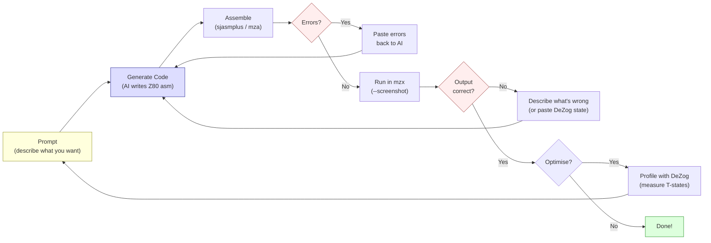

# Глава 23: Z80-разработка с помощью ИИ

> «Z80 они по-прежнему не знают.»
> -- Introspec (spke), Life on Mars, 2024

Эта книга была частично написана с помощью ИИ. Глава, которую ты сейчас читаешь, была набросана Claude Code. Ассемблер, используемый для сборки примеров --- `mza` от MinZ --- был создан с помощью ИИ. Демо-проект «Antique Toy», который документирует эта книга, был написан в цикле обратной связи между человеком и ИИ-агентом. Если тебе от этого некомфортно --- хорошо. Этот дискомфорт стоит исследовать.

Это самая самосознательная глава книги. Мы честно рассмотрим, что означает помощь ИИ для Z80-разработки в 2026 году --- где она реально помогает, где уверенно ошибается, и где ответ --- раздражающее «зависит от ситуации». Мы будем делать это с реальными примерами, реальным кодом и реальными случаями неудач, потому что демосцена никогда не терпела хайпа.

---

## 23.1 Историческая параллель: HiSoft C на ZX Spectrum

Прежде чем говорить об ИИ, давай поговорим о другой попытке принести инструменты более высокого уровня на ZX Spectrum.

В 1998 году *Spectrum Expert* #02 --- тот самый выпуск, где Dark и STS опубликовали свой метод средней точки для 3D (Глава 5) --- опубликовал обзор компилятора HiSoft C для ZX Spectrum. Вердикт был неоднозначным. Компилятор производил код, который работал «в 10--15 раз быстрее BASIC». Он поддерживал 33 зарезервированных ключевых слова, предлагал stdio.lib с графикой на уровне возможностей BASIC и включал `gam128.h` для доступа к банкам памяти 128K.

Но у него не было поддержки чисел с плавающей точкой.

Подумай об этом на секунду. Компилятор С. На машине, где плавающая точка уже обрабатывается ROM-калькулятором RST $28, сидящим в 16 КБ бесплатного кода. А компилятор не мог его использовать.

Вывод рецензента из *Spectrum Expert* был точен: «полезен для критичного к скорости кода, где float не нужен». Инструмент с чёткими сильными сторонами и жёсткими ограничениями, оценённый честно.

HiSoft Pascal HP4D рассказывал похожую историю. Компилятор занимал 12 КБ, оставляя примерно 21 КБ для программ. Он поддерживал вещественные типы и тригонометрические функции --- SIN, COS, SQRT --- и «подходил для обработки данных и вычислительной математики». Но 21 КБ для твоей программы на машине, где один несжатый экран занимает 6 912 байт, означает, что ты пишешь маленькие программы или ничего.

Языки более высокого уровня на ограниченном железе всегда были компромиссом. Они колоссально ускоряют определённые задачи. Делают другие задачи невозможными. Вопрос никогда не был «хорош ли HiSoft C или плох?», а «для чего именно он хорош, и что по-прежнему нужно писать на ассемблере?»

Z80-разработка с помощью ИИ --- такой же компромисс. Другой формы, тот же вопрос.

---

## 23.2 Цикл обратной связи Claude Code

Вот как Z80-разработка с помощью ИИ работает на практике. Это не магия. Это цикл.

### Цикл

```text
prompt --> code --> assemble --> error? --> fix --> assemble --> run --> wrong? --> fix --> run --> correct
  ^                                                                                                |
  +------------------------------------------------------------------------------------------------+
```

<!-- figure: ch23_ai_feedback_loop -->



Ты описываешь, что хочешь. ИИ генерирует Z80-ассемблер. Ты собираешь его. Сборка падает --- неправильный синтаксис, неправильный формат меток, неправильный диалект ассемблера. Ты вставляешь ошибку обратно. ИИ исправляет. Ты собираешь снова. На этот раз компилируется. Запускаешь в эмуляторе. Вывод неправильный --- экран заполняется мусором, бордюр не того цвета, ничего не появляется вообще. Описываешь, что видишь. ИИ корректирует. Запускаешь снова.

Этот цикл принципиально не отличается от того, как работает программист-человек, за одним критическим исключением: ИИ генерирует свою первую попытку гораздо быстрее и допускает определённые классы ошибок гораздо более предсказуемо.

### Конкретный пример

Допустим, ты просишь Claude Code написать подпрограмму, которая заполняет область атрибутов ZX Spectrum диагональным полосатым узором. Вот правдоподобная первая попытка:

```z80 id:ch23_a_concrete_example
; Fill attributes with diagonal stripes
; Pattern: alternating INK colours along diagonals
    ORG $8000

fill_diagonal:
    ld   hl, $5800          ; attribute memory start
    ld   b, 24              ; 24 rows

.row_loop:
    ld   c, 32              ; 32 columns per row
    ld   a, 24
    sub  b                  ; A = row index (0-23)

.col_loop:
    push af
    add  a, c               ; A = row + column
    and  7                  ; clamp to 0-7 (INK colours)
    or   $40                ; set BRIGHT bit
    ld   (hl), a            ; write attribute
    inc  hl
    pop  af
    dec  c
    jr   nz, .col_loop

    djnz .row_loop
    ret
```

Это разумный код. Он собирается. Работает. Но есть проблемы. Счётчик столбцов `C` считает вниз от 32, а не вверх от 0, поэтому диагональ идёт не в ту сторону. `or $40` устанавливает бит 6 (BRIGHT), что правильно, но визуальный эффект даёт диагонали справа-сверху вниз-влево, вместо более естественного слева-сверху вниз-вправо. А PUSH/POP AF во внутреннем цикле стоит 22 T-state на каждый байт атрибутов --- ненужный расход, если перестроить вычисление.

Ни одна из этих проблем не *ошибка* в том смысле, что код падает. Они *ошибки* в том смысле, что Z80-программист не написал бы код таким образом. Человек, который заполнял атрибуты сотни раз, вычислил бы индекс диагонали иначе, избежал бы PUSH/POP и попал в правильное направление с первой попытки, потому что паттерн row + column --- это вторая натура.

Вот версия, к которой ты приходишь после двух итераций:

```z80 id:ch23_a_concrete_example_2
fill_diagonal:
    ld   hl, $5800
    ld   d, 0               ; row index

.row_loop:
    ld   e, 0               ; column index
    ld   b, 32

.col_loop:
    ld   a, d
    add  a, e               ; diagonal = row + col
    and  7
    or   $40                ; BRIGHT + INK colour
    ld   (hl), a
    inc  hl
    inc  e
    djnz .col_loop

    inc  d
    ld   a, d
    cp   24
    jr   nz, .row_loop
    ret
```

Чище. Без PUSH/POP. Диагонали идут в правильном направлении. Внутренний цикл стоит 4 + 4 + 7 + 4 + 7 + 7 + 6 + 4 + 13 = 56 T-state на байт --- не блестяще, но функционально для подпрограммы заполнения, которая выполняется один раз.


Суть не в том, что ИИ написал плохой код. Суть в том, что *цикл* --- запрос, генерация, сборка, тест, исправление, повторный тест --- это и есть реальный рабочий процесс. Помощь ИИ не устраняет необходимость понимать Z80. Она смещает узкое место с написания кода на оценку кода.

### Что делает цикл быстрым

Цикл быстрее с ИИ, чем без него, для определённых категорий работы:

**Шаблонный код.** Директива ORG, цикл с HALT, тестовая обвязка с цветом бордюра из Главы 1, скелет заполнения атрибутов, подпрограмма записи в регистры AY, настройка LDIR, настройка режима прерываний. Каждый Z80-проект начинается с одних и тех же 30-50 строк. ИИ генерирует их правильно и мгновенно. Человек набирает по памяти. ИИ быстрее.

**Итерация по известному паттерну.** «Теперь сделай диагональ в другую сторону.» «Добавь счётчик кадров, чтобы это анимировалось.» «Сделай так, чтобы цвета циклически менялись через BRIGHT и не-BRIGHT.» Каждая итерация --- маленькая дельта к существующему коду. ИИ применяет дельту быстрее, чем ручное редактирование, и изменения обычно корректны.

**Генерация тестовых обвязок.** «Напиши тест, который заполняет память по адресу $C000 значениями 0-255, вызывает подпрограмму умножения по адресу $8000 и проверяет результаты по таблице.» ИИ генерирует такой каркасный код быстро и надёжно. Структура теста --- подготовить входные данные, вызвать подпрограмму, сравнить выходные --- вполне в компетенции ИИ.

**Документация и комментарии.** «Добавь подсчёт тактов к каждой инструкции в этом внутреннем цикле.» ИИ знает таблицы таймингов Z80 и применяет их корректно в простых случаях. Это утомительная человеческая работа, с которой машины справляются хорошо.

### Что делает цикл медленным

**Нестандартные алгоритмы.** Когда ты просишь что-то, чего ИИ не видел --- новую стратегию развёртки цикла, трюк, использующий поведение флагов Z80 определённым образом, схему генерации кода, заточенную под твою конкретную раскладку данных --- ИИ генерирует правдоподобно выглядящий код, который часто тонко ошибается. Хуже того --- ошибается так, что код компилируется и работает, но выдаёт неправильные результаты. Ты тратишь больше времени на отладку сгенерированного ИИ кода, чем потратил бы на написание его самостоятельно.

**Подсчёт тактов в условиях ограничений.** ИИ может считать такты для отдельных инструкций. Но когда тебе нужно знать точную стоимость подпрограммы, которая охватывает спорную и неспорную память, включает условные переходы с разной стоимостью при выполнении/невыполнении условия и должна уложиться в бюджет из 2 340 T-state (одна строка развёртки минус несколько инструкций) --- оценки ИИ ненадёжны. Он скажет «примерно 2 200 T-state», когда реальная стоимость зависит от вероятности ветвлений и выравнивания памяти. Вот где DeZog становится незаменимым.

**Творческий дизайн эффектов.** «Придумай визуальный эффект, который хорошо выглядит и укладывается в 8 000 T-state» --- на этот вопрос ИИ ответить не может. Он может реализовать эффект, который ты описал. Он не может его изобрести. Творческое ядро демосценовой работы --- поиск вычислительной схемы, производящей захватывающую визуализацию в жёстком бюджете --- остаётся полностью человеческим.

---

## 23.3 Интеграция с DeZog: вторая половина цикла

Если ИИ генерирует код, DeZog говорит тебе, работает ли он.

DeZog --- расширение VS Code, предоставляющее интерфейс отладчика Z80. Оно подключается к эмуляторам (ZEsarUX, CSpect, MAME) или к собственному внутреннему симулятору Z80 и даёт тебе точки останова, инспекцию памяти, наблюдение за регистрами, стеки вызовов и представления дизассемблированного кода --- стандартный опыт отладки, который ожидают современные разработчики, применённый к Z80-коду.

### Рабочий процесс ИИ + DeZog

Наиболее продуктивный рабочий процесс для Z80-разработки с помощью ИИ объединяет Claude Code с DeZog в плотном цикле:

1. **Claude Code генерирует подпрограмму** --- скажем, умножение 8x8.
2. **Ты собираешь её** с помощью `mza` и загружаешь в эмулятор, подключённый к DeZog.
3. **Ставишь точку останова** на точке входа и пошагово проходишь.
4. **Наблюдаешь за регистрами** на каждом шаге. Содержит ли A правильное промежуточное значение после первого `ADD A,B`? Устанавливается ли флаг переноса, когда должен?
5. **Замечаешь расхождение** --- старший байт результата неверен. Делаешь скриншот состояния регистров или копируешь значения.
6. **Вставляешь расхождение обратно в Claude Code** --- «После 6 итераций цикла сдвига A = $3C, а должен быть $78. Вот значения регистров в точке останова.»
7. **Claude Code определяет ошибку** --- обычно это пропущенный сдвиг, неверный выбор регистра или ошибка на единицу в счётчике цикла.
8. **Исправляешь, пересобираешь, перетестируешь.**

Этот процесс эффективен, потому что даёт ИИ то, чего ему не хватает: наземную истину. ИИ хорош в рассуждениях о структуре кода, но плох в мысленной симуляции выполнения Z80 на протяжении множества итераций. DeZog предоставляет фактическое состояние выполнения. ИИ рассуждает о разрыве между ожидаемым и фактическим состоянием. Вместе они сходятся к корректному коду быстрее, чем каждый по отдельности.

### Инспекция памяти для кода, работающего с данными

Для подпрограмм, которые манипулируют памятью --- заполнение экрана, генерация таблиц, операции с буферами --- представление памяти в DeZog незаменимо. Ты можешь поставить точку останова после подпрограммы генерации таблицы синусов и проинспектировать 256 байт по адресу таблицы. Симметричны ли они? Достигают ли пика на правильном значении? Пересекают ли ноль в правильной позиции?

Это особенно ценно для сгенерированных ИИ таблиц подстановки. Claude Code может сгенерировать подпрограмму, которая вычисляет 256-байтную таблицу синусов, используя параболическую аппроксимацию из Главы 4. Подпрограмма обычно *почти* работает --- форма правильная, диапазон правильный, но может быть ошибка на единицу в индексе, сдвигающая всю таблицу на одну позицию, или ошибка знака, инвертирующая один квадрант. DeZog позволяет увидеть таблицу напрямую и сравнить с заведомо корректными значениями.

### Что DeZog не может делать (пока)

DeZog пока не интегрируется с ИИ-агентами программно. Ты, человек, --- мост: читаешь значения регистров, вставляешь их в запрос, применяешь исправления. ИИ-агент, который мог бы ставить точки останова и итерировать автономно, замкнул бы цикл для хорошо определённых задач. Для творческой и архитектурной работы человек остаётся в цикле.

---

## 23.4 Когда ИИ помогает, когда нет

Давай будем конкретны. Не «ИИ хорош в некоторых вещах» --- конкретные категории с конкретными оценками.

### ИИ помогает: высокая уверенность

**Кодирование инструкций и подсчёт тактов.** ИИ выучил набор инструкций Z80 наизусть: опкоды, размеры в байтах, стоимость в T-state. `DJNZ` при переходе = 13T, без перехода = 8T. `LDIR` за байт = 21T, кроме последнего = 16T. Он получает это правильно стабильно, с оговоркой, что иногда путает тайминги Pentagon и 48K со спорной памятью.

**Шаблонный код и каркас.** Директивы ORG, циклы HALT, записи в регистры AY, подпрограммы очистки экрана, настройка прерываний. Паттерны, виденные тысячи раз. Генерируются корректно, экономят набор текста.

**Перевод между диалектами и объяснение кода.** Конвертация между синтаксисами sjasmplus, mza и z80asm. Объяснение, что делает блок Z80-ассемблера --- отслеживание логики, распознавание паттернов. Чтение Z80 легче, чем написание, и ИИ читает хорошо.

### ИИ помогает: средняя уверенность

**Стандартные алгоритмы.** Умножение сдвигом и сложением, восстанавливающее деление, рисование линии Брезенхэма, скроллинг на основе LDIR. ИИ генерирует рабочие реализации этого, но обычно это учебные версии --- корректные, но не оптимизированные. Человек выжмет ещё 5--15% скорости через трюки с распределением регистров, использование флагов и развёртку цикла, о которых ИИ не додумается применить.

**Раскладка памяти и адресация.** «Расположи таблицу размером 256 байт, выровненную по странице, по адресу $xx00» или «вычисли адрес атрибута для экранной позиции (строка, столбец)». ИИ понимает раскладку экрана Spectrum и генерирует корректные вычисления адресов, хотя иногда ошибается на границе третей в чересстрочной раскладке пиксельной памяти.

**Простой самомодифицирующийся код (SMC).** Подмена непосредственного операнда, изменение адреса перехода, замена инструкции. ИИ понимает концепцию и генерирует корректные примеры для простых случаев. Сложная самомодификация --- где поведение модифицированного кода зависит от взаимодействия нескольких патчей --- ненадёжна.

### ИИ не помогает: низкая уверенность

**Новаторская оптимизация внутренних циклов.** Это главное. Когда тебе нужно сбросить 3 T-state с внутреннего цикла, который выполняется 6 144 раза за кадр --- когда 3 T-state --- это разница между 50 fps и 48 fps --- ИИ не может надёжно найти оптимизацию. Он предложит стандартные подходы (развёртка цикла, таблица подстановки, замена регистров), но не обнаружит *конкретный* трюк, который позволяет *данная конкретная* раскладка данных и распределение регистров.

Внутренний цикл ротозумера Introspec --- `ld a,(hl) : inc l : dec h : add a : add a : add (hl)` --- из его анализа Illusion (Глава 7) занимает 95 T-state на 4 пары «толстых» пикселей. Гениальность --- в выборе `inc l` вместо `inc hl` (экономия 2 T-state, 6 на пару) и использовании того факта, что `add a` (удвоение) стоит 4T, тогда как `sla a` (сдвиг, делающий то же самое) стоит 8T. Именно такие микрорешения, накапливаясь, создают разницу между демо, которое работает, и демо, которое не работает. ИИ принимает такие решения плохо, потому что они требуют одновременного понимания *глобального* контекста давления на регистры, выравнивания памяти и бюджета кадра.

**Тайминги спорной памяти.** Паттерн задержки на оригинальных Спектрумах (6, 5, 4, 3, 2, 1, 0, 0 дополнительных T-state за 8-T-state период) взаимодействует с таймингами инструкций так, что ИИ не может надёжно предсказать. Introspec задокументировал это в «GO WEST» (Hype, 2015). ИИ знает факты, но не может применить их для расчёта фактического времени выполнения подпрограмм со смешанным доступом к спорной/неспорной памяти.

**Трюки с флагами и эстетические суждения.** ИИ знает, что `ADD A,A` устанавливает перенос из бита 7 --- пригодный и как условие перехода, и как умножение --- но не комбинирует спонтанно такие факты в новые оптимизации. И он не может принимать творческие решения: какие цвета подойдут для плазмы, каким должно быть ощущение от туннеля, должен ли скроллер подпрыгивать или двигаться синусоидой.

---

## 23.5 Кейс-стади: создание MinZ

MinZ --- язык программирования для систем Z80 и eZ80, созданный Alice при значительной помощи ИИ в течение 2024--2026 годов. Он компилирует современный, читаемый код в эффективный Z80-ассемблер. Проект реальный, с открытым исходным кодом, на момент написания имеет версию 0.18.0.

MinZ относится к этой главе по двум причинам. Во-первых, это кейс-стади по разработке инструментов для Z80 с помощью ИИ. Во-вторых, это сам по себе пример паттерна HiSoft C --- язык более высокого уровня на ограниченном железе, со знакомыми сильными сторонами и пределами.

### Что такое MinZ

MinZ предоставляет типизированные переменные (`u8`, `u16`, `i8`, `i16`, `bool`), функции с множественными возвращаемыми значениями, управление потоком (`if/else`, `while`, `for i in 0..n`), структуры, массивы и стандартную библиотеку, охватывающую математику, графику, ввод, звук и операции с памятью. Он компилируется в Z80-ассемблер через собственный ассемблер (`mza`), работает на собственном эмуляторе (`mzx`) и нацелен на ZX Spectrum, CP/M, MSX и Agon Light 2.

Инструментарий включает четыре отдельных инструмента:

- **mza** --- Z80-ассемблер с макросами, несколькими форматами вывода (.sna, .tap, .com, .rom, .bin) и поддержкой нескольких платформ
- **mzx** --- эмулятор ZX Spectrum с безголовым CLI-режимом, автоматическими скриншотами, инъекцией нажатий клавиш и покадровым захватом
- **mzd** --- Z80-дизассемблер с рекурсивным анализом в стиле IDA, перекрёстными ссылками, подсчётом T-state и реассемблируемым выводом
- **Компилятор MinZ** --- компилирует исходный код MinZ в Z80-ассемблер через mza

Программа на MinZ выглядит так:

```minz
import stdlib.graphics.screen;
import stdlib.input.keyboard;
import stdlib.time.delay;

fun main() -> void {
    clear_screen();
    draw_circle(128, 96, 50);

    loop {
        wait_frame();
        let dx = get_key_dx();
        // Move sprite based on input...
    }
}
```

Это компилируется в Z80-ассемблер, собирается в бинарник и работает на реальном или эмулируемом железе. Самодостаточный инструментарий --- компилятор, ассемблер, эмулятор, дизассемблер --- означает отсутствие внешних зависимостей.

### Где ИИ помог при создании MinZ

**Сам компилятор.** Компилятор MinZ написан на Go (~90 000 строк). Основная часть генерации кода --- трансляция промежуточного представления MinZ в Z80-ассемблер --- была написана в цикле с помощью ИИ. Паттерн: описать семантику языковой конструкции, сгенерировать генератор кода, протестировать на эмуляторе, исправить расхождения. Для стандартных конструкций вроде арифметических выражений, вызовов функций и управления потоком этот цикл сходился быстро. Claude Code генерировал корректные генераторы кода для `if/else` и циклов `while` с первой или второй попытки.

**Ассемблер.** `mza`, Z80-ассемблер MinZ, был создан с помощью ИИ. Он поддерживает полный набор инструкций Z80, макросы, множественные форматы вывода и двухпроходную сборку. Таблица кодирования инструкций --- которая отображает мнемоники в опкоды, обрабатывая все нерегулярные префиксные байты Z80 (CB, DD, ED, FD) --- была сгенерирована ИИ и верифицирована по даташиту Z80. Это именно тот вид систематического, табличного кода, с которым ИИ справляется хорошо.

**Эмулятор.** `mzx` достигает 100% покрытия инструкций Z80, включая все недокументированные опкоды (NOP с префиксом ED, DDCB/FDCB индексированные битовые операции). ИИ сгенерировал начальную реализацию каждой инструкции по руководству Z80; тестовый набор (тоже сгенерированный ИИ) поймал крайние случаи --- поведение флагов при переполнении, флаг полупереноса в DAA, тайминги прерываний. Но самая полезная возможность mzx --- целиком построенная через цикл обратной связи с ИИ --- это безголовый CLI-режим:

```text
mzx --run program.bin@8000 --frames 100 --screenshot output.png
mzx --load code.bin@8000,data.bin@C000 --set PC=8000,SP=FFFF,EI,IM=1
mzx --model 128k --tap demo.tap --exec 'LOAD ""' --frames 500
mzx --run effect.bin@8000 --frames DI:HALT --dump-keyframes ./frames/
mzx --model pentagon --trd disk.trd --type "RUN\n" --screenshot grab.png
```

Флаг `--run` загружает бинарник по указанному адресу и запускает выполнение --- без ROM, без BASIC, без экрана загрузки. Триггер `--frames DI:HALT` делает скриншот в точный момент, когда код сигнализирует «кадр готов», отключая прерывания перед HALT. Флаг `--dump-keyframes` сохраняет только кадры, в которых экран изменился --- автоматический визуальный регрессионный тест. Флаги `--exec` и `--type` инъектируют команды BASIC и нажатия клавиш, позволяя полностью автоматизировать тестирование программ, ожидающих пользовательского ввода.

Конвейер скриншотов этой книги использует mzx напрямую. Каждый скриншот примера кода на этих страницах был сгенерирован так:

```text
sjasmplus --nologo --raw=build/example.bin example.a80
mzx --run build/example.bin@8000 --frames 50 --screenshot build/ch09_plasma.png
```

Двадцать один пример, ноль ручного вмешательства, воспроизводимо через `make screenshots`.

**Дизассемблер.** `mzd` выполняет рекурсивный анализ --- ту же технику, что использует IDA Pro. Получив бинарник, он отслеживает все пути выполнения от точек входа, отделяет код от данных, обнаруживает строки, генерирует перекрёстные ссылки и автоматически расставляет метки на целях переходов:

```text
mzd illusion.bin --org $6000 --analyze --target spectrum --cycles --labels
```

Флаг `--cycles` добавляет подсчёт T-state к каждой инструкции --- автоматизируя ту самую работу, которую Introspec делал вручную в своём разборе Illusion 2017 года. Флаг `--target spectrum` аннотирует системные вызовы (RST $10 для вывода символа, порт $FE для бордюра/клавиатуры). Флаг `-R` производит реассемблируемый вывод, замыкая цикл дизассемблирование-модификация-реассемблирование.

ИИ построил и декодер инструкций `mzd` (систематическая табличная работа), и его движок анализа (рекурсивный спуск, построение графа потока управления). Платформо-специфичные знания ABI (что делают какие вызовы ROM ZX Spectrum) были частично сгенерированы ИИ, частично взяты из существующей документации.

**Стандартная библиотека и peephole-оптимизатор.** Десять модулей стандартной библиотеки (математика, графика, ввод, звук и т.д.) и 35+ peephole-паттернов («заменить `LD A,0` на `XOR A`»). Оба были сгенерированы ИИ и отшлифованы человеком. ИИ знает набор инструкций достаточно хорошо, чтобы предлагать корректные упрощения; человек проверяет семантическую корректность.

### Где ИИ не помог при создании MinZ

**True Self-Modifying Code (TSMC).** Самая отличительная особенность MinZ --- TSMC: компилятор может генерировать код, который переписывает собственные инструкции во время выполнения для повышения производительности. Однобайтовая замена опкода (7--20 T-state) вместо последовательности условного перехода (44+ T-state). *Концепция* TSMC была изобретением Alice, а не ИИ. ИИ не мог бы предложить: «а что если скомпилированный код патчил бы собственные опкоды для изменения поведения во время выполнения?» --- потому что эта идея требует одновременного понимания модели компиляции и кодирования инструкций Z80 на уровне, которого ИИ самостоятельно не достигает.

**Парсер.** MinZ изначально использовал tree-sitter для парсинга, но столкнулся с проблемами нехватки памяти на больших файлах. Замена --- рукописный рекурсивно-нисходящий парсер на Go --- была спроектирована Alice при консультации с ИИ (GPT-4, o4-mini и Claude были опрошены для архитектурных советов). ИИ-коллеги согласились, что рукописный парсер --- правильный подход, и предложили сохранить тестовый корпус tree-sitter. Но фактический дизайн грамматики парсера --- как синтаксис MinZ отображается на узлы AST --- был человеческой работой. ИИ мог генерировать код парсера для отдельных правил грамматики, но не мог спроектировать саму грамматику.

**Распределение регистров для генератора кода.** Решать, какие переменные живут в каких регистрах Z80, когда выгружать в память и как обращаться с нерегулярным регистровым файлом Z80 (только определённые регистры могут использоваться с определёнными инструкциями) --- это задача удовлетворения ограничений, с которой ИИ справляется плохо. Он генерирует код, который работает, но расточительно использует регистры, делает ненужные сохранения в память и упускает возможности держать горячие значения в регистрах через границы базовых блоков.

### Вердикт по MinZ

MinZ не мог бы существовать без помощи ИИ. Огромный объём систематического кода --- кодировщик инструкций, эмулятор, движок анализа дизассемблера, стандартная библиотека, peephole-паттерны --- занял бы у одного разработчика годы ручной работы. С помощью ИИ MinZ прошёл путь от концепции до экосистемы из четырёх инструментов примерно за 18 месяцев.

Но *интересные* особенности MinZ --- TSMC, трансформация лямбд в функции с нулевыми накладными расходами, UFCS-диспетчеризация методов, триггер `DI:HALT` в mzx, платформо-зависимые ABI-аннотации mzd --- это человеческие изобретения. ИИ их реализовал, но не придумал.

Это точно соответствует паттерну HiSoft C. Инструмент колоссально ускоряет рутинную работу. Творческая работа остаётся человеческой. Компромисс реален и стоит того.

---

## 23.5b Врезка: Другой ИИ --- суперо­птимизация полным перебором

Peephole-оптимизатор MinZ знает 35+ паттернов вроде «заменить `LD A,0` на `XOR A`». Но как *находить* такие паттерны? И откуда знать, какие из них действительно безопасны?

Возьмём `LD A, 0` → `XOR A`. Обе инструкции обнуляют A. Обе занимают меньше байтов в форме XOR (1 байт против 2). Но `XOR A` сбрасывает флаг переноса и устанавливает флаг нуля; `LD A, 0` сохраняет все флаги. Если код после этой инструкции проверяет перенос, «оптимизация» --- это баг. Человек-эксперт это знает. ИИ на нейросетях *обычно* это знает, но иногда забывает. Суперо­птимизатор полным перебором *доказывает* это, тестируя каждое возможное входное состояние.

**z80-optimizer** (от oisee, 2025) доводит подход полного перебора до логического завершения. Он перебирает каждую пару инструкций Z80 --- все 406 опкодов × 406 опкодов = 164 836 пар --- и для каждой пары проверяет, производит ли более короткая замена идентичный результат для всех возможных состояний регистров и флагов. Никаких эвристик. Никаких обучающих данных. Никаких нейросетей. Только исчерпывающий перебор с полной верификацией эквивалентности состояний.

Результаты: **602 008 доказуемо корректных правил оптимизации** за один запуск на Apple M2 (34,7 миллиарда сравнений за 3 часа 16 минут). Несколько примеров:

| Исходная последовательность | Замена | Экономия |
|---|---|---|
| `SLA A : RR A` | `OR A` | 3 байта, 12T |
| `LD A, 0 : NEG` | `SUB A` | 2 байта |
| `LD A, B : ADD A, 0` | `LD A, B : OR A` | 0 байтов, 4T |
| `SCF : RR A` | `SCF : RRA` | 1 байт, 4T |

Правила группируются в **83 уникальных паттерна трансформации** --- семейства замен, разделяющих одну и ту же структурную логику. Например, семейство «загрузить-и-проверить»: `LD A, r : ADD A, 0` → `LD A, r : OR A` применяется ко всем регистрам-источникам, потому что оптимизация эксплуатирует поведение флагов, а не конкретный регистр.

Что делает z80-optimizer интересным для этой главы --- не конкретные правила: любой опытный Z80-кодер знает большинство распространённых. Интересна *методология*. Это ИИ в исходном смысле: машина, которая находит знания через поиск, а не через заученные паттерны. Среди 602 008 правил --- тысячи, которые ни один человек не каталогизировал, потому что они связаны с малоизвестными парами опкодов, которые никто не пишет намеренно, но которые компиляторы и генераторы кода *производят*.

Очевидный следующий шаг --- последовательности длины 3 --- требует GPU-перебора (406³ = 67 миллионов троек × все входные состояния). За этим пределом стохастический поиск (в стиле STOKE) позволяет исследовать пространство более длинных замен без исчерпывающего перебора.

Для практической Z80-разработки z80-optimizer дополняет цикл обратной связи с ИИ из этой главы: Claude Code генерирует корректный, но неоптимизированный код, а затем z80-optimizer может механически проверить, есть ли у каких-либо пар инструкций более короткие эквиваленты. Один ИИ пишет код; другой ИИ доказывает, как его ужать.

**Исходный код:** `github.com/oisee/z80-optimizer` (лицензия MIT)

---

## 23.6 Честный взгляд: «Z80 они по-прежнему не знают»

Скептицизм Introspec в отношении Z80-возможностей ИИ --- это не общая технофобия. Он исходит из десятилетий опыта выжимания Z80 до абсолютного предела. Когда он говорит «Z80 они по-прежнему не знают», он имеет в виду кое-что конкретное.

Рассмотрим внутренний цикл ротозумера из его анализа Illusion. Эффект проходит через текстуру под углом, создавая повёрнутые и масштабированные «толстые» пиксели 2x2. Внутренний цикл:

```z80 id:ch23_honest_take_z80_they_still
    ld   a, (hl)    ; 7T   read texture byte
    inc  l          ; 4T   next column (no carry needed: 256-aligned!)
    dec  h          ; 4T   previous row
    add  a,a        ; 4T   double (same as SLA A but 4T not 8T)
    add  a,a        ; 4T   quadruple
    add  a,(hl)     ; 7T   combine with second texture sample
                    ; --- 30T per pixel pair
```

Ключевое наблюдение --- `inc l` вместо `inc hl`. Это экономит 2 T-state, но работает только потому, что текстура выровнена по 256-байтной границе, так что инкремент одного L никогда не требует переноса в H. ИИ использовал бы `inc hl` --- безопасный, универсальный выбор --- и потерял бы 2 T-state на итерацию. При 3 072 парах пикселей за кадр это 6 144 T-state --- почти 10% бюджета кадра на 48K Spectrum.

Вот что означает «Z80 они по-прежнему не знают». Не то, что ИИ не может писать Z80-ассемблер --- может. Не то, что он путает инструкции --- обычно нет. А то, что он не понимает *контекст*, в котором каждый выбор инструкции имеет значение. Он не мыслит бюджетами. Он не видит, что `inc l` безопасен здесь из-за ограничения выравнивания тремя уровнями абстракции выше. Он не знает, что 2 T-state на итерацию, умноженные на тысячи итераций --- это разница между попаданием в один кадр и необходимостью двух.

### Что именно ИИ делает неправильно

Мы протестировали Claude Code на нескольких Z80-задачах из области демосцены. Вот показательные результаты.

**Задача: написать подпрограмму DOWN_HL.** DOWN_HL перемещает указатель экрана в HL на одну строку пикселей вниз в чересстрочной раскладке видеопамяти Spectrum. Это самый часто используемый графический примитив на платформе. Introspec написал об этом фундаментальную статью (Hype, 2020).

Первая попытка ИИ:

```z80 id:ch23_what_the_ai_gets_wrong
down_hl:
    inc  h              ; 4T   move down one pixel row
    ld   a, h           ; 4T
    and  7              ; 7T
    ret  nz             ; 11T/5T  still within the character row
    ld   a, l           ; 4T
    add  a, 32          ; 7T   next character row
    ld   l, a           ; 4T
    ret  c              ; 11T/5T  if carry, crossed into next third
    ld   a, h           ; 4T
    sub  8              ; 7T
    ld   h, a           ; 4T
    ret                 ; 10T
```

Это действительно корректный код --- он правильно обрабатывает все три трети экрана, включая переходы между ними. ИИ может правильно реализовать стандартные подпрограммы вроде DOWN_HL, потому что паттерн хорошо задокументирован и встречается во многих Z80-справочниках. Подпрограмма работает: `inc h` переходит к следующей строке пикселей, `add a, 32` переходит к следующему знакоряду при необходимости, перенос от сложения L корректно определяет границы третей, а `sub 8` отменяет лишний инкремент TT для обычного случая.

Но «корректно» --- не то же самое, что «хорошо». В статье Introspec представлена версия RST7, использующая подход с двойным счётчиком, которая обрабатывает все границы за 2 343 T-state при полном проходе по экрану. Наивный подход выше --- стандартная учебниковая версия --- стоит 5 922 T-state. Разрыв между «работает» и «работает хорошо» --- в 2,5 раза, и ИИ этот разрыв не преодолевает. Он выдаёт первую версию, которую написал бы любой грамотный программист, а не ту, которую эксперт оптимизировал бы до совершенства.

**Задача: сгенерировать развёрнутое заполнение экрана.** На просьбу сгенерировать развёрнутое заполнение экрана на основе PUSH (техника из Главы 3) ИИ произвёл корректный код --- пары PUSH, записывающие по два байта, DI/EI для защиты манипуляции с указателем стека. Но он не подумал расположить данные в обратном порядке (PUSH записывает старший байт первым, по более низким адресам), из-за чего паттерн заполнения оказался задом наперёд. Человек, который писал PUSH-заполнения раньше, учитывает это автоматически.

**Задача: оптимизировать заданный внутренний цикл.** Получив работающий внутренний цикл с просьбой ускорить его, ИИ предложил стандартные оптимизации: развёртку, таблицу подстановки, замену регистров. Это корректные предложения. Но он не нашёл неочевидную оптимизацию --- ту, где ты перестраиваешь раскладку памяти, чтобы использовать `inc l` вместо `inc hl`, или используешь флаг переноса от сложения как условие перехода вместо отдельного сравнения. Неочевидная оптимизация требует понимания полного контекста подпрограммы, а контекстное окно ИИ, хоть и большое, не схватывает *пространственную* и *временную* структуру Z80-программы так, как это делает ментальная модель человека-эксперта.

### В чём Introspec прав

Глубочайшие оптимизации Z80 --- это не знание инструкций. Это понимание взаимодействия между раскладкой памяти, распределением регистров, кодированием инструкций, ограничениями по таймингам и визуальным выводом --- одновременно. Это взаимодействие и есть то, что Introspec называет «эволюцией вычислительной схемы» (Глава 1). Вычислительная схема --- это целостный дизайн, где каждое решение влияет на все остальные. ИИ оперирует кодом локально. Эксперт оперирует схемой глобально.

ИИ не знает Z80 в том смысле, в каком Introspec знает Z80. Он выучил набор инструкций наизусть, но не проникся машиной.

### В чём Introspec не совсем прав

Но «Z80 они по-прежнему не знают» подразумевает, что ИИ бесполезен для Z80-работы, а это не так.

ИИ не пытается заменить Introspec. Он пытается помочь Alice --- программисту, который понимает Z80 достаточно хорошо, чтобы оценивать вывод ИИ, но не имеет десятилетий опыта оптимизации внутренних циклов. Для Alice вывод ИИ --- это стартовая точка, которая лучше, чем пустой экран. Ей не нужно, чтобы ИИ нашёл трюк с `inc l`. Ей нужно, чтобы он сгенерировал первые 80% подпрограммы, и тогда она может потратить время на оставшиеся 20%.

Демосцена всегда была про последние 20%. ИИ это не меняет. Он меняет скорость, с которой ты проходишь первые 80%.

---

## 23.7 Демо «Antique Toy»: ИИ на практике

Демо-компаньон этой книги --- «Antique Toy» --- это сознательный эксперимент: построить демо для ZX Spectrum с помощью ИИ и задокументировать, что произойдёт.

Название --- отсылка к *Eager* Introspec (2015, 1-е место на 3BM openair). Мы реализуем эффекты, вдохновлённые Eager --- атрибутный туннель с 4-кратной симметрией, хаотический зумер, анимация 4-фазным цветом --- плюс 3D-движок на методе средней точки от Dark из *Spectrum Expert* #02.

**Что сработало:** Прототипирование эффектов --- Claude Code генерирует рабочие первые черновики достаточно быстро, чтобы пробовать идеи, которые иначе не стоили бы времени на набор. «А что если туннель использовал 8-кратную симметрию вместо 4-кратной?» занимает 15 минут со сгенерированным ИИ кодом вместо 2 часов вручную. Инструменты --- система сборки, пайплайн ресурсов, правила Makefile и тестовые обвязки были полностью сгенерированы ИИ и работают надёжно. Ревью кода --- подача ИИ подпрограммы с вопросом «что тут не так?» ловит очевидные ошибки (ошибки на единицу, забытые DI/EI, неправильные номера портов) до того, как они обойдутся в часы отладки.

**Что не сработало:** 3D-движок по методу средней точки Dark. Виртуальный процессор с упакованными 2-битными опкодами и 6-битными номерами точек был декодирован неправильно. Инструкция усреднения вычисляла `(A+B)/2` через `ADD A,B : SRA A`, что переполняется для знаковых координат. Три сеанса отладки, дольше, чем написать с нуля. Интеграция музыки провалилась аналогично --- ИИ сгенерировал проигрыватель, который конфликтовал с использованием теневых регистров (EXX, EX AF,AF') кодом эффекта. И проигрыватель, и эффект использовали теневой BC для разных целей, и EXX в обработчике прерываний подставлял устаревшие значения. Этот класс ошибок --- системные конфликты регистров через границы прерываний --- требует понимания полной архитектуры системы, а не отдельных подпрограмм.

**Честная оценка:** «Antique Toy» не закончен. Эффекты работают по отдельности. Интеграция продолжается. Но помощь ИИ сделала проект *осуществимым* для сольного разработчика, работающего по вечерам и выходным. Правильный вопрос не «может ли ИИ сравниться с выделенной человеческой командой?», а «позволяет ли помощь ИИ большему количеству людей делать демо?» Ответ, предварительно, да.

---

## 23.8 Цикл обратной связи на практике

Конкретный пример из проекта «Antique Toy»: реализация 4-кратной симметрии для эффекта туннеля путём копирования верхнего левого квадранта атрибутов 16x12 в три остальных квадранта с зеркалированием.

Запрос был конкретным: «Напиши Z80-подпрограмму, которая копирует верхний левый квадрант 16x12 области атрибутов ZX Spectrum ($5800) в три остальных квадранта с соответствующим зеркалированием.» Claude Code сгенерировал 47 строк, которые собрались с первой попытки.

Тестирование показало, что верхний правый квадрант смещён на один столбец. DeZog показал проблему: после того как зеркальный цикл декрементировал DE 16 раз, вычисление перехода к следующей строке забыло, что DE уже был сдвинут назад. Код продвигал DE на 32 (ширина одной строки) вместо необходимых 48 (32 для строки + 16 для компенсации зеркального прохода). Вставка значений регистров в Claude Code --- «После строки 1 DE = $581F (должно быть $582F)» --- дала немедленное исправление. Правый нижний квадрант имел ту же ошибку в усиленном виде. Ещё одна итерация исправила его.

Итого: три итерации, примерно 25 минут. Ручная оценка для опытного Z80-программиста: 40--60 минут. Для новичка: 2--3 часа. ИИ сэкономил время на начальной генерации. Отладка заняла одинаковое время независимо от того, кто написал код.

---

## 23.9 Построение собственного рабочего процесса с ИИ

Практическая настройка: VS Code с расширением Z80 Macro Assembler и Z80 Assembly Meter. Claude Code (или любая LLM, способная работать с кодом). Ассемблер (`mza` или sjasmplus). DeZog, подключённый к эмулятору. Makefile.

Рабочий процесс: **Начни с ИИ** --- опиши, что хочешь, с конкретикой (целевая машина, адреса памяти, синтаксис ассемблера). **Собери немедленно** --- не читай внимательно код ИИ; собери его, вставь ошибки обратно. **Тестируй цветом бордюра** --- оберни сгенерированные ИИ подпрограммы в тестовую обвязку из Главы 1. **Отлаживай с DeZog** --- ставь точки останова, найди первое расхождение регистров, сообщи его ИИ. **Итерируй** --- обычно 2--5 раундов для средней сложности; больше 5 означает, что ИИ не справляется, и тебе стоит написать самостоятельно. **Оптимизируй сам** --- после достижения корректности профилируй и применяй техники из Глав 1--14.

### Промпт-инжиниринг для Z80

**Хороший запрос:** «Напиши Z80-подпрограмму для ZX Spectrum 128K (тайминги Pentagon), которая копирует 16 байт из адреса в HL в экранную память по адресу (DE), следуя чересстрочной раскладке Spectrum. После каждого байта продвигай DE на следующую строку пикселей стандартным методом down_hl. Используй синтаксис mza. Добавь подсчёт тактов.»

**Плохой запрос:** «Напиши подпрограмму для спрайтов на Spectrum.»

Хороший запрос указывает машину, ассемблер, адреса, поведение и формат вывода. Плохой запрос оставляет всё неоднозначным, и ИИ заполнит пробелы неверными предположениями.

Для запросов на оптимизацию давай конкретную цель: «Эта подпрограмма занимает ~3 200 T-state. Мне нужно меньше 2 400. Не меняй интерфейс (HL = источник, DE = назначение, B = высота). Тайминги Pentagon.» Целевая производительность и ограничение интерфейса заставляют ИИ искать реальные оптимизации вместо реструктуризации соглашения о вызовах.

---

## 23.10 Общая картина

Помощь ИИ не меняет уровень абстракции результата --- Z80 по-прежнему выполняет те же инструкции на тех же скоростях. Что она меняет --- скорость ввода: как быстро ты переходишь от идеи к работающему (пусть и неоптимизированному) коду. Эксперты демосцены по-прежнему будут писать внутренние циклы лучше любого ИИ, но инструменты с ИИ-помощью снижают порог входа настолько, что больше людей смогут начать делать демо и самостоятельно освоить глубинные трюки.

---

## Итого

- **Z80-разработка с помощью ИИ следует циклу обратной связи:** запрос, генерация, сборка, тест, отладка, итерация. ИИ генерирует первый черновик быстро; человек оценивает и доводит. Цикл обычно занимает 2--5 итераций для подпрограммы средней сложности.

- **ИИ надёжен для:** кодирования инструкций, подсчёта тактов, шаблонного кода, перевода между диалектами и объяснения кода. Умеренно надёжен для стандартных алгоритмов и простого самомодифицирующегося кода (SMC). Ненадёжен для новаторской оптимизации, таймингов спорной памяти, творческого дизайна эффектов и глубоких трюков с флагами.

- **Интеграция с DeZog** ликвидирует разрыв между выводом ИИ и корректным кодом. Человек считывает состояния регистров из отладчика и передаёт расхождения ИИ, который рассуждает о несоответствии. Программной интеграции ИИ с отладчиком пока не существует, но это очевидный следующий шаг.

- **Кейс-стади MinZ** ясно демонстрирует паттерн: помощь ИИ позволила одному разработчику построить полный инструментарий языка (компилятор, ассемблер, эмулятор, стандартная библиотека) за 18 месяцев. Рутинная работа --- кодирование инструкций, генерация тестов, функции стандартной библиотеки --- была сгенерирована ИИ. Творческая работа --- TSMC, абстракции с нулевыми накладными расходами, дизайн грамматики --- была человеческой.

- **Скептицизм Introspec обоснован:** ИИ не понимает Z80 так, как понимает эксперт. Он не мыслит бюджетами, не видит сквозных ограничений, не находит неочевидных оптимизаций. Глубочайшая демосценовая работа остаётся за пределами досягаемости ИИ.

- **Историческая параллель верна:** HiSoft C был «в 10--15 раз быстрее BASIC», но не имел чисел с плавающей точкой. Z80-разработка с помощью ИИ драматически быстрее для шаблонного кода и итераций, но не может сравниться с человеком-экспертом в оптимизации внутренних циклов. Инструменты более высокого уровня на ограниченном железе всегда были компромиссом. Вопрос не «хорошо или плохо?», а «хорошо *для чего*?»

- **Практический рабочий процесс** сочетает Claude Code для генерации кода, DeZog для отладки, `mza` или sjasmplus для сборки и Makefile для автоматизации сборки. Начни с ИИ, собери немедленно, тестируй цветом бордюра, отлаживай с DeZog, оптимизируй сам.

- **Общий эффект** положительный: помощь ИИ снижает порог входа в Z80-разработку, не снижая потолок. Больше людей могут начать; эксперты по-прежнему нужны для глубокой работы. Это хорошо для демосцены.

---

## Попробуй сам

1. **Тест шаблонного кода.** Попроси своего ИИ-ассистента сгенерировать шаблон загрузки ZX Spectrum 128K: ORG по адресу $8000, отключение прерываний, настройка IM1, цикл HALT с тестовой обвязкой цвета бордюра. Собери и запусти. Сколько итераций понадобилось?

2. **Тест оптимизации.** Напиши (или сгенерируй ИИ) работающий цикл заполнения атрибутов. Измерь его стоимость тестовой обвязкой цвета бордюра. Затем попроси ИИ ускорить его. Измерь снова. Теперь оптимизируй его сам, используя техники из Глав 1--3. Сравни все три версии: оригинальную, оптимизированную ИИ, оптимизированную человеком.

3. **Испытание DOWN_HL.** Попроси ИИ написать подпрограмму DOWN_HL. Протестируй её на всех 192 строках пикселей. Правильно ли она обрабатывает переходы между третями? Сравни с анализом Introspec (Hype, 2020). Это лакмусовый тест компетенции ИИ в Z80.

4. **Эксперимент с MinZ.** Установи инструментарий MinZ (`mza`, `mzx`, `mzd`). Ассемблируй заливку экрана с помощью `mza`, запусти её в безголовом режиме через `mzx --run fill.bin@8000 --frames 5 --screenshot fill.png`, затем дизассемблируй бинарник демо с помощью `mzd demo.bin --analyze --cycles --target spectrum`. Сравни подсчёт T-state, сделанный ИИ-дизассемблером, со своими собственными ручными подсчётами из Главы 1.

5. **Автоматизированный конвейер.** Напиши эффект, ассемблируй его и добавь в `Makefile`, который запускает `mzx --screenshot` для каждого бинарника. Запусти `mzx --dump-keyframes`, чтобы увидеть, какие именно кадры дают видимые изменения. Это тот самый конвейер, который сгенерировал каждый скриншот в этой книге.

6. **Построй что-нибудь.** Выбери эффект из одной из предыдущих глав. Используй помощь ИИ для написания первого черновика. Итерируй до работающего результата. Профилируй его. Оптимизируй внутренний цикл вручную. Задокументируй каждый шаг. Ты только что прошёл через тот самый рабочий процесс, который описывает вся эта глава.

---

*Это последняя техническая глава. Далее следуют приложения --- справочные таблицы, руководства по настройке и справочник инструкций, к которому ты будешь обращаться каждый раз, когда пишешь Z80-ассемблер.*

> **Источники:** Обзор HiSoft C (Spectrum Expert #02, 1998); Introspec «Technical Analysis of Illusion» (Hype, 2017); Introspec «DOWN_HL» (Hype, 2020); Introspec «GO WEST Parts 1-2» (Hype, 2015); z80-optimizer (oisee, 2025, `github.com/oisee/z80-optimizer`)
